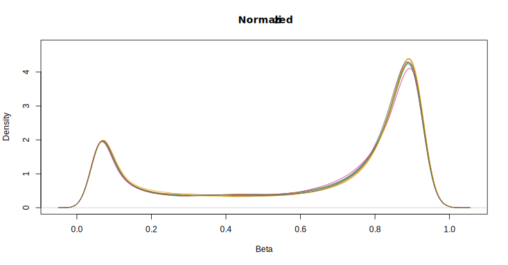
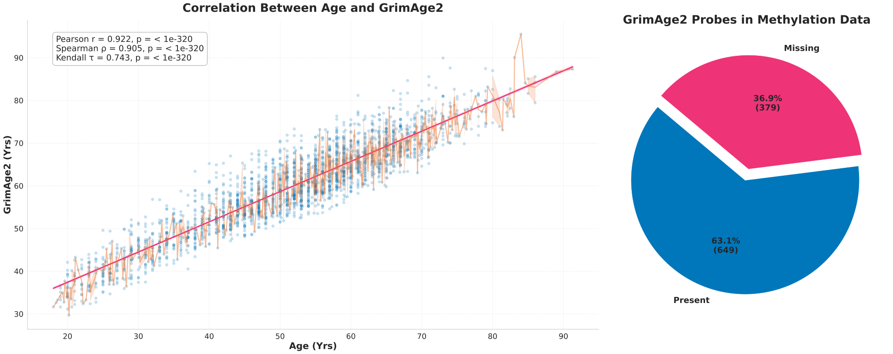
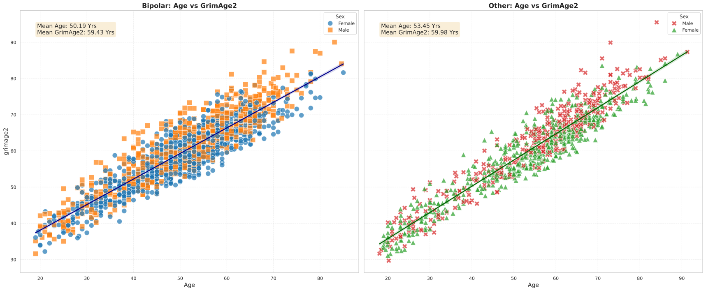

# **BP-DNAm**

## Tasks
- [ ] Format sample sheet and crosscheck with DNAm data
- [ ] Complete [A cross-package Bioconductor workflow for analysing methylation array data vignette](https://bioconductor.org/packages/release/workflows/vignettes/methylationArrayAnalysis/inst/doc/methylationArrayAnalysis.html#data-exploration) for cohort DNAm data
- [ ] Compare _REP vs non _REP sample pair methylation data
- [ ] Finalize sample sheet and DNAm data for [GrimAge version 2](https://www.aging-us.com/article/204434/text)
- [ ] Compute biological age using other methylation clocks and compare with chronological and GrimAge2
  - [ ] [dnaMethyAge: predict epigenetic age from DNA methylation data](https://github.com/yiluyucheng/dnaMethyAge)
  - [ ] [pyaging: a Python-based compendium of GPU-optimized aging clocks](https://github.com/rsinghlab/pyaging)
  - [ ] [Others](https://chatgpt.com/share/4f6a56e0-6ecb-47fb-be89-32ea2363e644)
  - [ ] [Others2](https://aistudio.google.com/app/prompts?state=%7B%22ids%22:%5B%221UxleECM1aPXNsQPsFwGrlLcdvhqkd8-V%22%5D,%22action%22:%22open%22,%22userId%22:%22105635218484851934159%22,%22resourceKeys%22:%7B%7D%7D)
- [ ] Plot chronological vs methylation-predicted biological age for all samples

## Motivation and Background
  - [Overview Presentation](https://docs.google.com/presentation/d/1er9EI4301XhYFj1IXjf6zHxfra9R18gMWy334dPLy6o/edit)
  - [Relevant Literature+](https://docs.google.com/spreadsheets/d/10S1L54l_t6icdOtmu1MQopsLwvqsSE8iASmZKH2Rtlc)
  - [Meta-analysis of epigenetic aging in schizophrenia reveals multifaceted relationships with age, sex, illness duration, and polygenic risk](https://clinicalepigeneticsjournal.biomedcentral.com/articles/10.1186/s13148-024-01660-8)

## Investigation Overview

### **Stage 1 - Data Preparation and Characterization**
#### _Density Plot of Normalized Beta Values_

### **Stage 2 - Compute and Analyze GrimAge version 2 Biological Age**
#### _BPDNAm GrimAge2 Sourcecode All Values_
               The output files will include (1) DNAmGrimAge2,AgeAccelGrim2 
                                              (2) seven DNAm based plasma protein estimates, and 
                                              (3) DNAm based packyears (DNAmPACKYRS)

    ==============================================================================================
    Name                                            variable                        unit
    ==============================================================================================
    DNAm  GrimAge2                                DNAmGrimAge2                    year
    GrimAge2 age acceleration                     AgeAccelGrim2                   year
    DNAm  Growth differentiation factor 15        DNAmGDF15                       pg/mL
    DNAm  Beta-2-microglobulin                    DNAmB2M                         pg/mL
    DNAm  Cystatin-C                                DNAmCystatinC                   pg/mL
    DNAm  Tissue Inhibitor Metalloproteinases 1     DNAmTIMP1                       pg/mL
    DNAm  Adrenomedullin                            DNAmADM                         pg/mL
    DNAm  Plasminogen activator inhibitor 1         DNAmPAI1                        pg/mL
    DNAm  Leptin                                    DNAmLeptin                      pg/mL
    DNAm  log C-reactive protein                  DNAmlogCRP                      mg/L (in CRP) 
    DNAm  log hemoglobin A1C                      DNAmlogA1C                      % (in A1C)
    DNAm  smoking pack years                        DNAmPACKYRS                  

[BPDNAm All Calculated GrimAge2 Variables](BPDNAm_GrimAge2_Sourcecode_All_2458_r_16_c_08112024_151650.csv)
| **SampleID** | **Female** | **Diagnosis** | **Age** | **DNAmGrimAge2** | **AgeAccelGrim2** | **DNAmCystatinC** | **DNAmTIMP1** | **DNAmADM** | **DNAmGDF15** | **DNAmPAI1** | **DNAmLeptin** | **DNAmB2M** | **DNAmPACKYRS** | **DNAmlogCRP** | **DNAmlogA1C** |
|:---|:---|:---|:---|:---|:---|:---|:---|:---|:---|:---|:---|:---|:---|:---|:---|
| 431-BG00001 | 1 | BipolarI | 51 | 33.2 | -2.5 | 756733.8 | 19312.3 | 344.7 | -138.7 | 12705.4 | 55144.9 | 2917064.0 | -36.3 | 1.1 | 1.7 |
| 431-BG00002 | 1 | BipolarI | 33 | 20.8 | -2.2 | 714401.6 | 16868.4 | 314.7 | -207.8 | 12250.0 | 54072.9 | 2627347.3 | -37.5 | 0.5 | 1.7 |
| 431-BG00003 | 0 | BipolarI | 49 | 34.3 | -0.1 | 757652.6 | 19283.8 | 328.5 | 5.0 | 15404.9 | 63504.4 | 2818565.0 | -28.0 | 1.1 | 1.7 |
| 431-BG00004 | 0 | BipolarI | 41 | 35.2 | 6.5 | 740190.8 | 17817.1 | 316.9 | -119.4 | 14587.0 | 37677.8 | 2651702.0 | -20.3 | 1.0 | 1.8 |
| 431-BG00006 | 0 | BipolarI | 64 | 44.1 | -0.8 | 802185.0 | 21932.2 | 344.7 | -64.7 | 15309.1 | 39636.6 | 2913542.0 | -41.9 | 1.3 | 1.7 |

Click to expand full table

| **SampleID** | **Female** | **Diagnosis** | **Age** | **DNAmGrimAge2** | **AgeAccelGrim2** | **DNAmCystatinC** | **DNAmTIMP1** | **DNAmADM** | **DNAmGDF15** | **DNAmPAI1** | **DNAmLeptin** | **DNAmB2M** | **DNAmPACKYRS** | **DNAmlogCRP** | **DNAmlogA1C** |
|:---|:---|:---|:---|:---|:---|:---|:---|:---|:---|:---|:---|:---|:---|:---|:---|
| 431-BG00007 | 0 | Bipolar II | 64.1 | 51.8 | 6.8 | 846169.2 | 22097.7 | 366.5 | 175.3 | 19796.3 | 50936.2 | 3046638.3 | -37.2 | 2.4 | 1.8 |
| 431-BG00009 | 1 | BipolarI | 53 | 32.0 | -5.2 | 771270.2 | 19861.3 | 334.8 | -171.4 | 10918.9 | 67674.2 | 2855520.9 | -34.9 | 1.1 | 1.7 |
| 431-BG00011 | 0 | Bipolar | 38 | 25.3 | -1.2 | 712851.6 | 17243.3 | 307.3 | -319.0 | 12692.3 | 57518.0 | 2604971.6 | -31.6 | 1.1 | 1.7 |
| 431-BG00013 | 1 | BipolarI | 47 | 31.4 | -1.5 | 747094.3 | 18596.2 | 328.6 | -169.1 | 13878.5 | 51261.5 | 2802445.8 | -44.0 | 1.8 | 1.7 |
| 431-BG00014 | 1 | BipolarI | 62 | 39.3 | -4.2 | 784336.2 | 20706.7 | 358.1 | 163.6 | 11349.3 | 64500.1 | 2919021.4 | -36.1 | 1.5 | 1.7 |
| 431-BG00015 | 0 | BipolarI | 71 | 44.9 | -5.0 | 825285.4 | 22122.2 | 351.5 | 105.0 | 11002.5 | 59099.2 | 3096674.1 | -35.8 | 1.2 | 1.7 |
| 431-BG00016 | 0 | BipolarI | 35 | 28.7 | 4.2 | 707196.6 | 17101.8 | 312.9 | -69.2 | 13365.5 | 44231.3 | 2599370.8 | -24.1 | 0.9 | 1.7 |
| 431-BG00017 | 1 | BipolarI | 56 | 39.5 | 0.2 | 785929.4 | 19929.1 | 356.2 | -44.5 | 15188.2 | 52275.5 | 2897038.6 | -31.2 | 1.3 | 1.7 |
| 431-BG00018 | 1 | BipolarI | 46 | 38.0 | 5.8 | 745222.2 | 18735.5 | 356.4 | 49.1 | 17366.4 | 48438.5 | 2776487.8 | -19.4 | 1.3 | 1.7 |
| 431-BG00021 | 1 | BipolarI | 50 | 35.2 | 0.1 | 777460.2 | 19413.6 | 337.1 | 3.2 | 12509.1 | 61012.1 | 2836847.1 | -27.6 | 1.2 | 1.7 |
| 431-BG00022 | 0 | BipolarI | 50 | 42.8 | 7.7 | 776853.9 | 19612.4 | 348.0 | -1.4 | 13177.9 | 48770.9 | 2833217.8 | -13.1 | 1.1 | 1.7 |
| 431-BG00024 | 1 | BipolarI | 54 | 41.1 | 3.3 | 768125.5 | 19649.9 | 361.7 | -44.4 | 14423.7 | 42965.7 | 2839708.8 | -26.4 | 1.4 | 1.7 |
| 431-BG00025 | 1 | BipolarI | 36 | 28.3 | 3.1 | 725286.6 | 17408.0 | 321.6 | -122.7 | 12957.4 | 43054.6 | 2636474.3 | -32.3 | 1.3 | 1.7 |
| 431-BG00026 | 1 | BipolarI | 47 | 34.6 | 1.7 | 770723.5 | 19112.6 | 359.3 | -177.2 | 13592.4 | 57831.5 | 2865178.0 | -39.2 | 1.9 | 1.7 |
| 431-BG00027 | 1 | BipolarI | 44 | 34.3 | 3.5 | 759790.9 | 19430.4 | 350.7 | -193.4 | 14560.5 | 34018.2 | 2927150.6 | -42.7 | 1.1 | 1.7 |
| 431-BG00029 | 1 | BipolarI | 55 | 32.9 | -5.7 | 751479.1 | 19413.8 | 343.5 | 99.3 | 10257.0 | 41975.8 | 2807690.0 | -44.0 | 0.7 | 1.7 |
| 431-BG00030 | 0 | BipolarI | 52 | 36.8 | 0.3 | 753247.5 | 19274.5 | 319.4 | -196.9 | 10335.6 | 41080.1 | 2827144.0 | -23.7 | 0.8 | 1.7 |
| 431-BG00031 | 1 | BipolarI | 51 | 29.4 | -6.4 | 758118.3 | 18468.0 | 329.6 | -139.7 | 12718.4 | 51636.5 | 2683219.3 | -36.9 | 0.4 | 1.7 |
| 431-BG00032 | 1 | BipolarI | 39 | 30.6 | 3.3 | 733986.2 | 17937.7 | 339.5 | -124.4 | 15487.1 | 45741.6 | 2707596.7 | -38.2 | 1.5 | 1.7 |
| 431-BG00036 | 1 | BipolarI | 31 | 17.9 | -3.7 | 694855.7 | 16443.0 | 315.5 | -356.9 | 12816.4 | 56926.1 | 2593408.3 | -49.0 | 1.4 | 1.7 |
| 431-BG00040 | 0 | BipolarI | 55 | 40.4 | 1.8 | 772137.9 | 19670.3 | 330.0 | -100.3 | 13021.1 | 57925.7 | 2935825.4 | -15.4 | 1.1 | 1.7 |
| 431-BG00041 | 0 | BipolarI | 51 | 43.1 | 7.3 | 747724.1 | 19530.1 | 327.9 | 32.3 | 13321.2 | 45753.8 | 2826102.2 | -5.3 | 1.1 | 1.7 |
| 431-BG00042 | 0 | Bipolar | 53 | 36.5 | -0.7 | 777362.6 | 19538.8 | 338.1 | -49.1 | 10652.0 | 45348.7 | 2828407.4 | -36.5 | 0.9 | 1.7 |
| 431-BG00044 | 1 | BipolarI | 48 | 32.9 | -0.8 | 735460.8 | 18737.5 | 316.7 | -150.9 | 15489.9 | 46853.9 | 2798603.9 | -28.2 | 1.1 | 1.7 |
| 431-BG00046 | 0 | BipolarI | 51 | 39.8 | 4.0 | 800879.9 | 20206.7 | 359.0 | 19.6 | 12748.2 | 46694.0 | 2944701.2 | -40.1 | 1.4 | 1.7 |
| 431-BG00047 | 1 | BipolarI | 39 | 29.3 | 2.0 | 746202.2 | 17964.1 | 350.7 | -354.8 | 15096.2 | 40895.1 | 2769510.6 | -45.3 | 1.5 | 1.7 |
| 431-BG00048 | 0 | BipolarI | 53 | 48.1 | 10.9 | 787644.3 | 20122.9 | 341.9 | 25.9 | 20142.7 | 48259.6 | 2909680.7 | -14.4 | 2.3 | 1.7 |
| 431-BG00049 | 0 | BipolarI | 53 | 35.3 | -1.9 | 764280.8 | 19544.1 | 345.8 | 6.0 | 14477.3 | 47277.4 | 2897314.3 | -44.4 | 1.1 | 1.7 |
| 431-BG00054 | 0 | BipolarI | 28 | 18.3 | -1.2 | 689950.0 | 15900.8 | 310.3 | -217.3 | 10970.8 | 55371.7 | 2548635.4 | -39.5 | 0.8 | 1.7 |
| 431-BG00055 | 0 | No diagnosis | 70.6 | 53.3 | 3.7 | 831692.6 | 22602.6 | 365.3 | 135.9 | 17655.8 | 34548.9 | 3116239.2 | -38.2 | 1.7 | 1.8 |
| 431-BG00056 | 1 | BipolarI | 28 | 19.4 | -0.1 | 702826.5 | 16177.2 | 304.0 | -372.1 | 13772.4 | 39934.5 | 2589286.1 | -49.7 | 1.5 | 1.7 |
| 431-BG00057 | 0 | No diagnosis | 63.6 | 45.0 | 0.4 | 810065.3 | 21393.0 | 357.2 | 76.5 | 15194.4 | 50621.0 | 3027086.3 | -36.7 | 1.4 | 1.7 |
| 431-BG00058 | 1 | No diagnosis | 61.6 | 36.1 | -7.1 | 786383.9 | 19881.4 | 346.8 | -21.9 | 12942.0 | 49139.1 | 2918267.8 | -45.3 | 1.0 | 1.7 |
| 431-BG00062 | 1 | Bipolar | 31 | 20.6 | -1.1 | 697688.8 | 16332.6 | 316.8 | -295.1 | 13789.0 | 39551.8 | 2534764.1 | -42.3 | 0.8 | 1.7 |
| 431-BG00070 | 1 | Control | 83 | 52.6 | -5.8 | 839225.8 | 23366.3 | 353.0 | 253.6 | 12584.9 | 35749.2 | 3131683.6 | -38.3 | 1.2 | 1.7 |
| 431-BG00075 | 0 | No diagnosis | 48 | 34.4 | 0.7 | 738368.1 | 19040.2 | 312.0 | 10.5 | 11156.4 | 43164.0 | 2818654.0 | -34.3 | 1.2 | 1.7 |
| 431-BG00079 | 0 | BipolarI | 36 | 20.0 | -5.1 | 716617.7 | 17175.9 | 297.4 | -155.0 | 10323.9 | 40367.9 | 2615123.0 | -44.3 | -0.2 | 1.7 |
| 431-BG00082 | 0 | BipolarI | 42 | 24.3 | -5.1 | 724797.3 | 17581.1 | 309.3 | -213.2 | 10191.6 | 55916.5 | 2698057.1 | -41.8 | 0.8 | 1.7 |
| 431-BG00060 | 1 | Bipolar | 65 | 50.6 | 5.0 | 817002.5 | 22116.6 | 358.4 | 180.8 | 12042.0 | 52862.0 | 3086055.6 | -20.5 | 2.0 | 1.7 |
| 431-BG00061 | 0 | BipolarI | 50 | 41.4 | 6.3 | 756826.8 | 19104.4 | 343.9 | 5.0 | 15539.0 | 44581.5 | 2819539.4 | -24.3 | 1.7 | 1.8 |
| 431-BG00089 | 1 | BipolarI | 48 | 32.6 | -1.0 | 760407.1 | 18700.1 | 340.3 | -65.6 | 13701.1 | 41479.7 | 2795132.2 | -47.2 | 1.5 | 1.7 |
| 431-BG00035 | 1 | BipolarI | 52 | 33.4 | -3.1 | 768193.0 | 19582.3 | 356.2 | 100.4 | 10895.0 | 48738.4 | 2857384.4 | -42.3 | 0.8 | 1.7 |
| 431-BG00092 | 0 | BipolarI | 47 | 29.7 | -3.3 | 742423.3 | 18571.6 | 335.4 | -106.0 | 12138.5 | 55347.7 | 2753585.2 | -46.4 | 1.3 | 1.7 |
| 431-BG00080 | 1 | BipolarI | 33 | 28.3 | 5.3 | 717122.3 | 17049.4 | 326.8 | -194.3 | 12308.6 | 41032.0 | 2781340.5 | -39.2 | 2.0 | 1.7 |
| 431-BG00069 | 1 | BipolarI | 64 | 40.8 | -4.2 | 785246.0 | 20023.7 | 354.4 | -0.4 | 11846.6 | 39684.4 | 2913645.3 | -37.1 | 1.1 | 1.7 |
| 431-BG00071 | 0 | Control | 33 | 17.7 | -5.3 | 692683.4 | 15928.2 | 304.9 | -479.9 | 5509.7 | 49643.0 | 2562912.8 | -43.4 | 0.6 | 1.7 |
| 431-BG00020 | 1 | BipolarI | 39 | 26.3 | -1.0 | 726035.5 | 17600.9 | 317.9 | -228.2 | 12537.7 | 36873.8 | 2673007.7 | -47.7 | 1.3 | 1.7 |
| 431-BG00090 | 1 | BipolarI | 55 | 42.5 | 3.9 | 759979.3 | 19394.5 | 331.8 | 129.2 | 10580.2 | 37348.5 | 2820925.1 | -18.8 | 1.5 | 1.7 |
| 431-BG00096 | 0 | Control | 65 | 51.9 | 6.3 | 794762.5 | 21526.0 | 362.3 | 224.9 | 12710.9 | 38622.4 | 3104476.3 | -22.3 | 1.7 | 1.7 |
| 431-BG00095 | 1 | Control | 63 | 39.6 | -4.6 | 792403.8 | 20434.5 | 346.0 | 83.0 | 12737.1 | 43848.3 | 2856028.6 | -34.6 | 0.6 | 1.7 |
| 431-BG00097 | 0 | Control | 21 | 13.2 | -1.4 | 681568.8 | 14709.0 | 295.1 | -393.2 | 12238.2 | 52969.1 | 2452104.9 | -38.6 | 0.5 | 1.7 |
| 431-BG00067 | 1 | Control | 46 | 30.7 | -1.5 | 736760.3 | 18440.7 | 331.6 | -98.9 | 13179.0 | 43947.0 | 2874640.5 | -43.6 | 1.4 | 1.7 |
| 431-BG00023 | 1 | BipolarI | 53 | 31.7 | -5.4 | 752567.6 | 18788.4 | 340.7 | -173.9 | 13577.9 | 50038.4 | 2834858.8 | -43.1 | 0.9 | 1.8 |
| 431-BG00094 | 1 | BipolarI | 38 | 28.5 | 1.9 | 725236.5 | 17305.5 | 314.2 | -287.8 | 10310.3 | 28753.7 | 2670435.1 | -38.7 | 1.2 | 1.7 |
| 431-BG00093 | 1 | No diagnosis | 19.3 | 11.3 | -2.1 | 668481.6 | 14516.0 | 311.9 | -474.8 | 10794.4 | 47951.8 | 2504648.6 | -47.3 | 0.8 | 1.7 |
| 431-BG00102 | 1 | No diagnosis | 70.9 | 42.9 | -6.9 | 815207.9 | 21653.7 | 348.0 | 115.8 | 9920.7 | 52939.4 | 3084441.9 | -41.3 | 1.2 | 1.7 |
| 431-BG00066 | 0 | BipolarI | 44 | 34.4 | 3.6 | 762474.4 | 19092.3 | 338.0 | -65.4 | 11326.4 | 54311.4 | 2727433.5 | -38.9 | 2.0 | 1.7 |
| 431-BG00038 | 0 | Schizoaffective disorder | 57 | 41.2 | 1.3 | 780053.2 | 19988.9 | 329.8 | -65.4 | 16429.1 | 34292.7 | 2855305.6 | -43.4 | 1.7 | 1.8 |
| 431-BG00100 | 1 | BipolarI | 47 | 31.7 | -1.2 | 734997.6 | 18162.6 | 332.2 | -221.1 | 12878.0 | 41267.9 | 2741051.8 | -43.2 | 1.7 | 1.7 |
| 431-BG00043 | 1 | BipolarI | 43 | 30.1 | 0.0 | 738185.3 | 18509.7 | 344.9 | -146.2 | 11336.7 | 42704.2 | 2709489.7 | -41.9 | 1.1 | 1.7 |
| 431-BG00108 | 0 | BipolarI | 52 | 39.3 | 2.9 | 776330.6 | 19693.1 | 331.9 | -0.5 | 11968.2 | 46138.7 | 2779712.8 | -32.6 | 1.6 | 1.7 |
| 431-BG00101 | 0 | BipolarI | 63 | 43.4 | -0.8 | 790924.2 | 21200.0 | 340.6 | -130.1 | 17945.5 | 49684.3 | 2920385.1 | -34.6 | 1.5 | 1.7 |
| 431-BG00113 | 1 | BipolarI | 37 | 27.5 | 1.6 | 740530.6 | 17178.4 | 326.9 | 101.5 | 10223.3 | 43893.4 | 2689983.8 | -39.4 | 1.3 | 1.7 |
| 431-BG00034 | 0 | BipolarI | 60 | 45.6 | 3.5 | 802231.2 | 21466.5 | 359.9 | 102.3 | 13600.1 | 35787.0 | 2947518.4 | -34.6 | 1.0 | 1.7 |
| 431-BG00209 | 0 | No diagnosis | 63.3 | 47.6 | 3.2 | 843139.8 | 21663.0 | 347.4 | 185.3 | 14255.2 | 51331.9 | 3084131.7 | -36.4 | 1.9 | 1.7 |
| 431-BG00195 | 0 | No diagnosis | 65.7 | 41.4 | -4.8 | 790145.3 | 21137.9 | 337.3 | 31.6 | 12939.2 | 53567.4 | 2949802.7 | -43.5 | 1.6 | 1.7 |
| 431-BG00217 | 0 | Nodiagnosis | 23 | 19.4 | 3.4 | 694179.8 | 16742.7 | 292.3 | -424.2 | 16044.3 | 38455.3 | 2524618.2 | -51.6 | 1.5 | 1.7 |
| 431-BG00210 | 1 | Other | 63.3 | 39.1 | -5.3 | 791605.3 | 20516.3 | 335.6 | -26.7 | 9839.3 | 35703.6 | 2887170.0 | -45.4 | 1.1 | 1.7 |
| 431-BG00216 | 1 | Other | 79 | 56.3 | 0.8 | 864111.1 | 24402.3 | 388.5 | 589.8 | 14977.7 | 50921.4 | 3168299.5 | -37.5 | 1.5 | 1.8 |
| 431-BG00084 | 1 | BipolarI | 39 | 26.5 | -0.8 | 719487.4 | 17027.1 | 321.6 | -152.9 | 11766.3 | 36071.0 | 2698830.7 | -36.6 | 0.6 | 1.7 |
| 431-BG00074 | 1 | BipolarII | 56 | 44.5 | 5.2 | 781594.5 | 20356.6 | 340.1 | 401.1 | 11168.1 | 52506.3 | 2867706.2 | -15.0 | 1.5 | 1.7 |
| 431-BG00019 | 0 | BipolarI | 42 | 30.3 | 0.9 | 746549.6 | 18182.6 | 332.4 | -189.7 | 13102.6 | 42713.4 | 2703157.2 | -43.1 | 1.2 | 1.7 |
| 431-BG00086 | 1 | Control | 59 | 38.7 | -2.7 | 758938.8 | 20359.5 | 344.6 | -193.1 | 10687.2 | 49911.2 | 2921964.5 | -32.2 | 1.4 | 1.7 |
| 431-BG00087 | 0 | Control | 67 | 45.4 | -1.6 | 803178.1 | 21886.2 | 358.0 | 106.9 | 13864.6 | 55469.4 | 2969418.2 | -34.6 | 1.3 | 1.7 |
| 431-BG00059 | 0 | BipolarI | 41 | 29.2 | 0.5 | 749768.1 | 17924.8 | 321.2 | -24.0 | 11017.2 | 51911.7 | 2720037.5 | -33.8 | 0.9 | 1.7 |
| 431-BG00076 | 0 | Control | 57 | 33.5 | -6.5 | 758366.1 | 19758.7 | 329.6 | -137.0 | 17420.2 | 62546.6 | 2863270.0 | -43.0 | 1.3 | 1.7 |
| 431-BG00077 | 1 | Other | 52.9 | 43.5 | 6.5 | 774177.7 | 19539.7 | 345.7 | 34.1 | 13034.6 | 45574.3 | 2869672.4 | -10.7 | 1.4 | 1.7 |
| 431-BG00085 | 1 | Other | 56 | 38.0 | -1.3 | 768112.9 | 19968.7 | 345.5 | -135.3 | 13287.3 | 40967.8 | 2881939.6 | -45.2 | 1.7 | 1.7 |
| 431-BG00051 | 1 | BipolarI | 26 | 19.4 | 1.3 | 676842.1 | 15048.7 | 292.3 | -410.1 | 13619.9 | 34160.8 | 2570472.9 | -40.9 | 1.4 | 1.7 |
| 431-BG00053 | 1 | No diagnosis | 56.3 | 33.0 | -6.5 | 770225.7 | 19464.5 | 325.9 | -77.2 | 12325.4 | 45565.8 | 2880933.4 | -50.0 | 1.2 | 1.7 |
| 431-BG00052 | 0 | No diagnosis | 58.7 | 39.8 | -1.4 | 772050.2 | 19774.8 | 334.8 | -145.4 | 10843.8 | 37896.9 | 2826925.5 | -33.4 | 1.1 | 1.7 |
| 431-BG00165 | 0 | No diagnosis | 64.3 | 41.5 | -3.6 | 803652.8 | 20923.9 | 318.9 | 97.5 | 10594.5 | 38506.4 | 2951102.1 | -34.1 | 0.6 | 1.7 |
| 431-BG00201 | 0 | No diagnosis | 63.1 | 42.4 | -1.9 | 808598.0 | 20864.3 | 334.7 | -29.0 | 17462.4 | 50733.2 | 2899090.0 | -44.0 | 1.8 | 1.8 |
| 431-BG00226 | 0 | Control | 22 | 17.8 | 2.6 | 674113.4 | 15201.4 | 281.5 | -453.6 | 12355.8 | 43415.5 | 2382200.2 | -23.2 | 0.4 | 1.7 |
| 431-BG00151 | 0 | Control | 65 | 47.5 | 1.9 | 789419.6 | 21858.3 | 335.8 | -16.2 | 11469.5 | 52273.9 | 2974879.1 | -15.5 | 1.2 | 1.7 |
| 431-BG00176 | 0 | BipolarI | 33 | 33.1 | 10.1 | 714998.2 | 17426.8 | 298.4 | -230.7 | 10917.4 | 48026.9 | 2632348.4 | -2.1 | 1.2 | 1.7 |
| 431-BG00168 | 1 | No diagnosis | 45.9 | 28.2 | -3.9 | 754131.2 | 18509.4 | 359.4 | -138.4 | 12637.9 | 53999.0 | 2773339.9 | -42.8 | 0.6 | 1.7 |
| 431-BG00200 | 1 | No diagnosis | 64.6 | 43.4 | -1.9 | 791091.2 | 20689.6 | 348.8 | 197.2 | 12275.0 | 46075.2 | 2997693.7 | -28.8 | 1.1 | 1.7 |
| 431-BG00188 | 1 | BipolarI | 51 | 32.0 | -3.8 | 763742.6 | 19313.5 | 322.6 | 188.3 | 10829.7 | 43997.0 | 2793458.3 | -36.8 | 0.4 | 1.7 |
| 431-BG00128 | 1 | BipolarI | 31 | 23.3 | 1.6 | 723743.6 | 16718.2 | 313.2 | -167.0 | 13538.4 | 51787.1 | 2628424.9 | -35.9 | 1.2 | 1.7 |
| 431-BG00182 | 0 | Control | 67 | 50.4 | 3.3 | 812424.6 | 22097.9 | 356.1 | 272.0 | 17288.5 | 49651.6 | 3012481.7 | -24.0 | 1.4 | 1.7 |
| 431-BG00145 | 1 | Other | 47.7 | 35.7 | 2.3 | 748101.5 | 19045.2 | 333.6 | 58.3 | 12330.8 | 52171.6 | 2807674.3 | -26.9 | 1.5 | 1.7 |
| 431-BG00133 | 1 | BipolarI | 47 | 36.6 | 3.7 | 760359.6 | 19516.2 | 335.8 | -41.6 | 13714.4 | 58664.9 | 2717919.7 | -20.3 | 1.6 | 1.7 |
| 431-BG00123 | 1 | Nodiagnosis | 26 | 11.0 | -7.1 | 678737.8 | 15336.5 | 298.3 | -267.2 | 10353.5 | 54316.0 | 2564263.6 | -50.4 | 0.5 | 1.7 |
| 431-BG00197 | 0 | Other | 38.2 | 26.1 | -0.6 | 745604.2 | 17625.1 | 317.3 | -384.4 | 14236.1 | 42067.8 | 2676775.1 | -41.8 | 0.6 | 1.7 |
| 431-BG00134 | 1 | BipolarI | 34 | 23.5 | -0.2 | 712868.5 | 16482.5 | 308.0 | -216.0 | 11139.6 | 41677.3 | 2644322.3 | -36.5 | 0.9 | 1.7 |
| 431-BG00196 | 1 | Other | 67.9 | 46.2 | -1.5 | 821887.5 | 21411.8 | 353.4 | 118.3 | 14096.0 | 50127.1 | 3041169.4 | -33.4 | 1.5 | 1.7 |
| 431-BG00136 | 1 | Control | 62 | 40.7 | -2.9 | 806221.2 | 21180.0 | 345.9 | 229.2 | 13791.4 | 75101.5 | 2970101.7 | -29.1 | 1.7 | 1.7 |
| 431-BG00186 | 1 | BipolarI | 39 | 27.4 | 0.1 | 735181.4 | 18011.3 | 335.7 | -60.4 | 11282.5 | 62866.9 | 2625758.5 | -26.3 | 0.9 | 1.7 |
| 431-BG00167 | 0 | BipolarI | 36 | 28.1 | 2.9 | 706320.7 | 17058.5 | 304.6 | -228.2 | 12725.2 | 41900.8 | 2617837.4 | -26.4 | 1.0 | 1.7 |
| 431-BG00140 | 1 | Bipolar | 27 | 20.3 | 1.5 | 701024.1 | 15985.9 | 326.3 | -20.9 | 9208.6 | 54271.3 | 2642189.6 | -38.8 | 1.2 | 1.7 |
| 431-BG00169 | 0 | BipolarI | 41 | 39.5 | 10.8 | 744535.1 | 18173.6 | 329.1 | -113.8 | 14855.9 | 30119.5 | 2763568.9 | -16.2 | 1.3 | 1.7 |
| 431-BG00180 | 0 | BipolarII | 65 | 45.6 | 0.0 | 810111.7 | 21392.4 | 344.3 | 103.3 | 11857.0 | 43282.8 | 3059376.3 | -35.3 | 1.3 | 1.7 |
| 431-BG00155 | 1 | BipolarI | 36 | 26.0 | 0.8 | 719102.0 | 17219.4 | 292.1 | 31.0 | 10527.7 | 29733.6 | 2748474.6 | -36.4 | 0.7 | 1.7 |
| 431-BG00110 | 1 | Bipolar | 49 | 35.8 | 1.5 | 766451.2 | 19586.5 | 345.1 | 66.7 | 14150.0 | 57849.9 | 2892395.0 | -31.5 | 1.6 | 1.7 |
| 431-BG00126 | 0 | Bipolar | 49 | 34.4 | 0.0 | 753965.4 | 19519.9 | 326.5 | 9.4 | 16330.6 | 45043.6 | 2890384.0 | -39.4 | 1.0 | 1.7 |
| 431-BG00112 | 1 | Bipolar | 42 | 31.3 | 1.9 | 740702.1 | 19075.6 | 351.1 | -34.5 | 13484.2 | 66706.0 | 2788414.2 | -22.9 | 1.0 | 1.7 |
| 431-BG00157 | 1 | BipolarI | 61 | 44.7 | 1.9 | 787766.8 | 20396.9 | 351.9 | 114.4 | 9123.9 | 49828.5 | 2995054.7 | -23.0 | 1.6 | 1.7 |
| 431-BG00170 | 0 | BipolarI | 34 | 28.6 | 4.8 | 709029.5 | 16692.4 | 316.8 | -200.9 | 11502.2 | 44667.2 | 2633962.8 | -20.4 | 1.0 | 1.7 |
| 431-BG00142 | 1 | BipolarI | 27 | 16.4 | -2.4 | 692585.6 | 15583.0 | 314.0 | -411.3 | 13632.7 | 58079.1 | 2507276.4 | -45.6 | 1.3 | 1.7 |
| 431-BG00141 | 0 | BipolarII | 54 | 39.5 | 1.6 | 778451.6 | 19734.3 | 334.4 | -43.7 | 14936.7 | 52724.5 | 2852907.7 | -28.2 | 1.4 | 1.7 |
| 431-BG00118 | 0 | Nodiagnosis | 26 | 16.1 | -2.0 | 689005.8 | 16580.0 | 291.7 | -233.6 | 10591.3 | 51779.3 | 2516026.6 | -48.3 | 0.8 | 1.7 |
| 431-BG00111 | 1 | Bipolar | 40 | 30.5 | 2.5 | 737459.4 | 17861.3 | 338.6 | -237.5 | 13443.2 | 44389.9 | 2698642.9 | -33.3 | 1.3 | 1.7 |
| 431-BG00171 | 1 | Other | 63.9 | 49.1 | 4.2 | 816711.0 | 21502.6 | 358.3 | 145.4 | 12153.1 | 55959.0 | 3023989.0 | -17.9 | 1.7 | 1.7 |
| 431-BG00120 | 0 | BipolarI | 62 | 47.7 | 4.2 | 795943.4 | 20605.1 | 355.4 | -18.8 | 17003.8 | 39271.5 | 2893355.0 | -26.0 | 1.6 | 1.7 |
| 431-BG00130 | 1 | BipolarI | 45 | 28.6 | -3.0 | 748905.8 | 18888.3 | 336.1 | -64.7 | 10288.0 | 58498.9 | 2817448.7 | -38.7 | 1.0 | 1.7 |
| 431-BG00138 | 1 | Bipolar | 34 | 27.9 | 4.2 | 724987.4 | 17098.1 | 310.5 | -167.0 | 13285.8 | 43287.3 | 2639286.4 | -29.8 | 1.4 | 1.7 |
| 431-BG00164 | 1 | BipolarI | 40 | 25.7 | -2.3 | 730960.0 | 17960.0 | 285.6 | -97.2 | 10012.8 | 44574.5 | 2687670.4 | -28.0 | 0.3 | 1.7 |
| 431-BG00147 | 0 | BipolarI | 26 | 22.9 | 4.8 | 702077.9 | 16051.1 | 297.9 | -347.7 | 14079.7 | 23025.7 | 2540466.7 | -37.3 | 0.7 | 1.7 |
| 431-BG00174 | 0 | BipolarI | 52 | 37.1 | 0.6 | 775910.5 | 19642.3 | 324.1 | -9.6 | 12009.3 | 59867.8 | 2883606.0 | -30.7 | 1.5 | 1.7 |
| 431-BG00152 | 0 | BipolarI | 56 | 43.0 | 3.7 | 782380.1 | 20777.1 | 344.4 | 74.1 | 15792.7 | 44971.5 | 2884169.8 | -35.2 | 1.7 | 1.7 |
| 431-BG00175 | 1 | BipolarI | 43 | 26.2 | -4.0 | 737117.3 | 17564.8 | 316.4 | 9.2 | 13240.0 | 46415.5 | 2620325.1 | -41.4 | 0.7 | 1.7 |
| 431-BG00187 | 0 | No diagnosis | 42.8 | 32.7 | 2.7 | 753865.6 | 18573.0 | 344.7 | -205.1 | 13767.0 | 58219.8 | 2839978.4 | -28.0 | 1.1 | 1.7 |
| 431-BG00219 | 0 | Nodiagnosis | 53 | 38.0 | 0.9 | 772554.8 | 19948.9 | 340.3 | -56.3 | 10163.1 | 36821.6 | 2933605.5 | -41.7 | 1.2 | 1.7 |
| 431-BG00116 | 0 | Bipolar | 32 | 22.4 | 0.1 | 728032.1 | 16817.3 | 315.4 | -258.3 | 11316.3 | 52492.7 | 2633293.3 | -45.9 | 1.2 | 1.7 |
| 431-BG00178 | 1 | Other | 61.4 | 38.9 | -4.2 | 777765.6 | 20126.2 | 350.0 | -8.9 | 14707.1 | 51817.3 | 2934190.5 | -37.6 | 1.3 | 1.7 |
| 431-BG00149 | 1 | BipolarI | 30 | 22.2 | 1.3 | 714853.1 | 16505.6 | 322.6 | -301.0 | 14721.7 | 64713.0 | 2672605.7 | -40.2 | 1.9 | 1.7 |
| 431-BG00091 | 1 | BipolarI | 67 | 50.4 | 3.3 | 806588.6 | 21655.5 | 368.4 | 52.4 | 14795.3 | 45575.4 | 3021512.0 | -24.0 | 1.9 | 1.7 |
| 431-BG00198 | 1 | Other | 25.4 | 18.5 | 0.8 | 704837.9 | 15912.3 | 302.5 | -474.0 | 10950.6 | 37491.2 | 2573059.7 | -46.4 | 1.2 | 1.7 |
| 431-BG00033 | 1 | Nodiagnosis | 23 | 11.7 | -4.3 | 677670.7 | 14832.8 | 296.4 | -467.6 | 9074.8 | 55455.9 | 2552163.3 | -43.9 | 0.7 | 1.7 |
| 431-BG00117 | 1 | BipolarI | 23 | 15.7 | -0.3 | 678430.5 | 15187.2 | 318.9 | -399.2 | 14115.7 | 49222.2 | 2523652.3 | -42.8 | 1.0 | 1.7 |
| 431-BG00121 | 1 | BipolarI | 28 | 21.9 | 2.4 | 693330.0 | 15926.1 | 306.6 | -338.6 | 13391.0 | 30766.5 | 2542374.4 | -43.4 | 1.4 | 1.7 |
| 431-BG00109 | 1 | BipolarI | 47 | 28.5 | -4.4 | 742400.6 | 18208.6 | 315.0 | -321.1 | 12247.4 | 42319.9 | 2768758.8 | -40.0 | 0.7 | 1.7 |
| 431-BG00124 | 1 | BipolarI | 30 | 19.6 | -1.4 | 686740.2 | 16278.1 | 311.9 | -334.4 | 12621.5 | 40277.3 | 2595604.2 | -40.7 | 0.7 | 1.7 |
| 431-BG00119 | 0 | BipolarI | 57 | 41.7 | 1.7 | 796212.5 | 20962.8 | 367.0 | 30.2 | 11831.9 | 47370.7 | 2965610.5 | -38.0 | 1.2 | 1.7 |
| 431-BG00104 | 1 | BipolarI | 54 | 37.1 | -0.7 | 790570.2 | 19730.4 | 350.4 | 33.6 | 10724.8 | 50996.9 | 2944146.4 | -38.1 | 1.3 | 1.7 |
| 431-BG00114 | 0 | BipolarI | 42 | 30.0 | 0.6 | 739196.1 | 18081.5 | 324.2 | -153.5 | 11348.9 | 29135.9 | 2747030.2 | -45.8 | 0.8 | 1.7 |
| 431-BG00115 | 0 | BipolarI | 47 | 34.8 | 1.8 | 754471.5 | 18887.3 | 325.3 | -216.2 | 13008.3 | 44209.8 | 2786885.9 | -34.4 | 1.3 | 1.7 |
| 431-BG00099 | 1 | No diagnosis | 62.5 | 49.2 | 5.4 | 798994.0 | 21801.8 | 358.1 | 202.9 | 13462.9 | 38680.1 | 3010774.1 | -32.3 | 2.1 | 1.7 |
| 431-BG00098 | 1 | Control | 66 | 47.8 | 1.4 | 808502.7 | 21841.7 | 348.6 | 84.3 | 12211.3 | 41697.5 | 3021819.0 | -34.7 | 2.0 | 1.7 |
| 431-BG00106 | 1 | BipolarI | 56 | 31.7 | -7.6 | 776212.1 | 20145.9 | 329.6 | -126.2 | 10346.9 | 61160.5 | 2900984.5 | -43.2 | 1.1 | 1.7 |
| 431-BG00105 | 0 | BipolarI | 55 | 40.0 | 1.4 | 784823.1 | 19728.6 | 323.3 | 11.1 | 11195.9 | 32856.9 | 2901688.9 | -38.4 | 1.4 | 1.7 |
| 431-BG00122 | 0 | BipolarI | 48 | 38.3 | 4.7 | 761924.5 | 18486.7 | 330.3 | 87.7 | 15242.3 | 48068.7 | 2774239.8 | -20.7 | 1.3 | 1.7 |
| 431-BG00081 | 0 | No diagnosis | 54.5 | 37.3 | -0.9 | 771048.3 | 19927.7 | 342.8 | -142.7 | 15598.0 | 55117.6 | 2888539.4 | -42.4 | 1.7 | 1.8 |
| 431-BG00127 | 1 | BipolarI | 42 | 27.0 | -2.4 | 724938.7 | 17427.0 | 321.3 | -289.9 | 12579.2 | 36883.2 | 2620144.5 | -41.8 | 0.8 | 1.8 |
| 431-BG00144 | 0 | BipolarII | 54 | 35.2 | -2.7 | 762627.2 | 19506.0 | 342.4 | -89.0 | 13987.2 | 41528.8 | 2836542.4 | -47.1 | 1.1 | 1.7 |
| 431-BG00158 | 1 | BipolarI | 47 | 32.0 | -1.0 | 762210.7 | 19042.9 | 345.9 | 15.5 | 11210.5 | 57288.0 | 2831596.8 | -40.0 | 1.3 | 1.7 |
| 431-BG00166 | 1 | No diagnosis | 67.5 | 39.6 | -7.8 | 800336.5 | 20773.2 | 334.6 | 77.3 | 9867.4 | 40758.7 | 2948374.8 | -37.6 | 0.3 | 1.7 |
| 431-BG00039 | 1 | BipolarI | 38 | 24.5 | -2.1 | 710707.2 | 17301.8 | 323.4 | -146.3 | 12500.5 | 50098.8 | 2688131.8 | -39.5 | 1.1 | 1.7 |
| 431-BG00143 | 1 | BipolarI | 22 | 13.4 | -1.9 | 682999.5 | 15286.4 | 323.0 | -474.7 | 12282.1 | 43693.1 | 2494805.7 | -53.8 | 0.9 | 1.7 |
| 431-BG00146 | 0 | Bipolar | 54 | 37.3 | -0.6 | 780089.3 | 20090.8 | 337.5 | 184.7 | 11298.9 | 46424.8 | 2909430.7 | -44.5 | 1.3 | 1.7 |
| 431-BG00156 | 0 | Control | 46 | 29.0 | -3.2 | 751893.3 | 18725.5 | 338.0 | -83.1 | 12855.7 | 47685.1 | 2792307.5 | -50.5 | 0.8 | 1.7 |
| 431-BG00148 | 0 | BipolarI | 40 | 32.9 | 4.9 | 739439.5 | 17977.4 | 309.4 | 66.5 | 11572.0 | 56947.8 | 2711654.8 | -21.4 | 1.5 | 1.7 |
| 431-BG00162 | 1 | BipolarII | 34 | 28.6 | 4.8 | 731763.9 | 17715.0 | 325.5 | -267.0 | 12766.0 | 38055.3 | 2724870.1 | -42.5 | 1.7 | 1.7 |
| 431-BG00131 | 0 | BipolarI | 19 | 11.5 | -1.7 | 671887.6 | 14316.3 | 296.4 | -530.5 | 10084.5 | 53579.4 | 2469989.1 | -44.5 | 1.0 | 1.7 |
| 431-BG00129 | 0 | BipolarI | 51 | 32.9 | -2.8 | 759445.2 | 19305.3 | 330.3 | -137.6 | 13769.7 | 54415.5 | 2818663.1 | -39.6 | 1.1 | 1.7 |
| 431-BG00125 | 1 | BipolarI | 52 | 33.9 | -2.6 | 760153.7 | 18664.7 | 339.3 | -141.5 | 11744.2 | 41439.0 | 2832990.3 | -39.7 | 1.2 | 1.7 |
| 431-BG00107 | 1 | BipolarI | 58 | 43.5 | 2.8 | 781051.4 | 20221.3 | 380.4 | -48.2 | 13511.7 | 52854.6 | 3091740.1 | -23.9 | 1.4 | 1.7 |
| 431-BG00139 | 1 | BipolarI | 33 | 21.3 | -1.7 | 709202.3 | 17225.4 | 309.0 | -260.4 | 12314.1 | 63052.0 | 2633809.0 | -37.6 | 1.4 | 1.7 |
| 431-BG00103 | 0 | BipolarI | 59 | 45.4 | 4.0 | 800636.4 | 20779.9 | 356.4 | -101.6 | 17079.7 | 54271.7 | 2955169.2 | -30.1 | 1.8 | 1.8 |
| 431-BG00253 | 0 | BipolarI | 64 | 46.1 | 1.2 | 819627.6 | 21268.9 | 356.5 | 133.9 | 17099.9 | 60445.7 | 3085054.2 | -34.7 | 2.0 | 1.7 |
| 431-BG00307 | 1 | BipolarI | 59 | 35.6 | -5.8 | 790355.1 | 20236.1 | 352.2 | -57.0 | 10963.1 | 63228.9 | 2918389.9 | -42.5 | 1.4 | 1.7 |
| 431-BG00431 | 0 | BipolarI | 27 | 14.7 | -4.1 | 692020.1 | 15727.7 | 299.9 | -378.7 | 13192.9 | 67163.9 | 2517438.9 | -42.4 | 0.8 | 1.7 |
| 431-BG00377 | 0 | BipolarI | 31 | 27.5 | 5.8 | 709433.1 | 16587.5 | 302.3 | -348.6 | 13853.2 | 43560.8 | 2599968.1 | -24.0 | 1.2 | 1.7 |
| 431-BG00439 | 1 | BipolarI | 43 | 33.9 | 3.8 | 743672.2 | 18239.6 | 350.2 | -203.1 | 13004.9 | 40586.2 | 2704869.4 | -41.8 | 2.0 | 1.7 |
| 431-BG00465 | 1 | BipolarII | 57 | 44.7 | 4.7 | 774189.6 | 20496.7 | 350.0 | 192.6 | 12317.9 | 35371.1 | 2897852.4 | -25.3 | 1.5 | 1.7 |
| 431-BG00456 | 1 | Other | 63.9 | 38.3 | -6.6 | 786816.7 | 20653.6 | 348.4 | 20.4 | 12007.4 | 40734.8 | 2947784.9 | -51.1 | 1.2 | 1.7 |
| 431-BG00515 | 0 | Bipolar II | 31.3 | 23.8 | 1.9 | 700635.6 | 16484.9 | 315.7 | -389.3 | 8837.4 | 36829.3 | 2546432.3 | -38.4 | 1.0 | 1.7 |
| 431-BG00528 | 1 | No diagnosis | 46.2 | 29.5 | -2.8 | 743250.6 | 18464.8 | 334.4 | -175.5 | 12206.3 | 47853.3 | 2828856.5 | -43.6 | 1.4 | 1.7 |
| 431-BG00512 | 1 | BipolarI | 55 | 41.0 | 2.5 | 767816.4 | 19454.1 | 346.6 | 112.5 | 12304.1 | 40167.3 | 2882790.9 | -25.6 | 1.4 | 1.7 |
| 431-BG00537 | 1 | BipolarI | 49 | 42.4 | 8.0 | 772614.2 | 19647.8 | 356.5 | -197.2 | 15914.2 | 28292.7 | 2855645.4 | -34.4 | 1.9 | 1.8 |
| 431-BG00491 | 0 | No diagnosis | 62.1 | 42.6 | -1.0 | 801423.0 | 20950.1 | 340.8 | 8.7 | 12712.1 | 42538.7 | 2976321.1 | -45.1 | 1.5 | 1.7 |
| 431-BG00490 | 1 | BipolarI | 58 | 38.0 | -2.7 | 778044.6 | 20103.8 | 346.2 | -19.8 | 12793.6 | 54925.2 | 2912787.4 | -39.0 | 1.6 | 1.7 |
| 431-BG00400 | 1 | BipolarI | 57 | 36.3 | -3.7 | 783152.7 | 19795.9 | 338.5 | -107.1 | 15827.4 | 49584.5 | 2870785.3 | -43.0 | 1.3 | 1.8 |
| 431-BG00520 | 1 | BipolarI | 65 | 48.4 | 2.7 | 805992.3 | 21726.9 | 357.2 | 166.9 | 12377.6 | 33780.5 | 3022013.0 | -31.7 | 1.5 | 1.7 |
| 431-BG00468 | 1 | BipolarI | 47 | 31.7 | -1.2 | 756462.6 | 18585.4 | 337.2 | -144.8 | 11172.2 | 46513.6 | 2789369.9 | -45.2 | 1.7 | 1.7 |
| 431-BG00540 | 1 | Nodiagnosis | 23 | 15.1 | -0.8 | 670046.8 | 15097.8 | 319.5 | -310.3 | 11526.9 | 41107.2 | 2488333.9 | -45.8 | 0.6 | 1.7 |
| 431-BG00445 | 1 | BipolarI | 48 | 40.2 | 6.6 | 758222.1 | 18946.6 | 351.6 | 30.2 | 14591.8 | 44313.8 | 2819112.4 | -22.9 | 1.8 | 1.7 |
| 431-BG00506 | 1 | BipolarI | 43 | 24.9 | -5.2 | 732136.6 | 18028.2 | 322.2 | -474.4 | 12159.9 | 54299.7 | 2696677.2 | -42.6 | 1.1 | 1.7 |
| 431-BG00434 | 0 | BipolarI | 38 | 21.4 | -5.2 | 713972.4 | 16748.4 | 301.8 | -189.8 | 14514.6 | 50219.1 | 2648144.6 | -45.2 | 0.5 | 1.8 |
| 431-BG00365 | 0 | BipolarI | 55 | 36.1 | -2.5 | 775890.7 | 19883.8 | 332.0 | -33.5 | 13012.6 | 52054.1 | 2909343.1 | -41.6 | 1.3 | 1.7 |
| 431-BG00494 | 1 | BipolarI | 21 | 15.9 | 1.3 | 681401.0 | 14766.4 | 307.7 | -228.4 | 9342.4 | 45329.2 | 2496986.4 | -41.0 | 1.1 | 1.7 |
| 431-BG00469 | 0 | No diagnosis | 74.7 | 53.1 | 0.6 | 842594.5 | 22564.1 | 352.5 | 374.8 | 16751.1 | 37114.3 | 3156706.8 | -36.3 | 1.5 | 1.7 |
| 431-BG00483 | 1 | Nodiagnosis | 63 | 46.4 | 2.2 | 801719.3 | 20797.8 | 371.8 | 20.0 | 12102.1 | 39772.7 | 2975605.9 | -31.6 | 1.5 | 1.7 |
| 431-BG00464 | 1 | No diagnosis | 82.5 | 59.1 | 1.1 | 854418.0 | 24060.8 | 393.1 | 446.5 | 14339.7 | 39467.4 | 3302102.0 | -30.5 | 1.2 | 1.8 |
| 431-BG00511 | 1 | BipolarI | 65 | 40.0 | -5.7 | 797897.4 | 20495.7 | 347.0 | 39.7 | 13400.0 | 47684.2 | 2974573.1 | -41.4 | 1.1 | 1.7 |
| 431-BG00408 | 1 | Control | 32 | 21.8 | -0.6 | 718627.5 | 16170.7 | 317.3 | -294.4 | 9839.4 | 42942.9 | 2553070.1 | -44.2 | 1.3 | 1.7 |
| 431-BG00225 | 0 | BipolarI | 54 | 37.0 | -0.9 | 774186.8 | 19718.9 | 337.0 | 22.8 | 14357.3 | 38988.7 | 2894316.0 | -46.4 | 1.2 | 1.7 |
| 431-BG00502 | 1 | Bipolar II | 47.6 | 33.4 | 0.0 | 744324.0 | 18697.4 | 333.2 | -12.5 | 13557.8 | 38895.1 | 2875907.5 | -43.2 | 1.4 | 1.7 |
| 431-BG00477 | 1 | BipolarI | 49 | 32.7 | -1.7 | 751102.4 | 18355.9 | 348.9 | 8.2 | 9269.2 | 40941.9 | 2822146.3 | -37.0 | 0.9 | 1.7 |
| 431-BG00453 | 1 | No diagnosis | 63.9 | 48.8 | 4.0 | 795309.5 | 20826.9 | 356.3 | 79.9 | 12313.4 | 33184.8 | 3025896.8 | -26.6 | 1.6 | 1.7 |
| 431-BG00329 | 1 | Control | 59 | 37.0 | -4.4 | 770654.6 | 20146.3 | 328.5 | -31.3 | 9871.6 | 41673.7 | 2917948.4 | -45.7 | 1.4 | 1.7 |
| 431-BG00532 | 1 | Nodiagnosis | 47 | 34.2 | 1.3 | 748019.9 | 18972.4 | 336.2 | 47.4 | 10785.1 | 38835.9 | 2874929.8 | -40.3 | 1.4 | 1.7 |
| 431-BG00504 | 1 | BipolarI | 51 | 31.9 | -3.9 | 745349.3 | 18866.7 | 323.2 | 150.5 | 14551.9 | 45224.8 | 2816036.3 | -39.9 | 0.8 | 1.7 |
| 431-BG00467 | 1 | Bipolar | 34 | 27.5 | 3.8 | 719000.7 | 16674.6 | 314.2 | -357.5 | 10491.0 | 35747.4 | 2678327.0 | -35.5 | 1.7 | 1.7 |
| 431-BG00028 | 1 | BipolarI | 56 | 41.3 | 2.0 | 761976.6 | 19857.2 | 339.6 | 163.5 | 12573.5 | 44319.6 | 2896795.9 | -20.4 | 1.1 | 1.7 |
| 431-BG00510 | 1 | Other | 22.2 | 8.7 | -6.7 | 668559.9 | 15119.5 | 299.4 | -329.2 | 11186.8 | 57088.7 | 2473770.7 | -54.6 | 0.6 | 1.7 |
| 431-BG00560 | 1 | No diagnosis | 23 | 20.3 | 4.3 | 694077.7 | 16243.7 | 318.0 | -330.0 | 16985.9 | 51570.4 | 2635146.8 | -42.7 | 1.6 | 1.8 |
| 431-BG00527 | 1 | BipolarI | 63 | 45.2 | 1.0 | 784052.6 | 20686.6 | 345.9 | 154.2 | 18187.3 | 37046.6 | 3055491.1 | -31.6 | 1.2 | 1.8 |
| 431-BG00440 | 1 | No diagnosis | 66.4 | 47.0 | 0.4 | 804036.7 | 21757.8 | 363.6 | 201.7 | 12936.6 | 51093.0 | 2989078.0 | -32.8 | 1.5 | 1.8 |
| 431-BG00290 | 1 | BipolarI | 50 | 31.6 | -3.4 | 772073.4 | 19329.2 | 339.1 | -177.8 | 8231.9 | 45874.8 | 2844224.5 | -46.4 | 1.1 | 1.7 |
| 431-BG00516 | 1 | BipolarI | 63 | 39.6 | -4.6 | 810623.8 | 20820.1 | 368.1 | 105.2 | 11157.0 | 46182.8 | 3033204.0 | -47.1 | 0.9 | 1.7 |
| 431-BG00415 | 1 | Bipolar | 64 | 41.5 | -3.5 | 808193.6 | 20910.2 | 342.5 | 55.8 | 11178.2 | 51760.6 | 3025314.2 | -35.7 | 1.2 | 1.7 |
| 431-BG00312 | 1 | Bipolar | 52 | 31.7 | -4.7 | 772426.6 | 19065.4 | 328.9 | 63.7 | 11310.0 | 53665.3 | 2857328.5 | -49.7 | 1.7 | 1.7 |
| 431-BG00524 | 1 | BipolarI | 21 | 8.6 | -6.0 | 664652.9 | 14671.1 | 292.5 | -570.3 | 8020.6 | 43464.9 | 2445227.0 | -56.3 | 0.8 | 1.7 |
| 431-BG00447 | 0 | BipolarI | 47 | 38.4 | 5.5 | 751699.0 | 19745.7 | 340.8 | 160.4 | 14534.0 | 55297.8 | 2851044.8 | -31.2 | 1.7 | 1.8 |
| 431-BG00476 | 0 | Bipolar | 66 | 48.9 | 2.5 | 826256.9 | 21418.1 | 349.3 | 67.5 | 14992.4 | 42384.2 | 3213451.7 | -39.3 | 1.9 | 1.8 |
| 431-BG00517 | 1 | No diagnosis | 57.3 | 31.5 | -8.8 | 754727.4 | 19278.0 | 316.8 | -222.7 | 11172.1 | 43367.7 | 2882814.8 | -43.2 | 0.7 | 1.7 |
| 431-BG00489 | 1 | BipolarI | 54 | 35.8 | -2.1 | 754483.9 | 18927.6 | 337.6 | -126.8 | 10381.9 | 46839.7 | 2842400.9 | -27.4 | 1.0 | 1.7 |
| 431-BG00410 | 0 | BipolarI | 64 | 42.7 | -2.3 | 805361.0 | 21351.3 | 370.2 | 79.4 | 15449.9 | 52803.0 | 3042563.3 | -49.7 | 1.6 | 1.7 |
| 431-BG00396 | 1 | BipolarI | 30 | 23.1 | 2.2 | 703948.6 | 16386.4 | 335.7 | -268.2 | 13261.4 | 41537.2 | 2648720.6 | -46.0 | 1.4 | 1.7 |
| 431-BG00412 | 1 | BipolarI | 27 | 18.1 | -0.7 | 693581.2 | 15876.5 | 304.8 | -474.2 | 11124.5 | 44749.7 | 2536746.2 | -52.9 | 1.9 | 1.7 |
| 431-BG00487 | 0 | BipolarII | 58 | 37.4 | -3.3 | 759514.8 | 19296.5 | 338.2 | 2.7 | 13267.1 | 45213.4 | 2844808.3 | -35.4 | 1.0 | 1.7 |
| 431-BG00328 | 1 | Control | 63 | 39.0 | -5.3 | 798730.6 | 20386.3 | 340.0 | -3.1 | 10953.9 | 51389.2 | 3012676.1 | -45.3 | 1.6 | 1.7 |
| 431-BG00559 | 1 | Control | 20 | 12.4 | -1.4 | 684301.3 | 14677.8 | 306.6 | -453.1 | 9931.1 | 36500.2 | 2495406.3 | -51.2 | 0.8 | 1.7 |
| 431-BG00518 | 0 | No diagnosis | 58.3 | 47.6 | 6.7 | 800366.2 | 20613.3 | 355.0 | 66.9 | 13015.2 | 35098.3 | 3054121.8 | -27.4 | 1.4 | 1.8 |
| 431-BG00433 | 1 | Bipolar | 48 | 31.1 | -2.5 | 754015.7 | 19454.9 | 325.7 | -38.0 | 13232.1 | 45090.7 | 2807647.7 | -51.0 | 1.5 | 1.7 |
| 431-BG00538 | 1 | Other | 58.6 | 37.0 | -4.2 | 789491.1 | 19840.5 | 345.1 | 107.2 | 10306.8 | 55960.9 | 2941478.5 | -41.2 | 1.4 | 1.7 |
| 431-BG00541 | 0 | Other | 52 | 40.5 | 4.0 | 760371.1 | 19557.3 | 353.8 | 23.3 | 15756.2 | 58896.7 | 2871136.4 | -23.6 | 1.4 | 1.8 |
| 431-BG00332 | 1 | Other | 64.8 | 42.4 | -3.1 | 796750.4 | 20991.3 | 349.6 | 117.9 | 12285.5 | 45074.6 | 3049392.8 | -45.0 | 1.7 | 1.7 |
| 431-BG00470 | 1 | Other | 74.7 | 48.0 | -4.4 | 828180.8 | 22553.5 | 362.2 | 261.5 | 12024.6 | 41351.9 | 3076525.0 | -43.7 | 1.3 | 1.7 |
| 431-BG00493 | 0 | Other | 55 | 41.6 | 3.0 | 797054.5 | 20077.3 | 328.9 | -68.2 | 14697.5 | 34847.1 | 2905291.3 | -33.9 | 1.3 | 1.7 |
| 431-BG00463 | 0 | No diagnosis | 91.3 | 63.7 | -0.5 | 882337.3 | 24859.0 | 397.5 | 188.8 | 13108.0 | 50564.3 | 3277982.1 | -31.4 | 2.0 | 1.7 |
| 431-BG00492 | 1 | BipolarI | 52 | 34.0 | -2.4 | 762417.4 | 19325.2 | 354.2 | 121.2 | 12101.6 | 60879.7 | 2830325.8 | -30.1 | 0.8 | 1.7 |
| 431-BG00461 | 0 | Nodiagnosis | 64 | 40.3 | -4.7 | 799825.6 | 20993.0 | 346.6 | -40.9 | 11349.9 | 53149.7 | 3015301.6 | -45.5 | 1.4 | 1.7 |
| 431-BG00459 | 1 | BipolarI | 65 | 38.3 | -7.4 | 798873.0 | 20929.8 | 346.1 | 30.2 | 12118.1 | 56887.7 | 3026849.3 | -44.9 | 1.2 | 1.7 |
| 431-BG00474 | 1 | Bipolar | 64 | 46.4 | 1.5 | 797610.7 | 21002.4 | 355.0 | 141.4 | 15464.5 | 36949.8 | 2982146.0 | -31.8 | 1.5 | 1.7 |
| 431-BG00406 | 0 | Other | 65.1 | 51.6 | 5.9 | 803881.7 | 21931.7 | 344.5 | 88.7 | 12144.0 | 44394.5 | 3054422.6 | -22.0 | 2.1 | 1.7 |
| 431-BG00394 | 1 | Bipolar | 54 | 37.8 | -0.1 | 770439.0 | 19265.7 | 355.0 | -116.2 | 11503.7 | 57209.9 | 2842833.9 | -30.6 | 1.8 | 1.7 |
| 431-BG00349 | 1 | Bipolar | 44 | 32.3 | 1.5 | 753050.7 | 18366.9 | 331.0 | -170.1 | 14607.2 | 41681.8 | 2804132.4 | -46.6 | 2.0 | 1.7 |
| 431-BG00402 | 1 | BipolarI | 39 | 24.1 | -3.2 | 731637.3 | 17919.6 | 310.1 | -324.2 | 15280.4 | 43783.6 | 2686791.5 | -50.3 | 1.2 | 1.7 |
| 431-BG00460 | 1 | BipolarI | 57 | 36.0 | -4.0 | 773106.8 | 19308.3 | 321.5 | -84.2 | 9942.8 | 44186.1 | 2835820.5 | -38.4 | 1.3 | 1.7 |
| 431-BG00529 | 1 | Control | 45 | 26.9 | -4.6 | 753927.2 | 18644.0 | 320.3 | -248.1 | 12602.2 | 44172.2 | 2740383.9 | -51.4 | 1.1 | 1.7 |
| 431-BG00413 | 1 | BipolarI | 65 | 39.6 | -6.1 | 789257.3 | 20611.7 | 354.1 | 10.9 | 11346.7 | 42366.1 | 2915937.2 | -42.5 | 0.8 | 1.7 |
| 431-BG00498 | 0 | BipolarI | 28 | 26.1 | 6.6 | 721305.0 | 16886.8 | 300.1 | -258.4 | 9726.6 | 41659.4 | 2592487.3 | -36.6 | 1.9 | 1.7 |
| 431-BG00375 | 0 | BipolarI | 51 | 36.0 | 0.3 | 779434.1 | 19628.0 | 340.1 | -233.9 | 13440.3 | 49241.1 | 2858481.6 | -47.9 | 2.0 | 1.7 |
| 431-BG00418 | 0 | BipolarII | 69 | 47.1 | -1.3 | 808729.9 | 21387.1 | 319.5 | 213.1 | 13353.1 | 44637.9 | 3065834.3 | -29.0 | 1.3 | 1.7 |
| 431-BG00390 | 1 | BipolarI | 37 | 22.4 | -3.4 | 718640.6 | 16751.7 | 327.4 | -286.9 | 15202.4 | 48599.4 | 2699886.8 | -49.2 | 1.1 | 1.7 |
| 431-BG00442 | 0 | No diagnosis | 71.5 | 54.5 | 4.3 | 833337.5 | 22794.9 | 376.6 | 104.6 | 15773.0 | 48387.0 | 3145546.3 | -37.9 | 2.6 | 1.7 |
| 431-BG00525 | 0 | Control | 25 | 13.9 | -3.5 | 677361.5 | 15312.3 | 271.4 | -480.3 | 12942.4 | 39038.2 | 2425478.6 | -51.5 | 0.8 | 1.7 |
| 431-BG00444 | 1 | No diagnosis | 50.5 | 28.2 | -7.2 | 740322.8 | 18717.8 | 308.8 | -182.4 | 8806.1 | 37751.1 | 2831676.2 | -47.9 | 0.8 | 1.7 |
| 431-BG00505 | 1 | BipolarI | 59 | 44.8 | 3.4 | 790080.9 | 20273.6 | 361.7 | -32.8 | 14467.8 | 37686.5 | 2891749.4 | -26.9 | 1.3 | 1.7 |
| 431-BG00404 | 0 | Bipolar | 67 | 43.5 | -3.6 | 819167.2 | 22295.1 | 351.5 | 115.5 | 10758.8 | 51071.3 | 2987218.0 | -45.3 | 1.3 | 1.7 |
| 431-BG00452 | 1 | Bipolar | 54 | 31.7 | -6.2 | 742247.5 | 18890.4 | 328.8 | 21.8 | 11615.0 | 37610.9 | 2820095.1 | -41.7 | 0.3 | 1.7 |
| 431-BG00526 | 1 | Other | 29 | 18.2 | -2.0 | 695878.9 | 15973.1 | 304.6 | -164.5 | 11167.2 | 37948.7 | 2593929.7 | -49.0 | 0.6 | 1.7 |
| 431-BG00292 | 0 | No diagnosis | 59.5 | 40.4 | -1.4 | 786571.3 | 20643.2 | 330.9 | 50.8 | 10787.1 | 46541.4 | 2962169.2 | -43.0 | 1.6 | 1.7 |
| 431-BG00458 | 0 | BipolarI | 37 | 24.2 | -1.6 | 717363.8 | 17244.3 | 319.1 | -231.0 | 9306.1 | 39608.8 | 2707315.9 | -50.9 | 1.1 | 1.7 |
| 431-BG00388 | 0 | Bipolar II | 44.8 | 29.5 | -1.9 | 738237.3 | 18152.9 | 321.0 | -90.0 | 11735.1 | 43170.2 | 2793456.4 | -44.9 | 1.2 | 1.7 |
| 431-BG00484 | 0 | Control | 56 | 40.5 | 1.2 | 775515.6 | 20197.3 | 326.4 | 14.1 | 13095.2 | 39530.4 | 2851707.8 | -37.3 | 1.5 | 1.7 |
| 431-BG00389 | 0 | Other | 65.4 | 54.7 | 8.7 | 829752.2 | 22370.2 | 365.4 | 156.7 | 15292.8 | 45871.1 | 3110521.7 | -33.3 | 2.8 | 1.8 |
| 431-BG00417 | 0 | BipolarI | 58 | 44.9 | 4.2 | 801149.6 | 20695.8 | 344.4 | -95.6 | 16540.0 | 41583.0 | 2897643.2 | -39.1 | 2.0 | 1.8 |
| 431-BG00475 | 1 | Schizoaffective disorder | 44.7 | 41.7 | 10.4 | 764654.5 | 18834.5 | 346.5 | 38.3 | 12623.5 | 36656.7 | 2860758.4 | -20.8 | 2.0 | 1.7 |
| 431-BG00432 | 0 | BipolarI | 61 | 50.8 | 8.0 | 816473.4 | 21845.1 | 346.3 | 18.5 | 14151.0 | 46838.3 | 3079998.5 | -27.1 | 2.6 | 1.7 |
| 431-BG00425 | 0 | BipolarI | 42 | 41.6 | 12.2 | 751361.4 | 18993.5 | 322.4 | -78.1 | 15186.0 | 31782.2 | 2826382.9 | -19.3 | 1.9 | 1.7 |
| 431-BG00441 | 0 | No diagnosis | 45.6 | 29.0 | -3.0 | 735821.8 | 18763.3 | 322.1 | -74.6 | 11154.8 | 50468.4 | 2837505.0 | -47.5 | 1.3 | 1.7 |
| 431-BG00414 | 0 | BipolarII | 53 | 45.3 | 8.1 | 763100.0 | 19813.7 | 330.1 | -43.3 | 15402.7 | 44639.8 | 2831261.7 | -14.8 | 1.8 | 1.8 |
| 431-BG00451 | 1 | Bipolar | 42 | 29.1 | -0.3 | 736780.9 | 18248.5 | 366.5 | -177.2 | 14534.1 | 51095.3 | 2571074.6 | -44.8 | 1.4 | 1.7 |
| 431-BG00420 | 0 | BipolarI | 38 | 35.2 | 8.6 | 731944.6 | 17508.1 | 324.6 | -67.6 | 16415.8 | 42168.4 | 2699366.8 | -14.4 | 1.1 | 1.7 |
| 431-BG00407 | 0 | BipolarI | 80 | 63.3 | 7.1 | 851231.8 | 23759.6 | 405.5 | 314.7 | 16980.0 | 39991.1 | 3222686.4 | -24.6 | 2.0 | 1.8 |
| 431-BG00347 | 1 | No diagnosis | 72.7 | 49.8 | -1.3 | 824541.0 | 22297.6 | 377.7 | 278.2 | 15164.8 | 41006.7 | 3121054.3 | -43.1 | 1.6 | 1.7 |
| 431-BG00373 | 1 | No diagnosis | 69.7 | 43.5 | -5.5 | 823762.6 | 21465.7 | 355.5 | 123.9 | 15384.9 | 49634.4 | 2976939.3 | -44.0 | 1.3 | 1.7 |
| 431-BG00161 | 1 | Bipolar | 34 | 25.5 | 1.8 | 733067.8 | 17246.5 | 314.5 | -300.5 | 14994.0 | 40018.7 | 2594576.8 | -41.3 | 1.3 | 1.7 |
| 431-BG00405 | 1 | BipolarI | 45 | 29.5 | -2.0 | 735254.9 | 17762.4 | 322.8 | -106.8 | 7127.7 | 47002.4 | 2692252.1 | -32.1 | 1.2 | 1.7 |
| 431-BG00333 | 0 | BipolarI | 59 | 47.5 | 6.1 | 808340.0 | 21272.7 | 351.1 | 58.6 | 16300.3 | 53221.5 | 2973884.2 | -32.2 | 2.3 | 1.8 |
| 431-BG00421 | 1 | Bipolar | 60 | 39.6 | -2.5 | 784411.0 | 20417.5 | 342.5 | 157.7 | 7751.8 | 37152.5 | 2873731.7 | -35.3 | 0.8 | 1.7 |
| 431-BG00462 | 1 | BipolarI | 57 | 33.3 | -6.7 | 760646.0 | 19455.8 | 348.6 | -0.5 | 12076.2 | 50875.3 | 2741382.9 | -44.2 | 0.9 | 1.7 |
| 431-BG00411 | 1 | Other | 25.3 | 16.9 | -0.7 | 688252.6 | 15783.2 | 303.3 | -398.2 | 10119.5 | 42253.0 | 2463026.1 | -45.7 | 1.2 | 1.7 |
| 431-BG00449 | 0 | Bipolar I | 36.8 | 23.9 | -1.8 | 716412.5 | 17008.7 | 295.1 | -355.8 | 11156.9 | 41565.7 | 2576470.3 | -48.4 | 1.5 | 1.7 |
| 431-BG00382 | 1 | No diagnosis | 76.8 | 52.0 | -2.0 | 834545.7 | 22431.3 | 368.1 | 371.7 | 15243.4 | 40979.1 | 3127890.9 | -34.1 | 1.1 | 1.8 |
| 431-BG00436 | 1 | Bipolar | 59 | 42.2 | 0.8 | 788224.4 | 21142.7 | 346.0 | -43.8 | 15823.9 | 43245.8 | 2970203.2 | -43.2 | 2.0 | 1.7 |
| 431-BG00438 | 1 | BipolarI | 57 | 38.3 | -1.7 | 777322.3 | 20259.5 | 341.5 | 33.6 | 13129.5 | 54570.1 | 2923094.8 | -33.2 | 1.3 | 1.7 |
| 431-BG00428 | 0 | Bipolar II | 56.5 | 41.0 | 1.4 | 788416.7 | 20219.2 | 333.2 | 13.9 | 12315.1 | 35073.9 | 2931704.5 | -42.5 | 1.4 | 1.8 |
| 431-BG00419 | 1 | Other | 58.9 | 38.5 | -2.8 | 766198.6 | 20063.0 | 341.6 | 69.0 | 11176.1 | 47965.3 | 2886200.7 | -36.2 | 1.4 | 1.7 |
| 431-BG00356 | 0 | Bipolar | 60 | 36.1 | -6.0 | 772274.4 | 20085.5 | 328.1 | 0.5 | 11284.4 | 51379.6 | 2930309.0 | -48.7 | 1.4 | 1.7 |
| 431-BG00368 | 1 | Bipolar | 52 | 38.6 | 2.2 | 782698.0 | 19441.1 | 337.8 | 424.8 | 12994.5 | 40939.0 | 2871924.0 | -33.4 | 1.0 | 1.7 |
| 431-BG00500 | 1 | Bipolar | 61 | 42.1 | -0.8 | 768660.2 | 20386.2 | 333.6 | 112.2 | 14410.9 | 37521.8 | 2908417.6 | -25.6 | 0.6 | 1.8 |
| 431-BG00499 | 1 | Schizoaffective disorder | 28.7 | 14.7 | -5.3 | 689416.1 | 15315.1 | 307.2 | -331.6 | 9506.1 | 44551.5 | 2545026.3 | -46.5 | 0.4 | 1.7 |
| 431-BG00479 | 1 | No diagnosis | 47.5 | 29.2 | -4.1 | 735567.7 | 18420.3 | 326.9 | -227.3 | 9785.6 | 53842.3 | 2725122.0 | -37.2 | 1.2 | 1.7 |
| 431-BG00576 | 0 | BipolarI | 57 | 45.7 | 5.7 | 793942.5 | 20728.5 | 351.2 | 30.0 | 16575.4 | 46776.7 | 2865315.5 | -25.1 | 1.7 | 1.7 |
| 431-BG00577 | 0 | BipolarI | 60 | 39.6 | -2.5 | 777745.8 | 20907.1 | 332.2 | 56.8 | 12050.1 | 39598.5 | 2874639.3 | -47.6 | 1.3 | 1.7 |
| 431-BG00486 | 1 | No diagnosis | 65.6 | 44.7 | -1.3 | 800567.2 | 21315.2 | 345.8 | 110.7 | 16315.1 | 43778.3 | 2939914.2 | -39.7 | 1.6 | 1.8 |
| 431-BG00552 | 1 | BipolarI | 58 | 36.1 | -4.6 | 788923.9 | 20374.5 | 334.8 | -13.2 | 14785.2 | 51027.1 | 2991117.8 | -46.1 | 1.3 | 1.7 |
| 431-BG00558 | 0 | BipolarI | 52 | 37.6 | 1.1 | 773458.2 | 19821.8 | 326.6 | -178.0 | 13298.2 | 54652.3 | 2843810.0 | -40.7 | 2.2 | 1.7 |
| 431-BG00570 | 1 | Bipolar I | 40.1 | 29.3 | 1.2 | 722036.5 | 17952.7 | 331.9 | -249.8 | 13196.7 | 54700.6 | 2638889.3 | -32.4 | 1.7 | 1.7 |
| 431-BG00514 | 0 | BipolarI | 48 | 40.0 | 6.4 | 744426.9 | 18824.9 | 322.3 | -119.0 | 13378.4 | 32687.2 | 2717308.8 | -24.7 | 1.6 | 1.7 |
| 431-BG00557 | 0 | Other | 73 | 52.7 | 1.4 | 829465.7 | 22440.8 | 360.7 | 172.9 | 14705.3 | 33695.0 | 3125795.1 | -37.5 | 1.5 | 1.7 |
| 431-BG00583 | 0 | No diagnosis | 63.5 | 41.7 | -2.9 | 776489.1 | 20447.8 | 342.0 | 118.3 | 9866.4 | 38314.2 | 2909254.8 | -37.1 | 0.9 | 1.7 |
| 431-BG00481 | 1 | No diagnosis | 59.2 | 33.8 | -7.7 | 769671.5 | 20149.1 | 342.9 | -141.3 | 12399.5 | 51109.4 | 2834852.9 | -48.2 | 1.0 | 1.7 |
| 431-BG00545 | 0 | Control | 67 | 45.2 | -1.8 | 805076.0 | 21636.9 | 350.1 | 152.3 | 12818.5 | 53658.8 | 3030862.9 | -33.8 | 1.2 | 1.7 |
| 431-BG00553 | 1 | Other | 49.7 | 39.1 | 4.3 | 759462.1 | 19526.6 | 343.5 | -233.4 | 14007.9 | 40709.1 | 2843332.8 | -36.6 | 2.3 | 1.7 |
| 431-BG00429 | 1 | BipolarI | 31 | 21.2 | -0.5 | 706012.2 | 16688.3 | 310.1 | -180.4 | 13856.7 | 39324.9 | 2648536.7 | -51.0 | 1.2 | 1.7 |
| 431-BG00422 | 1 | Control | 50 | 37.9 | 2.9 | 774642.0 | 19473.0 | 351.9 | -111.6 | 12393.2 | 41134.1 | 2896594.3 | -41.7 | 1.8 | 1.7 |
| 431-BG00343 | 0 | BipolarI | 67 | 50.4 | 3.3 | 792289.0 | 20901.4 | 360.7 | 206.4 | 11821.6 | 38399.1 | 3052433.8 | -21.4 | 1.3 | 1.7 |
| 431-BG00546 | 0 | BipolarI | 52 | 38.8 | 2.3 | 754238.2 | 19535.8 | 318.9 | -67.0 | 10861.8 | 42153.9 | 2727890.0 | -27.1 | 1.3 | 1.8 |
| 431-BG00354 | 0 | No diagnosis | 77.6 | 57.3 | 2.8 | 858860.5 | 23102.4 | 370.7 | 148.1 | 14564.0 | 43111.7 | 3254780.3 | -29.7 | 1.9 | 1.7 |
| 431-BG00480 | 0 | Control | 61 | 41.6 | -1.2 | 784387.5 | 20404.2 | 343.4 | 36.2 | 11201.8 | 44180.8 | 2973437.6 | -39.5 | 1.3 | 1.7 |
| 431-BG00556 | 1 | No diagnosis | 63.2 | 35.5 | -8.9 | 779483.7 | 20275.9 | 338.8 | 40.3 | 12230.2 | 45479.4 | 2866934.7 | -50.0 | 0.8 | 1.7 |
| 431-BG00554 | 1 | Other | 58 | 36.0 | -4.7 | 758986.0 | 20881.3 | 341.0 | 277.4 | 6973.7 | 47336.7 | 2924916.2 | -47.4 | 1.2 | 1.7 |
| 431-BG00523 | 0 | No diagnosis | 60.8 | 42.3 | -0.4 | 787540.8 | 20936.8 | 346.5 | 32.6 | 12185.5 | 39487.8 | 2942380.0 | -45.9 | 1.7 | 1.7 |
| 431-BG00519 | 0 | Control | 66 | 44.7 | -1.7 | 816445.0 | 21727.4 | 357.7 | 52.6 | 14806.8 | 51890.4 | 2926270.3 | -48.5 | 1.9 | 1.8 |
| 431-BG00568 | 1 | BipolarI | 64 | 39.6 | -5.3 | 791785.1 | 20886.7 | 333.2 | 33.3 | 10900.3 | 48304.6 | 2960960.3 | -45.4 | 1.4 | 1.7 |
| 431-BG00319 | 1 | Bipolar | 55 | 36.2 | -2.4 | 784464.7 | 19347.0 | 352.9 | -73.8 | 13197.6 | 47152.9 | 2900610.0 | -49.0 | 1.7 | 1.7 |
| 431-BG00563 | 1 | Bipolar I | 28.3 | 12.8 | -6.9 | 673245.2 | 15822.0 | 329.6 | -458.4 | 12634.2 | 48162.0 | 2470693.5 | -54.3 | 0.3 | 1.7 |
| 431-BG00580 | 1 | BipolarI | 53 | 33.1 | -4.1 | 766015.3 | 18773.2 | 313.7 | -97.8 | 9783.3 | 43326.3 | 2834162.9 | -46.3 | 1.7 | 1.7 |
| 431-BG00482 | 1 | No diagnosis | 22.6 | 9.6 | -6.1 | 650151.8 | 14754.9 | 291.9 | -417.1 | 9749.4 | 42241.8 | 2410540.9 | -53.7 | 0.7 | 1.7 |
| 431-BG00544 | 1 | Other | 46.4 | 25.6 | -6.9 | 731781.6 | 17870.4 | 319.5 | -239.5 | 7876.8 | 42518.5 | 2703984.6 | -49.2 | 0.8 | 1.7 |
| 431-BG00501 | 0 | Control | 61 | 36.4 | -6.4 | 773512.0 | 19846.2 | 348.9 | -127.0 | 10500.8 | 49002.3 | 2880291.4 | -45.8 | 1.0 | 1.7 |
| 431-BG00522 | 1 | BipolarI | 58 | 40.4 | -0.3 | 787134.1 | 20012.8 | 332.6 | 34.9 | 10433.6 | 53553.0 | 2932784.6 | -25.6 | 1.4 | 1.7 |
| 431-BG00561 | 1 | BipolarI | 62 | 45.2 | 1.7 | 802914.0 | 20941.4 | 371.8 | 155.6 | 12283.5 | 50780.5 | 3080924.8 | -28.2 | 1.4 | 1.7 |
| 431-BG00542 | 1 | Other | 32 | 20.1 | -2.3 | 704220.4 | 16313.0 | 298.0 | -180.5 | 13283.3 | 44152.7 | 2642138.6 | -49.8 | 1.4 | 1.7 |
| 431-BG00543 | 1 | BipolarI | 60 | 43.0 | 0.9 | 776380.4 | 19933.4 | 337.9 | 117.1 | 11317.9 | 40345.5 | 2901045.0 | -29.8 | 1.6 | 1.7 |
| 431-BG00574 | 0 | BipolarI | 34 | 22.7 | -1.1 | 706665.4 | 16921.0 | 303.7 | -359.8 | 13278.6 | 40921.5 | 2650197.2 | -52.9 | 1.6 | 1.7 |
| 431-BG00569 | 1 | Other | 50.2 | 41.1 | 6.0 | 763920.5 | 19039.3 | 336.3 | 40.9 | 12677.8 | 36523.7 | 2793881.2 | -18.6 | 1.3 | 1.7 |
| 431-BG00485 | 0 | Control | 69 | 48.7 | 0.2 | 821248.3 | 21747.4 | 342.4 | 155.3 | 14950.6 | 40260.2 | 3056517.0 | -37.5 | 1.6 | 1.7 |
| 431-BG00572 | 0 | BipolarI | 57 | 43.6 | 3.6 | 778771.5 | 20315.5 | 332.1 | -11.8 | 11923.6 | 38708.9 | 2942069.4 | -29.6 | 1.6 | 1.7 |
| 431-BG00488 | 1 | BipolarI | 42 | 28.5 | -0.9 | 742384.6 | 18449.3 | 328.5 | -183.4 | 7625.8 | 42837.9 | 2648333.6 | -44.5 | 1.1 | 1.7 |
| 431-BG00448 | 1 | Bipolar | 55 | 36.8 | -1.8 | 780764.5 | 19488.6 | 342.6 | 65.6 | 11252.9 | 47744.1 | 2917642.8 | -44.8 | 1.6 | 1.7 |
| 431-BG00564 | 1 | Other | 22 | 10.9 | -4.4 | 680240.1 | 14969.5 | 293.8 | -400.5 | 11196.4 | 38561.8 | 2393119.2 | -59.0 | 0.8 | 1.7 |
| 431-BG00534 | 1 | Bipolar II | 56.4 | 49.5 | 9.9 | 815787.7 | 20994.6 | 356.4 | 83.1 | 14075.7 | 31502.1 | 2955062.8 | -33.4 | 2.5 | 1.7 |
| 431-BG00530 | 0 | BipolarI | 54 | 39.4 | 1.5 | 791937.6 | 19794.6 | 337.9 | -53.4 | 11816.6 | 50762.4 | 2918337.4 | -42.6 | 2.0 | 1.7 |
| 431-BG00509 | 1 | BipolarI | 49 | 36.7 | 2.4 | 763231.4 | 19520.5 | 333.2 | -59.1 | 15433.5 | 32860.8 | 2894333.9 | -47.7 | 1.7 | 1.8 |
| 431-BG00374 | 1 | BipolarI | 42 | 32.2 | 2.8 | 749033.5 | 18198.3 | 346.5 | -198.7 | 13204.9 | 38156.4 | 2724978.7 | -44.0 | 1.7 | 1.7 |
| 431-BG00562 | 1 | No diagnosis | 53 | 36.7 | -0.5 | 777039.9 | 19601.8 | 347.6 | -69.2 | 12839.8 | 40278.5 | 2849485.4 | -49.7 | 1.7 | 1.7 |
| 431-BG00575 | 0 | Bipolar | 44 | 33.9 | 3.1 | 736568.2 | 18845.4 | 305.2 | -94.8 | 11431.2 | 41535.5 | 2800956.3 | -31.2 | 1.4 | 1.7 |
| 431-BG00372 | 0 | Control | 73 | 57.3 | 6.0 | 833965.8 | 22937.4 | 362.9 | 225.4 | 14854.3 | 45810.4 | 3170501.6 | -24.1 | 2.1 | 1.8 |
| 431-BG00251 | 0 | Bipolar | 36 | 24.2 | -1.0 | 709446.5 | 16930.7 | 304.4 | -372.7 | 8639.2 | 39049.0 | 2633703.9 | -40.8 | 1.0 | 1.7 |
| 431-BG00222 | 1 | Bipolar | 47 | 30.3 | -2.6 | 734659.6 | 18662.0 | 336.7 | -79.2 | 12791.8 | 46495.2 | 2735593.2 | -48.6 | 1.5 | 1.7 |
| 431-BG00184 | 0 | No diagnosis | 59.3 | 42.1 | 0.5 | 790634.2 | 20523.5 | 331.7 | -14.3 | 14446.1 | 41686.5 | 2826554.3 | -36.8 | 1.5 | 1.7 |
| 431-BG00243 | 0 | Other | 59.6 | 44.7 | 2.9 | 795257.9 | 20328.1 | 378.8 | 126.8 | 14322.0 | 39496.1 | 2942792.4 | -39.5 | 1.4 | 1.8 |
| 431-BG00242 | 0 | Control | 55 | 36.3 | -2.3 | 781271.8 | 20032.3 | 324.8 | -189.6 | 8287.4 | 37306.5 | 2899732.8 | -46.5 | 1.1 | 1.7 |
| 431-BG00207 | 1 | BipolarII | 65 | 48.9 | 3.3 | 797063.9 | 23752.1 | 345.5 | 779.4 | 10739.1 | 36937.1 | 2965460.8 | -37.8 | 1.3 | 1.7 |
| 431-BG00215 | 1 | Other | 31.9 | 19.2 | -3.1 | 710241.4 | 16313.2 | 308.8 | -254.1 | 10362.9 | 58657.2 | 2616914.5 | -44.9 | 1.4 | 1.7 |
| 431-BG00231 | 1 | Control | 55 | 39.5 | 0.9 | 768884.6 | 19415.0 | 348.2 | 187.9 | 15292.3 | 40659.4 | 2850287.2 | -33.5 | 1.3 | 1.7 |
| 431-BG00272 | 0 | Bipolar II | 66 | 48.8 | 2.5 | 794096.4 | 21327.2 | 352.4 | 138.2 | 17254.8 | 40184.8 | 3073386.2 | -39.1 | 2.1 | 1.8 |
| 431-BG00309 | 0 | BipolarI | 22 | 17.2 | 1.9 | 675589.1 | 14870.5 | 297.5 | -453.6 | 12463.8 | 36951.4 | 2414294.2 | -44.7 | 1.3 | 1.7 |
| 431-BG00246 | 1 | Other | 46.9 | 37.0 | 4.2 | 762574.4 | 18977.3 | 329.0 | -113.1 | 12467.9 | 42577.9 | 2869857.3 | -27.8 | 1.7 | 1.7 |
| 431-BG00264 | 0 | BipolarI | 65 | 49.7 | 4.0 | 810499.9 | 21620.7 | 343.7 | 131.2 | 14642.0 | 39354.7 | 2995790.0 | -23.1 | 1.3 | 1.7 |
| 431-BG00181 | 1 | Bipolar I | 47.6 | 37.9 | 4.5 | 769953.8 | 19011.2 | 328.1 | -100.4 | 14426.7 | 41283.4 | 2893701.2 | -34.5 | 2.1 | 1.7 |
| 431-BG00288 | 0 | Other | 71.7 | 51.9 | 1.5 | 827637.1 | 22489.5 | 379.2 | 147.4 | 17521.6 | 44973.6 | 3162105.5 | -43.2 | 2.1 | 1.7 |
| 431-BG00224 | 1 | Nodiagnosis | 45 | 24.9 | -6.7 | 735378.4 | 17636.2 | 307.7 | -255.3 | 12104.3 | 44157.9 | 2678098.8 | -48.3 | 0.9 | 1.7 |
| 431-BG00239 | 1 | Bipolar I | 55.4 | 43.6 | 4.7 | 780755.8 | 20068.4 | 340.4 | 30.3 | 16178.2 | 41422.1 | 2899959.5 | -28.4 | 2.0 | 1.7 |
| 431-BG00211 | 0 | Nodiagnosis | 70 | 49.4 | 0.2 | 824551.1 | 21983.9 | 352.9 | 213.0 | 15102.3 | 70093.5 | 3040314.8 | -23.3 | 1.9 | 1.7 |
| 431-BG00238 | 1 | Other | 56.8 | 33.4 | -6.4 | 780422.5 | 19586.4 | 337.5 | -91.0 | 8726.0 | 39610.5 | 2821338.9 | -53.3 | 1.2 | 1.7 |
| 431-BG00240 | 1 | Bipolar | 29 | 21.4 | 1.2 | 706149.8 | 16436.3 | 335.3 | -264.2 | 15536.0 | 44865.4 | 2610821.0 | -48.8 | 1.4 | 1.7 |
| 431-BG00202 | 0 | Control | 59 | 47.1 | 5.7 | 787694.9 | 20458.6 | 347.4 | 14.1 | 16820.0 | 40197.2 | 2938543.5 | -24.1 | 1.6 | 1.8 |
| 431-BG00220 | 0 | Nodiagnosis | 55 | 36.8 | -1.8 | 768948.1 | 19530.8 | 342.5 | 12.8 | 7767.2 | 42913.0 | 2877067.2 | -40.8 | 1.2 | 1.7 |
| 431-BG00218 | 1 | Nodiagnosis | 54 | 37.1 | -0.7 | 765048.6 | 20006.6 | 359.1 | 21.8 | 9183.9 | 39994.9 | 2951965.8 | -46.9 | 1.6 | 1.7 |
| 431-BG00232 | 0 | Nodiagnosis | 21 | 14.1 | -0.4 | 675129.1 | 14528.9 | 311.9 | -234.5 | 12196.4 | 39165.9 | 2476731.9 | -56.8 | 1.1 | 1.7 |
| 431-BG00256 | 1 | BipolarI | 68 | 39.7 | -8.0 | 778049.5 | 20937.3 | 368.3 | 107.6 | 10190.0 | 41915.2 | 2930724.2 | -43.6 | 0.6 | 1.7 |
| 431-BG00221 | 0 | Bipolar | 43 | 27.3 | -2.8 | 742452.3 | 17316.7 | 305.7 | -135.2 | 10325.9 | 37478.6 | 2670457.0 | -43.0 | 0.7 | 1.7 |
| 431-BG00183 | 1 | Control | 60 | 40.3 | -1.8 | 773591.6 | 19787.3 | 333.0 | 4.1 | 12870.5 | 32645.7 | 2888404.9 | -36.4 | 1.3 | 1.7 |
| 431-BG00213 | 1 | Bipolar | 73 | 47.2 | -4.1 | 819554.9 | 21536.5 | 353.4 | 40.5 | 11152.1 | 41346.3 | 3109580.2 | -40.0 | 1.5 | 1.7 |
| 431-BG00285 | 1 | Nodiagnosis | 70 | 44.7 | -4.5 | 785326.6 | 21201.7 | 356.9 | 90.9 | 12321.7 | 42352.6 | 2987192.6 | -38.5 | 1.3 | 1.7 |
| 431-BG00281 | 0 | Other | 66 | 42.0 | -4.3 | 786321.1 | 21124.5 | 351.5 | 147.6 | 12989.8 | 41983.8 | 2965707.0 | -46.2 | 1.0 | 1.7 |
| 431-BG00252 | 0 | Control | 23 | 16.4 | 0.4 | 683938.8 | 15520.8 | 287.6 | -462.3 | 10695.5 | 42029.7 | 2503624.6 | -45.4 | 1.2 | 1.7 |
| 431-BG00179 | 1 | Schizophrenia | 45.6 | 30.5 | -1.4 | 735379.4 | 18393.2 | 316.7 | -110.4 | 12430.6 | 35339.0 | 2772775.2 | -52.9 | 1.9 | 1.7 |
| 431-BG00241 | 1 | BipolarI | 58 | 38.6 | -2.1 | 774920.0 | 20083.6 | 337.4 | 252.5 | 11735.5 | 48247.6 | 2950157.2 | -37.8 | 1.3 | 1.7 |
| 431-BG00287 | 0 | BipolarI | 42 | 26.6 | -2.8 | 719686.8 | 17926.3 | 318.1 | -137.8 | 14444.8 | 39184.4 | 2624746.0 | -50.4 | 1.0 | 1.7 |
| 431-BG00271 | 1 | BipolarI | 39 | 28.4 | 1.1 | 731124.1 | 17841.3 | 317.6 | -151.8 | 13538.7 | 43097.6 | 2787659.7 | -42.6 | 1.6 | 1.7 |
| 431-BG00260 | 1 | BipolarI | 36 | 28.2 | 3.0 | 708036.1 | 17127.0 | 320.4 | -252.0 | 14280.0 | 46927.5 | 2707142.0 | -31.3 | 1.6 | 1.7 |
| 431-BG00234 | 0 | BipolarII | 67 | 54.2 | 7.2 | 847555.9 | 22108.5 | 367.0 | 183.1 | 18478.6 | 47958.7 | 3138466.9 | -31.8 | 2.3 | 1.8 |
| 431-BG00261 | 1 | Other | 65.3 | 45.5 | -0.4 | 782589.9 | 21292.7 | 354.1 | 2.2 | 12836.8 | 43669.6 | 3014093.8 | -36.2 | 2.0 | 1.7 |
| 431-BG00245 | 1 | Nodiagnosis | 23 | 13.1 | -2.9 | 669628.4 | 15624.9 | 318.1 | -384.2 | 13867.8 | 51598.0 | 2527780.6 | -52.5 | 1.0 | 1.7 |
| 431-BG00294 | 0 | Other | 50.5 | 39.5 | 4.1 | 775829.4 | 19476.2 | 323.7 | -109.3 | 11903.1 | 47614.8 | 2862567.9 | -24.4 | 1.4 | 1.7 |
| 431-BG00249 | 0 | Schizoaffective disorder | 70.2 | 50.8 | 1.5 | 817713.8 | 22683.5 | 370.3 | 118.5 | 15940.8 | 47041.0 | 3025096.1 | -40.8 | 2.0 | 1.8 |
| 431-BG00230 | 0 | Control | 55 | 35.4 | -3.2 | 769174.4 | 19428.3 | 349.5 | -107.9 | 14676.7 | 43874.0 | 2813824.4 | -49.9 | 1.2 | 1.7 |
| 431-BG00191 | 0 | BipolarI | 68 | 44.8 | -3.0 | 815325.5 | 21585.2 | 357.4 | 151.8 | 12058.1 | 56789.9 | 3032464.5 | -41.8 | 1.7 | 1.7 |
| 431-BG00250 | 0 | BipolarI | 58 | 47.9 | 7.2 | 794509.8 | 20567.7 | 334.1 | 103.1 | 14024.6 | 46315.0 | 2878985.9 | -18.9 | 1.9 | 1.8 |
| 431-BG00214 | 1 | Control | 60 | 38.0 | -4.1 | 780621.0 | 19591.4 | 335.8 | -66.5 | 10183.1 | 48285.9 | 2903562.3 | -33.8 | 1.3 | 1.7 |
| 431-BG00295 | 0 | BipolarI | 50 | 37.8 | 2.7 | 772691.8 | 19498.0 | 327.9 | -17.5 | 10736.7 | 40422.9 | 2836528.4 | -36.3 | 1.5 | 1.7 |
| 431-BG00255 | 0 | BipolarI | 58 | 39.0 | -1.7 | 787111.1 | 20121.2 | 326.5 | -142.4 | 15361.9 | 43683.9 | 2914251.3 | -45.6 | 1.6 | 1.8 |
| 431-BG00273 | 0 | BipolarI | 60 | 42.8 | 0.7 | 780958.9 | 20412.0 | 353.8 | -51.1 | 14306.7 | 45561.0 | 2994517.6 | -33.0 | 1.4 | 1.7 |
| 431-BG00212 | 1 | Nodiagnosis | 50 | 39.3 | 4.3 | 749162.8 | 18928.4 | 370.0 | 52.8 | 13674.7 | 46698.7 | 2783085.5 | -25.5 | 1.5 | 1.7 |
| 431-BG00206 | 0 | BipolarI | 45 | 29.7 | -1.8 | 753468.9 | 18412.9 | 316.4 | -142.9 | 13704.3 | 55339.1 | 2707068.5 | -42.2 | 1.2 | 1.8 |
| 431-BG00254 | 1 | BipolarI | 66 | 41.8 | -4.6 | 792035.5 | 20612.0 | 350.1 | 155.6 | 10794.7 | 38540.0 | 2980028.8 | -37.8 | 0.8 | 1.7 |
| 431-BG00247 | 1 | BipolarI | 59 | 37.4 | -4.0 | 789337.2 | 20103.4 | 328.5 | 41.7 | 9371.1 | 49258.3 | 2884110.7 | -44.6 | 1.6 | 1.7 |
| 431-BG00248 | 0 | Bipolar I | 67.2 | 48.5 | 1.3 | 804507.6 | 21297.7 | 349.1 | 271.6 | 14105.8 | 47050.3 | 2903296.4 | -31.0 | 1.8 | 1.7 |
| 431-BG00266 | 0 | Bipolar | 42 | 32.9 | 3.5 | 741774.1 | 18506.6 | 317.1 | -161.4 | 12339.3 | 49088.7 | 2687027.7 | -26.2 | 1.1 | 1.7 |
| 431-BG00177 | 0 | Other | 61.4 | 41.4 | -1.7 | 780497.9 | 20682.5 | 346.0 | -101.2 | 15157.2 | 47679.3 | 2989633.7 | -41.9 | 1.6 | 1.7 |
| 431-BG01393 | 1 | BipolarI | 63 | 43.7 | -0.6 | 792264.3 | 20804.3 | 346.9 | 136.5 | 10270.2 | 52742.1 | 2914844.4 | -28.5 | 1.6 | 1.7 |
| 431-BG01409 | 1 | Bipolar | 50 | 30.3 | -4.7 | 755485.5 | 18619.0 | 337.1 | -227.1 | 10662.1 | 40774.2 | 2770718.7 | -47.8 | 1.1 | 1.7 |
| 431-BG01562 | 1 | Bipolar | 49 | 39.6 | 5.3 | 768039.8 | 19346.1 | 332.3 | -123.5 | 13699.0 | 41329.9 | 2870847.5 | -25.0 | 1.5 | 1.7 |
| 431-BG01662 | 0 | BipolarI | 64 | 48.0 | 3.0 | 817836.1 | 21746.4 | 348.6 | 168.4 | 13191.7 | 41977.5 | 2966503.3 | -38.4 | 1.9 | 1.7 |
| 431-BG01701 | 1 | Bipolar | 44 | 29.5 | -1.3 | 759807.2 | 18793.0 | 335.0 | -202.2 | 14656.7 | 69980.1 | 2824793.4 | -40.8 | 1.8 | 1.7 |
| 431-BG01614 | 1 | Bipolar | 57 | 35.3 | -4.7 | 757175.1 | 19573.6 | 330.5 | 33.0 | 10305.9 | 43733.0 | 2813083.5 | -43.8 | 1.4 | 1.7 |
| 431-BG01678 | 0 | Nodiagnosis | 43 | 27.0 | -3.1 | 729795.2 | 18066.2 | 318.8 | -254.4 | 9981.1 | 39223.9 | 2655995.8 | -46.6 | 0.8 | 1.7 |
| 431-BG01634 | 0 | Control | 48 | 29.0 | -4.7 | 749056.9 | 18532.7 | 315.5 | -87.7 | 11302.9 | 42252.5 | 2686777.2 | -49.9 | 0.9 | 1.7 |
| 431-BG01692 | 0 | Control | 55 | 31.7 | -6.9 | 755157.6 | 18989.4 | 313.0 | -128.1 | 13357.0 | 45238.1 | 2671179.2 | -46.0 | 0.9 | 1.7 |
| 431-BG01641 | 0 | No diagnosis | 61.7 | 36.6 | -6.7 | 795274.3 | 20433.8 | 319.2 | 99.9 | 11965.3 | 47008.4 | 3019827.9 | -48.6 | 0.9 | 1.7 |
| 431-BG01214 | 1 | Bipolar | 61 | 37.7 | -5.1 | 785399.1 | 20663.5 | 328.0 | 92.1 | 14614.5 | 52027.1 | 2862178.8 | -47.9 | 1.6 | 1.8 |
| 431-BG01744 | 1 | Control | 48 | 37.8 | 4.2 | 761769.7 | 19387.6 | 334.0 | 2.1 | 15364.7 | 39228.1 | 2803496.1 | -41.7 | 2.2 | 1.7 |
| 431-BG01433 | 1 | Bipolar | 38 | 27.2 | 0.6 | 733605.6 | 17429.0 | 345.1 | -227.0 | 9177.8 | 49078.7 | 2668996.1 | -39.2 | 1.4 | 1.7 |
| 431-BG01725 | 1 | Bipolar I | 63.1 | 49.4 | 5.1 | 802053.3 | 20556.1 | 381.7 | 193.1 | 17456.8 | 36826.4 | 2958715.8 | -31.8 | 2.0 | 1.7 |
| 431-BG01610 | 1 | Bipolar | 64 | 46.8 | 1.8 | 799302.5 | 20908.8 | 364.7 | -30.1 | 17046.5 | 50908.4 | 2911202.7 | -30.6 | 2.1 | 1.8 |
| 431-BG01578 | 1 | Control | 43 | 39.3 | 9.2 | 759225.3 | 18634.8 | 336.1 | -167.1 | 15184.5 | 45186.9 | 2749178.7 | -18.5 | 2.0 | 1.7 |
| 431-BG01779 | 1 | Bipolar | 47 | 36.2 | 3.3 | 760968.4 | 19022.6 | 344.5 | 24.7 | 12015.3 | 46024.8 | 2833112.7 | -38.4 | 2.0 | 1.7 |
| 431-BG01661 | 0 | Nodiagnosis | 40 | 22.7 | -5.3 | 718485.3 | 17072.6 | 299.8 | -237.9 | 11575.2 | 48348.6 | 2608700.7 | -47.8 | 0.9 | 1.7 |
| 431-BG01777 | 0 | Bipolar | 65 | 41.9 | -3.8 | 789151.4 | 20495.3 | 342.2 | 79.0 | 11580.1 | 46822.8 | 2911745.3 | -40.2 | 1.5 | 1.7 |
| 431-BG01602 | 0 | Control | 58 | 39.4 | -1.3 | 805383.4 | 20441.6 | 330.9 | -80.0 | 15912.5 | 48154.3 | 2907969.5 | -43.7 | 1.4 | 1.8 |
| 431-BG01622 | 1 | Bipolar | 63 | 49.1 | 4.9 | 811200.4 | 22214.2 | 349.6 | 38.1 | 15728.3 | 39737.4 | 3064257.7 | -27.9 | 1.8 | 1.7 |
| 431-BG01652 | 0 | No diagnosis | 66.6 | 41.8 | -5.0 | 807377.4 | 21692.9 | 347.1 | -49.8 | 12327.7 | 52353.8 | 2954364.4 | -46.7 | 1.5 | 1.7 |
| 431-BG01569 | 0 | Bipolar | 66 | 49.1 | 2.8 | 812286.8 | 21619.4 | 351.8 | 52.8 | 15252.9 | 41376.3 | 3023247.2 | -40.1 | 2.1 | 1.8 |
| 431-BG01703 | 1 | Control | 58 | 36.1 | -4.6 | 765677.2 | 19848.1 | 354.0 | -88.4 | 12472.3 | 45597.4 | 2808841.8 | -39.1 | 0.9 | 1.7 |
| 431-BG01704 | 1 | Bipolar | 43 | 23.5 | -6.6 | 733314.1 | 18388.4 | 320.2 | -85.1 | 12261.6 | 54865.3 | 2624335.5 | -54.7 | 1.2 | 1.7 |
| 431-BG01439 | 1 | Other | 40.3 | 32.3 | 4.1 | 728670.6 | 17552.3 | 330.7 | -44.8 | 11243.7 | 43555.4 | 2735670.1 | -28.8 | 1.6 | 1.7 |
| 431-BG01724 | 1 | Bipolar | 66 | 43.3 | -3.1 | 807036.6 | 21122.1 | 349.4 | 114.8 | 13590.4 | 45738.5 | 3005388.3 | -45.3 | 1.7 | 1.7 |
| 431-BG01660 | 1 | Bipolar | 41 | 28.5 | -0.2 | 721856.9 | 17592.2 | 314.0 | -364.7 | 11264.1 | 41033.8 | 2708205.2 | -35.8 | 1.4 | 1.7 |
| 431-BG01798 | 1 | Bipolar | 48 | 38.4 | 4.8 | 741975.2 | 18699.7 | 329.7 | 53.4 | 13449.2 | 38120.7 | 2810551.8 | -22.7 | 1.5 | 1.7 |
| 431-BG01655 | 0 | Other | 59 | 39.4 | -2.0 | 786495.4 | 20379.6 | 332.8 | -9.7 | 13126.5 | 41956.4 | 2910500.1 | -43.2 | 1.3 | 1.7 |
| 431-BG01623 | 1 | Other | 33.6 | 20.3 | -3.1 | 718971.6 | 16761.5 | 323.1 | 340.3 | 10074.8 | 47946.2 | 2680117.0 | -47.6 | 0.4 | 1.7 |
| 431-BG01675 | 0 | Nodiagnosis | 57 | 37.9 | -2.1 | 789162.3 | 20052.6 | 325.4 | -222.5 | 12244.0 | 40375.3 | 2919883.9 | -46.5 | 1.5 | 1.7 |
| 431-BG01680 | 1 | Control | 44 | 32.7 | 1.9 | 742135.8 | 18093.5 | 323.3 | -74.0 | 12594.9 | 41541.2 | 2741789.6 | -35.1 | 1.6 | 1.7 |
| 431-BG01573 | 1 | No diagnosis | 70.8 | 49.0 | -0.7 | 827653.3 | 21804.7 | 369.0 | 37.7 | 15517.2 | 49245.0 | 2930461.8 | -38.2 | 2.0 | 1.8 |
| 431-BG01399 | 0 | Bipolar | 39 | 25.1 | -2.2 | 722329.0 | 17549.6 | 309.3 | -194.6 | 12801.4 | 45523.7 | 2622966.5 | -50.3 | 1.4 | 1.7 |
| 431-BG01657 | 1 | Other | 36.8 | 21.3 | -4.4 | 720505.9 | 16878.4 | 320.1 | -475.8 | 11781.6 | 45450.6 | 2648296.9 | -52.9 | 1.3 | 1.7 |
| 431-BG01672 | 0 | Bipolar | 43 | 43.3 | 13.2 | 780134.0 | 19012.1 | 338.7 | 68.8 | 17961.8 | 46692.6 | 2768866.3 | -18.6 | 2.2 | 1.8 |
| 431-BG01653 | 1 | No diagnosis | 65.2 | 44.7 | -1.0 | 799488.0 | 20930.7 | 349.6 | 40.5 | 14208.2 | 46999.0 | 2957470.8 | -41.3 | 2.3 | 1.7 |
| 431-BG01366 | 1 | Bipolar | 47 | 32.6 | -0.3 | 749611.5 | 18157.4 | 320.2 | 9.0 | 9507.5 | 44681.8 | 2760562.7 | -32.3 | 1.4 | 1.7 |
| 431-BG01606 | 0 | Control | 55 | 42.4 | 3.9 | 774883.5 | 19465.8 | 329.8 | 10.2 | 12532.3 | 49319.2 | 2816594.5 | -14.8 | 1.3 | 1.7 |
| 431-BG01651 | 1 | Other | 56.9 | 43.2 | 3.3 | 770471.4 | 19930.4 | 344.8 | 9.9 | 14949.7 | 49757.6 | 2846502.5 | -22.2 | 1.8 | 1.7 |
| 431-BG01594 | 1 | Control | 55 | 33.0 | -5.6 | 762934.3 | 19377.1 | 331.7 | -63.9 | 10194.0 | 47265.3 | 2787354.9 | -44.7 | 1.2 | 1.7 |
| 431-BG01673 | 0 | Nodiagnosis | 31 | 13.8 | -7.8 | 673714.4 | 15896.3 | 303.4 | -527.4 | 13351.9 | 50162.9 | 2451095.3 | -57.1 | 0.8 | 1.7 |
| 431-BG01615 | 0 | Control | 61 | 39.3 | -3.5 | 792142.5 | 20615.2 | 327.4 | -142.1 | 14463.4 | 47941.1 | 2836715.2 | -42.3 | 1.4 | 1.7 |
| 431-BG01677 | 0 | Nodiagnosis | 58 | 39.3 | -1.4 | 768641.3 | 20294.5 | 329.4 | -64.1 | 11598.5 | 45355.8 | 2883957.8 | -41.7 | 1.8 | 1.7 |
| 431-BG01649 | 1 | Bipolar | 80 | 51.1 | -5.1 | 849994.6 | 23152.3 | 370.8 | 264.9 | 16267.0 | 43370.7 | 3188386.1 | -51.7 | 1.7 | 1.7 |
| 431-BG01780 | 1 | Bipolar I | 50.6 | 45.0 | 9.5 | 781880.8 | 19755.2 | 357.6 | -132.7 | 21841.2 | 51934.2 | 2912049.5 | -19.9 | 2.5 | 1.7 |
| 431-BG01690 | 0 | Control | 44 | 27.0 | -3.8 | 744391.5 | 17797.9 | 308.2 | -135.6 | 11660.6 | 48771.4 | 2635900.0 | -47.9 | 1.3 | 1.7 |
| 431-BG01784 | 0 | Control | 55 | 41.9 | 3.3 | 764946.1 | 19738.4 | 344.9 | 30.1 | 13964.3 | 58107.9 | 2895154.7 | -25.4 | 1.8 | 1.8 |
| 431-BG01679 | 0 | BipolarII | 59 | 39.6 | -1.9 | 778131.2 | 19825.2 | 313.9 | -48.7 | 12729.5 | 42446.8 | 2898427.2 | -28.8 | 0.7 | 1.8 |
| 431-BG01648 | 1 | Other | 48 | 36.8 | 3.1 | 764551.8 | 19337.8 | 332.6 | -65.2 | 15364.6 | 44490.4 | 2785548.9 | -43.9 | 2.3 | 1.8 |
| 431-BG01571 | 1 | Control | 59 | 36.7 | -4.7 | 770844.4 | 19912.7 | 345.2 | -124.5 | 11773.0 | 47631.3 | 2885447.3 | -47.0 | 1.7 | 1.7 |
| 431-BG01581 | 1 | Control | 56 | 34.8 | -4.5 | 761771.4 | 19062.9 | 342.4 | -128.5 | 12501.1 | 37130.4 | 2763190.7 | -40.7 | 0.8 | 1.7 |
| 431-BG01624 | 1 | Other | 31.6 | 24.2 | 2.1 | 704172.1 | 16419.1 | 336.7 | -221.4 | 12894.6 | 43805.4 | 2584654.7 | -36.6 | 1.1 | 1.7 |
| 431-BG01665 | 1 | Bipolar | 48 | 35.1 | 1.5 | 773598.0 | 18695.5 | 330.6 | -153.9 | 14025.1 | 41084.2 | 2853226.3 | -47.6 | 2.2 | 1.7 |
| 431-BG01702 | 0 | Other | 59.9 | 38.3 | -3.8 | 790903.7 | 20771.7 | 341.4 | -165.7 | 12368.3 | 57749.2 | 2995617.8 | -43.6 | 1.3 | 1.8 |
| 431-BG01586 | 1 | Control | 47 | 26.6 | -6.3 | 733369.3 | 17820.1 | 311.6 | -239.4 | 11579.9 | 42479.5 | 2669913.4 | -47.2 | 1.1 | 1.7 |
| 431-BG01626 | 0 | Bipolar | 62 | 37.8 | -5.8 | 790304.0 | 20545.7 | 318.1 | -168.9 | 13061.4 | 45709.0 | 2914070.2 | -44.8 | 1.0 | 1.7 |
| 431-BG01645 | 0 | Control | 54 | 36.4 | -1.5 | 760482.3 | 19333.1 | 330.3 | -73.5 | 16950.2 | 51673.0 | 2746415.1 | -40.8 | 1.4 | 1.8 |
| 431-BG01759 | 1 | Schizoaffective disorder | 40.7 | 32.0 | 3.5 | 738396.1 | 17523.1 | 315.8 | -364.7 | 13904.0 | 42361.8 | 2631247.3 | -24.5 | 1.5 | 1.7 |
| 431-BG01414 | 0 | Bipolar | 54 | 38.1 | 0.2 | 787966.8 | 19816.4 | 332.6 | -43.8 | 13570.8 | 45235.4 | 2825367.0 | -40.4 | 1.6 | 1.7 |
| 431-BG01639 | 1 | Control | 25 | 16.7 | -0.7 | 670603.7 | 15603.4 | 284.6 | -285.4 | 11810.8 | 52843.0 | 2466421.2 | -38.7 | 1.3 | 1.7 |
| 431-BG01584 | 0 | Control | 62 | 41.8 | -1.8 | 788962.7 | 20739.5 | 334.9 | -48.8 | 15274.7 | 60611.1 | 2947438.9 | -34.7 | 1.8 | 1.7 |
| 431-BG01633 | 1 | Control | 74 | 50.3 | -1.7 | 836633.5 | 22335.6 | 364.8 | 208.9 | 15044.6 | 43916.2 | 2959480.1 | -42.8 | 2.0 | 1.7 |
| 431-BG01598 | 1 | No diagnosis | 59.5 | 33.8 | -8.0 | 784812.7 | 19629.9 | 331.2 | 50.6 | 11109.4 | 47470.9 | 2886919.5 | -49.7 | 1.1 | 1.7 |
| 431-BG01568 | 0 | Nodiagnosis | 24 | 10.0 | -6.7 | 669913.1 | 14822.5 | 295.3 | -431.8 | 10856.9 | 49374.7 | 2464696.5 | -56.3 | 0.5 | 1.7 |
| 431-BG01603 | 1 | Nodiagnosis | 62 | 43.9 | 0.4 | 785325.8 | 20235.0 | 392.8 | 18.7 | 14058.5 | 44575.0 | 2962484.8 | -37.1 | 1.6 | 1.7 |
| 431-BG01640 | 1 | Nodiagnosis | 57 | 35.4 | -4.6 | 767786.6 | 19925.3 | 335.7 | -84.0 | 11774.2 | 42133.3 | 2829381.4 | -47.7 | 1.4 | 1.7 |
| 431-BG01632 | 0 | No diagnosis | 76.3 | 49.6 | -4.0 | 827904.7 | 22300.4 | 333.3 | 128.7 | 11596.7 | 37543.3 | 3004554.2 | -39.6 | 1.4 | 1.7 |
| 431-BG01564 | 1 | Bipolar | 52 | 36.7 | 0.2 | 770938.0 | 19318.1 | 339.8 | -200.8 | 15213.7 | 47140.7 | 2828661.5 | -37.4 | 1.7 | 1.7 |
| 431-BG01589 | 1 | Control | 55 | 35.1 | -3.5 | 783686.9 | 19109.3 | 354.1 | -29.7 | 14632.7 | 46021.3 | 2937318.5 | -51.6 | 1.6 | 1.7 |
| 431-BG01587 | 1 | Nodiagnosis | 54 | 41.4 | 3.5 | 784037.9 | 20248.5 | 345.0 | -129.2 | 16774.8 | 45944.3 | 2946003.1 | -35.7 | 1.8 | 1.8 |
| 431-BG01442 | 1 | Bipolar | 41 | 25.6 | -3.1 | 717224.8 | 17589.5 | 308.6 | -149.6 | 14219.5 | 38773.0 | 2668918.1 | -48.4 | 1.2 | 1.7 |
| 431-BG01572 | 0 | Other | 71.7 | 48.3 | -2.1 | 812218.6 | 22429.9 | 356.6 | 204.3 | 17320.8 | 51499.6 | 3029131.2 | -38.7 | 1.4 | 1.8 |
| 431-BG01604 | 0 | Control | 50 | 29.2 | -5.8 | 747245.2 | 18005.8 | 304.0 | -56.8 | 11945.2 | 34404.0 | 2722740.0 | -50.8 | 0.8 | 1.7 |
| 431-BG01599 | 0 | Control | 61 | 43.4 | 0.6 | 805500.5 | 21298.2 | 350.8 | 16.6 | 16382.8 | 50526.2 | 2986653.4 | -44.3 | 2.0 | 1.7 |
| 431-BG01617 | 0 | Nodiagnosis | 41 | 28.6 | -0.1 | 728381.5 | 17944.5 | 309.3 | -192.8 | 10526.8 | 40591.5 | 2699445.9 | -43.5 | 1.4 | 1.7 |
| 431-BG01643 | 1 | Bipolar I | 65.3 | 43.7 | -2.1 | 810300.4 | 20887.1 | 357.9 | 14.5 | 14425.5 | 50203.0 | 2994713.9 | -41.1 | 1.8 | 1.7 |
| 431-BG01597 | 0 | BipolarI | 39 | 27.5 | 0.2 | 712366.6 | 17133.5 | 299.1 | -197.7 | 13815.2 | 49070.1 | 2563248.6 | -25.4 | 0.8 | 1.7 |
| 431-BG01412 | 0 | Bipolar | 64 | 45.7 | 0.8 | 791916.1 | 20937.3 | 368.3 | 51.7 | 10653.3 | 48155.3 | 3026694.7 | -29.6 | 1.3 | 1.7 |
| 431-BG01654 | 0 | Bipolar | 27 | 13.9 | -4.9 | 675876.5 | 15397.4 | 292.7 | -443.8 | 12928.6 | 46971.9 | 2379667.8 | -50.4 | 0.9 | 1.7 |
| 431-BG01428 | 0 | Bipolar | 69 | 52.2 | 3.8 | 813214.6 | 22253.2 | 355.1 | 57.9 | 19107.2 | 48064.6 | 3010248.2 | -26.3 | 1.8 | 1.8 |
| 431-BG01605 | 0 | Control | 55 | 36.7 | -1.8 | 771463.6 | 19464.1 | 329.9 | -136.2 | 12977.1 | 42025.0 | 2875696.7 | -44.4 | 1.3 | 1.8 |
| 431-BG01451 | 1 | Bipolar | 67 | 41.3 | -5.8 | 801254.1 | 21196.5 | 337.9 | 22.3 | 11726.0 | 45971.6 | 2913540.9 | -45.1 | 1.4 | 1.7 |
| 431-BG01440 | 1 | Other | 44.9 | 28.9 | -2.5 | 750371.4 | 18774.2 | 319.9 | -95.6 | 13845.7 | 47684.2 | 2684200.7 | -52.5 | 1.9 | 1.7 |
| 431-BG01628 | 0 | Control | 42 | 30.3 | 0.9 | 722366.7 | 17425.1 | 303.1 | -229.8 | 15268.9 | 50136.4 | 2696266.8 | -30.3 | 1.5 | 1.7 |
| 431-BG01612 | 1 | Bipolar | 55 | 37.8 | -0.8 | 775402.7 | 20014.1 | 350.2 | -100.1 | 10487.4 | 45601.8 | 2856884.6 | -45.6 | 1.8 | 1.7 |
| 431-BG01636 | 0 | Control | 58 | 47.1 | 6.4 | 785810.2 | 20709.7 | 332.8 | 154.0 | 16130.0 | 45124.4 | 2939758.4 | -23.4 | 1.9 | 1.8 |
| 431-BG01574 | 1 | Nodiagnosis | 59 | 42.0 | 0.5 | 788565.6 | 20078.3 | 346.5 | -91.9 | 16016.6 | 51501.3 | 2909722.4 | -35.1 | 2.0 | 1.8 |
| 431-BG01650 | 0 | No diagnosis | 41.2 | 21.8 | -7.1 | 708932.9 | 17348.3 | 307.5 | -124.5 | 12166.1 | 50264.4 | 2568362.9 | -48.7 | 0.7 | 1.7 |
| 431-BG01590 | 0 | Control | 53 | 34.7 | -2.5 | 758994.4 | 19752.4 | 315.2 | -72.9 | 14031.8 | 48724.7 | 2853773.8 | -42.3 | 1.3 | 1.7 |
| 431-BG01570 | 0 | Control | 51 | 34.1 | -1.7 | 770915.2 | 19145.5 | 331.5 | -201.6 | 13006.1 | 41686.9 | 2749482.6 | -43.2 | 1.0 | 1.7 |
| 431-BG01608 | 1 | Other | 49 | 30.5 | -3.8 | 750964.0 | 18381.8 | 316.6 | -167.1 | 8468.5 | 45528.3 | 2794578.9 | -41.8 | 1.3 | 1.7 |
| 431-BG01669 | 0 | Nodiagnosis | 64 | 43.5 | -1.4 | 791679.8 | 21296.2 | 343.0 | 92.4 | 13886.0 | 49236.2 | 3045663.5 | -37.7 | 1.5 | 1.7 |
| 431-BG01627 | 0 | Nodiagnosis | 53 | 36.5 | -0.7 | 775148.0 | 19362.3 | 320.2 | -85.7 | 11582.8 | 40664.1 | 2822268.2 | -42.3 | 1.4 | 1.7 |
| 431-BG01538 | 1 | Bipolar |  |  |  |  |  |  |  | 13345.6 | 46988.0 |  |  | 1.3 |  |
| 431-BG01611 | 0 | Other | 66 | 58.7 | 12.3 | 819671.4 | 22162.5 | 373.7 | 135.0 | 17987.9 | 46135.8 | 3011147.8 | -17.5 | 3.0 | 1.8 |
| 431-BG01437 | 0 | Nodiagnosis | 34 | 25.2 | 1.5 | 703678.0 | 16946.1 | 321.4 | -282.8 | 10825.2 | 40317.7 | 2668233.6 | -40.2 | 1.1 | 1.7 |
| 431-BG01447 | 1 | Bipolar | 24 | 19.1 | 2.5 | 685444.0 | 15662.1 | 301.6 | -417.0 | 14371.5 | 36220.4 | 2406989.9 | -43.7 | 1.4 | 1.7 |
| 431-BG01646 | 0 | Control | 44 | 32.3 | 1.5 | 751613.0 | 18786.6 | 337.5 | -221.5 | 13894.6 | 47570.2 | 2731745.2 | -51.2 | 2.2 | 1.7 |
| 431-BG01450 | 1 | Bipolar | 70 | 41.0 | -8.2 | 807126.9 | 21380.7 | 361.5 | 351.5 | 9848.8 | 54846.5 | 2994678.4 | -47.3 | 1.2 | 1.7 |
| 431-BG01616 | 1 | Nodiagnosis | 38 | 22.8 | -3.8 | 703507.0 | 17431.1 | 319.2 | -308.4 | 15850.4 | 44471.5 | 2497389.0 | -49.0 | 1.2 | 1.7 |
| 431-BG01621 | 1 | Bipolar | 31 | 17.7 | -4.0 | 704137.9 | 16276.4 | 325.8 | -225.7 | 10631.6 | 55103.3 | 2516323.6 | -52.2 | 1.3 | 1.7 |
| 431-BG01452 | 0 | Other | 65.6 | 42.3 | -3.7 | 802589.7 | 20649.2 | 332.3 | -47.3 | 12082.7 | 54872.3 | 2927568.7 | -40.0 | 1.8 | 1.7 |
| 431-BG01644 | 1 | Nodiagnosis | 51 | 29.7 | -6.1 | 761720.7 | 19304.2 | 325.1 | -157.6 | 10043.3 | 51593.1 | 2755632.9 | -50.9 | 1.4 | 1.7 |
| 431-BG01596 | 1 | Control | 47 | 33.1 | 0.1 | 753589.1 | 18570.6 | 326.5 | -266.5 | 9583.6 | 38483.1 | 2841601.0 | -38.6 | 1.5 | 1.7 |
| 431-BG01567 | 0 | Control | 39 | 25.4 | -1.9 | 717264.2 | 17797.4 | 293.6 | -362.9 | 10520.9 | 42870.6 | 2653403.8 | -42.2 | 1.1 | 1.7 |
| 431-BG01635 | 0 | No diagnosis | 60.2 | 37.0 | -5.2 | 763625.5 | 20396.9 | 342.2 | -19.8 | 12625.1 | 52985.7 | 2943218.3 | -48.7 | 1.5 | 1.7 |
| 431-BG01618 | 1 | Bipolar II | 60.2 | 38.6 | -3.7 | 766001.9 | 19880.8 | 328.4 | 66.3 | 12797.1 | 58104.6 | 2856810.5 | -23.2 | 0.9 | 1.8 |
| 431-BG01668 | 0 | Control | 57 | 47.2 | 7.2 | 789786.2 | 20666.1 | 327.4 | 26.0 | 12216.5 | 48093.3 | 2932028.0 | -18.9 | 2.2 | 1.7 |
| 431-BG01591 | 1 | Nodiagnosis | 45 | 30.2 | -1.3 | 760803.3 | 18773.8 | 339.3 | -216.6 | 11663.4 | 54552.0 | 2774642.4 | -45.8 | 1.6 | 1.7 |
| 431-BG01449 | 0 | Bipolar | 69 | 47.9 | -0.6 | 828171.7 | 22423.4 | 358.3 | 112.3 | 13767.3 | 49975.6 | 3070578.9 | -43.0 | 1.8 | 1.7 |
| 431-BG01609 | 1 | Control | 59 | 38.7 | -2.7 | 786920.2 | 20014.2 | 344.2 | 8.2 | 13120.0 | 45124.6 | 2926599.6 | -48.7 | 1.7 | 1.8 |
| 431-BG01593 | 0 | Control | 43 | 26.1 | -4.0 | 731193.6 | 17963.6 | 301.5 | -248.4 | 12967.5 | 37503.7 | 2716782.1 | -48.8 | 0.8 | 1.7 |
| 431-BG01619 | 0 | Control | 45 | 27.7 | -3.9 | 749889.9 | 18235.7 | 324.9 | -292.3 | 10505.4 | 41510.5 | 2744952.7 | -51.7 | 1.0 | 1.7 |
| 431-BG01585 | 0 | Other | 49 | 29.1 | -5.3 | 750267.0 | 18501.8 | 307.5 | -306.7 | 10169.9 | 45708.5 | 2754681.3 | -48.4 | 1.2 | 1.7 |
| 431-BG01575 | 0 | Nodiagnosis | 47 | 29.1 | -3.8 | 742728.6 | 18838.9 | 337.7 | -256.4 | 8680.3 | 37711.1 | 2699681.0 | -51.8 | 0.7 | 1.7 |
| 431-BG01420 | 0 | Control | 73 | 48.0 | -3.3 | 830409.9 | 21958.4 | 349.4 | 133.8 | 13574.6 | 49444.1 | 3042737.1 | -39.4 | 1.5 | 1.7 |
| 431-BG01408 | 0 | Bipolar | 54 | 40.4 | 2.5 | 779712.7 | 20163.8 | 335.6 | 5.2 | 15800.9 | 77955.7 | 2886023.5 | -18.2 | 1.9 | 1.7 |
| 431-BG01613 | 1 | Control | 71 | 48.6 | -1.2 | 808000.7 | 21300.3 | 349.4 | 105.6 | 15791.6 | 52370.9 | 3039313.9 | -24.5 | 1.6 | 1.7 |
| 431-BG01631 | 1 | No diagnosis | 20.6 | 8.0 | -6.3 | 651513.5 | 14246.3 | 295.7 | -589.3 | 12033.6 | 51778.2 | 2339282.5 | -53.8 | 1.1 | 1.7 |
| 431-BG01681 | 1 | Bipolar | 69 | 50.9 | 2.4 | 807419.7 | 21995.4 | 365.0 | 89.1 | 16260.7 | 46773.7 | 2971810.1 | -21.5 | 1.6 | 1.7 |
| 431-BG01705 | 0 | Bipolar II | 83.1 | 66.4 | 8.0 | 864808.0 | 24922.0 | 392.3 | 445.4 | 14517.5 | 43115.5 | 3208416.9 | -21.8 | 2.4 | 1.7 |
| 431-BG01795 | 1 | Other | 57.5 | 46.9 | 6.6 | 810235.9 | 21102.5 | 357.1 | 12.7 | 16306.8 | 40532.2 | 2995284.5 | -33.7 | 2.2 | 1.7 |
| 431-BG01682 | 0 | Other | 47.2 | 29.2 | -3.9 | 740635.6 | 18282.8 | 333.7 | -194.0 | 11879.3 | 43630.8 | 2716510.3 | -46.7 | 0.9 | 1.7 |
| 431-BG01407 | 0 | Control | 56 | 35.5 | -3.8 | 738765.6 | 17705.6 | 362.4 | -55.2 | 11392.4 | 47590.5 | 2697735.3 | -41.0 | 1.4 | 1.8 |
| 431-BG01697 | 1 | Bipolar | 52 | 39.7 | 3.2 | 754234.6 | 19035.6 | 355.6 | 176.7 | 12103.2 | 44791.9 | 2805416.1 | -19.9 | 1.1 | 1.7 |
| 431-BG01579 | 1 | Nodiagnosis | 55 | 36.4 | -2.2 | 762626.8 | 19291.1 | 343.6 | -214.3 | 9609.7 | 44010.3 | 2884606.1 | -43.1 | 1.7 | 1.7 |
| 431-BG01683 | 0 | Bipolar | 65 | 45.8 | 0.2 | 784034.7 | 20927.9 | 342.1 | 37.5 | 17769.7 | 51852.6 | 3066260.6 | -24.6 | 1.4 | 1.7 |
| 431-BG01687 | 1 | Nodiagnosis | 54 | 34.0 | -3.9 | 764396.1 | 19115.6 | 326.6 | -79.4 | 14859.1 | 49291.0 | 2851238.8 | -46.2 | 1.5 | 1.8 |
| 431-BG01664 | 1 | Bipolar II | 54.5 | 40.6 | 2.4 | 762383.0 | 19760.0 | 327.2 | 104.8 | 11905.0 | 38738.5 | 2785277.0 | -32.1 | 1.7 | 1.8 |
| 431-BG01666 | 1 | Bipolar | 63 | 43.8 | -0.5 | 797764.6 | 21112.8 | 347.8 | -41.3 | 14752.1 | 52185.5 | 2901692.9 | -38.7 | 2.3 | 1.7 |
| 431-BG01693 | 0 | Other | 31 | 16.2 | -5.4 | 694754.5 | 16127.8 | 289.4 | -469.3 | 10976.7 | 46836.7 | 2508301.8 | -51.2 | 0.7 | 1.7 |
| 431-BG01642 | 1 | Nodiagnosis | 42 | 26.7 | -2.7 | 737971.9 | 18158.1 | 314.2 | -176.4 | 14346.7 | 49382.6 | 2678168.9 | -48.8 | 1.5 | 1.7 |
| 431-BG01728 | 0 | Bipolar | 66 | 51.3 | 5.0 | 808097.6 | 21454.8 | 347.4 | -15.5 | 14428.8 | 45055.1 | 2988607.3 | -23.3 | 2.1 | 1.8 |
| 431-BG01760 | 0 | Nodiagnosis | 32 | 18.3 | -4.1 | 693587.4 | 16214.5 | 287.3 | -277.8 | 14993.2 | 44811.1 | 2522469.5 | -44.7 | 0.6 | 1.7 |
| 431-BG01715 | 1 | Bipolar | 33 | 21.2 | -1.9 | 707249.6 | 16461.4 | 320.6 | -295.6 | 12806.0 | 52768.2 | 2601847.8 | -49.4 | 1.9 | 1.7 |
| 431-BG01694 | 0 | Bipolar | 61 | 40.5 | -2.3 | 795934.7 | 20557.9 | 355.8 | -27.1 | 13834.0 | 51802.2 | 2952423.3 | -47.1 | 1.6 | 1.7 |
| 431-BG01696 | 0 | Control | 46 | 37.9 | 5.6 | 756142.9 | 18377.6 | 339.7 | -110.9 | 14139.9 | 50650.3 | 2766646.7 | -23.7 | 1.5 | 1.8 |
| 431-BG01638 | 0 | Nodiagnosis | 49 | 34.2 | -0.2 | 733071.7 | 18960.6 | 326.6 | -108.8 | 11554.4 | 50368.7 | 2718313.4 | -28.6 | 1.2 | 1.7 |
| 431-BG01716 | 1 | Bipolar | 56 | 39.5 | 0.2 | 773708.4 | 19807.9 | 324.1 | -32.2 | 12748.7 | 48276.0 | 2765211.2 | -25.4 | 1.5 | 1.7 |
| 431-BG01710 | 0 | Control | 51 | 38.6 | 2.8 | 760874.4 | 19174.5 | 332.6 | 159.1 | 13682.9 | 44501.4 | 2805738.2 | -28.1 | 1.2 | 1.7 |
| 431-BG01700 | 1 | Bipolar II | 60.7 | 40.4 | -2.2 | 784081.0 | 20215.6 | 351.2 | -54.5 | 11432.5 | 41944.4 | 2908930.5 | -40.1 | 1.7 | 1.7 |
| 431-BG01708 | 1 | Other | 29.2 | 19.2 | -1.2 | 695122.1 | 15636.6 | 290.7 | -205.9 | 12982.9 | 41923.7 | 2521663.3 | -45.1 | 1.3 | 1.7 |
| 431-BG01699 | 0 | Bipolar | 59 | 42.4 | 1.0 | 798134.9 | 20557.6 | 343.7 | -11.9 | 13302.0 | 50481.5 | 2997513.2 | -42.7 | 2.2 | 1.7 |
| 431-BG01698 | 0 | Other | 41 | 33.4 | 4.7 | 758941.8 | 18280.5 | 345.9 | -126.7 | 13666.1 | 48119.1 | 2759258.6 | -39.1 | 1.6 | 1.7 |
| 431-BG01419 | 1 | Bipolar | 72 | 46.3 | -4.3 | 798659.6 | 21710.9 | 364.0 | 66.1 | 11764.0 | 53447.6 | 3087564.4 | -40.9 | 2.1 | 1.7 |
| 431-BG01729 | 1 | Other | 47.9 | 29.7 | -3.8 | 737104.0 | 18614.4 | 323.4 | -259.7 | 13232.5 | 39376.9 | 2669726.7 | -43.0 | 1.0 | 1.7 |
| 431-BG01712 | 1 | Nodiagnosis | 20 | 10.7 | -3.2 | 655993.5 | 14667.0 | 279.9 | -710.9 | 12053.0 | 42719.9 | 2396117.9 | -46.4 | 1.0 | 1.7 |
| 431-BG01688 | 1 | Control | 59 | 50.6 | 9.2 | 797807.3 | 20481.7 | 354.6 | 58.5 | 16898.0 | 41943.4 | 2923290.7 | -21.0 | 2.5 | 1.8 |
| 431-BG01663 | 1 | Bipolar | 53 | 36.7 | -0.5 | 777845.6 | 19309.7 | 341.1 | -69.3 | 16301.0 | 45174.8 | 2791390.7 | -39.4 | 1.5 | 1.7 |
| 431-BG01754 | 0 | Control | 51 | 32.5 | -3.2 | 748546.2 | 18598.4 | 316.7 | -121.8 | 9342.3 | 38409.8 | 2709809.6 | -44.2 | 1.2 | 1.7 |
| 431-BG01778 | 1 | Bipolar | 52 | 30.2 | -6.3 | 757858.3 | 19264.1 | 334.5 | 238.3 | 11522.9 | 46887.1 | 2749359.4 | -42.7 | 0.2 | 1.7 |
| 431-BG01307 | 1 | Bipolar | 52 | 32.3 | -4.1 | 763443.2 | 18941.2 | 322.2 | -99.7 | 11998.9 | 47240.4 | 2808798.2 | -41.8 | 1.2 | 1.7 |
| 431-BG01745 | 1 | Bipolar | 48 | 33.8 | 0.2 | 776101.8 | 19187.2 | 318.5 | -101.2 | 13931.0 | 54407.9 | 2813237.1 | -45.8 | 2.2 | 1.8 |
| 431-BG01730 | 1 | Control | 69 | 53.0 | 4.5 | 821058.9 | 22201.0 | 380.2 | 244.5 | 18887.7 | 52309.8 | 3162104.0 | -39.2 | 3.1 | 1.7 |
| 431-BG01707 | 1 | Nodiagnosis | 53 | 35.8 | -1.4 | 775364.3 | 19928.1 | 336.2 | -119.7 | 13301.6 | 42465.8 | 2870609.1 | -49.8 | 1.7 | 1.7 |
| 431-BG01750 | 0 | Bipolar | 29 | 22.2 | 2.0 | 684890.7 | 16172.8 | 290.5 | -299.0 | 12873.0 | 43480.7 | 2548999.9 | -36.8 | 1.3 | 1.7 |
| 431-BG01741 | 0 | Bipolar | 50 | 46.6 | 11.6 | 759867.6 | 20967.3 | 344.9 | 433.2 | 13211.4 | 44448.2 | 2752951.3 | -16.6 | 1.7 | 1.8 |
| 431-BG01747 | 1 | Bipolar | 61 | 36.7 | -6.1 | 796244.9 | 20332.1 | 335.6 | -11.1 | 15541.8 | 52595.2 | 2947814.6 | -45.1 | 1.2 | 1.7 |
| 431-BG01734 | 0 | BipolarI | 55 | 41.8 | 3.2 | 775450.0 | 20323.1 | 358.4 | -79.8 | 16784.9 | 49280.6 | 2876799.6 | -38.1 | 2.0 | 1.7 |
| 431-BG01738 | 1 | Bipolar | 61 | 53.4 | 10.5 | 814741.8 | 21798.0 | 359.1 | 155.3 | 18484.9 | 36888.4 | 3058250.5 | -22.7 | 2.4 | 1.7 |
| 431-BG01689 | 0 | Other | 67.8 | 46.8 | -0.9 | 805656.6 | 21529.6 | 346.6 | -26.9 | 19547.1 | 53092.0 | 2969465.5 | -30.8 | 1.5 | 1.8 |
| 431-BG01726 | 0 | Bipolar | 61 | 40.1 | -2.7 | 787235.1 | 20516.8 | 345.0 | -33.1 | 15318.9 | 44963.5 | 2896763.0 | -45.7 | 1.4 | 1.7 |
| 431-BG01757 | 0 | Control | 60 | 39.0 | -3.1 | 779897.4 | 20188.0 | 319.4 | -204.7 | 14179.3 | 49435.0 | 2865591.4 | -36.5 | 1.5 | 1.7 |
| 431-BG01667 | 1 | Control | 62 | 39.7 | -3.8 | 788504.9 | 20148.9 | 351.0 | -43.9 | 10521.2 | 49746.7 | 2943529.7 | -37.1 | 1.5 | 1.7 |
| 431-BG01670 | 1 | Bipolar | 43 | 27.4 | -2.7 | 731383.3 | 18025.9 | 313.5 | -128.8 | 12337.2 | 43917.9 | 2667098.8 | -42.8 | 1.2 | 1.7 |
| 431-BG01391 | 1 | Bipolar | 53 | 31.0 | -6.2 | 759688.9 | 18985.5 | 328.4 | -37.9 | 12026.9 | 54542.8 | 2709649.2 | -45.7 | 1.3 | 1.7 |
| 431-BG01582 | 0 | Nodiagnosis | 62 | 44.1 | 0.6 | 801628.0 | 21679.9 | 337.0 | 59.0 | 14083.3 | 47543.3 | 2992670.0 | -45.0 | 2.2 | 1.7 |
| 431-BG01671 | 0 | Bipolar I | 72.8 | 53.3 | 2.1 | 826070.9 | 22792.8 | 354.8 | 67.9 | 14328.5 | 42735.3 | 3094174.0 | -37.6 | 2.3 | 1.7 |
| 431-BG01446 | 0 | Bipolar | 45 | 32.8 | 1.3 | 732792.7 | 18175.5 | 318.0 | -260.8 | 10121.7 | 43625.9 | 2730428.1 | -33.6 | 1.4 | 1.7 |
| 431-BG00137 | 1 | Bipolar | 29 | 21.2 | 1.0 | 697131.8 | 16701.8 | 306.4 | -329.7 | 14515.5 | 44104.7 | 2583081.6 | -37.9 | 1.0 | 1.7 |
| 431-BG01721 | 1 | Other | 55.7 | 32.9 | -6.1 | 769515.9 | 19316.9 | 342.6 | -199.7 | 13035.4 | 46539.6 | 2870174.7 | -52.4 | 1.4 | 1.7 |
| 431-BG01740 | 1 | Bipolar | 60 | 40.3 | -1.8 | 785804.9 | 20131.2 | 360.9 | 142.6 | 15053.2 | 42784.1 | 2941751.9 | -48.1 | 1.7 | 1.7 |
| 431-BG01761 | 1 | Bipolar | 53 | 37.9 | 0.8 | 768910.7 | 19735.4 | 335.0 | -139.7 | 11177.4 | 41900.1 | 2840825.5 | -33.0 | 1.5 | 1.7 |
| 431-BG01762 | 1 | Bipolar | 33 | 19.2 | -3.8 | 710408.2 | 16553.5 | 302.1 | -279.0 | 12171.1 | 49160.9 | 2548740.2 | -51.3 | 1.3 | 1.7 |
| 431-BG01717 | 0 | Nodiagnosis | 49 | 32.5 | -1.8 | 750911.0 | 18816.1 | 313.5 | -181.6 | 9313.8 | 41756.6 | 2708008.2 | -41.0 | 1.3 | 1.7 |
| 431-BG01900 | 1 | Schizoaffective disorder | 36.8 | 24.1 | -1.7 | 710055.0 | 17469.4 | 300.3 | -148.2 | 9506.0 | 46734.6 | 2633593.9 | -39.0 | 1.2 | 1.7 |
| 431-BG01819 | 0 | Bipolar | 51 | 40.5 | 4.7 | 771520.3 | 19357.6 | 338.5 | -37.8 | 14817.5 | 43843.1 | 2759540.1 | -27.7 | 1.4 | 1.8 |
| 431-BG01718 | 0 | Bipolar | 52 | 37.1 | 0.7 | 757926.5 | 19255.1 | 319.4 | -2.1 | 12791.0 | 36637.5 | 2758613.5 | -38.6 | 1.4 | 1.7 |
| 431-BG01882 | 0 | Bipolar | 58 | 49.4 | 8.7 | 787479.1 | 21204.9 | 337.4 | 8.5 | 16706.9 | 45324.8 | 2944279.6 | -13.1 | 1.7 | 1.8 |
| 431-BG01872 | 1 | Bipolar | 54 | 40.0 | 2.1 | 769899.4 | 19468.7 | 337.0 | -27.9 | 9628.0 | 49208.7 | 2808261.3 | -19.9 | 1.5 | 1.7 |
| 431-BG01802 | 0 | Bipolar II | 55.3 | 35.0 | -3.8 | 757775.5 | 19746.8 | 309.1 | -111.1 | 16500.4 | 47471.3 | 2895932.6 | -47.8 | 1.7 | 1.7 |
| 431-BG01805 | 1 | Bipolar | 50 | 27.8 | -7.3 | 733571.9 | 18023.9 | 328.2 | -302.9 | 14687.5 | 46560.6 | 2755709.4 | -45.1 | 0.8 | 1.7 |
| 431-BG01770 | 1 | Bipolar I | 61.6 | 36.8 | -6.4 | 781669.3 | 20814.9 | 340.0 | -5.2 | 11557.3 | 42687.9 | 2854351.5 | -48.0 | 1.0 | 1.7 |
| 431-BG01848 | 0 | Bipolar | 51 | 46.9 | 11.1 | 773641.2 | 20340.4 | 371.1 | -72.2 | 12417.4 | 40457.5 | 2777542.6 | -23.4 | 2.2 | 1.7 |
| 431-BG01799 | 1 | Control | 29 | 21.6 | 1.3 | 692720.5 | 16287.3 | 313.5 | -311.4 | 16152.7 | 53246.8 | 2574994.2 | -40.7 | 1.8 | 1.7 |
| 431-BG01885 | 1 | Control | 26 | 14.5 | -3.6 | 686581.5 | 15892.7 | 300.4 | -335.3 | 9551.8 | 48883.3 | 2470712.6 | -55.9 | 1.4 | 1.7 |
| 431-BG01869 | 0 | Control | 29 | 13.4 | -6.9 | 689057.4 | 16203.3 | 284.5 | -408.5 | 13457.6 | 48839.4 | 2431197.5 | -52.0 | 0.5 | 1.7 |
| 431-BG01695 | 0 | Control | 57 | 37.6 | -2.4 | 767442.3 | 19597.4 | 337.8 | -105.9 | 17361.4 | 51215.5 | 2842559.8 | -38.0 | 1.3 | 1.7 |
| 431-BG01592 | 0 | Control | 47 | 31.4 | -1.5 | 746634.3 | 18888.7 | 314.5 | -159.9 | 13674.1 | 47912.6 | 2722408.0 | -36.8 | 0.9 | 1.7 |
| 431-BG01876 | 0 | Control | 70 | 50.2 | 1.0 | 829990.1 | 22629.9 | 362.6 | 92.9 | 17112.3 | 53336.8 | 3086428.0 | -35.3 | 1.7 | 1.8 |
| 431-BG01874 | 0 | Control | 41 | 30.0 | 1.3 | 743770.0 | 17937.6 | 324.1 | -245.0 | 13573.7 | 36188.7 | 2680081.5 | -43.1 | 1.2 | 1.7 |
| 431-BG01820 | 0 | Bipolar | 45 | 24.7 | -6.8 | 753395.0 | 17799.4 | 313.6 | 44.3 | 16001.3 | 56160.4 | 2761697.6 | -53.5 | 0.8 | 1.7 |
| 431-BG01851 | 0 | Bipolar | 66 | 50.4 | 4.0 | 811852.3 | 21788.0 | 355.1 | 107.5 | 14846.5 | 42585.6 | 3038750.0 | -34.1 | 2.0 | 1.8 |
| 431-BG01859 | 1 | Bipolar | 28 | 21.1 | 1.6 | 706971.0 | 16355.4 | 324.8 | -364.1 | 12484.9 | 53072.6 | 2646245.0 | -49.3 | 2.0 | 1.7 |
| 431-BG01727 | 0 | Control | 30 | 14.9 | -6.0 | 699937.6 | 16068.2 | 274.5 | -371.1 | 11919.1 | 39268.4 | 2533285.8 | -55.3 | 0.6 | 1.7 |
| 431-BG01797 | 1 | Control | 49 | 30.1 | -4.3 | 758327.4 | 19353.2 | 330.0 | -173.7 | 14147.4 | 56446.0 | 2797735.8 | -51.7 | 1.6 | 1.7 |
| 431-BG01843 | 1 | Control | 50 | 31.8 | -3.3 | 757064.5 | 18749.2 | 318.8 | -66.8 | 12205.0 | 45451.0 | 2749310.4 | -40.3 | 1.2 | 1.7 |
| 431-BG01842 | 0 | Control | 55 | 41.1 | 2.5 | 851540.7 | 21904.9 | 366.4 | -17.7 | 16403.8 | 46397.8 | 2980343.3 | -54.0 | 1.3 | 1.7 |
| 431-BG01850 | 0 | Bipolar | 41 | 27.6 | -1.1 | 742298.0 | 18049.1 | 329.5 | -173.7 | 17067.5 | 60563.4 | 2717950.7 | -44.7 | 1.4 | 1.7 |
| 431-BG01828 | 0 | Control | 58 | 45.6 | 4.9 | 796820.4 | 20747.1 | 346.9 | 72.3 | 13763.8 | 46830.2 | 3026990.6 | -29.6 | 1.9 | 1.7 |
| 431-BG01862 | 1 | Bipolar | 48 | 41.0 | 7.3 | 769608.6 | 20663.7 | 341.6 | 278.0 | 16205.4 | 53736.0 | 2815934.0 | -33.2 | 2.4 | 1.7 |
| 431-BG01879 | 1 | Bipolar | 34 | 22.6 | -1.2 | 718052.4 | 16542.2 | 315.6 | -380.8 | 13143.4 | 51040.9 | 2607237.9 | -37.2 | 1.1 | 1.7 |
| 431-BG01146 | 0 | Bipolar | 78 | 55.5 | 0.6 | 838546.6 | 22986.4 | 359.8 | 127.9 | 13250.0 | 39937.3 | 3155618.2 | -34.8 | 2.0 | 1.7 |
| 431-BG01821 | 0 | Control | 43 | 29.1 | -1.0 | 746296.9 | 18244.2 | 327.9 | -71.4 | 10743.7 | 42948.0 | 2747635.7 | -41.4 | 0.7 | 1.7 |
| 431-BG01752 | 1 | Bipolar | 39 | 30.2 | 2.9 | 741834.6 | 17516.9 | 325.6 | -85.6 | 14594.9 | 51436.1 | 2676712.7 | -29.7 | 1.4 | 1.7 |
| 431-BG01748 | 1 | Bipolar | 55 | 41.1 | 2.5 | 784117.6 | 19781.0 | 340.2 | 182.6 | 13098.8 | 38498.6 | 2797289.7 | -28.3 | 1.2 | 1.7 |
| 431-BG01857 | 0 | Bipolar | 70 | 48.8 | -0.3 | 822189.2 | 22262.0 | 349.2 | 48.3 | 12001.3 | 50859.4 | 2976511.3 | -29.7 | 1.5 | 1.7 |
| 431-BG01840 | 1 | No diagnosis | 38 | 24.3 | -2.3 | 724729.3 | 17482.2 | 321.9 | -231.1 | 13477.3 | 40878.8 | 2667891.0 | -51.3 | 1.2 | 1.7 |
| 431-BG01826 | 0 | Bipolar | 49 | 33.6 | -0.7 | 757349.9 | 19074.0 | 315.7 | -188.9 | 13000.0 | 35262.8 | 2715265.9 | -46.8 | 1.4 | 1.7 |
| 431-BG01767 | 1 | Bipolar | 48 | 32.4 | -1.2 | 834837.5 | 18718.2 | 314.9 | 382.5 | 11197.6 | 48801.2 | 2744859.1 | -47.1 | 1.1 | 1.7 |
| 431-BG01806 | 0 | Bipolar | 70 | 51.9 | 2.7 | 810759.8 | 21764.0 | 360.5 | 230.1 | 12981.9 | 48201.1 | 3014992.5 | -25.5 | 1.8 | 1.8 |
| 431-BG01190 | 1 | Bipolar | 56 | 37.4 | -1.9 | 763021.4 | 19265.4 | 343.9 | -55.6 | 14417.7 | 40896.0 | 2765334.8 | -42.2 | 1.6 | 1.7 |
| 431-BG01801 | 1 | Other | 49.9 | 35.2 | 0.2 | 765430.9 | 18907.6 | 339.8 | -69.3 | 14391.8 | 47146.8 | 2798171.1 | -36.3 | 1.5 | 1.7 |
| 431-BG01898 | 0 | Bipolar | 52 | 41.8 | 5.3 | 793945.2 | 19903.9 | 337.2 | 60.0 | 16022.4 | 53845.0 | 2822537.5 | -26.3 | 1.6 | 1.8 |
| 431-BG01742 | 0 | Control | 56 | 34.6 | -4.7 | 767792.2 | 19988.3 | 325.6 | 152.7 | 14883.7 | 46986.7 | 2862393.0 | -48.4 | 1.0 | 1.7 |
| 431-BG01863 | 1 | Other | 30.1 | 22.1 | 1.1 | 708688.1 | 16302.3 | 310.7 | -313.4 | 11108.8 | 48386.7 | 2607434.9 | -47.0 | 2.0 | 1.7 |
| 431-BG01810 | 0 | Control | 29 | 19.7 | -0.5 | 683413.3 | 16351.0 | 285.1 | -315.6 | 13581.3 | 31216.1 | 2541200.2 | -49.5 | 1.0 | 1.7 |
| 431-BG01785 | 1 | Bipolar | 39 | 27.0 | -0.2 | 736744.3 | 17475.5 | 328.7 | -244.6 | 14239.1 | 51936.8 | 2716401.4 | -37.3 | 1.2 | 1.7 |
| 431-BG01781 | 1 | Bipolar | 43 | 27.9 | -2.2 | 755382.7 | 18420.1 | 337.6 | -66.1 | 10977.8 | 56724.2 | 2791890.9 | -46.8 | 1.3 | 1.7 |
| 431-BG01706 | 1 | Control | 53 | 38.5 | 1.3 | 761153.5 | 19801.3 | 354.1 | 77.1 | 16390.5 | 50488.8 | 2906459.9 | -29.6 | 1.2 | 1.7 |
| 431-BG01845 | 0 | No diagnosis | 26.4 | 14.3 | -4.1 | 687920.9 | 15323.2 | 275.1 | -336.1 | 10456.3 | 43892.4 | 2492950.0 | -44.5 | 0.4 | 1.7 |
| 431-BG01856 | 0 | Bipolar | 58 | 38.6 | -2.1 | 795304.7 | 20446.5 | 321.1 | 40.9 | 14863.1 | 48215.9 | 2938090.7 | -38.8 | 1.1 | 1.7 |
| 431-BG01809 | 0 | Bipolar | 66 | 47.3 | 0.9 | 820291.0 | 21621.3 | 358.7 | 112.2 | 11219.0 | 40410.4 | 3043826.1 | -36.3 | 1.3 | 1.7 |
| 431-BG01899 | 0 | Bipolar | 67 | 52.0 | 4.9 | 816917.5 | 22014.8 | 345.0 | 80.9 | 12749.4 | 41713.5 | 3037994.8 | -23.5 | 1.9 | 1.7 |
| 431-BG01691 | 1 | Control | 46 | 30.6 | -1.6 | 772279.5 | 18337.3 | 325.2 | -191.5 | 12874.7 | 53334.8 | 2732032.2 | -35.7 | 1.1 | 1.7 |
| 431-BG01855 | 1 | Other | 32.2 | 17.6 | -4.9 | 703768.2 | 16237.2 | 297.2 | -240.0 | 10400.7 | 39197.2 | 2529198.2 | -46.7 | 0.6 | 1.6 |
| 431-BG01794 | 1 | Bipolar | 50 | 34.0 | -1.0 | 766724.7 | 18965.0 | 330.3 | -120.7 | 13499.8 | 49569.7 | 2864465.8 | -45.7 | 2.1 | 1.7 |
| 431-BG01886 | 0 | Bipolar | 25 | 25.9 | 8.5 | 697103.3 | 16367.7 | 294.5 | -344.4 | 15227.7 | 38768.0 | 2465430.7 | -24.0 | 1.4 | 1.7 |
| 431-BG01813 | 1 | Bipolar I | 21.1 | 19.6 | 5.0 | 698112.4 | 15340.3 | 321.1 | -201.7 | 14953.0 | 48644.5 | 2521897.7 | -46.1 | 2.1 | 1.7 |
| 431-BG01905 | 1 | Bipolar | 45 | 31.3 | -0.2 | 737607.7 | 17775.8 | 318.6 | -71.4 | 10042.9 | 58510.5 | 2740121.7 | -19.1 | 0.9 | 1.7 |
| 431-BG01723 | 0 | Bipolar | 67 | 46.3 | -0.7 | 799111.7 | 21495.1 | 340.1 | 16.8 | 17601.7 | 35715.6 | 3015807.5 | -36.3 | 1.3 | 1.7 |
| 431-BG01889 | 1 | No diagnosis | 66.9 | 39.5 | -7.5 | 793591.1 | 20753.6 | 334.9 | 32.0 | 12324.2 | 45146.4 | 2892361.5 | -47.3 | 1.2 | 1.8 |
| 431-BG01891 | 0 | Bipolar | 21 | 14.0 | -0.6 | 684835.9 | 15241.3 | 272.0 | -520.6 | 8792.1 | 43445.0 | 2544088.0 | -49.2 | 1.2 | 1.7 |
| 431-BG01913 | 0 | Bipolar | 45 | 29.4 | -2.2 | 748663.3 | 18658.2 | 333.3 | -190.8 | 15670.8 | 52991.4 | 2814204.8 | -49.9 | 1.3 | 1.7 |
| 431-BG01912 | 0 | Bipolar | 45 | 29.5 | -2.0 | 753221.8 | 18398.0 | 314.9 | -17.3 | 12068.8 | 40775.5 | 2687450.5 | -51.9 | 1.4 | 1.7 |
| 431-BG01823 | 1 | Bipolar | 36 | 22.6 | -2.5 | 720025.7 | 16955.1 | 316.1 | -322.7 | 8426.6 | 36570.8 | 2689794.7 | -53.1 | 1.4 | 1.7 |
| 431-BG01852 | 1 | Bipolar | 69 | 43.2 | -5.2 | 799438.4 | 20996.0 | 351.0 | 36.3 | 11437.1 | 43721.0 | 2996341.2 | -33.7 | 0.9 | 1.7 |
| 431-BG01143 | 0 | BipolarI | 56 | 40.0 | 0.7 | 797462.1 | 19850.5 | 350.9 | -25.9 | 15223.8 | 43727.5 | 2958218.6 | -44.1 | 1.6 | 1.7 |
| 431-BG01846 | 0 | Other | 20.5 | 9.9 | -4.3 | 666614.0 | 14332.9 | 269.9 | -350.0 | 13764.2 | 49821.8 | 2385708.7 | -49.2 | 0.8 | 1.7 |
| 431-BG01808 | 1 | Bipolar | 73 | 51.5 | 0.2 | 822051.5 | 22189.8 | 385.1 | 229.7 | 13526.1 | 47513.5 | 3055194.5 | -39.0 | 2.1 | 1.8 |
| 431-BG01766 | 1 | Control | 65 | 39.8 | -5.8 | 796491.9 | 21066.5 | 355.0 | 61.3 | 10166.0 | 45277.4 | 3061395.1 | -49.9 | 1.4 | 1.7 |
| 431-BG01865 | 0 | Bipolar | 71 | 56.7 | 6.8 | 817411.5 | 22411.7 | 359.2 | 67.4 | 14639.5 | 40339.5 | 3050054.7 | -16.2 | 1.7 | 1.8 |
| 431-BG01833 | 1 | Control | 48 | 36.2 | 2.6 | 764091.6 | 18766.6 | 328.7 | -209.7 | 9921.3 | 41960.4 | 2914398.2 | -32.4 | 1.7 | 1.7 |
| 431-BG01803 | 0 | Control | 71 | 44.7 | -5.2 | 815782.7 | 21495.9 | 371.8 | 229.2 | 11593.3 | 51064.2 | 3029409.5 | -45.5 | 1.1 | 1.7 |
| 431-BG01731 | 0 | BipolarI | 44 | 31.2 | 0.4 | 759170.3 | 18454.2 | 326.2 | -231.5 | 14283.9 | 38080.9 | 2788446.8 | -52.0 | 1.6 | 1.7 |
| 431-BG01222 | 1 | Other | 60.3 | 44.5 | 2.2 | 785190.5 | 20328.7 | 337.8 | -16.8 | 11999.1 | 32998.3 | 2834656.8 | -26.1 | 1.3 | 1.7 |
| 431-BG01866 | 1 | Bipolar | 42 | 26.3 | -3.1 | 731539.2 | 17362.4 | 323.5 | -163.8 | 9501.2 | 42467.0 | 2636426.9 | -45.4 | 1.2 | 1.7 |
| 431-BG01881 | 1 | Other | 67.8 | 44.5 | -3.1 | 800677.1 | 20805.5 | 350.4 | -17.5 | 12408.0 | 53471.4 | 3036470.9 | -34.3 | 1.9 | 1.7 |
| 431-BG01684 | 0 | Control | 30 | 27.7 | 6.7 | 704801.0 | 15822.2 | 295.4 | -336.0 | 13112.8 | 32625.9 | 2524988.6 | -22.4 | 1.1 | 1.7 |
| 431-BG01887 | 0 | Bipolar | 67 | 43.4 | -3.7 | 804478.3 | 21556.1 | 359.6 | 76.0 | 10023.6 | 52495.7 | 2981428.0 | -41.2 | 1.4 | 1.7 |
| 431-BG01787 | 1 | Bipolar | 50 | 33.3 | -1.8 | 768386.6 | 18719.0 | 333.9 | 0.6 | 14342.8 | 46579.6 | 2775072.3 | -46.1 | 1.6 | 1.7 |
| 431-BG01800 | 1 | Bipolar II | 44.7 | 28.4 | -3.0 | 740277.0 | 17781.7 | 313.8 | -274.2 | 12296.4 | 44153.4 | 2718903.2 | -43.9 | 1.4 | 1.7 |
| 431-BG01769 | 0 | No diagnosis | 54.8 | 38.5 | 0.1 | 789036.8 | 20014.8 | 351.6 | 50.3 | 12852.6 | 49651.3 | 2836279.3 | -47.1 | 1.8 | 1.7 |
| 431-BG01737 | 1 | Bipolar | 66 | 44.3 | -2.0 | 833737.9 | 21836.6 | 363.0 | 13.7 | 17367.0 | 59942.9 | 3040901.9 | -47.1 | 2.0 | 1.8 |
| 431-BG01902 | 0 | Bipolar | 59 | 45.2 | 3.8 | 787280.6 | 20725.1 | 341.4 | -26.6 | 16356.6 | 47744.5 | 2922704.3 | -33.3 | 2.1 | 1.8 |
| 431-BG01883 | 1 | Bipolar | 40 | 24.9 | -3.1 | 718532.6 | 17113.4 | 315.8 | -265.5 | 14048.0 | 45192.0 | 2624770.0 | -50.9 | 1.7 | 1.7 |
| 431-BG01782 | 1 | Bipolar | 38 | 19.8 | -6.8 | 719011.2 | 16817.2 | 283.3 | -182.5 | 9515.5 | 35971.8 | 2610129.3 | -51.8 | 0.7 | 1.7 |
| 431-BG01884 | 0 | Bipolar | 61 | 53.7 | 10.9 | 815435.1 | 21221.3 | 347.5 | 95.6 | 14575.2 | 42282.1 | 2937096.1 | -13.3 | 2.3 | 1.7 |
| 431-BG01815 | 0 | Bipolar | 36 | 23.6 | -1.6 | 698246.4 | 16719.3 | 309.4 | -236.5 | 13399.5 | 40336.8 | 2633787.4 | -46.6 | 1.2 | 1.7 |
| 431-BG01758 | 1 | Bipolar | 67 | 45.7 | -1.4 | 812855.4 | 21618.5 | 345.2 | 166.1 | 13119.1 | 38186.3 | 3045697.5 | -39.0 | 1.5 | 1.7 |
| 431-BG01824 | 0 | Other | 62.8 | 46.5 | 2.4 | 807676.3 | 21793.1 | 351.5 | 20.0 | 14048.7 | 47886.0 | 3048754.5 | -44.3 | 2.5 | 1.7 |
| 431-BG01772 | 1 | Schizoaffective disorder | 52.4 | 31.8 | -4.9 | 742755.3 | 19386.1 | 320.9 | -59.8 | 12069.9 | 47387.6 | 2778439.5 | -42.7 | 1.2 | 1.7 |
| 431-BG01860 | 1 | Bipolar | 61 | 39.5 | -3.3 | 792640.3 | 20263.5 | 337.9 | 5.5 | 12724.3 | 45447.1 | 2950821.1 | -42.4 | 1.6 | 1.7 |
| 431-BG01890 | 0 | Bipolar | 60 | 46.8 | 4.7 | 791462.4 | 20671.7 | 331.6 | 28.3 | 14053.4 | 40072.4 | 2889255.4 | -25.3 | 1.9 | 1.7 |
| 431-BG01732 | 0 | Bipolar | 41 | 28.7 | 0.0 | 729724.7 | 17744.4 | 306.6 | -208.9 | 14534.4 | 44791.2 | 2655985.1 | -47.8 | 1.7 | 1.8 |
| 431-BG01774 | 1 | Bipolar | 52 | 42.5 | 6.1 | 756339.9 | 19248.8 | 328.3 | -29.5 | 14841.7 | 44267.6 | 2791663.8 | -15.6 | 1.8 | 1.8 |
| 431-BG01838 | 1 | Other | 18.6 | 9.6 | -3.3 | 661915.7 | 14436.8 | 282.5 | -492.5 | 8815.4 | 49995.7 | 2437990.8 | -48.0 | 1.1 | 1.7 |
| 431-BG01827 | 1 | Bipolar | 57 | 35.1 | -4.9 | 779186.7 | 19623.4 | 321.1 | -49.2 | 10688.8 | 40657.4 | 2799577.9 | -36.6 | 0.7 | 1.7 |
| 431-BG01868 | 0 | Bipolar | 62 | 42.5 | -1.0 | 776439.4 | 20142.1 | 353.3 | 74.5 | 15007.2 | 47662.0 | 2855893.9 | -30.8 | 1.2 | 1.7 |
| 431-BG01875 | 1 | Other | 43.2 | 28.2 | -2.1 | 743266.2 | 18384.0 | 335.2 | -248.9 | 17654.9 | 46880.4 | 2769783.1 | -48.3 | 1.4 | 1.7 |
| 431-BG01877 | 0 | Control | 47 | 30.2 | -2.7 | 756695.9 | 18703.9 | 318.7 | -239.6 | 13092.2 | 45533.5 | 2744664.9 | -46.9 | 1.2 | 1.7 |
| 431-BG01867 | 0 | Bipolar | 67 | 50.8 | 3.8 | 819421.1 | 21680.7 | 353.8 | 106.2 | 19897.1 | 51699.2 | 3060876.4 | -26.3 | 2.0 | 1.7 |
| 431-BG01841 | 0 | Bipolar | 52 | 31.5 | -4.9 | 762940.2 | 18513.3 | 311.2 | -211.9 | 11286.2 | 48568.1 | 2736267.5 | -43.6 | 1.2 | 1.7 |
| 431-BG01864 | 1 | Control | 24 | 9.1 | -7.6 | 663110.8 | 14783.6 | 290.1 | -358.9 | 12900.3 | 55344.7 | 2416066.5 | -54.6 | 0.8 | 1.7 |
| 431-BG01832 | 1 | Other | 52.8 | 32.6 | -4.5 | 771216.3 | 19098.8 | 327.3 | -144.9 | 10599.6 | 51324.8 | 2762439.3 | -43.1 | 1.5 | 1.7 |
| 431-BG01791 | 1 | Bipolar II | 50.6 | 32.5 | -2.9 | 764090.6 | 19509.2 | 330.3 | -87.4 | 14257.8 | 40156.8 | 2817348.9 | -51.0 | 1.4 | 1.7 |
| 431-BG01836 | 1 | Bipolar | 53 | 37.2 | 0.1 | 773535.0 | 20003.8 | 331.8 | -202.0 | 11731.2 | 35635.4 | 2830397.9 | -43.7 | 1.7 | 1.7 |
| 431-BG01844 | 1 | Bipolar II | 57.5 | 42.2 | 1.9 | 782512.8 | 19708.4 | 347.0 | -56.5 | 12601.5 | 47230.2 | 2942022.4 | -24.6 | 1.4 | 1.7 |
| 431-BG01796 | 1 | Bipolar | 48 | 41.6 | 8.0 | 768076.0 | 19275.6 | 338.3 | -103.4 | 15635.9 | 41332.0 | 2810887.5 | -25.7 | 2.2 | 1.8 |
| 431-BG01763 | 1 | Bipolar | 28 | 26.2 | 6.7 | 730919.0 | 16686.4 | 323.9 | -93.0 | 15489.9 | 50138.6 | 2647491.4 | -39.5 | 2.0 | 1.7 |
| 431-BG01837 | 1 | Control | 75 | 48.5 | -4.2 | 812604.4 | 22000.8 | 347.5 | 225.3 | 15133.5 | 44916.5 | 3029289.3 | -31.4 | 1.3 | 1.7 |
| 431-BG01768 | 1 | Other | 59 | 39.4 | -2.0 | 787318.7 | 20438.2 | 345.6 | -76.9 | 15941.1 | 42031.2 | 2920378.4 | -51.0 | 2.0 | 1.7 |
| 431-BG01814 | 1 | Other | 54.5 | 33.6 | -4.6 | 775151.5 | 19796.7 | 323.6 | -200.7 | 13591.3 | 51787.4 | 2827314.7 | -38.7 | 1.0 | 1.7 |
| 431-BG01711 | 0 | Control | 58 | 44.5 | 3.8 | 807873.8 | 20987.5 | 346.3 | -2.4 | 16602.1 | 39757.7 | 2914420.1 | -43.5 | 1.9 | 1.8 |
| 431-BG01786 | 0 | Other | 36.3 | 29.3 | 4.0 | 718702.3 | 17801.4 | 318.9 | -188.0 | 17158.3 | 50640.9 | 2663678.7 | -36.0 | 1.7 | 1.7 |
| 431-BG01847 | 1 | Bipolar | 46 | 37.0 | 4.7 | 760148.7 | 18429.5 | 326.1 | -54.8 | 13855.7 | 34144.3 | 2726888.1 | -26.4 | 1.3 | 1.7 |
| 431-BG01789 | 0 | Control | 62 | 45.2 | 1.7 | 790052.7 | 21439.3 | 341.7 | 135.7 | 17604.9 | 57035.7 | 2965224.3 | -31.7 | 1.8 | 1.8 |
| 431-BG01878 | 0 | Bipolar | 53 | 33.0 | -4.2 | 761480.3 | 19274.5 | 335.9 | -147.6 | 9353.0 | 50543.5 | 2794815.1 | -44.5 | 1.2 | 1.7 |
| 431-BG01807 | 0 | Bipolar II | 58.1 | 37.9 | -2.9 | 793693.2 | 19932.7 | 336.1 | -55.6 | 14993.0 | 49128.4 | 2876430.5 | -46.0 | 1.5 | 1.7 |
| 431-BG01854 | 0 | Bipolar | 58 | 44.2 | 3.5 | 773006.2 | 20020.0 | 346.7 | -3.8 | 12490.4 | 51195.7 | 2883715.2 | -23.3 | 1.9 | 1.7 |
| 431-BG01858 | 0 | Bipolar II | 69.5 | 55.0 | 6.2 | 822195.3 | 22686.0 | 369.4 | 158.8 | 16347.0 | 53821.4 | 3109197.8 | -16.0 | 1.9 | 1.7 |
| 431-BG01733 | 0 | Control | 74 | 55.0 | 3.0 | 821312.7 | 22846.1 | 350.6 | 272.1 | 16336.1 | 35881.5 | 3108552.4 | -30.2 | 1.8 | 1.7 |
| 431-BG01888 | 0 | Other | 74.1 | 54.9 | 2.8 | 843855.2 | 22790.7 | 360.8 | 78.7 | 14301.9 | 41641.0 | 3077284.1 | -31.5 | 1.9 | 1.7 |
| 431-BG01709 | 1 | Bipolar | 32 | 27.5 | 5.2 | 719743.4 | 16630.2 | 321.7 | -260.7 | 12388.4 | 43558.0 | 2598913.9 | -31.5 | 1.7 | 1.7 |
| 431-BG02083 | 0 | Other | 64 | 40.1 | -4.9 | 732167.7 | 18156.8 | 385.8 | 8.5 | 13729.5 | 36085.1 | 3014856.1 | -44.9 | 1.4 | 1.7 |
| 431-BG02082 | 1 | Bipolar II | 55.4 | 40.0 | 1.1 | 785142.7 | 19827.0 | 359.3 | -140.9 | 14635.2 | 35633.2 | 2834106.2 | -45.7 | 1.8 | 1.7 |
| 431-BG02043 | 0 | Bipolar | 30 | 24.2 | 3.3 | 723619.3 | 16644.5 | 314.3 | -273.9 | 15589.7 | 40822.8 | 2637595.0 | -48.4 | 1.6 | 1.7 |
| 431-BG02077 | 0 | Bipolar | 20 | 15.2 | 1.3 | 677367.7 | 15077.2 | 295.2 | -399.4 | 14790.4 | 57903.7 | 2479493.6 | -36.7 | 1.1 | 1.7 |
| 431-BG01965 | 1 | Bipolar | 44 | 33.0 | 2.2 | 757341.3 | 18264.0 | 332.4 | -184.4 | 13890.1 | 41376.3 | 2712875.0 | -42.0 | 2.0 | 1.7 |
| 431-BG02081 | 0 | Bipolar | 47 | 42.6 | 9.7 | 767295.2 | 19082.9 | 338.9 | 39.0 | 15064.6 | 46540.3 | 2803311.2 | -14.6 | 1.6 | 1.8 |
| 431-BG02086 | 1 | Bipolar | 45 | 29.7 | -1.9 | 750000.6 | 19062.3 | 329.5 | -20.9 | 12758.6 | 48463.7 | 2801712.2 | -54.3 | 1.8 | 1.7 |
| 431-BG02090 | 0 | Bipolar | 23 | 15.9 | -0.1 | 673517.2 | 15379.5 | 294.3 | -373.7 | 11541.4 | 45058.9 | 2409547.0 | -36.8 | 0.6 | 1.7 |
| 431-BG02097 | 0 | Other | 26.9 | 19.6 | 0.9 | 677061.5 | 15617.4 | 293.5 | -342.9 | 12650.0 | 45830.3 | 2437327.4 | -34.0 | 1.1 | 1.7 |
| 431-BG02052 | 1 | Control | 65 | 42.1 | -3.5 | 794185.5 | 20786.9 | 356.6 | -16.0 | 16660.2 | 47259.7 | 3010837.8 | -42.6 | 1.6 | 1.7 |
| 431-BG01988 | 1 | Bipolar | 40 | 28.7 | 0.7 | 736723.3 | 17259.7 | 325.6 | -254.3 | 13933.2 | 46911.6 | 2728699.9 | -41.1 | 2.0 | 1.7 |
| 431-BG02053 | 1 | Bipolar | 28 | 19.2 | -0.3 | 703049.7 | 15512.6 | 314.3 | -294.1 | 12789.9 | 50509.2 | 2601487.6 | -40.9 | 1.2 | 1.7 |
| 431-BG02076 | 1 | Bipolar | 49 | 39.8 | 5.5 | 741672.6 | 18796.5 | 327.7 | -79.6 | 14930.3 | 38956.4 | 2735037.2 | -19.5 | 1.8 | 1.7 |
| 431-BG02005 | 1 | Bipolar | 52 | 32.3 | -4.1 | 757745.1 | 19486.5 | 323.1 | -171.0 | 12924.8 | 51974.0 | 2836005.8 | -45.6 | 1.6 | 1.7 |
| 431-BG02007 | 0 | Control | 43 | 36.4 | 6.3 | 748888.2 | 18409.7 | 321.6 | -200.6 | 14390.7 | 42787.2 | 2746369.6 | -22.6 | 1.3 | 1.7 |
| 431-BG02008 | 1 | Other | 69 | 45.0 | -3.4 | 811914.6 | 21209.7 | 353.4 | -35.2 | 11673.8 | 51607.0 | 2933681.6 | -28.6 | 1.3 | 1.7 |
| 431-BG02093 | 1 | Bipolar I | 39.6 | 25.8 | -1.9 | 730404.8 | 17994.6 | 305.6 | -282.1 | 12466.9 | 46271.9 | 2669731.4 | -46.7 | 1.6 | 1.7 |
| 431-BG02006 | 1 | Bipolar | 46 | 33.0 | 0.7 | 729328.9 | 18365.8 | 321.3 | -184.3 | 11066.7 | 42433.7 | 2670514.8 | -26.7 | 1.2 | 1.7 |
| 431-BG02013 | 0 | No diagnosis | 74.3 | 49.5 | -2.8 | 815583.3 | 22311.8 | 354.8 | 189.1 | 13807.1 | 48501.7 | 3077147.4 | -39.5 | 1.7 | 1.7 |
| 431-BG02012 | 1 | Control | 72 | 53.4 | 2.8 | 838883.6 | 22768.7 | 369.7 | 228.3 | 15127.6 | 51616.7 | 3074540.3 | -33.2 | 2.5 | 1.7 |
| 431-BG02089 | 0 | Bipolar | 44 | 31.9 | 1.1 | 738206.8 | 17975.1 | 303.9 | -188.8 | 12742.0 | 40626.0 | 2694512.9 | -35.4 | 1.3 | 1.7 |
| 431-BG02011 | 1 | Bipolar I | 42.7 | 34.9 | 5.0 | 743331.2 | 18518.1 | 334.7 | -126.1 | 13225.0 | 45378.5 | 2773326.0 | -33.3 | 2.1 | 1.7 |
| 431-BG01975 | 0 | Bipolar I | 52.4 | 36.7 | 0.0 | 787600.9 | 19417.5 | 316.2 | -13.8 | 12373.1 | 40340.8 | 2906404.6 | -42.8 | 1.4 | 1.7 |
| 431-BG01991 | 0 | Bipolar | 41 | 28.7 | 0.0 | 722432.1 | 17697.5 | 317.7 | -95.2 | 15720.5 | 39205.4 | 2656126.5 | -42.1 | 1.2 | 1.7 |
| 431-BG01989 | 1 | Bipolar II | 58.2 | 45.4 | 4.5 | 804034.9 | 20697.7 | 366.2 | -75.8 | 10506.0 | 48167.3 | 2941587.5 | -20.2 | 1.5 | 1.7 |
| 431-BG01973 | 1 | Schizoaffective disorder | 50.1 | 30.7 | -4.4 | 753144.4 | 18864.2 | 316.6 | -284.8 | 10853.8 | 52263.7 | 2830833.1 | -44.8 | 1.6 | 1.7 |
| 431-BG01980 | 1 | Bipolar II | 61.2 | 43.4 | 0.5 | 803437.2 | 20861.2 | 355.8 | -11.7 | 15053.3 | 48595.3 | 2940371.2 | -38.2 | 2.0 | 1.7 |
| 431-BG02062 | 0 | Other | 65.3 | 48.0 | 2.1 | 811169.8 | 21401.0 | 355.0 | -18.7 | 15613.0 | 43050.6 | 3044152.6 | -39.5 | 2.2 | 1.7 |
| 431-BG02071 | 1 | Schizoaffective disorder | 36.3 | 24.3 | -1.1 | 732416.3 | 17377.8 | 324.9 | -209.6 | 13147.2 | 54900.1 | 2699620.1 | -54.4 | 2.1 | 1.7 |
| 431-BG02060 | 0 | Bipolar | 59 | 44.9 | 3.5 | 784757.3 | 20164.0 | 343.7 | 10.7 | 15391.1 | 38641.5 | 2816799.5 | -30.0 | 1.7 | 1.7 |
| 431-BG02080 | 1 | Bipolar | 56 | 47.6 | 8.3 | 794920.4 | 19969.6 | 354.0 | 254.5 | 17537.4 | 41391.4 | 2854327.7 | -18.2 | 1.9 | 1.7 |
| 431-BG02059 | 1 | Other | 69.4 | 39.4 | -9.4 | 788228.8 | 20546.4 | 340.1 | -29.8 | 12404.8 | 41046.6 | 2889409.6 | -39.4 | 0.5 | 1.7 |
| 431-BG02058 | 0 | Bipolar | 54 | 32.7 | -5.2 | 775844.8 | 19615.4 | 327.1 | -36.9 | 15744.2 | 49736.2 | 2808599.6 | -47.3 | 0.7 | 1.7 |
| 431-BG02068 | 0 | Bipolar | 35 | 28.0 | 3.6 | 716976.2 | 16836.3 | 304.5 | -222.8 | 14399.5 | 37637.9 | 2523760.0 | -30.0 | 1.2 | 1.7 |
| 431-BG02063 | 0 | Schizoaffective disorder | 54.2 | 41.7 | 3.7 | 787693.2 | 19796.3 | 347.4 | 55.0 | 15184.4 | 73434.6 | 2881786.9 | -14.3 | 1.5 | 1.8 |
| 431-BG02070 | 0 | Control | 55 | 40.0 | 1.4 | 788363.3 | 20478.0 | 342.3 | 85.3 | 13768.1 | 53836.2 | 2917022.1 | -41.5 | 1.9 | 1.7 |
| 431-BG02074 | 0 | Bipolar | 51 | 31.6 | -4.1 | 766340.6 | 19337.2 | 310.7 | -116.3 | 12559.1 | 43231.7 | 2849310.1 | -44.8 | 0.9 | 1.7 |
| 431-BG02056 | 0 | Bipolar | 45 | 31.9 | 0.4 | 751134.7 | 18779.5 | 328.1 | -125.8 | 14114.6 | 48467.2 | 2665251.6 | -42.2 | 1.4 | 1.7 |
| 431-BG02069 | 1 | Bipolar | 47 | 30.5 | -2.4 | 764819.0 | 19025.5 | 340.0 | -135.1 | 13594.2 | 59677.7 | 2798358.3 | -37.2 | 1.0 | 1.7 |
| 431-BG09003 | 1 | Control | 70 | 48.0 | -1.2 | 826657.5 | 21936.2 | 342.9 | 120.3 | 11287.0 | 35996.1 | 3003460.2 | -39.5 | 1.6 | 1.7 |
| 431-BG02051 | 0 | Bipolar | 56 | 39.6 | 0.3 | 778078.0 | 20153.4 | 327.3 | -151.7 | 15233.5 | 37404.0 | 2936086.7 | -43.9 | 1.7 | 1.7 |
| 431-BG01970 | 1 | Bipolar | 32 | 25.2 | 2.8 | 702881.9 | 16570.7 | 321.8 | -402.0 | 12704.2 | 49146.8 | 2583467.9 | -30.0 | 1.6 | 1.7 |
| 431-BG01931 | 0 | Bipolar | 51 | 33.8 | -2.0 | 763177.7 | 19588.5 | 333.1 | -101.5 | 14278.3 | 47524.1 | 2861007.6 | -49.0 | 1.4 | 1.7 |
| 431-BG01981 | 1 | Bipolar | 47 | 32.8 | -0.2 | 763138.6 | 19001.1 | 355.0 | -128.7 | 14891.9 | 52992.8 | 2791557.3 | -45.8 | 1.7 | 1.7 |
| 431-BG02072 | 1 | Bipolar | 60 | 40.1 | -2.1 | 786624.2 | 19922.5 | 339.4 | -25.6 | 10325.2 | 41623.0 | 2881669.6 | -33.6 | 1.2 | 1.7 |
| 431-BG01957 | 1 | Bipolar | 50 | 32.5 | -2.5 | 767801.7 | 19817.4 | 343.8 | -40.2 | 12240.1 | 52316.2 | 2869336.1 | -47.0 | 1.3 | 1.7 |
| 431-BG01984 | 0 | Bipolar | 51 | 43.5 | 7.7 | 770764.4 | 19764.7 | 346.8 | 151.8 | 16740.0 | 45679.6 | 2913018.6 | -17.8 | 1.3 | 1.7 |
| 431-BG02067 | 1 | Bipolar | 46 | 36.0 | 3.7 | 774408.2 | 19056.1 | 345.7 | -132.7 | 14333.8 | 40191.7 | 2831413.4 | -40.9 | 1.9 | 1.7 |
| 431-BG01964 | 1 | Bipolar | 29 | 26.9 | 6.6 | 713234.5 | 16263.4 | 304.8 | -248.8 | 9240.7 | 37082.3 | 2538572.0 | -23.7 | 1.4 | 1.7 |
| 431-BG01992 | 1 | Bipolar | 57 | 36.8 | -3.2 | 773352.3 | 20867.9 | 348.8 | 314.2 | 11815.1 | 53151.9 | 2883062.7 | -45.8 | 1.3 | 1.7 |
| 431-BG01969 | 0 | Bipolar | 44 | 34.1 | 3.3 | 735753.8 | 18241.1 | 320.1 | -167.1 | 12576.4 | 47777.1 | 2647927.3 | -26.5 | 1.5 | 1.7 |
| 431-BG01966 | 0 | Bipolar | 58 | 49.3 | 8.6 | 800421.3 | 20835.9 | 348.9 | 0.8 | 16959.4 | 42353.2 | 2960023.4 | -27.7 | 2.5 | 1.7 |
| 431-BG02004 | 0 | Other | 55.4 | 48.1 | 9.3 | 790223.9 | 20815.6 | 347.2 | 53.6 | 16140.4 | 41610.6 | 2848288.3 | -22.3 | 2.0 | 1.8 |
| 431-BG01960 | 1 | Bipolar | 48 | 28.0 | -5.6 | 740179.9 | 18224.8 | 306.8 | -283.8 | 10905.9 | 43991.5 | 2745455.7 | -42.0 | 1.0 | 1.7 |
| 431-BG01971 | 1 | Bipolar II | 71.3 | 47.6 | -2.5 | 810170.0 | 21576.2 | 374.0 | 233.3 | 14046.1 | 52442.8 | 3038472.4 | -32.3 | 1.4 | 1.7 |
| 431-BG01963 | 1 | Bipolar | 85 | 58.0 | -1.8 | 851121.4 | 24218.5 | 389.6 | 246.7 | 12762.3 | 52244.9 | 3267072.7 | -32.5 | 1.9 | 1.7 |
| 431-BG02009 | 1 | Bipolar II | 56 | 34.4 | -4.9 | 768931.4 | 19598.4 | 329.5 | -208.0 | 14166.6 | 43344.9 | 2815407.5 | -45.5 | 1.2 | 1.7 |
| 431-BG01953 | 0 | Control | 37 | 25.3 | -0.5 | 714891.2 | 16975.4 | 326.2 | -400.2 | 13608.1 | 42188.3 | 2685291.9 | -44.8 | 1.3 | 1.7 |
| 431-BG01959 | 0 | Bipolar | 50 | 40.2 | 5.1 | 758350.6 | 18915.5 | 328.7 | -5.5 | 12216.2 | 46028.4 | 2743538.7 | -18.5 | 1.5 | 1.7 |
| 431-BG01993 | 0 | Bipolar | 44 | 28.6 | -2.2 | 751556.8 | 17964.3 | 320.6 | -372.8 | 13061.1 | 45982.5 | 2749441.1 | -42.1 | 1.1 | 1.7 |
| 431-BG01720 | 1 | Bipolar | 53 | 37.1 | -0.1 | 766999.5 | 19360.7 | 335.8 | 40.4 | 13483.7 | 35056.3 | 2837419.7 | -43.8 | 1.5 | 1.7 |
| 431-BG01999 | 0 | Control | 59 | 39.9 | -1.6 | 777128.1 | 19772.2 | 341.7 | 51.1 | 13195.3 | 47433.0 | 2966473.4 | -35.8 | 1.3 | 1.7 |
| 431-BG02000 | 1 | Other | 54 | 36.0 | -1.9 | 773302.7 | 19696.8 | 329.0 | -107.6 | 13706.6 | 37908.3 | 2823050.5 | -50.5 | 1.8 | 1.7 |
| 431-BG01939 | 1 | Bipolar | 42 | 26.4 | -3.0 | 748740.3 | 17297.6 | 328.1 | -111.3 | 8816.1 | 43339.4 | 2721383.8 | -46.5 | 1.2 | 1.7 |
| 431-BG01986 | 0 | Bipolar | 68 | 48.8 | 1.0 | 808636.5 | 22253.2 | 365.1 | -74.5 | 15575.0 | 41343.0 | 3022988.1 | -41.4 | 1.9 | 1.7 |
| 431-BG01915 | 0 | Bipolar | 73 | 48.8 | -2.5 | 812734.0 | 21878.7 | 356.5 | 89.7 | 15599.8 | 46159.1 | 3109438.3 | -42.6 | 1.7 | 1.8 |
| 431-BG01972 | 1 | Bipolar | 42 | 25.7 | -3.7 | 740400.3 | 17666.4 | 327.8 | -159.7 | 10996.7 | 48221.2 | 2728202.3 | -50.3 | 1.2 | 1.7 |
| 431-BG01165 | 0 | Bipolar | 59 | 46.6 | 5.2 | 809743.5 | 20798.2 | 357.7 | 61.0 | 13947.1 | 42238.9 | 2977951.0 | -33.5 | 1.8 | 1.7 |
| 431-BG01977 | 0 | Bipolar | 55 | 47.8 | 9.2 | 792154.0 | 20211.5 | 348.5 | 68.9 | 13825.6 | 51502.4 | 2918736.5 | -15.7 | 2.2 | 1.7 |
| 431-BG01947 | 1 | Control | 58 | 31.9 | -8.8 | 757338.4 | 19221.3 | 334.3 | 173.9 | 12419.4 | 49884.9 | 2782775.9 | -45.5 | 0.8 | 1.7 |
| 431-BG01987 | 1 | Bipolar | 33 | 22.1 | -1.0 | 702962.3 | 16450.3 | 308.8 | -310.2 | 14884.6 | 44016.2 | 2555956.9 | -41.9 | 1.2 | 1.7 |
| 431-BG01950 | 1 | No diagnosis | 69.9 | 47.1 | -2.0 | 831931.1 | 21579.8 | 367.7 | 168.4 | 12085.5 | 48002.9 | 3113688.8 | -39.6 | 1.8 | 1.7 |
| 431-BG01949 | 1 | Control | 68 | 43.3 | -4.5 | 800632.2 | 21251.3 | 346.1 | 155.7 | 12171.4 | 43597.1 | 2928578.8 | -34.4 | 0.9 | 1.7 |
| 431-BG01942 | 0 | Other | 61.1 | 43.3 | 0.4 | 794104.9 | 21106.9 | 336.3 | -31.5 | 12412.4 | 45740.6 | 2966567.5 | -33.7 | 1.5 | 1.7 |
| 431-BG01954 | 1 | Bipolar | 54 | 38.6 | 0.7 | 759099.0 | 19558.4 | 329.7 | 32.4 | 10513.8 | 51784.3 | 2838412.4 | -23.3 | 1.5 | 1.7 |
| 431-BG01978 | 1 | Control | 33 | 21.9 | -1.2 | 698947.3 | 16515.7 | 312.8 | -236.8 | 10716.4 | 37721.0 | 2526139.3 | -41.2 | 0.9 | 1.7 |
| 431-BG01955 | 1 | Bipolar | 67 | 50.2 | 3.1 | 805036.5 | 21479.4 | 354.1 | 290.1 | 13787.8 | 37509.8 | 2948278.5 | -23.0 | 1.4 | 1.7 |
| 431-BG01943 | 1 | Other | 65.3 | 43.5 | -2.4 | 810280.5 | 20834.2 | 345.9 | 78.9 | 13821.5 | 36305.0 | 2943594.9 | -43.1 | 1.6 | 1.7 |
| 431-BG01958 | 1 | Bipolar II | 62.1 | 43.5 | -0.1 | 812206.5 | 21236.0 | 345.3 | 20.7 | 15720.3 | 44653.0 | 2993726.5 | -41.0 | 1.6 | 1.8 |
| 431-BG01946 | 0 | Schizoaffective disorder | 37.1 | 25.3 | -0.6 | 716786.5 | 17376.7 | 303.3 | -247.4 | 10675.2 | 41927.9 | 2648283.5 | -42.8 | 1.0 | 1.7 |
| 431-BG01983 | 0 | Schizoaffective disorder | 50.6 | 33.1 | -2.3 | 755539.8 | 18945.0 | 320.1 | -197.2 | 11787.0 | 45208.2 | 2745316.3 | -42.3 | 1.4 | 1.7 |
| 431-BG01948 | 0 | Other | 67.2 | 49.6 | 2.4 | 809102.3 | 21808.5 | 367.3 | 196.0 | 16094.7 | 45808.5 | 3050602.7 | -32.6 | 1.7 | 1.7 |
| 431-BG01952 | 0 | Control | 34 | 25.3 | 1.6 | 708455.2 | 16594.4 | 307.0 | -310.8 | 15520.2 | 30916.8 | 2619665.5 | -48.6 | 1.5 | 1.7 |
| 431-BG01894 | 1 | Bipolar | 46 | 29.7 | -2.5 | 755391.1 | 18200.9 | 333.5 | -93.3 | 13228.5 | 39372.1 | 2742755.4 | -49.0 | 1.2 | 1.7 |
| 431-BG01908 | 1 | Control | 44 | 28.1 | -2.7 | 749864.8 | 18711.2 | 341.8 | -280.5 | 11758.0 | 53111.9 | 2765821.8 | -49.0 | 1.4 | 1.7 |
| 431-BG01933 | 0 | Bipolar | 58 | 44.3 | 3.6 | 801655.8 | 20714.8 | 343.8 | 51.5 | 15299.6 | 52209.5 | 2931857.5 | -34.4 | 2.0 | 1.8 |
| 431-BG01935 | 1 | Bipolar | 52 | 35.6 | -0.9 | 766422.8 | 19375.9 | 365.0 | -166.4 | 12008.0 | 62760.3 | 2821711.2 | -39.6 | 2.1 | 1.7 |
| 431-BG01944 | 0 | Bipolar | 55 | 41.0 | 2.4 | 797317.9 | 20166.2 | 341.9 | -116.3 | 13124.4 | 46422.9 | 2865198.8 | -32.6 | 1.4 | 1.7 |
| 431-BG01940 | 0 | Bipolar | 45 | 29.3 | -2.2 | 746670.0 | 18580.7 | 324.9 | 62.7 | 12358.1 | 47094.2 | 2687150.2 | -46.6 | 0.9 | 1.7 |
| 431-BG01903 | 1 | Control | 72 | 46.5 | -4.1 | 819148.0 | 21746.5 | 355.8 | 105.2 | 11976.7 | 43268.2 | 3068016.2 | -46.1 | 1.8 | 1.7 |
| 431-BG01951 | 1 | Bipolar | 43 | 29.3 | -0.8 | 760692.4 | 18060.8 | 332.9 | -235.4 | 12730.7 | 53670.3 | 2724591.3 | -45.5 | 1.8 | 1.7 |
| 431-BG01936 | 0 | Other | 61.2 | 39.7 | -3.3 | 800422.8 | 20466.8 | 338.9 | -87.4 | 12125.6 | 46022.3 | 2941773.3 | -43.6 | 1.2 | 1.7 |
| 431-BG01923 | 1 | Bipolar II | 65.1 | 38.2 | -7.6 | 802080.1 | 20969.5 | 334.3 | -65.2 | 10285.9 | 41066.6 | 2965638.2 | -47.9 | 0.8 | 1.7 |
| 431-BG01910 | 1 | No diagnosis | 62 | 41.6 | -2.0 | 799100.8 | 20588.8 | 356.2 | -148.4 | 12626.6 | 40101.4 | 2902631.0 | -44.8 | 1.7 | 1.7 |
| 431-BG01909 | 1 | Bipolar | 35 | 21.7 | -2.7 | 712458.6 | 16891.3 | 315.4 | -273.5 | 8810.7 | 43762.9 | 2630468.7 | -51.9 | 1.4 | 1.7 |
| 431-BG01907 | 0 | Bipolar | 70 | 52.6 | 3.4 | 842812.0 | 22844.9 | 373.0 | 352.2 | 15951.1 | 62838.2 | 3124169.1 | -34.0 | 2.4 | 1.7 |
| 431-BG01849 | 1 | Bipolar | 29 | 14.8 | -5.5 | 688790.3 | 15450.9 | 301.2 | -344.4 | 8754.2 | 43671.1 | 2550051.4 | -56.3 | 1.2 | 1.7 |
| 431-BG09000 | 0 | Bipolar | 54 | 39.1 | 1.2 | 787437.6 | 20345.7 | 348.9 | -132.7 | 14445.6 | 54109.0 | 2961296.6 | -48.0 | 2.4 | 1.7 |
| 431-BG09002 | 1 | Bipolar II | 61.7 | 44.2 | 0.9 | 788284.4 | 20481.1 | 347.6 | 5.6 | 16373.2 | 43420.7 | 2931065.6 | -35.7 | 1.8 | 1.8 |
| 431-BG09001 | 1 | Control | 68 | 48.7 | 1.0 | 808934.2 | 21300.2 | 360.8 | 102.2 | 13624.4 | 45212.1 | 3037062.4 | -31.6 | 2.0 | 1.7 |
| 431-BG01906 | 0 | Other | 39.3 | 24.2 | -3.3 | 723503.3 | 17223.3 | 292.1 | -279.0 | 14153.0 | 44503.2 | 2668713.0 | -44.1 | 0.9 | 1.7 |
| 431-BG01937 | 1 | Control | 71 | 43.2 | -6.7 | 800780.7 | 20913.0 | 355.4 | 26.4 | 11476.4 | 43549.7 | 3039683.1 | -42.3 | 1.2 | 1.7 |
| 431-BG01928 | 0 | Bipolar | 63 | 49.0 | 4.8 | 787840.8 | 21030.6 | 349.5 | 0.2 | 16452.9 | 42521.4 | 2943405.3 | -26.5 | 1.9 | 1.8 |
| 431-BG01771 | 1 | Control | 82 | 53.5 | -4.2 | 852199.4 | 22715.8 | 358.5 | 178.6 | 16156.8 | 51038.9 | 3160197.4 | -36.1 | 2.0 | 1.7 |
| 431-BG01914 | 0 | Other | 30.2 | 17.3 | -3.8 | 693060.9 | 15810.8 | 290.1 | -295.7 | 10994.7 | 41593.6 | 2448354.6 | -52.2 | 0.9 | 1.7 |
| 431-BG01719 | 1 | Bipolar | 59 | 37.8 | -3.6 | 761234.9 | 19788.1 | 325.0 | -83.8 | 12417.5 | 47415.2 | 2786750.4 | -31.4 | 1.1 | 1.8 |
| 431-BG01893 | 0 | Bipolar | 37 | 25.6 | -0.2 | 724472.1 | 17017.8 | 301.2 | -363.6 | 14345.6 | 41084.3 | 2655570.4 | -46.7 | 1.5 | 1.7 |
| 431-BG01918 | 0 | Bipolar | 50 | 35.0 | -0.1 | 757991.6 | 19275.3 | 326.7 | -104.0 | 11066.4 | 41165.7 | 2814525.5 | -41.2 | 1.5 | 1.7 |
| 431-BG01932 | 1 | Control | 27 | 13.4 | -5.4 | 690616.0 | 15721.2 | 314.0 | -330.1 | 13016.8 | 57490.5 | 2517360.4 | -56.6 | 1.1 | 1.7 |
| 431-BG01921 | 0 | Bipolar | 52 | 33.2 | -3.2 | 771348.4 | 19182.1 | 321.2 | -181.5 | 13326.2 | 52063.1 | 2778600.3 | -49.2 | 1.7 | 1.7 |
| 431-BG01897 | 0 | Other | 74.6 | 55.2 | 2.8 | 836281.2 | 22755.2 | 361.3 | 184.7 | 16448.2 | 48253.8 | 3105329.8 | -32.4 | 2.3 | 1.8 |
| 431-BG01904 | 0 | Other | 64.9 | 45.6 | 0.0 | 798017.3 | 21212.3 | 345.3 | 32.1 | 14237.6 | 50168.4 | 2863634.0 | -34.0 | 1.9 | 1.7 |
| 431-BG01896 | 1 | Control | 70 | 43.6 | -5.5 | 792123.1 | 21499.8 | 351.2 | 187.5 | 10626.1 | 44852.2 | 3031332.7 | -42.5 | 1.5 | 1.7 |
| 431-BG01895 | 1 | No diagnosis | 62.4 | 42.9 | -0.9 | 786962.8 | 20212.4 | 357.8 | 109.6 | 13800.3 | 46224.3 | 2924738.1 | -30.0 | 1.3 | 1.7 |
| 431-BG01892 | 0 | Bipolar | 44 | 30.3 | -0.5 | 750501.4 | 18404.1 | 318.8 | -167.0 | 11920.4 | 43162.7 | 2749556.8 | -46.3 | 1.4 | 1.7 |
| 431-BG01880 | 1 | Bipolar | 53 | 38.1 | 0.9 | 760616.8 | 19244.2 | 331.6 | -102.6 | 13770.8 | 43546.5 | 2791588.4 | -33.2 | 1.8 | 1.7 |
| 431-BG01818 | 0 | Control | 62 | 46.1 | 2.6 | 786413.4 | 20295.8 | 335.6 | 66.7 | 12751.1 | 45615.2 | 2954636.3 | -21.5 | 1.4 | 1.8 |
| 431-BG01817 | 1 | Other | 63.1 | 50.6 | 6.3 | 824796.4 | 20726.5 | 364.3 | 149.3 | 14368.5 | 47306.1 | 2985675.0 | -15.8 | 1.7 | 1.7 |
| 431-BG01920 | 0 | Bipolar | 32 | 33.2 | 10.9 | 726068.7 | 17241.2 | 325.2 | -133.5 | 15082.3 | 48920.6 | 2700755.3 | -17.4 | 1.6 | 1.7 |
| 431-BG01919 | 1 | Bipolar II | 63.7 | 40.7 | -4.0 | 778630.8 | 20400.6 | 343.9 | 43.1 | 12020.2 | 54496.0 | 2938118.3 | -41.1 | 2.1 | 1.7 |
| 431-BG01901 | 0 | Bipolar | 44 | 32.2 | 1.4 | 750201.7 | 19051.1 | 344.1 | -129.9 | 13939.6 | 48710.1 | 2770284.8 | -45.3 | 1.6 | 1.7 |
| 431-BG02419 | 1 | Bipolar | 24 | 12.6 | -4.1 | 670501.0 | 14861.8 | 274.1 | -548.2 | 11334.8 | 37283.2 | 2415856.6 | -52.6 | 1.1 | 1.7 |
| 431-BG02377 | 1 | Bipolar | 51 | 38.2 | 2.4 | 794265.9 | 19791.9 | 341.6 | 296.0 | 16088.4 | 44883.6 | 2882924.1 | -39.5 | 1.4 | 1.7 |
| 431-BG02381 | 0 | Bipolar | 42 | 29.4 | 0.0 | 737669.9 | 17578.5 | 322.1 | -339.7 | 15247.3 | 43207.9 | 2662267.8 | -45.3 | 1.5 | 1.8 |
| 431-BG02353 | 0 | Bipolar | 34 | 23.8 | 0.0 | 688125.7 | 16224.9 | 287.4 | -301.5 | 17668.5 | 40958.2 | 2473634.9 | -33.6 | 0.9 | 1.8 |
| 431-BG02304 | 1 | Bipolar | 47 | 35.6 | 2.6 | 756971.7 | 19252.4 | 373.7 | 54.8 | 11077.8 | 46054.8 | 2816460.1 | -44.8 | 2.0 | 1.7 |
| 431-BG02350 | 0 | Bipolar | 62 | 44.6 | 1.1 | 801601.8 | 20565.2 | 351.9 | -22.0 | 15437.3 | 39956.1 | 2943268.0 | -40.5 | 1.7 | 1.7 |
| 431-BG02336 | 0 | Bipolar | 48 | 30.7 | -3.0 | 738632.4 | 19045.9 | 308.0 | -106.6 | 12842.4 | 52758.8 | 2711583.7 | -38.9 | 1.2 | 1.7 |
| 431-BG02318 | 0 | Bipolar | 62 | 44.4 | 0.9 | 798323.3 | 21271.6 | 333.1 | 46.5 | 16845.7 | 42596.6 | 2996495.1 | -32.9 | 1.3 | 1.7 |
| 431-BG02295 | 1 | Bipolar | 51 | 36.2 | 0.4 | 738893.6 | 18240.7 | 324.7 | -115.3 | 14496.8 | 45845.3 | 2794001.0 | -26.3 | 1.5 | 1.8 |
| 431-BG02245 | 1 | Other | 31.4 | 18.6 | -3.3 | 703873.1 | 16288.9 | 306.7 | -249.4 | 12644.2 | 47155.4 | 2628487.7 | -53.8 | 1.2 | 1.7 |
| 431-BG02340 | 1 | Bipolar | 34 | 23.4 | -0.3 | 711982.7 | 16809.8 | 317.2 | -178.4 | 12542.0 | 45523.6 | 2617487.4 | -45.0 | 1.4 | 1.7 |
| 431-BG02201 | 0 | Other | 54.5 | 32.3 | -6.0 | 757401.7 | 19540.3 | 302.7 | -49.4 | 10996.3 | 50433.2 | 2842291.9 | -45.2 | 1.2 | 1.7 |
| 431-BG02326 | 1 | Bipolar II | 50.2 | 32.0 | -3.2 | 772353.5 | 18600.5 | 327.9 | -163.5 | 10058.5 | 42995.5 | 2764551.2 | -45.0 | 1.3 | 1.7 |
| 431-BG02348 | 1 | Bipolar | 42 | 27.2 | -2.2 | 739950.6 | 18042.8 | 313.5 | -222.0 | 11417.3 | 47615.0 | 2657276.0 | -43.5 | 1.4 | 1.7 |
| 431-BG02248 | 1 | Bipolar | 57 | 34.7 | -5.3 | 764704.5 | 19278.1 | 300.5 | -65.1 | 12578.6 | 40191.4 | 2753753.6 | -34.1 | 0.8 | 1.7 |
| 431-BG02299 | 1 | No diagnosis | 23.2 | 8.7 | -7.4 | 652236.9 | 15300.7 | 277.6 | -355.2 | 10709.1 | 44100.1 | 2352872.1 | -57.8 | 0.7 | 1.7 |
| 431-BG03003 | 1 | Bipolar | 34 | 23.0 | -0.8 | 733177.7 | 17039.0 | 313.9 | -333.2 | 12285.7 | 50694.6 | 2628085.2 | -49.0 | 1.8 | 1.7 |
| 431-BG02208 | 1 | Bipolar I | 71 | 46.8 | -3.1 | 815710.6 | 21575.8 | 359.4 | 263.6 | 13153.3 | 45986.0 | 3041644.3 | -42.2 | 1.7 | 1.7 |
| 431-BG02169 | 0 | Other | 67.5 | 47.0 | -0.4 | 803672.9 | 21527.8 | 345.4 | 139.3 | 13446.0 | 42810.1 | 3050424.3 | -41.2 | 1.9 | 1.7 |
| 431-BG02331 | 1 | Bipolar | 38 | 23.0 | -3.5 | 698365.3 | 17245.9 | 325.9 | -372.7 | 10012.4 | 56201.6 | 2631204.8 | -39.8 | 1.3 | 1.7 |
| 431-BG02258 | 1 | Bipolar | 67 | 43.8 | -3.2 | 825318.4 | 21236.2 | 352.2 | 193.9 | 12321.2 | 46537.2 | 2978994.2 | -45.4 | 1.7 | 1.7 |
| 431-BG02346 | 1 | Bipolar | 58 | 35.9 | -4.8 | 766684.2 | 19777.1 | 358.0 | -132.5 | 16184.7 | 47851.3 | 2869589.7 | -45.7 | 1.3 | 1.7 |
| 431-BG01994 | 1 | Bipolar | 30 | 16.7 | -4.2 | 712952.8 | 15836.7 | 275.0 | -424.5 | 10801.3 | 42163.4 | 2309246.7 | -46.3 | 1.1 | 1.7 |
| 431-BG02277 | 1 | Bipolar | 38 | 22.0 | -4.6 | 710952.3 | 16943.1 | 315.0 | -356.0 | 11423.6 | 44755.3 | 2689542.9 | -48.2 | 1.1 | 1.7 |
| 431-BG02444 | 0 | Bipolar I | 54.9 | 38.0 | -0.5 | 771060.8 | 19218.8 | 333.6 | -106.4 | 12833.9 | 36899.3 | 2818878.9 | -39.6 | 1.3 | 1.7 |
| 431-BG02351 | 0 | Bipolar | 42 | 29.0 | -0.4 | 730025.7 | 17884.7 | 306.7 | -148.0 | 14650.3 | 40399.1 | 2641903.6 | -43.1 | 1.2 | 1.7 |
| 431-BG02168 | 1 | No diagnosis | 66 | 42.5 | -3.8 | 799463.4 | 20696.6 | 332.9 | 117.9 | 13898.8 | 45388.3 | 2941886.7 | -37.2 | 1.3 | 1.8 |
| 431-BG02361 | 0 | Bipolar | 65 | 49.4 | 3.8 | 814209.8 | 21387.7 | 350.5 | 141.8 | 14284.6 | 53316.2 | 2988121.7 | -23.1 | 1.9 | 1.7 |
| 431-BG02380 | 1 | Control | 65 | 51.2 | 5.5 | 834924.4 | 22344.5 | 367.2 | 75.1 | 16880.5 | 51467.2 | 3103467.6 | -36.1 | 2.6 | 1.8 |
| 431-BG02376 | 0 | Bipolar | 67 | 50.2 | 3.1 | 828151.7 | 21798.5 | 357.2 | 201.7 | 16711.0 | 45198.2 | 3031374.4 | -36.6 | 1.9 | 1.8 |
| 431-BG02471 | 1 | Bipolar | 43 | 34.4 | 4.3 | 771402.6 | 18876.9 | 342.6 | -185.8 | 13353.5 | 45101.0 | 2825349.1 | -46.5 | 2.2 | 1.7 |
| 431-BG02345 | 0 | Bipolar I | 26.1 | 15.7 | -2.5 | 687592.3 | 15630.4 | 300.6 | -427.6 | 14436.2 | 46510.0 | 2395564.3 | -56.3 | 1.4 | 1.7 |
| 431-BG02378 | 0 | Control | 54 | 40.5 | 2.6 | 781374.4 | 19855.4 | 329.0 | -107.9 | 15629.9 | 40489.5 | 2955090.3 | -44.0 | 2.2 | 1.7 |
| 431-BG02317 | 1 | Bipolar | 67 | 43.1 | -3.9 | 785687.5 | 20943.2 | 366.5 | 36.9 | 13594.9 | 43333.1 | 2974172.5 | -43.4 | 1.4 | 1.7 |
| 431-BG02327 | 1 | Bipolar | 56 | 33.6 | -5.6 | 765710.3 | 19825.7 | 343.7 | -50.9 | 12571.1 | 43320.3 | 2856967.4 | -51.1 | 1.2 | 1.7 |
| 431-BG02294 | 1 | Other | 57.3 | 34.1 | -6.1 | 764043.6 | 19373.7 | 339.2 | 1.6 | 13334.8 | 46941.1 | 2787028.1 | -47.4 | 1.2 | 1.7 |
| 431-BG02425 | 1 | Pending | 59.4 | 45.0 | 3.3 | 798402.3 | 20611.3 | 357.3 | 0.5 | 16454.5 | 42739.1 | 2937453.0 | -36.7 | 2.1 | 1.8 |
| 431-BG02398 | 1 | Bipolar | 51 | 32.0 | -3.7 | 739739.5 | 19304.7 | 329.4 | -184.4 | 13800.6 | 47626.8 | 2818279.3 | -47.9 | 1.6 | 1.7 |
| 431-BG03006 | 1 | Other | 63.1 | 40.7 | -3.6 | 790088.0 | 20806.3 | 345.1 | -70.2 | 14407.7 | 40936.7 | 2972437.5 | -46.9 | 1.6 | 1.7 |
| 431-BG02267 | 1 | Bipolar | 55 | 35.5 | -3.1 | 761378.4 | 19460.4 | 351.7 | -124.5 | 12607.2 | 41553.6 | 2816470.1 | -47.4 | 1.5 | 1.7 |
| 431-BG02363 | 0 | Control | 52 | 39.9 | 3.4 | 781906.3 | 20152.2 | 351.2 | -99.1 | 13948.0 | 39787.4 | 2904730.2 | -45.3 | 1.6 | 1.8 |
| 431-BG02393 | 1 | Bipolar I | 47.9 | 27.5 | -6.0 | 735587.4 | 18310.6 | 329.1 | -271.8 | 9314.7 | 42467.2 | 2775347.4 | -45.7 | 0.8 | 1.7 |
| 431-BG02365 | 0 | Bipolar | 41 | 25.4 | -3.3 | 725013.8 | 17530.3 | 307.7 | -429.2 | 12946.7 | 41070.1 | 2692696.0 | -50.7 | 1.1 | 1.8 |
| 431-BG02269 | 1 | Bipolar | 49 | 37.1 | 2.7 | 747858.0 | 18975.2 | 328.8 | -73.4 | 14604.4 | 52468.3 | 2787474.7 | -24.3 | 1.6 | 1.8 |
| 431-BG03004 | 0 | Other | 62.8 | 47.3 | 3.2 | 801146.7 | 20550.1 | 351.7 | 207.5 | 14520.3 | 40853.0 | 2916594.4 | -28.6 | 1.5 | 1.7 |
| 431-BG02333 | 0 | Control | 20 | 11.0 | -2.9 | 660009.4 | 14645.4 | 293.7 | -418.7 | 10901.9 | 39684.2 | 2447429.3 | -55.6 | 0.6 | 1.7 |
| 431-BG02314 | 0 | No diagnosis | 75 | 51.0 | -1.8 | 835177.6 | 22099.8 | 379.4 | 49.9 | 12433.1 | 44352.3 | 3128441.0 | -39.3 | 1.5 | 1.7 |
| 431-BG02396 | 1 | Other | 42.2 | 24.8 | -4.7 | 726103.8 | 17915.0 | 300.8 | -203.6 | 12078.8 | 45045.1 | 2632265.2 | -48.5 | 1.3 | 1.7 |
| 431-BG02443 | 1 | Other | 64.8 | 36.5 | -9.0 | 790695.2 | 21045.0 | 346.1 | 18.1 | 7804.3 | 51624.4 | 2937677.0 | -49.5 | 1.0 | 1.7 |
| 431-BG02399 | 0 | Bipolar | 33 | 23.1 | 0.1 | 721634.6 | 16675.6 | 295.2 | -380.6 | 10957.1 | 38904.0 | 2627963.6 | -47.3 | 1.3 | 1.7 |
| 431-BG02362 | 1 | Control | 58 | 36.5 | -4.2 | 785757.1 | 19842.9 | 340.5 | -28.3 | 11475.1 | 42435.1 | 2919845.7 | -50.5 | 1.5 | 1.7 |
| 431-BG02367 | 1 | Bipolar | 62 | 41.3 | -2.3 | 791276.1 | 20924.6 | 347.3 | 148.6 | 12453.1 | 46113.6 | 2914764.4 | -38.5 | 1.3 | 1.7 |
| 431-BG02296 | 0 | Bipolar | 50 | 46.9 | 11.8 | 787132.1 | 20608.1 | 363.3 | 130.4 | 12975.9 | 49556.2 | 2883418.9 | -15.3 | 1.9 | 1.7 |
| 431-BG02328 | 1 | No diagnosis | 55.4 | 32.0 | -6.9 | 759067.6 | 19036.1 | 331.9 | 124.6 | 12418.8 | 39923.5 | 2858999.4 | -46.7 | 0.5 | 1.7 |
| 431-BG02364 | 1 | Bipolar | 58 | 35.7 | -5.0 | 774928.4 | 19529.4 | 329.8 | -163.9 | 14037.1 | 50567.8 | 2837538.1 | -44.1 | 1.7 | 1.7 |
| 431-BG02088 | 0 | Bipolar | 29 | 15.5 | -4.7 | 686638.3 | 15677.9 | 286.1 | -382.1 | 8217.0 | 44373.0 | 2490679.3 | -47.7 | 0.6 | 1.7 |
| 431-BG02424 | 1 | Bipolar | 57 | 30.9 | -9.0 | 753194.8 | 19698.6 | 319.2 | -201.1 | 11665.4 | 52110.3 | 2895761.9 | -48.3 | 1.1 | 1.7 |
| 431-BG02332 | 1 | Bipolar | 55 | 33.2 | -5.4 | 763724.6 | 19242.3 | 331.4 | -42.1 | 10555.3 | 42496.4 | 2830389.7 | -49.4 | 1.3 | 1.7 |
| 431-BG02410 | 0 | Control | 57 | 39.8 | -0.2 | 782462.0 | 20210.8 | 329.8 | -50.2 | 16428.3 | 42441.4 | 2819391.5 | -37.1 | 1.2 | 1.7 |
| 431-BG02409 | 1 | Pending | 55.1 | 35.2 | -3.5 | 757288.8 | 19690.8 | 329.2 | -67.0 | 9921.6 | 36943.6 | 2824645.7 | -45.5 | 1.3 | 1.7 |
| 431-BG02279 | 0 | Bipolar | 65 | 43.5 | -2.2 | 809196.5 | 21420.7 | 342.8 | 14.6 | 15142.2 | 43672.8 | 2917109.5 | -50.2 | 1.8 | 1.8 |
| 431-BG02347 | 1 | Bipolar | 42 | 38.8 | 9.4 | 760115.4 | 18099.1 | 341.8 | 6.6 | 14510.0 | 43828.3 | 2778975.2 | -21.0 | 1.9 | 1.7 |
| 431-BG02315 | 1 | Control | 67 | 45.9 | -1.2 | 821319.3 | 21952.3 | 345.1 | 96.5 | 12633.9 | 46493.1 | 3061716.6 | -40.2 | 1.8 | 1.7 |
| 431-BG02298 | 0 | Bipolar II | 25.3 | 18.8 | 1.2 | 692264.7 | 15549.7 | 299.7 | -362.0 | 12793.9 | 48645.6 | 2491734.0 | -38.8 | 1.1 | 1.7 |
| 431-BG02287 | 1 | Control | 38 | 35.3 | 8.7 | 737642.7 | 17689.6 | 316.3 | -142.9 | 13893.9 | 52372.6 | 2696097.7 | -6.7 | 1.5 | 1.7 |
| 431-BG02441 | 1 | Bipolar | 40 | 25.1 | -2.9 | 730833.3 | 17451.9 | 323.6 | -316.1 | 13369.0 | 45033.2 | 2719357.4 | -47.9 | 1.3 | 1.7 |
| 431-BG02427 | 1 | Bipolar | 49 | 33.3 | -1.0 | 747822.0 | 18708.1 | 331.6 | -65.7 | 11753.7 | 37319.3 | 2754877.5 | -44.2 | 1.4 | 1.7 |
| 431-BG02415 | 1 | Bipolar | 65 | 45.7 | 0.0 | 794352.1 | 20956.1 | 355.7 | 285.9 | 15238.5 | 45462.5 | 2951495.8 | -35.9 | 1.5 | 1.8 |
| 431-BG02356 | 1 | Other | 75.3 | 47.9 | -5.0 | 834209.9 | 22659.4 | 360.5 | 172.7 | 11566.6 | 59738.2 | 3060543.8 | -33.1 | 1.3 | 1.7 |
| 431-BG02330 | 1 | Bipolar | 45 | 34.6 | 3.0 | 743996.9 | 18641.2 | 344.6 | -128.5 | 13262.2 | 41686.6 | 2748985.8 | -35.5 | 1.7 | 1.7 |
| 431-BG02293 | 1 | Bipolar | 32 | 23.1 | 0.7 | 705656.7 | 16276.7 | 312.5 | -212.0 | 15456.9 | 39719.7 | 2617982.8 | -41.2 | 1.2 | 1.7 |
| 431-BG02301 | 1 | Bipolar | 44 | 27.5 | -3.3 | 733153.0 | 18074.2 | 315.1 | -284.9 | 14987.5 | 45157.7 | 2637339.0 | -49.6 | 1.5 | 1.8 |
| 431-BG02166 | 0 | Bipolar | 57 | 38.3 | -1.7 | 793251.8 | 20624.7 | 335.6 | 69.2 | 11493.4 | 45010.7 | 2892071.0 | -47.7 | 1.3 | 1.7 |
| 431-BG02270 | 1 | Schizoaffective disorder | 68 | 45.0 | -2.8 | 806962.3 | 21294.4 | 347.9 | 53.4 | 14679.6 | 47769.7 | 2989972.2 | -38.6 | 1.8 | 1.7 |
| 431-BG03009 | 1 | Bipolar | 50 | 36.6 | 1.6 | 780294.2 | 19479.4 | 349.2 | -159.3 | 16497.2 | 38692.9 | 2856099.6 | -50.7 | 2.0 | 1.7 |
| 431-BG02256 | 1 | Bipolar | 43 | 34.6 | 4.5 | 736482.4 | 20677.4 | 320.0 | 297.0 | 14559.3 | 41446.2 | 2720254.9 | -43.3 | 1.8 | 1.7 |
| 431-BG02343 | 1 | Bipolar | 43 | 31.4 | 1.3 | 744487.6 | 18547.1 | 321.9 | -165.4 | 13144.5 | 32294.4 | 2721662.1 | -47.0 | 1.6 | 1.7 |
| 431-BG02306 | 0 | Bipolar | 39 | 28.0 | 0.7 | 743043.1 | 17498.4 | 322.9 | -116.4 | 14784.2 | 45579.3 | 2698311.9 | -46.4 | 1.4 | 1.7 |
| 431-BG02324 | 0 | Control | 65 | 41.5 | -4.1 | 807409.9 | 21193.6 | 346.6 | 130.2 | 13554.2 | 39336.2 | 2948752.4 | -46.2 | 0.9 | 1.7 |
| 431-BG02337 | 1 | Bipolar | 52 | 31.1 | -5.4 | 745780.6 | 18744.3 | 327.7 | -129.2 | 11507.5 | 49651.0 | 2721765.8 | -44.6 | 1.2 | 1.8 |
| 431-BG02297 | 1 | Control | 46 | 31.4 | -0.8 | 769229.2 | 18741.3 | 335.2 | -132.0 | 13212.7 | 49340.4 | 2832611.2 | -49.6 | 1.9 | 1.7 |
| 431-BG02355 | 1 | Bipolar | 62 | 42.0 | -1.5 | 776529.5 | 20694.5 | 337.2 | 48.3 | 14825.7 | 43543.1 | 2965544.8 | -37.6 | 1.7 | 1.7 |
| 431-BG03007 | 0 | Bipolar | 59 | 39.7 | -1.7 | 780724.5 | 19710.2 | 330.5 | -130.0 | 12653.7 | 52393.0 | 2894760.6 | -30.4 | 1.5 | 1.7 |
| 431-BG02379 | 0 | Bipolar | 63 | 47.1 | 2.9 | 776667.8 | 20604.0 | 348.2 | 59.4 | 13347.6 | 42667.0 | 2949292.7 | -25.3 | 1.7 | 1.7 |
| 431-BG02354 | 0 | Bipolar | 31 | 18.0 | -3.6 | 698886.3 | 15828.4 | 297.8 | -444.2 | 11231.7 | 41973.1 | 2531720.8 | -51.4 | 1.0 | 1.7 |
| 431-BG02205 | 0 | Bipolar | 73 | 52.1 | 0.8 | 806177.8 | 22001.3 | 359.9 | 146.1 | 15725.8 | 43779.7 | 3029089.1 | -33.4 | 1.9 | 1.8 |
| 431-BG02116 | 0 | Control | 63 | 42.9 | -1.4 | 800902.4 | 20558.8 | 340.6 | -71.7 | 15051.5 | 41617.2 | 2932463.5 | -40.5 | 1.5 | 1.7 |
| 431-BG02194 | 1 | Bipolar | 48 | 28.8 | -4.8 | 744637.4 | 18205.2 | 313.7 | -196.0 | 11516.8 | 41135.0 | 2740714.9 | -46.2 | 1.2 | 1.7 |
| 431-BG02190 | 1 | Bipolar | 32 | 16.9 | -5.4 | 706059.3 | 16511.8 | 308.4 | -300.8 | 14103.2 | 51437.8 | 2546600.3 | -52.3 | 0.9 | 1.7 |
| 431-BG02102 | 1 | Bipolar | 58 | 42.8 | 2.1 | 789256.2 | 19898.8 | 344.5 | 99.3 | 10930.1 | 41651.2 | 2811820.3 | -28.3 | 1.6 | 1.7 |
| 431-BG01755 | 1 | Bipolar | 55 | 44.7 | 6.1 | 775191.9 | 19770.5 | 325.5 | 28.5 | 15848.1 | 44598.8 | 2747205.0 | -15.9 | 2.0 | 1.7 |
| 431-BG02115 | 0 | Control | 36 | 24.7 | -0.5 | 722284.3 | 16512.0 | 294.1 | -65.7 | 15382.0 | 42336.0 | 2555233.9 | -38.9 | 0.7 | 1.8 |
| 431-BG02087 | 1 | No diagnosis | 53.2 | 31.6 | -5.7 | 740099.6 | 18475.6 | 337.5 | -284.6 | 11985.3 | 44837.5 | 2773757.2 | -38.5 | 0.9 | 1.7 |
| 431-BG01825 | 1 | Bipolar | 23 | 17.3 | 1.4 | 680059.5 | 14984.2 | 297.3 | -371.4 | 14200.7 | 46812.4 | 2496466.5 | -38.7 | 1.4 | 1.7 |
| 431-BG03005 | 0 | Control | 65 | 47.3 | 1.6 | 816232.5 | 21116.5 | 364.4 | 89.5 | 18337.6 | 37770.5 | 3018555.0 | -42.2 | 1.8 | 1.7 |
| 431-BG02193 | 1 | Bipolar | 62 | 44.6 | 1.1 | 803565.9 | 20480.5 | 349.9 | 123.8 | 13139.7 | 54074.8 | 2931401.4 | -23.0 | 1.6 | 1.7 |
| 431-BG02064 | 1 | Bipolar | 57 | 40.8 | 0.8 | 795958.3 | 20608.2 | 355.0 | 15.6 | 20312.3 | 53501.9 | 2880665.5 | -46.8 | 2.1 | 1.8 |
| 431-BG02092 | 1 | Control | 52 | 32.1 | -4.3 | 762803.0 | 18844.8 | 324.3 | -224.1 | 13219.3 | 42856.7 | 2819840.2 | -46.7 | 1.3 | 1.7 |
| 431-BG02111 | 1 | Bipolar | 54 | 34.8 | -3.1 | 756361.1 | 19900.9 | 329.0 | -102.6 | 11631.8 | 39709.8 | 2813397.1 | -41.5 | 1.0 | 1.7 |
| 431-BG02231 | 0 | Bipolar II | 66.8 | 49.1 | 2.2 | 812083.4 | 21566.2 | 361.8 | 245.5 | 15089.2 | 42493.3 | 3031346.8 | -36.1 | 1.7 | 1.7 |
| 431-BG02073 | 0 | Bipolar II | 57.6 | 40.2 | -0.2 | 784109.5 | 20180.0 | 347.1 | 23.4 | 16580.0 | 43585.8 | 2965494.3 | -47.4 | 1.6 | 1.8 |
| 431-BG02204 | 0 | Bipolar | 54 | 34.4 | -3.5 | 746436.4 | 19095.8 | 322.2 | -153.2 | 14578.9 | 55420.0 | 2832944.5 | -39.5 | 1.4 | 1.8 |
| 431-BG01938 | 1 | Bipolar | 62 | 39.3 | -4.2 | 790554.0 | 20320.9 | 341.1 | 25.0 | 16387.5 | 48424.8 | 3020139.9 | -44.8 | 1.4 | 1.8 |
| 431-BG01968 | 1 | Bipolar | 40 | 28.1 | 0.1 | 720074.0 | 17756.6 | 320.5 | -243.5 | 11134.9 | 35748.6 | 2759305.4 | -40.4 | 1.2 | 1.7 |
| 431-BG01219 | 0 | Bipolar | 66 | 50.6 | 4.3 | 808126.2 | 21677.5 | 339.1 | 129.0 | 18257.9 | 49770.3 | 2998606.2 | -24.2 | 1.9 | 1.8 |
| 431-BG01237 | 1 | Bipolar I | 37.5 | 26.6 | 0.4 | 717582.8 | 18349.1 | 329.2 | -149.8 | 16242.6 | 51489.9 | 2680282.9 | -46.4 | 1.6 | 1.7 |
| 431-BG02243 | 1 | Bipolar II | 28.5 | 19.8 | -0.1 | 690679.8 | 16204.7 | 314.6 | -377.5 | 11985.8 | 51798.9 | 2588878.0 | -49.4 | 1.9 | 1.7 |
| 431-BG02280 | 0 | Bipolar | 48 | 32.7 | -0.9 | 769611.6 | 18840.1 | 347.5 | -192.7 | 12298.2 | 49895.2 | 2798212.7 | -49.0 | 1.6 | 1.7 |
| 431-BG01410 | 1 | Bipolar | 68 | 44.7 | -3.0 | 825299.9 | 21634.4 | 373.4 | 159.5 | 18683.7 | 68089.7 | 3031678.9 | -37.4 | 1.8 | 1.7 |
| 431-BG02061 | 1 | Bipolar | 61 | 43.0 | 0.2 | 800529.7 | 21290.1 | 367.0 | 112.8 | 12500.7 | 44573.2 | 2943987.4 | -40.6 | 1.4 | 1.7 |
| 431-BG02244 | 0 | Control | 36 | 30.3 | 5.1 | 748584.3 | 18327.1 | 321.1 | -4.2 | 14020.6 | 53463.1 | 2765067.8 | -43.4 | 2.1 | 1.7 |
| 431-BG02103 | 1 | Bipolar | 63 | 41.6 | -2.6 | 794355.1 | 21116.3 | 342.1 | 113.0 | 15357.8 | 47232.4 | 2929018.3 | -38.6 | 1.3 | 1.7 |
| 431-BG02271 | 1 | Bipolar | 43 | 29.3 | -0.8 | 749706.2 | 18362.9 | 335.2 | -212.2 | 11147.5 | 59681.7 | 2723967.0 | -44.8 | 1.9 | 1.7 |
| 431-BG02184 | 1 | Bipolar | 20 | 10.2 | -3.6 | 648881.3 | 14227.7 | 293.6 | -461.3 | 11577.5 | 39530.1 | 2441714.3 | -51.7 | 0.9 | 1.7 |
| 431-BG02319 | 1 | Bipolar | 63 | 38.5 | -5.7 | 783467.4 | 20312.9 | 347.0 | 64.1 | 14812.9 | 52267.2 | 2968724.4 | -43.3 | 1.1 | 1.8 |
| 431-BG02131 | 0 | Control | 61 | 46.6 | 3.7 | 800655.4 | 20950.7 | 358.5 | -16.2 | 14811.9 | 38155.8 | 2963999.2 | -34.6 | 1.6 | 1.7 |
| 431-BG02096 | 1 | Control | 43 | 28.7 | -1.4 | 732004.4 | 18249.3 | 327.2 | -179.0 | 10182.7 | 49560.8 | 2726298.1 | -48.5 | 1.9 | 1.7 |
| 431-BG02001 | 1 | Bipolar | 64 | 43.4 | -1.5 | 787319.4 | 20932.5 | 342.7 | 183.2 | 14561.3 | 45101.3 | 2917736.0 | -35.4 | 1.5 | 1.7 |
| 431-BG02132 | 1 | Other | 58.6 | 39.7 | -1.4 | 767537.1 | 20046.8 | 343.5 | 30.3 | 11272.7 | 40243.5 | 2892373.3 | -40.3 | 1.6 | 1.7 |
| 431-BG01997 | 1 | Bipolar | 58 | 39.2 | -1.5 | 774327.6 | 20416.9 | 340.5 | 64.2 | 12786.3 | 39061.1 | 2820293.1 | -40.2 | 1.2 | 1.7 |
| 431-BG02291 | 1 | Bipolar | 50 | 35.4 | 0.3 | 768976.5 | 19207.1 | 345.9 | -121.5 | 14771.3 | 53305.4 | 2822534.0 | -45.4 | 2.2 | 1.7 |
| 431-BG02207 | 1 | Bipolar | 42 | 32.5 | 3.1 | 756919.2 | 18856.1 | 325.5 | -121.2 | 12643.9 | 48149.2 | 2761151.6 | -43.6 | 2.1 | 1.7 |
| 431-BG02308 | 0 | Bipolar | 25 | 11.4 | -6.0 | 688880.4 | 15097.8 | 290.5 | -275.5 | 10341.3 | 49728.1 | 2412604.4 | -52.3 | 0.3 | 1.7 |
| 431-BG02104 | 1 | Other | 35.5 | 19.1 | -5.7 | 705933.5 | 16555.0 | 292.6 | -157.4 | 9033.6 | 42447.8 | 2656115.9 | -50.2 | 0.9 | 1.7 |
| 431-BG02191 | 0 | Bipolar | 72 | 59.3 | 8.7 | 853539.0 | 23332.7 | 365.1 | 187.8 | 16848.7 | 42912.2 | 3161776.2 | -17.2 | 2.1 | 1.7 |
| 431-BG02187 | 1 | Other | 61.2 | 50.6 | 7.7 | 799080.3 | 20892.6 | 372.6 | 349.3 | 16417.3 | 45272.1 | 2969188.9 | -11.9 | 1.4 | 1.7 |
| 431-BG02129 | 0 | Bipolar | 45 | 34.5 | 3.0 | 779142.8 | 18790.7 | 346.7 | -162.1 | 12196.0 | 43125.4 | 2817298.4 | -48.0 | 1.9 | 1.7 |
| 431-BG02313 | 1 | Bipolar | 59 | 51.2 | 9.8 | 803409.5 | 20882.9 | 360.3 | 446.7 | 15784.6 | 44451.4 | 2973192.8 | -19.2 | 2.3 | 1.7 |
| 431-BG02085 | 1 | Bipolar | 20 | 10.3 | -3.5 | 681266.1 | 14093.3 | 300.1 | -433.5 | 11041.6 | 39614.8 | 2460837.5 | -56.7 | 0.9 | 1.7 |
| 431-BG02272 | 1 | Bipolar | 56 | 35.0 | -4.2 | 782390.7 | 19330.3 | 343.0 | -72.2 | 11859.2 | 48154.3 | 2780675.6 | -38.8 | 1.0 | 1.7 |
| 431-BG02284 | 1 | Bipolar | 53 | 31.6 | -5.5 | 761699.4 | 19212.9 | 335.9 | 40.5 | 12743.9 | 47660.0 | 2753341.7 | -47.4 | 1.0 | 1.7 |
| 431-BG02292 | 0 | Bipolar | 26 | 15.0 | -3.1 | 681685.4 | 15877.3 | 296.3 | -404.2 | 10927.8 | 45207.1 | 2513293.9 | -48.3 | 0.6 | 1.7 |
| 431-BG02338 | 0 | Control | 56 | 35.0 | -4.3 | 783314.5 | 19659.6 | 324.5 | -125.7 | 12717.2 | 50612.5 | 2801487.0 | -41.4 | 1.1 | 1.7 |
| 431-BG02240 | 1 | Bipolar | 53 | 35.3 | -1.9 | 761959.6 | 19566.3 | 341.0 | -173.3 | 11109.9 | 40979.0 | 2797495.3 | -43.8 | 1.5 | 1.7 |
| 431-BG02322 | 0 | Bipolar | 29 | 27.2 | 7.0 | 706399.3 | 16159.5 | 301.8 | -229.1 | 16326.4 | 53854.8 | 2525208.9 | -19.1 | 1.5 | 1.7 |
| 431-BG03001 | 1 | No diagnosis | 56.9 | 43.1 | 3.2 | 771840.5 | 19895.0 | 338.2 | -3.9 | 11119.7 | 48629.5 | 2917206.2 | -16.2 | 1.5 | 1.7 |
| 431-BG02309 | 0 | Other | 64.6 | 53.4 | 8.0 | 809252.4 | 21241.0 | 369.0 | -18.5 | 18008.7 | 34948.8 | 2927475.6 | -23.8 | 1.9 | 1.8 |
| 431-BG02285 | 1 | Bipolar | 77 | 54.7 | 0.6 | 842887.7 | 23252.5 | 372.1 | 393.1 | 14549.9 | 49465.2 | 3170917.7 | -33.8 | 2.0 | 1.7 |
| 431-BG02310 | 1 | Control | 63 | 41.0 | -3.2 | 784182.9 | 19938.6 | 337.2 | 3.1 | 13628.9 | 44846.1 | 2984259.5 | -34.3 | 1.3 | 1.7 |
| 431-BG02283 | 0 | Bipolar | 52 | 40.6 | 4.1 | 775822.2 | 19906.6 | 344.7 | 5.2 | 16377.7 | 45659.8 | 2863092.4 | -32.6 | 1.5 | 1.7 |
| 431-BG02113 | 0 | Bipolar | 39 | 28.7 | 1.4 | 725975.9 | 17559.7 | 317.9 | -106.1 | 17391.0 | 47277.2 | 2654551.7 | -45.7 | 1.8 | 1.7 |
| 431-BG02278 | 1 | Bipolar | 45 | 28.7 | -2.9 | 749623.5 | 18983.6 | 326.9 | -97.1 | 12239.6 | 58433.9 | 2801424.6 | -49.2 | 1.9 | 1.7 |
| 431-BG02282 | 0 | Bipolar | 61 | 42.6 | -0.3 | 789896.7 | 20689.7 | 322.8 | 72.6 | 17784.0 | 39887.9 | 2926566.9 | -32.0 | 1.0 | 1.7 |
| 431-BG02342 | 1 | No diagnosis | 51.5 | 32.2 | -3.9 | 773635.1 | 19748.3 | 334.3 | -108.2 | 9360.4 | 63129.2 | 2829608.3 | -40.2 | 1.6 | 1.7 |
| 431-BG02323 | 1 | Bipolar | 51 | 38.3 | 2.5 | 776057.8 | 19231.1 | 322.0 | -6.7 | 13784.4 | 42999.4 | 2826646.9 | -28.8 | 1.4 | 1.8 |
| 431-BG02114 | 1 | Control | 70 | 44.3 | -4.9 | 823953.2 | 21639.0 | 350.6 | 334.4 | 14218.7 | 49887.9 | 3053728.9 | -42.9 | 1.2 | 1.7 |
| 431-BG02289 | 1 | Bipolar | 46 | 35.5 | 3.3 | 771785.4 | 18996.8 | 351.2 | -184.9 | 13629.9 | 45272.9 | 2769304.2 | -45.1 | 2.2 | 1.7 |
| 431-BG02268 | 1 | Control | 67 | 49.6 | 2.5 | 819280.1 | 21361.0 | 389.6 | 152.8 | 14017.6 | 41738.3 | 3018808.3 | -27.8 | 1.2 | 1.7 |
| 431-BG02290 | 1 | No diagnosis | 67.2 | 47.2 | 0.0 | 798858.3 | 21486.2 | 358.4 | 117.9 | 17765.6 | 50851.7 | 2971208.9 | -32.4 | 1.9 | 1.7 |
| 431-BG02099 | 0 | Bipolar I | 20.4 | 12.5 | -1.7 | 675284.4 | 14877.8 | 303.4 | -580.3 | 12814.2 | 51137.2 | 2416579.3 | -48.5 | 1.1 | 1.7 |
| 431-BG02206 | 1 | Bipolar | 31 | 25.6 | 4.0 | 709175.9 | 16297.2 | 323.9 | -260.3 | 14368.0 | 45261.3 | 2512794.1 | -37.4 | 2.0 | 1.7 |
| 431-BG02250 | 1 | Bipolar | 50 | 34.7 | -0.4 | 775170.0 | 20211.1 | 341.4 | 46.9 | 11722.5 | 67557.3 | 2755288.4 | -40.3 | 2.1 | 1.7 |
| 431-BG02100 | 1 | Bipolar | 71 | 41.6 | -8.3 | 805471.9 | 20906.2 | 335.5 | 45.9 | 12132.3 | 39138.2 | 2912090.5 | -48.2 | 1.2 | 1.7 |
| 431-BG02095 | 0 | Bipolar | 56 | 45.4 | 6.1 | 781821.1 | 20572.3 | 351.5 | 143.9 | 15752.2 | 56936.6 | 2918099.4 | -22.2 | 2.0 | 1.7 |
| 431-BG02478 | 0 | Bipolar | 74 | 48.6 | -3.4 | 824033.8 | 22476.7 | 349.0 | 100.0 | 13573.6 | 47542.5 | 3052969.6 | -40.5 | 1.5 | 1.7 |
| 431-BG02411 | 1 | Bipolar II | 44.4 | 31.5 | 0.4 | 736542.6 | 18585.5 | 337.8 | -229.9 | 10810.3 | 37923.1 | 2733938.8 | -43.4 | 1.6 | 1.7 |
| 431-BG02321 | 0 | Bipolar I | 66 | 47.1 | 0.7 | 816260.3 | 21769.4 | 352.1 | 41.2 | 14661.5 | 40450.4 | 3001330.0 | -46.7 | 2.0 | 1.7 |
| 431-BG02397 | 1 | Bipolar | 34 | 24.0 | 0.2 | 726950.8 | 17085.8 | 312.3 | -220.8 | 10716.4 | 46937.9 | 2632241.6 | -45.8 | 1.6 | 1.7 |
| 431-BG02123 | 0 | Bipolar | 39 | 33.3 | 6.0 | 737635.3 | 17939.8 | 335.7 | -215.9 | 15108.9 | 52353.8 | 2728309.0 | -25.0 | 1.7 | 1.7 |
| 431-BG02438 | 1 | Control | 81 | 50.3 | -6.7 | 845558.9 | 22978.8 | 361.8 | 632.5 | 15026.4 | 47242.6 | 3180315.8 | -38.3 | 0.7 | 1.7 |
| 431-BG02045 | 0 | Bipolar | 47 | 35.4 | 2.4 | 752070.4 | 19067.2 | 335.1 | -33.9 | 11587.9 | 46526.8 | 2745411.1 | -31.9 | 1.2 | 1.7 |
| 431-BG02391 | 0 | Bipolar II | 53.7 | 37.6 | -0.1 | 774197.4 | 20040.5 | 318.9 | 138.2 | 13920.9 | 37961.4 | 2819211.2 | -45.1 | 1.4 | 1.7 |
| 431-BG02431 | 1 | Bipolar | 45 | 37.3 | 5.8 | 764691.8 | 18916.9 | 333.6 | -31.0 | 13270.5 | 42824.2 | 2779192.1 | -30.3 | 1.9 | 1.7 |
| 431-BG02432 | 1 | Other | 55.3 | 42.5 | 3.8 | 779006.6 | 19634.9 | 338.6 | -0.9 | 13408.1 | 41595.2 | 2821537.2 | -26.7 | 1.8 | 1.7 |
| 431-BG02405 | 0 | Bipolar | 41 | 41.3 | 12.6 | 760776.9 | 18837.7 | 328.2 | -100.6 | 13754.4 | 36408.2 | 2780343.8 | -19.3 | 2.0 | 1.7 |
| 431-BG02430 | 1 | Bipolar | 52 | 41.7 | 5.3 | 765579.5 | 19326.8 | 322.7 | 8.3 | 12036.6 | 43720.5 | 2908569.3 | -15.1 | 1.5 | 1.7 |
| 431-BG02050 | 1 | Bipolar | 50 | 34.9 | -0.2 | 757732.6 | 19499.7 | 349.9 | -51.0 | 15119.6 | 55362.9 | 2827462.0 | -42.5 | 1.9 | 1.7 |
| 431-BG02413 | 1 | Bipolar | 50 | 35.5 | 0.4 | 735319.4 | 18301.8 | 334.6 | -53.8 | 15081.2 | 50041.1 | 2559127.6 | -14.5 | 0.9 | 1.7 |
| 431-BG00803 | 1 | Bipolar | 61 | 42.4 | -0.4 | 784166.1 | 20213.5 | 352.3 | -31.5 | 13029.6 | 45022.2 | 2906386.8 | -36.9 | 1.9 | 1.7 |
| 431-BG02255 | 1 | Bipolar | 75 | 47.9 | -4.8 | 832956.6 | 22290.1 | 354.1 | 250.9 | 14730.8 | 49919.0 | 3077035.4 | -39.0 | 1.3 | 1.7 |
| 431-BG02107 | 1 | Bipolar | 31 | 22.8 | 1.2 | 720284.5 | 16503.1 | 309.9 | -357.5 | 16850.1 | 40597.4 | 2588829.6 | -49.0 | 1.8 | 1.7 |
| 431-BG02186 | 0 | Bipolar | 65 | 49.8 | 4.1 | 805257.0 | 22329.0 | 367.5 | -67.4 | 20711.0 | 48864.2 | 3092738.2 | -39.2 | 2.1 | 1.8 |
| 431-BG02288 | 0 | Bipolar | 57 | 47.3 | 7.3 | 795484.2 | 20700.8 | 330.4 | 166.1 | 15163.9 | 41553.4 | 2921721.2 | -19.8 | 1.6 | 1.8 |
| 431-BG02125 | 1 | Bipolar | 42 | 36.9 | 7.5 | 745266.3 | 18643.5 | 332.8 | -45.4 | 15346.0 | 48412.9 | 2783482.7 | -28.9 | 2.2 | 1.8 |
| 431-BG02320 | 1 | Bipolar | 38 | 25.2 | -1.4 | 728134.1 | 17093.3 | 324.6 | -190.7 | 13631.6 | 46346.8 | 2617737.3 | -47.0 | 1.5 | 1.7 |
| 431-BG02390 | 1 | Schizoaffective disorder | 43.2 | 23.9 | -6.3 | 722932.1 | 17226.0 | 310.1 | -201.5 | 14146.0 | 39692.4 | 2547013.6 | -45.5 | 0.6 | 1.7 |
| 431-BG02389 | 0 | Bipolar | 63 | 51.5 | 7.3 | 808881.9 | 21576.3 | 373.2 | 37.6 | 20524.9 | 39291.6 | 3061425.6 | -39.2 | 2.5 | 1.8 |
| 431-BG02412 | 0 | Control | 46 | 24.9 | -7.4 | 741069.9 | 17884.6 | 309.0 | -220.7 | 14143.7 | 56569.5 | 2762260.6 | -49.7 | 1.0 | 1.7 |
| 431-BG02437 | 0 | No diagnosis | 82.1 | 56.8 | -0.9 | 834811.4 | 23015.5 | 368.3 | 183.8 | 15079.8 | 40259.2 | 3053331.0 | -35.8 | 2.0 | 1.7 |
| 431-BG02261 | 0 | Bipolar | 35 | 24.4 | -0.1 | 717537.1 | 17176.5 | 297.8 | -228.4 | 13154.3 | 43039.8 | 2566217.2 | -42.0 | 1.0 | 1.7 |
| 431-BG02188 | 0 | Other | 35.8 | 27.9 | 2.9 | 714829.5 | 17257.0 | 318.8 | -181.3 | 13189.8 | 53990.2 | 2721389.2 | -38.4 | 1.8 | 1.7 |
| 431-BG03002 | 0 | Other | 81.5 | 56.7 | -0.6 | 860034.8 | 24020.2 | 364.5 | 380.1 | 14280.6 | 42901.9 | 3209195.3 | -34.3 | 1.4 | 1.7 |
| 431-BG02303 | 1 | Bipolar | 48 | 32.3 | -1.3 | 754609.5 | 19117.6 | 324.7 | -13.4 | 13470.3 | 51623.8 | 2777072.7 | -41.7 | 1.5 | 1.7 |
| 431-BG02259 | 1 | Bipolar | 47 | 44.5 | 11.6 | 765665.7 | 18956.8 | 342.4 | 38.0 | 13904.2 | 39824.1 | 2878853.4 | -12.6 | 2.1 | 1.7 |
| 431-BG02275 | 1 | Bipolar | 43 | 28.5 | -1.6 | 752325.3 | 18415.4 | 320.0 | -107.9 | 13172.1 | 55259.7 | 2792175.1 | -47.5 | 1.9 | 1.7 |
| 431-BG02251 | 0 | Bipolar | 47 | 43.8 | 10.9 | 768845.9 | 19469.9 | 349.3 | 113.9 | 14007.0 | 55368.7 | 2888328.1 | -18.5 | 2.3 | 1.7 |
| 431-BG02010 | 0 | Other | 59.3 | 42.9 | 1.3 | 795379.5 | 20615.0 | 335.7 | 93.7 | 15570.9 | 43070.6 | 2846870.6 | -43.0 | 2.0 | 1.7 |
| 431-BG02108 | 1 | Bipolar II | 34.9 | 29.6 | 5.2 | 722997.5 | 17581.7 | 323.1 | -173.3 | 13217.4 | 45710.1 | 2703531.4 | -30.0 | 1.7 | 1.7 |
| 431-BG02138 | 0 | Bipolar | 70 | 49.8 | 0.6 | 819348.0 | 21961.3 | 374.2 | 254.2 | 13091.2 | 43810.7 | 3049773.9 | -41.6 | 1.7 | 1.8 |
| 431-BG02133 | 0 | Bipolar | 45 | 38.1 | 6.6 | 831279.1 | 18519.8 | 325.5 | 284.9 | 13109.7 | 39077.7 | 2780978.3 | -38.4 | 1.5 | 1.7 |
| 431-BG02110 | 1 | Control | 62 | 44.1 | 0.6 | 806603.3 | 20604.4 | 351.3 | 51.6 | 13745.0 | 35866.2 | 3024703.2 | -43.0 | 1.8 | 1.7 |
| 431-BG02112 | 1 | Control | 59 | 40.5 | -0.9 | 785908.9 | 20545.3 | 337.2 | 8.5 | 11698.4 | 44151.2 | 2851344.4 | -42.8 | 2.0 | 1.7 |
| 431-BG02202 | 0 | Bipolar | 51 | 37.5 | 1.7 | 765183.5 | 19266.4 | 330.1 | -65.5 | 16733.2 | 48616.1 | 2814617.3 | -36.4 | 1.7 | 1.7 |
| 431-BG02117 | 1 | Control | 54 | 33.2 | -4.7 | 760707.8 | 18956.7 | 324.0 | -20.1 | 11799.2 | 45935.5 | 2754619.1 | -41.9 | 1.3 | 1.7 |
| 431-BG02185 | 0 | Bipolar | 33 | 23.2 | 0.2 | 712390.3 | 16903.9 | 298.3 | -279.9 | 11306.9 | 48994.1 | 2557942.6 | -44.9 | 1.6 | 1.7 |
| 431-BG02266 | 1 | Bipolar | 46 | 27.4 | -4.8 | 747986.0 | 18538.2 | 316.8 | -275.4 | 11266.6 | 62707.5 | 2743940.9 | -45.9 | 1.7 | 1.7 |
| 431-BG02101 | 1 | Bipolar | 50 | 44.5 | 9.5 | 770802.3 | 19579.0 | 350.6 | 173.9 | 12577.2 | 42414.3 | 2907271.5 | -19.9 | 2.2 | 1.7 |
| 431-BG02329 | 1 | Other | 45.8 | 29.1 | -3.0 | 750481.7 | 18303.5 | 323.0 | -104.5 | 11523.2 | 38544.2 | 2792199.9 | -45.2 | 0.9 | 1.7 |
| 431-BG02130 | 1 | Bipolar | 32 | 19.7 | -2.6 | 712659.5 | 16929.9 | 322.5 | -297.4 | 11738.9 | 46272.7 | 2527796.6 | -52.3 | 1.1 | 1.7 |
| 431-BG02118 | 0 | Bipolar | 71 | 51.4 | 1.5 | 818311.4 | 21571.2 | 342.5 | 147.4 | 14747.5 | 39173.0 | 3025218.4 | -28.6 | 1.7 | 1.7 |
| 431-BG02257 | 0 | Bipolar | 51 | 33.1 | -2.6 | 745986.5 | 18572.5 | 312.1 | -164.5 | 11518.7 | 39163.4 | 2792903.6 | -34.4 | 0.8 | 1.7 |
| 431-BG01756 | 0 | Control | 56 | 47.1 | 7.8 | 790791.5 | 20261.2 | 338.1 | 73.5 | 16659.8 | 47403.0 | 2902586.3 | -17.0 | 1.8 | 1.7 |
| 431-BG02262 | 0 | Bipolar I | 71.4 | 52.8 | 2.6 | 821114.3 | 22116.8 | 352.1 | 159.5 | 16621.3 | 41864.2 | 3066872.2 | -27.4 | 1.7 | 1.7 |
| 431-BG02249 | 1 | Bipolar | 45 | 29.3 | -2.2 | 749341.8 | 17380.0 | 322.3 | -191.4 | 12789.3 | 38928.0 | 2700028.3 | -45.2 | 1.3 | 1.7 |
| 431-BG02260 | 0 | Control | 79 | 58.6 | 3.0 | 852823.2 | 23047.0 | 366.7 | 293.0 | 17752.9 | 45700.3 | 3146405.9 | -26.2 | 1.9 | 1.8 |
| 431-BG02286 | 0 | Bipolar | 57 | 35.6 | -4.4 | 772340.9 | 19760.2 | 342.0 | -155.0 | 11941.9 | 42371.9 | 2828151.2 | -46.2 | 0.9 | 1.7 |
| 431-BG02195 | 0 | Bipolar | 71 | 52.8 | 2.9 | 866022.6 | 21883.9 | 349.2 | 182.8 | 13599.3 | 47836.3 | 3069185.5 | -28.0 | 1.8 | 1.7 |
| 431-BG02263 | 1 | Other | 66.8 | 44.2 | -2.7 | 794877.2 | 21055.1 | 345.3 | 113.1 | 13863.5 | 55988.5 | 2949900.7 | -29.5 | 1.5 | 1.7 |
| 431-BG02247 | 0 | Other | 39.5 | 22.1 | -5.5 | 725693.9 | 17458.2 | 303.3 | -362.0 | 10814.7 | 53476.8 | 2650954.0 | -44.0 | 0.7 | 1.7 |
| 431-BG02106 | 0 | Bipolar | 35 | 29.8 | 5.4 | 721032.4 | 17025.8 | 311.6 | -301.3 | 15419.1 | 44102.0 | 2639805.2 | -26.4 | 1.4 | 1.7 |
| 431-BG02335 | 0 | Bipolar | 43 | 26.4 | -3.7 | 734635.3 | 17485.4 | 291.7 | -101.8 | 11868.6 | 42748.3 | 2662931.9 | -44.3 | 1.0 | 1.7 |
| 431-BG02344 | 1 | Control | 55 | 41.7 | 3.1 | 790250.2 | 21980.4 | 349.4 | 530.9 | 11387.5 | 42196.9 | 2943459.2 | -39.5 | 1.2 | 1.7 |
| 431-BG01215 | 1 | Bipolar | 58 | 37.8 | -2.9 | 767071.5 | 20143.3 | 337.9 | -127.7 | 16341.6 | 39708.3 | 2770828.2 | -45.3 | 1.4 | 1.8 |
| 431-BG02197 | 0 | Bipolar | 44 | 36.1 | 5.3 | 764576.8 | 19079.8 | 337.8 | -250.5 | 13433.1 | 39115.5 | 2836547.4 | -46.1 | 2.2 | 1.7 |
| 431-BG02316 | 0 | No diagnosis | 68.5 | 48.9 | 0.8 | 808033.3 | 21328.1 | 348.7 | 83.0 | 16597.6 | 41689.1 | 2978654.7 | -28.6 | 1.3 | 1.8 |
| 431-BG02098 | 1 | Bipolar | 55 | 40.4 | 1.8 | 751704.9 | 19631.1 | 352.2 | -26.5 | 13680.1 | 55783.5 | 2875062.5 | -25.9 | 2.1 | 1.7 |
| 431-BG02091 | 0 | Bipolar | 26 | 14.3 | -3.8 | 688661.9 | 15614.1 | 305.8 | -491.5 | 11057.3 | 54064.9 | 2452405.8 | -50.3 | 0.9 | 1.7 |
| 431-BG02252 | 0 | Schizoaffective disorder | 51.8 | 34.0 | -2.3 | 763684.2 | 19577.3 | 330.5 | -69.4 | 13705.1 | 46642.6 | 2783470.9 | -41.8 | 0.9 | 1.7 |
| 431-BG02141 | 1 | Bipolar | 65 | 43.2 | -2.4 | 796707.3 | 20647.2 | 341.8 | 137.3 | 13726.3 | 42139.4 | 2905614.9 | -35.2 | 1.3 | 1.7 |
| 431-BG02002 | 1 | Bipolar | 39 | 34.0 | 6.7 | 745184.1 | 18309.9 | 367.3 | 42.8 | 13404.8 | 48235.6 | 2647488.8 | -34.3 | 1.8 | 1.7 |
| 431-BG02137 | 1 | Other | 73.7 | 46.5 | -5.3 | 816050.8 | 22010.7 | 352.8 | 192.3 | 16241.9 | 43082.4 | 3059631.0 | -40.8 | 1.2 | 1.7 |
| 431-BG02382 | 1 | Bipolar | 44 | 32.9 | 2.1 | 758893.4 | 18405.5 | 333.2 | -49.6 | 15152.0 | 46991.4 | 2807560.7 | -37.3 | 1.5 | 1.7 |
| 431-BG02325 | 1 | Control | 62 | 38.7 | -4.8 | 788979.7 | 20450.2 | 326.3 | -52.6 | 12004.1 | 46724.2 | 2800243.3 | -36.2 | 1.1 | 1.7 |
| 431-BG02422 | 1 | Bipolar | 41 | 27.9 | -0.8 | 729524.8 | 17402.8 | 330.8 | -129.8 | 9299.8 | 42402.3 | 2657359.5 | -43.5 | 1.5 | 1.7 |
| 431-BG02383 | 1 | No diagnosis | 41 | 29.0 | 0.3 | 742346.4 | 18100.0 | 331.1 | -259.5 | 13187.2 | 44482.1 | 2704900.8 | -43.7 | 1.5 | 1.7 |
| 431-BG02421 | 0 | Bipolar | 68 | 53.6 | 5.8 | 829447.0 | 21838.2 | 366.6 | 88.4 | 13510.6 | 41620.9 | 3154874.6 | -24.5 | 1.8 | 1.7 |
| 431-BG00677 | 1 | Bipolar | 42 | 30.3 | 0.8 | 737834.9 | 18064.0 | 320.3 | -122.8 | 11793.7 | 44925.3 | 2697298.0 | -40.5 | 1.8 | 1.7 |
| 431-BG02075 | 1 | Other | 70.6 | 46.0 | -3.6 | 811370.0 | 21673.4 | 341.1 | 85.6 | 13235.1 | 39804.3 | 2963249.3 | -38.5 | 1.5 | 1.7 |
| 431-BG02387 | 1 | Bipolar | 58 | 45.8 | 5.1 | 786839.8 | 20051.6 | 358.3 | 110.7 | 13788.9 | 45905.2 | 2920907.4 | -15.0 | 1.4 | 1.7 |
| 431-BG02388 | 0 | No diagnosis | 69 | 48.7 | 0.3 | 836900.0 | 21501.9 | 359.2 | 171.1 | 13918.3 | 36665.4 | 3043625.8 | -42.6 | 1.7 | 1.7 |
| 431-BG02302 | 0 | Bipolar | 58 | 52.7 | 12.0 | 786790.3 | 20461.9 | 352.9 | 141.7 | 17875.3 | 41960.0 | 2994101.2 | -8.2 | 2.1 | 1.7 |
| 431-BG02423 | 1 | Other | 66.2 | 40.9 | -5.6 | 800281.7 | 20550.7 | 349.9 | 50.6 | 12151.5 | 56140.0 | 2984870.0 | -44.7 | 2.0 | 1.7 |
| 431-BG02384 | 1 | Other | 49.4 | 31.4 | -3.3 | 749096.3 | 18757.5 | 351.1 | -191.0 | 9497.2 | 41213.1 | 2746601.5 | -44.8 | 1.1 | 1.7 |
| 431-BG02109 | 0 | Bipolar | 52 | 33.4 | -3.1 | 762831.0 | 19380.4 | 336.1 | 29.7 | 13835.1 | 41364.3 | 2768201.4 | -51.1 | 1.1 | 1.7 |
| 431-BG02124 | 0 | Bipolar | 54 | 32.7 | -5.2 | 756969.4 | 18946.1 | 300.5 | -145.2 | 12006.6 | 41541.5 | 2711113.8 | -45.3 | 1.2 | 1.7 |
| 431-BG02105 | 1 | Control | 29 | 15.1 | -5.1 | 680679.2 | 15685.1 | 301.4 | -227.8 | 10664.2 | 43004.0 | 2513756.1 | -50.1 | 0.6 | 1.7 |
| 431-BG01411 | 0 | Control | 66 | 43.4 | -3.0 | 813134.8 | 21424.3 | 327.9 | 36.1 | 18404.9 | 50255.6 | 2967795.6 | -41.9 | 1.5 | 1.8 |
| 431-BG03000 | 1 | Bipolar | 25 | 16.0 | -1.4 | 665598.0 | 15072.0 | 311.7 | 199.4 | 11403.2 | 50979.8 | 2445760.8 | -36.4 | 0.4 | 1.7 |
| 431-BG02455 | 1 | Bipolar | 55 | 36.7 | -1.9 | 785895.1 | 20182.2 | 322.8 | 22.0 | 11570.0 | 40836.8 | 2793810.4 | -45.1 | 1.6 | 1.7 |
| 431-BG02536 | 1 | Control | 51 | 30.5 | -5.2 | 743934.4 | 18803.6 | 311.8 | -96.9 | 12785.4 | 44493.8 | 2731303.6 | -41.2 | 1.1 | 1.7 |
| 431-BG02581 | 0 | Bipolar | 29 | 20.4 | 0.2 | 686762.4 | 15739.3 | 307.1 | -247.7 | 12811.1 | 39111.9 | 2450865.6 | -40.7 | 0.8 | 1.7 |
| 431-BG02509 | 0 | Other | 57.3 | 42.0 | 1.8 | 789030.2 | 20657.9 | 344.8 | -54.8 | 16776.5 | 46032.6 | 2885221.6 | -38.2 | 1.6 | 1.8 |
| 431-BG02596 | 0 | Bipolar | 53 | 33.9 | -3.3 | 760059.5 | 19369.4 | 318.5 | -277.2 | 14839.6 | 44181.7 | 2742891.4 | -49.2 | 1.7 | 1.7 |
| 431-BG02580 | 1 | Bipolar | 45 | 31.0 | -0.5 | 755520.2 | 18339.5 | 337.8 | -114.1 | 13648.4 | 55229.5 | 2803364.7 | -45.2 | 2.0 | 1.7 |
| 431-BG02599 | 0 | Control | 46 | 25.0 | -7.2 | 734297.0 | 17770.5 | 322.0 | -64.3 | 10292.8 | 47710.2 | 2756940.9 | -50.6 | 0.4 | 1.7 |
| 431-BG02561 | 1 | Bipolar | 44 | 24.9 | -5.9 | 729046.5 | 18237.1 | 315.7 | -97.2 | 11742.3 | 43457.8 | 2704358.2 | -51.8 | 0.9 | 1.7 |
| 431-BG02530 | 1 | Bipolar | 34 | 20.8 | -3.0 | 712751.8 | 16855.1 | 309.7 | -361.8 | 11911.3 | 47681.6 | 2628535.9 | -49.4 | 1.4 | 1.7 |
| 431-BG02551 | 0 | Bipolar | 64 | 46.5 | 1.6 | 813490.2 | 21335.7 | 345.6 | 19.2 | 18370.0 | 40068.1 | 2994553.0 | -42.7 | 1.9 | 1.8 |
| 431-BG02406 | 1 | Bipolar | 51 | 34.7 | -1.1 | 751207.6 | 19021.8 | 322.3 | 32.3 | 10863.3 | 38036.5 | 2814603.6 | -40.0 | 1.4 | 1.7 |
| 431-BG02426 | 1 | Control | 50 | 31.3 | -3.7 | 748854.3 | 18901.4 | 314.9 | -23.8 | 11857.3 | 47694.5 | 2790675.0 | -32.3 | 0.7 | 1.7 |
| 431-BG02528 | 1 | Bipolar | 57 | 42.3 | 2.3 | 771766.5 | 20371.2 | 339.0 | -46.4 | 14909.1 | 42078.1 | 2895547.8 | -31.8 | 1.8 | 1.7 |
| 431-BG02467 | 0 | Other | 64.1 | 44.0 | -1.0 | 799685.4 | 20838.3 | 353.2 | 35.4 | 11819.2 | 38893.2 | 3023597.0 | -36.2 | 1.1 | 1.7 |
| 431-BG02463 | 1 | Bipolar | 60 | 43.2 | 1.1 | 797542.4 | 20809.3 | 344.3 | 20.4 | 14354.1 | 37896.5 | 2937273.2 | -37.7 | 1.6 | 1.7 |
| 431-BG02535 | 1 | Bipolar | 53 | 29.5 | -7.7 | 738533.6 | 18479.1 | 324.0 | -166.2 | 11663.6 | 40992.1 | 2821287.6 | -52.2 | 1.1 | 1.7 |
| 431-BG02417 | 1 | Bipolar | 61 | 40.1 | -2.7 | 784095.0 | 19687.4 | 324.7 | -34.7 | 12620.0 | 43392.6 | 2757354.4 | -27.4 | 1.1 | 1.7 |
| 431-BG02481 | 1 | Other | 25.9 | 13.2 | -4.8 | 685755.3 | 15526.1 | 305.5 | -329.3 | 9443.5 | 42686.5 | 2387980.2 | -55.9 | 0.9 | 1.7 |
| 431-BG01305 | 1 | Bipolar | 42 | 29.9 | 0.5 | 723916.4 | 17359.8 | 335.7 | -137.4 | 15649.5 | 51181.0 | 2718426.3 | -36.1 | 1.8 | 1.7 |
| 431-BG02550 | 0 | Bipolar | 70 | 54.1 | 5.0 | 834654.8 | 21608.9 | 367.8 | 254.0 | 14795.1 | 43347.6 | 3036341.9 | -27.1 | 2.0 | 1.8 |
| 431-BG02543 | 0 | Bipolar | 54 | 35.8 | -2.1 | 767101.7 | 19805.5 | 318.6 | -409.3 | 14452.1 | 50889.1 | 2873924.8 | -38.7 | 1.7 | 1.7 |
| 431-BG00078 | 1 | Bipolar | 51 | 39.6 | 3.8 | 774761.6 | 19646.6 | 343.8 | -114.2 | 16742.6 | 35959.2 | 2786271.8 | -33.6 | 1.5 | 1.7 |
| 431-BG02539 | 0 | Bipolar | 58 | 38.9 | -1.8 | 784674.7 | 19909.5 | 332.5 | 7.2 | 15128.2 | 47731.5 | 2822803.1 | -42.1 | 1.5 | 1.7 |
| 431-BG02403 | 0 | Bipolar I | 24.3 | 17.1 | 0.2 | 691519.5 | 15389.9 | 295.8 | -336.2 | 12638.0 | 46508.0 | 2411222.6 | -50.8 | 1.6 | 1.7 |
| 431-BG02545 | 0 | Bipolar | 45 | 31.4 | -0.1 | 754985.5 | 18326.6 | 323.3 | -197.5 | 15120.7 | 50101.0 | 2818852.1 | -46.8 | 1.8 | 1.7 |
| 431-BG02513 | 0 | Bipolar | 57 | 47.4 | 7.4 | 777647.3 | 20291.4 | 349.0 | 5.7 | 16061.9 | 43701.9 | 2847660.1 | -17.7 | 1.9 | 1.7 |
| 431-BG02402 | 0 | Bipolar | 58 | 48.8 | 8.1 | 775614.0 | 20554.2 | 342.7 | 121.4 | 15443.8 | 47044.5 | 2952290.8 | -16.7 | 2.2 | 1.7 |
| 431-BG02462 | 0 | Bipolar | 45 | 36.1 | 4.6 | 752073.6 | 18354.3 | 336.2 | 88.7 | 13687.8 | 32773.3 | 2766420.8 | -39.0 | 1.3 | 1.8 |
| 431-BG02360 | 1 | No diagnosis | 73.3 | 51.0 | -0.5 | 820255.9 | 22061.5 | 367.1 | 241.3 | 15488.2 | 50017.9 | 3075429.6 | -38.1 | 2.3 | 1.7 |
| 431-BG02468 | 1 | Bipolar | 54 | 31.6 | -6.3 | 764759.2 | 19157.8 | 344.2 | -33.4 | 9774.2 | 55798.2 | 2798857.6 | -39.9 | 0.9 | 1.7 |
| 431-BG02372 | 0 | Bipolar | 38 | 39.7 | 13.2 | 725926.0 | 17524.7 | 316.2 | -156.6 | 18213.8 | 36709.6 | 2673980.6 | -6.5 | 2.0 | 1.7 |
| 431-BG02469 | 0 | No diagnosis | 52.3 | 32.3 | -4.4 | 753375.1 | 19190.9 | 326.1 | -130.4 | 10808.3 | 49980.8 | 2792004.7 | -38.9 | 0.9 | 1.7 |
| 431-BG02532 | 1 | Bipolar | 42 | 34.4 | 5.0 | 730321.5 | 18078.3 | 328.7 | -144.3 | 20127.9 | 49766.1 | 2729283.8 | -32.9 | 2.1 | 1.8 |
| 431-BG02538 | 1 | Bipolar | 47 | 33.1 | 0.1 | 759091.4 | 18907.7 | 343.0 | -267.0 | 15713.0 | 35251.7 | 2768761.3 | -48.2 | 1.5 | 1.7 |
| 431-BG02525 | 1 | Bipolar | 45 | 29.9 | -1.6 | 740601.7 | 18216.6 | 305.2 | -54.8 | 10580.6 | 44007.3 | 2679469.6 | -38.9 | 1.4 | 1.7 |
| 431-BG02554 | 0 | Bipolar | 51 | 44.5 | 8.8 | 772350.3 | 19694.7 | 353.0 | 32.0 | 14162.9 | 49560.5 | 2888729.7 | -18.6 | 2.0 | 1.7 |
| 431-BG02488 | 0 | Bipolar | 44 | 31.8 | 1.0 | 739179.8 | 18131.0 | 311.8 | -186.4 | 8174.0 | 36457.5 | 2645607.5 | -38.5 | 1.4 | 1.7 |
| 431-BG02531 | 0 | Bipolar | 57 | 37.3 | -2.7 | 777044.1 | 19847.8 | 319.6 | 31.6 | 14404.2 | 52282.7 | 2883667.2 | -39.5 | 1.4 | 1.7 |
| 431-BG02446 | 0 | Bipolar | 59 | 41.8 | 0.3 | 790583.0 | 19904.9 | 339.5 | -45.7 | 14403.9 | 50426.2 | 2855161.7 | -30.5 | 1.4 | 1.8 |
| 431-BG02459 | 1 | Bipolar | 52 | 34.1 | -2.3 | 769215.2 | 19185.6 | 333.0 | 47.6 | 10950.3 | 46529.9 | 2820528.5 | -47.6 | 1.7 | 1.7 |
| 431-BG02452 | 1 | Bipolar | 37 | 28.0 | 2.1 | 732639.8 | 17171.2 | 325.0 | -208.0 | 15034.2 | 42470.4 | 2620248.5 | -45.4 | 1.8 | 1.7 |
| 431-BG02494 | 1 | Bipolar | 30 | 23.7 | 2.7 | 711012.7 | 16242.4 | 309.5 | -150.4 | 11674.0 | 49463.5 | 2622242.3 | -32.0 | 1.5 | 1.7 |
| 431-BG02404 | 0 | Bipolar II | 55.8 | 35.3 | -3.9 | 766426.4 | 19831.1 | 309.9 | -82.6 | 11024.2 | 42058.9 | 2815175.4 | -46.5 | 1.5 | 1.7 |
| 431-BG02501 | 0 | Bipolar I | 65.1 | 46.5 | 0.8 | 795403.7 | 20702.1 | 332.9 | -130.3 | 12499.4 | 39912.2 | 2933037.6 | -29.1 | 1.9 | 1.7 |
| 431-BG02483 | 1 | Bipolar | 68 | 46.6 | -1.2 | 819297.3 | 21251.4 | 337.3 | 128.5 | 10708.6 | 41735.2 | 3022894.0 | -25.5 | 1.1 | 1.7 |
| 431-BG02507 | 1 | Bipolar | 65 | 48.4 | 2.8 | 809874.4 | 21486.7 | 349.6 | 275.2 | 15163.3 | 49947.1 | 2991860.9 | -26.2 | 1.9 | 1.7 |
| 431-BG02505 | 1 | Control | 43 | 28.5 | -1.6 | 734556.5 | 17324.5 | 318.6 | -264.9 | 13916.4 | 41312.0 | 2687056.1 | -46.8 | 1.9 | 1.7 |
| 431-BG02084 | 1 | Bipolar | 55 | 44.4 | 5.9 | 776233.8 | 20263.6 | 336.3 | 139.7 | 14068.1 | 37563.7 | 2872421.1 | -19.6 | 1.5 | 1.7 |
| 431-BG02458 | 0 | Bipolar | 49 | 32.3 | -2.1 | 749937.5 | 18576.9 | 329.2 | -61.7 | 14620.9 | 49868.5 | 2719765.0 | -43.3 | 1.4 | 1.7 |
| 431-BG02454 | 1 | Bipolar | 77 | 54.2 | 0.1 | 833838.6 | 23228.1 | 368.8 | 230.6 | 14510.8 | 43808.6 | 3190400.2 | -32.8 | 1.9 | 1.7 |
| 431-BG02429 | 0 | Bipolar | 58 | 37.3 | -3.4 | 788593.3 | 20049.4 | 328.1 | 8.2 | 10432.2 | 45677.3 | 2797780.4 | -42.3 | 1.2 | 1.7 |
| 431-BG02518 | 0 | No diagnosis | 53.4 | 36.4 | -1.0 | 771634.5 | 19540.8 | 349.3 | -38.3 | 13280.8 | 48171.0 | 2851572.5 | -44.0 | 1.6 | 1.7 |
| 431-BG02514 | 0 | Schizophrenia | 60.5 | 48.0 | 5.5 | 790304.0 | 20771.5 | 330.2 | 2.2 | 13157.0 | 46046.3 | 2923896.8 | -18.8 | 2.0 | 1.7 |
| 431-BG02521 | 1 | Control | 54 | 32.0 | -5.9 | 766326.6 | 19227.3 | 324.8 | -56.9 | 13117.6 | 50742.7 | 2799123.3 | -48.2 | 1.3 | 1.7 |
| 431-BG02352 | 1 | Bipolar | 46 | 36.7 | 4.5 | 752512.2 | 18358.9 | 327.2 | -115.5 | 9240.9 | 38155.2 | 2774512.8 | -24.6 | 1.6 | 1.7 |
| 431-BG02479 | 0 | Control | 62 | 43.3 | -0.2 | 807525.7 | 21054.9 | 333.9 | -16.8 | 17133.9 | 41507.9 | 2930264.2 | -44.1 | 1.5 | 1.8 |
| 431-BG02480 | 1 | Other | 62.1 | 37.7 | -5.9 | 775696.6 | 20326.9 | 335.8 | -156.3 | 11303.8 | 48893.8 | 2887134.7 | -45.8 | 1.7 | 1.7 |
| 431-BG02493 | 0 | Bipolar | 56 | 37.7 | -1.6 | 781038.5 | 19940.4 | 324.0 | -211.6 | 15104.8 | 46876.2 | 2823639.8 | -47.5 | 2.1 | 1.7 |
| 431-BG02520 | 1 | Bipolar | 35 | 26.8 | 2.4 | 726076.6 | 17133.5 | 330.9 | -206.8 | 12454.8 | 34600.7 | 2679360.3 | -48.3 | 1.6 | 1.7 |
| 431-BG02519 | 1 | Control | 58 | 44.2 | 3.5 | 768917.0 | 19614.5 | 333.8 | 53.6 | 13859.5 | 41632.3 | 2966517.3 | -19.6 | 1.8 | 1.7 |
| 431-BG02311 | 0 | Bipolar | 78 | 58.0 | 3.2 | 846869.1 | 23140.7 | 375.6 | 129.2 | 15982.5 | 57699.0 | 3155597.9 | -20.6 | 2.2 | 1.7 |
| 431-BG02489 | 1 | Other | 59.7 | 40.5 | -1.5 | 771744.0 | 19883.9 | 337.4 | 8.0 | 12272.6 | 47316.8 | 2919488.9 | -33.5 | 1.7 | 1.7 |
| 431-BG02516 | 1 | Bipolar | 22 | 10.9 | -4.4 | 672682.5 | 14962.7 | 290.4 | -444.4 | 10599.2 | 49711.4 | 2489085.1 | -51.6 | 1.1 | 1.7 |
| 431-BG02447 | 0 | Other | 69.3 | 50.0 | 1.4 | 812476.0 | 21251.6 | 347.9 | 16.1 | 13488.9 | 47648.5 | 3041838.5 | -22.8 | 1.5 | 1.8 |
| 431-BG02475 | 1 | Bipolar | 53 | 34.6 | -2.6 | 762348.5 | 19525.3 | 331.6 | -87.2 | 14230.3 | 46433.8 | 2784885.0 | -43.3 | 1.5 | 1.7 |
| 431-BG02522 | 0 | Bipolar | 52 | 42.3 | 5.8 | 756299.7 | 19934.4 | 327.9 | -143.9 | 13802.9 | 47836.5 | 2879533.0 | -20.1 | 1.8 | 1.7 |
| 431-BG02502 | 0 | Bipolar | 64 | 53.0 | 8.1 | 807525.1 | 21394.9 | 340.9 | 33.8 | 11819.4 | 36363.8 | 2963635.2 | -14.1 | 1.9 | 1.7 |
| 431-BG02476 | 1 | Other | 23.1 | 18.5 | 2.5 | 693226.0 | 15168.2 | 297.0 | -308.2 | 14211.7 | 38513.9 | 2461796.6 | -43.4 | 1.4 | 1.7 |
| 431-BG02448 | 1 | Other | 68.1 | 44.8 | -3.0 | 819362.0 | 21910.1 | 350.9 | 185.2 | 13536.9 | 55925.0 | 3015921.9 | -42.3 | 2.0 | 1.7 |
| 431-BG02487 | 0 | Bipolar | 47 | 32.6 | -0.3 | 764688.1 | 18782.6 | 323.7 | -101.4 | 14207.4 | 44773.4 | 2807006.4 | -41.9 | 1.1 | 1.7 |
| 431-BG02368 | 1 | Bipolar | 39 | 25.5 | -1.7 | 737725.2 | 17342.2 | 292.6 | -153.0 | 9724.7 | 37983.4 | 2628977.3 | -39.1 | 1.1 | 1.7 |
| 431-BG02503 | 1 | Bipolar | 48 | 33.4 | -0.2 | 764220.3 | 19311.3 | 338.7 | -1.7 | 14896.9 | 47259.0 | 2825675.1 | -49.0 | 1.7 | 1.7 |
| 431-BG02359 | 1 | Other | 47.3 | 30.5 | -2.7 | 751744.0 | 18159.3 | 323.9 | -80.1 | 12766.4 | 49642.5 | 2705247.1 | -33.8 | 1.0 | 1.7 |
| 431-BG02358 | 1 | Control | 21 | 15.2 | 0.7 | 681026.8 | 14909.6 | 297.7 | -528.4 | 13516.7 | 37616.7 | 2515317.7 | -48.0 | 1.3 | 1.7 |
| 431-BG02357 | 1 | Bipolar | 54 | 35.1 | -2.8 | 764843.7 | 19532.4 | 330.5 | 19.8 | 12099.9 | 40848.9 | 2801266.3 | -44.5 | 1.3 | 1.7 |
| 431-BG02512 | 0 | Bipolar | 50 | 44.8 | 9.8 | 778726.6 | 19946.5 | 330.3 | 138.1 | 16769.8 | 46673.3 | 2858542.5 | -16.3 | 1.9 | 1.7 |
| 431-BG02482 | 1 | Bipolar | 49 | 39.3 | 5.0 | 762762.0 | 19260.6 | 325.3 | 74.8 | 13966.5 | 47915.5 | 2811989.4 | -22.2 | 1.7 | 1.7 |
| 431-BG02265 | 1 | Bipolar | 51 | 36.9 | 1.1 | 765970.3 | 19364.3 | 347.6 | -85.7 | 15712.7 | 53726.2 | 2813070.0 | -35.4 | 1.9 | 1.7 |
| 431-BG02492 | 1 | Bipolar | 59 | 45.1 | 3.7 | 796504.5 | 20184.4 | 360.1 | 46.3 | 16529.1 | 48362.3 | 2950841.0 | -23.7 | 1.5 | 1.8 |
| 431-BG02485 | 0 | Bipolar II | 61.8 | 51.8 | 8.4 | 807685.2 | 21610.6 | 361.8 | 173.1 | 14535.5 | 39071.6 | 3092749.8 | -27.0 | 2.1 | 1.7 |
| 431-BG02366 | 1 | Bipolar | 45 | 24.5 | -7.1 | 741477.8 | 18153.4 | 322.0 | -274.2 | 11892.1 | 58203.0 | 2757756.2 | -45.9 | 0.9 | 1.7 |
| 431-BG02511 | 0 | Control | 67 | 51.8 | 4.8 | 806245.5 | 21946.3 | 355.9 | 13.2 | 14157.0 | 36780.1 | 2979728.6 | -23.8 | 1.7 | 1.7 |
| 431-BG02386 | 1 | Bipolar | 67 | 41.3 | -5.7 | 795586.4 | 21015.1 | 338.5 | 73.2 | 8884.3 | 40845.8 | 2871611.0 | -44.7 | 1.4 | 1.7 |
| 431-BG02491 | 1 | Bipolar | 52 | 34.2 | -2.2 | 761888.4 | 18778.3 | 334.0 | -319.3 | 15419.7 | 47269.8 | 2788696.6 | -40.6 | 1.5 | 1.8 |
| 431-BG02203 | 1 | Bipolar | 78 | 57.5 | 2.7 | 845042.5 | 23363.3 | 386.0 | 274.8 | 16979.2 | 40055.6 | 3242449.2 | -36.4 | 2.1 | 1.8 |
| 431-BG02510 | 0 | Bipolar | 65 | 45.7 | 0.0 | 816022.2 | 21143.7 | 347.4 | 64.6 | 15670.8 | 56424.7 | 3009436.9 | -36.9 | 1.9 | 1.8 |
| 431-BG02442 | 0 | Bipolar | 46 | 28.0 | -4.3 | 744454.4 | 18530.3 | 309.7 | 125.0 | 11994.3 | 50388.3 | 2736859.6 | -46.0 | 0.8 | 1.7 |
| 431-BG02339 | 0 | Bipolar | 26 | 16.0 | -2.1 | 672430.5 | 15400.8 | 297.9 | -496.9 | 11294.0 | 37400.2 | 2502298.0 | -53.2 | 1.2 | 1.7 |
| 431-BG02484 | 1 | Control | 25 | 15.0 | -2.4 | 668946.8 | 15019.7 | 301.9 | -409.9 | 8998.7 | 48444.3 | 2475471.8 | -43.7 | 1.2 | 1.7 |
| 431-BG02472 | 1 | Other | 55.2 | 38.9 | 0.2 | 780008.4 | 20146.1 | 342.3 | -26.3 | 14177.5 | 42892.8 | 2911053.1 | -47.4 | 2.1 | 1.7 |
| 431-BG02416 | 1 | Bipolar | 55 | 38.2 | -0.4 | 761854.4 | 19445.1 | 345.9 | 33.3 | 18680.8 | 45164.5 | 2861712.2 | -45.4 | 1.9 | 1.8 |
| 431-BG02453 | 0 | Bipolar | 63 | 43.9 | -0.3 | 811035.8 | 22996.9 | 336.2 | 603.3 | 13861.6 | 49076.6 | 2893677.2 | -43.2 | 0.9 | 1.7 |
| 431-BG02369 | 0 | Bipolar | 55 | 39.6 | 1.0 | 790537.9 | 20434.0 | 324.8 | 38.2 | 13952.2 | 49368.1 | 2822350.5 | -38.6 | 1.7 | 1.7 |
| 431-BG02461 | 0 | Bipolar | 71 | 51.9 | 2.1 | 810254.3 | 21943.0 | 361.2 | 87.3 | 16072.4 | 43409.3 | 3016923.2 | -32.6 | 2.0 | 1.8 |
| 431-BG02504 | 1 | Control | 64 | 40.3 | -4.6 | 780793.8 | 20142.4 | 340.9 | 105.0 | 8425.2 | 48399.7 | 3019603.5 | -37.0 | 1.4 | 1.7 |
| 431-BG02497 | 0 | Bipolar | 35 | 27.9 | 3.5 | 733236.0 | 17088.5 | 315.3 | -157.8 | 15410.5 | 41337.5 | 2657628.8 | -39.7 | 1.3 | 1.7 |
| 431-BG02385 | 1 | Bipolar | 48 | 34.2 | 0.6 | 765409.9 | 19534.9 | 341.0 | -149.3 | 12480.3 | 42243.8 | 2851059.9 | -50.7 | 2.0 | 1.7 |
| 431-BG02450 | 1 | Bipolar | 38 | 23.9 | -2.7 | 704934.0 | 16988.6 | 327.9 | -253.0 | 11552.8 | 41235.7 | 2565391.9 | -49.5 | 1.5 | 1.7 |
| 431-BG02451 | 1 | Bipolar II | 26.5 | 13.2 | -5.2 | 693102.8 | 15409.5 | 309.6 | -195.7 | 9510.5 | 46632.3 | 2477653.1 | -52.2 | 0.4 | 1.7 |
| 431-BG02445 | 0 | Bipolar | 61 | 43.1 | 0.3 | 777436.2 | 20355.2 | 341.1 | 197.4 | 15347.0 | 43758.9 | 2873003.7 | -32.5 | 1.3 | 1.7 |
| 431-BG02433 | 0 | Bipolar | 26 | 20.1 | 2.0 | 704693.5 | 15700.8 | 291.8 | -327.7 | 13404.5 | 37806.5 | 2528654.9 | -48.4 | 1.3 | 1.7 |
| 431-BG02449 | 1 | Bipolar | 53 | 33.1 | -4.0 | 752181.8 | 18886.1 | 331.7 | 5.3 | 14217.5 | 51578.0 | 2790982.7 | -38.3 | 1.3 | 1.7 |
| 431-BG02312 | 0 | Bipolar | 53 | 40.0 | 2.9 | 765301.3 | 19636.6 | 337.8 | 14.0 | 12883.4 | 47506.7 | 2804435.9 | -30.2 | 1.6 | 1.7 |
| 431-BG02470 | 1 | Bipolar | 44 | 31.6 | 0.8 | 753031.2 | 18467.2 | 323.3 | -130.5 | 13020.5 | 49337.6 | 2753035.7 | -37.6 | 1.7 | 1.7 |
| 431-BG02508 | 1 | Bipolar | 41 | 29.0 | 0.4 | 744730.0 | 18161.8 | 322.3 | -55.9 | 10151.3 | 58524.5 | 2811963.9 | -38.5 | 1.8 | 1.7 |
| 431-BG02407 | 1 | Control | 60 | 35.1 | -7.0 | 768493.8 | 19684.9 | 343.4 | 316.8 | 10185.6 | 45638.9 | 2872046.4 | -41.8 | 0.6 | 1.7 |
| 431-BG02460 | 1 | Other | 23.2 | 11.7 | -4.5 | 668214.0 | 14832.4 | 285.9 | -501.1 | 10289.0 | 46723.8 | 2477318.5 | -51.7 | 1.3 | 1.7 |
| 431-BG02428 | 1 | Control | 66 | 44.9 | -1.4 | 796830.4 | 21218.5 | 349.9 | 26.2 | 12998.7 | 47944.7 | 2987671.5 | -39.1 | 2.2 | 1.7 |
| 431-BG02394 | 1 | Bipolar | 53 | 42.7 | 5.5 | 786484.8 | 20114.8 | 338.8 | -120.0 | 11119.6 | 42318.8 | 2923857.9 | -22.1 | 1.7 | 1.7 |
| 431-BG02420 | 1 | Bipolar | 60 | 38.3 | -3.8 | 773205.3 | 20441.1 | 342.2 | 55.5 | 13037.7 | 37506.0 | 2915027.5 | -50.8 | 1.4 | 1.7 |
| 431-BG02281 | 0 | Bipolar | 57 | 37.5 | -2.5 | 785927.1 | 19792.9 | 329.0 | -57.6 | 14339.5 | 40894.3 | 2828797.3 | -44.5 | 1.2 | 1.7 |
| 431-BG02392 | 1 | Control | 63 | 42.1 | -2.2 | 797502.8 | 20638.7 | 360.7 | 40.2 | 13075.3 | 45718.4 | 2939861.9 | -39.6 | 1.4 | 1.7 |
| 431-BG02414 | 1 | Bipolar | 54 | 41.0 | 3.1 | 766486.0 | 19979.9 | 355.3 | 62.5 | 18121.2 | 41968.0 | 2904011.1 | -37.3 | 1.9 | 1.7 |
| 431-BG02436 | 1 | Bipolar | 59 | 39.1 | -2.3 | 782961.1 | 20318.6 | 332.0 | 15.1 | 11418.7 | 47601.2 | 2918181.1 | -37.1 | 1.4 | 1.7 |
| 431-BG02486 | 1 | Bipolar | 47 | 27.4 | -5.5 | 754313.9 | 18255.4 | 323.7 | -233.9 | 10510.1 | 57383.4 | 2731987.1 | -43.8 | 1.3 | 1.7 |
| 431-BG02456 | 0 | Bipolar | 46 | 32.0 | -0.2 | 759319.0 | 18525.2 | 310.5 | -7.1 | 10035.2 | 32136.4 | 2705993.0 | -49.9 | 1.6 | 1.7 |
| 431-BG02189 | 0 | Bipolar | 61 | 46.9 | 4.1 | 805362.3 | 20982.5 | 347.8 | 70.0 | 12390.4 | 46774.5 | 2942479.6 | -27.8 | 1.8 | 1.7 |
| 431-BG02400 | 0 | Bipolar | 69 | 50.5 | 2.0 | 831412.0 | 22404.6 | 374.7 | 85.7 | 15331.9 | 55846.2 | 3067947.8 | -43.8 | 2.6 | 1.7 |
| 431-BG02853 | 0 | Bipolar | 47 | 36.1 | 3.1 | 737973.6 | 18614.4 | 311.9 | -72.7 | 13056.6 | 40994.3 | 2775668.3 | -25.4 | 1.2 | 1.7 |
| 431-BG02858 |  |  |  |  |  |  |  |  |  | 15781.8 | 53584.6 |  |  | 1.4 |  |
| 431-BG02843 | 0 | Bipolar | 57 | 41.5 | 1.5 | 791969.7 | 19799.4 | 347.0 | -84.8 | 16119.0 | 44132.8 | 3029158.6 | -31.2 | 1.1 | 1.7 |
| 431-BG02847 | 1 | Control | 56 | 36.9 | -2.4 | 783533.4 | 19655.0 | 317.5 | 12.7 | 10752.0 | 39329.9 | 2846030.3 | -42.2 | 1.5 | 1.7 |
| 431-BG02846 |  |  |  |  |  |  |  |  |  | 9398.5 | 49998.3 |  |  | 1.3 |  |
| 431-BG02806 | 0 | Bipolar | 47 | 31.0 | -1.9 | 757343.5 | 18517.1 | 308.4 | -164.6 | 11221.1 | 41379.0 | 2765345.1 | -43.9 | 1.2 | 1.7 |
| 431-BG02622 | 1 | Bipolar | 52 | 33.2 | -3.3 | 745270.4 | 18698.7 | 346.5 | -238.5 | 9589.1 | 48306.8 | 2829465.7 | -35.9 | 1.2 | 1.7 |
| 431-BG02844 | 1 | No diagnosis | 63.4 | 41.2 | -3.3 | 774239.3 | 20873.3 | 345.6 | 132.4 | 11178.9 | 42530.1 | 2940180.1 | -37.1 | 1.2 | 1.7 |
| 431-BG02845 | 0 | Control | 65 | 44.9 | -0.7 | 798645.3 | 20944.8 | 343.8 | 66.6 | 14452.7 | 40648.6 | 2994088.9 | -40.2 | 1.5 | 1.7 |
| 431-BG03823 | 0 | Bipolar | 53 | 38.0 | 0.8 | 773828.0 | 19282.0 | 329.7 | -177.5 | 11824.3 | 39233.7 | 2842779.4 | -44.5 | 2.0 | 1.7 |
| 431-BG02648 | 1 | Bipolar | 45 | 26.9 | -4.6 | 727602.0 | 17644.9 | 323.1 | -139.2 | 9934.2 | 35159.1 | 2725090.9 | -48.7 | 1.0 | 1.7 |
| 431-BG03822 | 0 | Bipolar | 50 | 40.8 | 5.8 | 757733.6 | 19546.5 | 339.4 | -136.9 | 12048.3 | 36604.0 | 2789888.7 | -25.3 | 1.3 | 1.7 |
| 431-BG02829 | 0 | Bipolar | 53 | 38.5 | 1.3 | 773408.9 | 19488.2 | 335.8 | 58.5 | 12826.9 | 41509.6 | 2810094.2 | -37.3 | 1.5 | 1.7 |
| 431-BG03818 | 0 | Bipolar II | 46 | 42.5 | 10.3 | 764717.4 | 18982.1 | 337.1 | -61.5 | 13569.8 | 41682.1 | 2754145.3 | -10.5 | 1.3 | 1.7 |
| 431-BG02838 | 0 | Control | 57 | 36.5 | -3.5 | 774452.9 | 19925.5 | 318.1 | 74.5 | 11882.3 | 40779.8 | 2842566.5 | -43.8 | 1.1 | 1.7 |
| 431-BG03018 | 1 | Bipolar | 42 | 27.1 | -2.3 | 745672.2 | 17991.4 | 319.7 | -202.2 | 12402.7 | 44456.0 | 2767600.0 | -44.1 | 1.0 | 1.7 |
| 431-BG02741 | 1 | No diagnosis | 55.2 | 35.5 | -3.2 | 774761.2 | 20354.2 | 326.2 | 16.6 | 11182.7 | 46287.8 | 2855744.6 | -45.3 | 1.4 | 1.7 |
| 431-BG02742 | 0 | Other | 55.9 | 37.3 | -2.0 | 782440.2 | 19863.1 | 331.7 | 2.3 | 14989.4 | 39520.0 | 2846258.1 | -47.4 | 1.2 | 1.7 |
| 431-BG02830 | 0 | No diagnosis | 73.8 | 52.4 | 0.6 | 820551.4 | 22693.2 | 360.8 | 114.6 | 12517.3 | 41426.6 | 3094185.5 | -34.0 | 1.6 | 1.8 |
| 431-BG02818 | 1 | Bipolar | 68 | 48.5 | 0.8 | 816382.2 | 21213.5 | 355.9 | 103.2 | 12164.9 | 44252.4 | 2993630.9 | -29.2 | 1.5 | 1.8 |
| 431-BG02744 | 1 | Bipolar | 34 | 24.0 | 0.2 | 706061.3 | 16434.9 | 312.5 | -229.1 | 10879.8 | 48541.4 | 2625512.1 | -35.8 | 1.5 | 1.7 |
| 431-BG03821 | 1 | Bipolar | 39 | 24.6 | -2.7 | 731920.3 | 17648.2 | 301.4 | -275.3 | 8462.2 | 43101.1 | 2620990.6 | -45.4 | 1.3 | 1.7 |
| 431-BG02805 | 1 | Bipolar | 73 | 45.9 | -5.4 | 815858.3 | 22223.8 | 357.6 | 226.3 | 10207.1 | 51142.4 | 3067586.2 | -37.2 | 1.3 | 1.7 |
| 431-BG02832 | 1 | Control | 56 | 31.2 | -8.1 | 765124.0 | 19382.4 | 339.7 | -153.8 | 10993.8 | 49978.9 | 2798397.3 | -48.1 | 0.8 | 1.7 |
| 431-BG02784 | 0 | Control | 46 | 31.0 | -1.2 | 737254.6 | 18822.8 | 309.9 | -267.4 | 12422.9 | 47261.2 | 2619941.2 | -36.8 | 1.1 | 1.7 |
| 431-BG03817 | 1 | Bipolar | 33 | 19.6 | -3.4 | 704539.1 | 16122.0 | 299.4 | -356.8 | 11066.3 | 41645.5 | 2587300.5 | -45.2 | 1.0 | 1.7 |
| 431-BG02783 | 1 | Bipolar | 23 | 18.5 | 2.5 | 686118.5 | 15454.7 | 292.2 | -277.4 | 10739.8 | 48354.0 | 2550251.4 | -35.2 | 1.4 | 1.7 |
| 431-BG02785 | 1 | Other | 44.4 | 34.6 | 3.5 | 749971.1 | 18491.0 | 334.7 | -9.2 | 10387.0 | 47270.9 | 2771975.6 | -28.4 | 1.7 | 1.7 |
| 431-BG03020 | 0 | Bipolar | 20 | 15.6 | 1.8 | 677040.5 | 15595.3 | 295.0 | -259.9 | 10839.2 | 38441.8 | 2429758.3 | -51.7 | 1.3 | 1.7 |
| 431-BG02798 | 1 | Bipolar | 27 | 16.6 | -2.2 | 692972.5 | 15776.2 | 292.9 | -400.5 | 11364.5 | 35606.4 | 2523097.5 | -49.4 | 0.8 | 1.7 |
| 431-BG02755 | 1 | Bipolar | 19 | 12.4 | -0.7 | 679647.5 | 14754.3 | 301.8 | -391.1 | 10105.8 | 45944.6 | 2450890.0 | -52.8 | 1.3 | 1.7 |
| 431-BG03820 | 0 | Control | 25 | 17.9 | 0.5 | 678502.5 | 15540.3 | 301.5 | -339.6 | 11738.4 | 42546.5 | 2471072.7 | -47.1 | 1.2 | 1.7 |
| 431-BG02819 | 0 | Bipolar | 45 | 33.3 | 1.8 | 763903.9 | 18113.5 | 320.6 | 64.0 | 10409.8 | 51303.5 | 2677385.0 | -32.4 | 1.4 | 1.7 |
| 431-BG02808 | 1 | Control | 68 | 45.5 | -2.2 | 804139.7 | 21150.1 | 387.0 | 58.4 | 14882.6 | 48038.3 | 2991231.3 | -36.9 | 1.2 | 1.7 |
| 431-BG02816 | 1 | No diagnosis | 41.3 | 25.7 | -3.2 | 724934.9 | 17856.1 | 325.7 | -235.0 | 11455.1 | 52938.7 | 2681660.7 | -43.3 | 1.4 | 1.7 |
| 431-BG02807 | 1 | Bipolar | 37 | 24.5 | -1.4 | 735813.5 | 16993.6 | 317.3 | -83.8 | 14923.0 | 50820.2 | 2649763.6 | -38.4 | 0.9 | 1.7 |
| 431-BG02817 | 1 | Bipolar | 26 | 15.8 | -2.3 | 701508.2 | 16112.2 | 310.6 | -285.8 | 11481.1 | 47859.9 | 2457908.7 | -51.3 | 1.0 | 1.7 |
| 431-BG02821 | 1 | Bipolar | 59 | 37.7 | -3.7 | 792651.4 | 20242.4 | 331.7 | 1.5 | 12814.6 | 36166.1 | 2869856.6 | -46.1 | 1.2 | 1.7 |
| 431-BG02826 | 0 | Control | 56 | 41.8 | 2.5 | 777418.4 | 20304.1 | 336.5 | 76.4 | 15325.0 | 43645.1 | 2854168.4 | -28.6 | 1.3 | 1.7 |
| 431-BG03816 | 1 | No diagnosis | 71.2 | 45.4 | -4.7 | 828019.1 | 20959.8 | 347.5 | 213.0 | 12564.9 | 36990.1 | 3006288.6 | -42.5 | 1.2 | 1.7 |
| 431-BG02477 | 0 | Bipolar | 50 | 36.5 | 1.4 | 764402.9 | 19365.0 | 322.0 | -30.0 | 15290.6 | 34857.3 | 2738745.4 | -47.2 | 1.8 | 1.7 |
| 431-BG03815 | 0 | Bipolar | 42 | 26.5 | -2.9 | 753453.6 | 18042.2 | 303.6 | -251.3 | 14170.8 | 53750.7 | 2668914.3 | -43.2 | 1.1 | 1.7 |
| 431-BG02542 | 0 | Bipolar | 36 | 21.4 | -3.7 | 731682.1 | 17098.6 | 299.9 | -196.9 | 7865.7 | 51031.3 | 2653489.5 | -48.5 | 1.1 | 1.7 |
| 431-BG02790 | 0 | Bipolar | 62 | 43.8 | 0.3 | 794289.2 | 21262.9 | 346.3 | -1.9 | 10947.8 | 41411.2 | 2934173.9 | -34.6 | 1.2 | 1.7 |
| 431-BG02812 | 1 | Bipolar | 63 | 42.8 | -1.4 | 804977.4 | 20446.4 | 336.2 | 59.5 | 12803.1 | 44058.5 | 2925999.7 | -35.8 | 1.7 | 1.7 |
| 431-BG02735 | 0 | Bipolar | 41 | 35.4 | 6.7 | 747991.5 | 18262.7 | 310.3 | -131.4 | 17726.4 | 39569.0 | 2725680.0 | -33.7 | 2.0 | 1.8 |
| 431-BG02811 | 1 | Bipolar | 38 | 32.8 | 6.2 | 747329.8 | 17747.1 | 339.0 | -86.1 | 16892.1 | 38343.4 | 2750126.6 | -39.9 | 1.9 | 1.7 |
| 431-BG02791 | 0 | Bipolar | 53 | 36.0 | -1.2 | 767996.0 | 19340.9 | 324.7 | -47.1 | 11101.7 | 35087.0 | 2800877.3 | -45.4 | 1.3 | 1.7 |
| 431-BG02739 | 0 | Bipolar | 70 | 56.2 | 7.1 | 831600.0 | 21676.2 | 374.1 | 184.1 | 14843.4 | 51977.4 | 3073003.3 | -20.9 | 2.4 | 1.8 |
| 431-BG02802 | 0 | Other | 58.6 | 35.2 | -5.9 | 786401.7 | 19431.7 | 322.4 | 49.6 | 8935.5 | 47185.8 | 2877908.9 | -47.7 | 1.2 | 1.7 |
| 431-BG02801 | 0 | Bipolar | 23 | 12.0 | -4.0 | 668695.9 | 14845.7 | 299.1 | -475.4 | 9801.5 | 47834.4 | 2427753.0 | -49.8 | 0.7 | 1.7 |
| 431-BG03017 | 0 | Bipolar | 75 | 57.3 | 4.6 | 835335.3 | 23185.0 | 359.8 | 269.0 | 16384.4 | 59220.6 | 3133303.7 | -22.2 | 2.4 | 1.8 |
| 431-BG02660 | 1 | Other | 19.5 | 9.1 | -4.4 | 660764.7 | 14595.0 | 296.3 | -510.6 | 8322.1 | 46383.0 | 2377888.0 | -50.0 | 0.7 | 1.7 |
| 431-BG02726 | 0 | Other | 41.3 | 28.5 | -0.4 | 749928.5 | 17779.6 | 316.6 | -201.7 | 14861.5 | 50738.5 | 2734179.1 | -45.5 | 1.5 | 1.7 |
| 431-BG02736 | 1 | Bipolar | 62 | 42.9 | -0.7 | 781469.3 | 20470.8 | 344.8 | 95.2 | 15337.6 | 40539.6 | 2928346.4 | -26.4 | 0.8 | 1.7 |
| 431-BG02659 | 1 | Bipolar | 50 | 44.2 | 9.1 | 764694.3 | 19466.5 | 349.8 | 72.2 | 14317.2 | 39412.3 | 2812787.2 | -19.3 | 1.9 | 1.8 |
| 431-BG02661 | 1 | Control | 41 | 28.7 | 0.0 | 722965.1 | 17983.0 | 331.1 | -203.0 | 13479.4 | 37279.0 | 2711207.2 | -48.5 | 1.6 | 1.7 |
| 431-BG02803 | 1 | Bipolar II | 65.3 | 41.3 | -4.5 | 784382.8 | 20577.6 | 348.9 | 89.7 | 11100.1 | 51224.0 | 3025084.9 | -36.2 | 1.3 | 1.7 |
| 431-BG03016 | 1 | Bipolar | 43 | 32.5 | 2.4 | 759128.4 | 17926.0 | 325.1 | -200.8 | 12996.1 | 35975.9 | 2692726.6 | -39.8 | 1.6 | 1.7 |
| 431-BG02800 | 0 | Bipolar | 29 | 25.0 | 4.8 | 700027.2 | 16570.0 | 309.1 | -334.5 | 12618.2 | 51867.4 | 2510978.9 | -26.6 | 1.4 | 1.7 |
| 431-BG02772 | 1 | Bipolar | 78 | 48.2 | -6.6 | 827350.3 | 22602.6 | 359.7 | 250.5 | 10452.4 | 45383.9 | 3103837.1 | -36.7 | 1.0 | 1.7 |
| 431-BG02712 | 1 | Bipolar II | 59.4 | 41.6 | 0.0 | 793792.4 | 20404.9 | 350.4 | 96.5 | 15897.7 | 52295.1 | 2975585.4 | -31.7 | 1.5 | 1.7 |
| 431-BG02771 | 0 | Control | 58 | 41.6 | 0.9 | 805659.6 | 20671.2 | 337.1 | -17.7 | 11061.9 | 42744.7 | 2847031.6 | -40.2 | 1.6 | 1.7 |
| 431-BG02792 | 0 | Bipolar | 58 | 42.5 | 1.8 | 790501.3 | 20030.7 | 348.4 | -118.3 | 15325.4 | 43623.0 | 2823190.5 | -38.9 | 1.9 | 1.7 |
| 431-BG00667 |  |  |  |  |  |  |  |  |  | 16031.0 | 46366.7 |  |  | 1.8 |  |
| 431-BG02773 | 0 | Other | 18.4 | 9.0 | -3.7 | 668257.3 | 14308.6 | 298.3 | -476.8 | 11268.7 | 49145.2 | 2350971.9 | -49.1 | 0.4 | 1.7 |
| 431-BG03014 | 1 | Control | 89 | 63.1 | 0.5 | 879541.6 | 24570.5 | 376.4 | 513.0 | 13442.2 | 39660.1 | 3222983.4 | -27.5 | 1.7 | 1.7 |
| 431-BG02809 | 0 | Bipolar II | 57.9 | 41.6 | 1.0 | 778954.9 | 20140.0 | 335.0 | -153.0 | 13385.8 | 38573.6 | 2795322.0 | -36.5 | 1.6 | 1.7 |
| 431-BG02774 | 1 | Other | 39.9 | 27.2 | -0.7 | 728302.0 | 17826.7 | 326.9 | -75.6 | 10702.8 | 33310.7 | 2674320.2 | -45.7 | 1.0 | 1.7 |
| 431-BG02760 | 0 | Other | 55.3 | 39.3 | 0.5 | 783216.0 | 19812.2 | 339.6 | 57.4 | 12777.9 | 40100.4 | 2891766.5 | -41.0 | 1.3 | 1.7 |
| 431-BG02793 | 0 | Control | 60 | 41.7 | -0.4 | 807849.9 | 19923.5 | 328.6 | 156.6 | 13916.2 | 42287.2 | 2833752.3 | -37.8 | 1.4 | 1.7 |
| 431-BG02757 | 1 | Bipolar | 58 | 42.1 | 1.4 | 775481.6 | 19693.5 | 352.5 | 11.4 | 11818.1 | 50512.0 | 2865281.3 | -25.5 | 1.8 | 1.7 |
| 431-BG02750 | 0 | Bipolar I | 55.6 | 49.6 | 10.6 | 801198.0 | 21092.2 | 354.7 | 108.4 | 16590.0 | 52504.3 | 3029197.0 | -16.4 | 2.2 | 1.7 |
| 431-BG02769 | 1 | Other | 58.7 | 40.2 | -1.0 | 788657.9 | 20345.9 | 340.6 | 37.4 | 11695.8 | 40675.3 | 2901470.0 | -41.7 | 1.8 | 1.7 |
| 431-BG02780 | 1 | No diagnosis | 19.9 | 10.3 | -3.5 | 661440.7 | 14777.3 | 291.9 | -351.4 | 11006.1 | 54344.7 | 2418674.9 | -49.5 | 1.2 | 1.7 |
| 431-BG02789 | 1 | Control | 26 | 14.1 | -4.0 | 678449.4 | 15439.6 | 283.5 | -428.6 | 11136.1 | 37145.9 | 2437348.1 | -52.3 | 1.0 | 1.7 |
| 431-BG02782 | 0 | Schizoaffective disorder | 67.8 | 49.7 | 2.1 | 817739.4 | 22211.7 | 351.3 | 165.0 | 15198.4 | 40585.1 | 3106060.7 | -36.4 | 1.7 | 1.7 |
| 431-BG03011 | 0 | Bipolar | 25 | 19.1 | 1.7 | 696019.0 | 16122.7 | 306.0 | -528.2 | 12886.6 | 51526.4 | 2496481.9 | -45.5 | 1.7 | 1.7 |
| 431-BG02717 | 1 | Bipolar | 78 | 52.6 | -2.3 | 846489.1 | 23109.5 | 357.0 | 178.5 | 11467.3 | 47563.1 | 3169000.7 | -34.5 | 1.7 | 1.7 |
| 431-BG02562 | 1 | Bipolar | 61 | 43.8 | 1.0 | 799584.6 | 20898.7 | 354.9 | 45.9 | 13599.1 | 57477.8 | 2886780.4 | -25.2 | 1.6 | 1.7 |
| 431-BG02756 | 1 | Control | 49 | 30.6 | -3.7 | 744833.3 | 18501.0 | 322.2 | -243.8 | 12735.5 | 31594.0 | 2740883.4 | -45.8 | 0.9 | 1.7 |
| 431-BG02787 | 0 | Bipolar | 24 | 18.6 | 1.9 | 704904.1 | 15720.8 | 305.3 | -359.2 | 14640.5 | 47454.2 | 2533572.8 | -44.4 | 1.2 | 1.7 |
| 431-BG00874 | 1 | Control | 65 | 45.4 | -0.3 | 803729.8 | 21113.7 | 362.2 | 71.5 | 15222.4 | 49891.3 | 2983287.9 | -28.8 | 1.4 | 1.7 |
| 431-BG03013 | 1 | Bipolar | 46 | 35.3 | 3.0 | 763267.6 | 19422.8 | 345.6 | -135.3 | 14741.0 | 44213.6 | 2857818.2 | -45.8 | 2.1 | 1.7 |
| 431-BG02499 | 1 | Bipolar | 54 | 30.2 | -7.7 | 753559.3 | 19468.1 | 336.4 | -55.0 | 10357.5 | 50147.5 | 2796862.8 | -48.5 | 0.8 | 1.7 |
| 431-BG02786 | 0 | Other | 27.8 | 14.7 | -4.7 | 692837.1 | 16087.6 | 307.4 | -446.7 | 13447.1 | 56436.1 | 2483421.2 | -55.6 | 1.2 | 1.7 |
| 431-BG03012 | 1 | Bipolar | 51 | 39.3 | 3.5 | 771054.9 | 19313.5 | 347.7 | 28.1 | 16175.8 | 45020.1 | 2773149.4 | -35.3 | 2.0 | 1.7 |
| 431-BG02776 | 0 | Bipolar | 48 | 43.6 | 9.9 | 747966.1 | 18621.0 | 314.7 | 21.8 | 16031.6 | 39868.9 | 2797172.9 | -4.6 | 1.5 | 1.8 |
| 431-BG02672 | 1 | Bipolar | 46 | 32.6 | 0.4 | 755044.5 | 18336.6 | 331.0 | -94.0 | 12685.5 | 46484.5 | 2716816.7 | -38.4 | 1.5 | 1.7 |
| 431-BG02675 | 0 | Bipolar | 70 | 47.3 | -1.9 | 831453.5 | 21773.9 | 351.2 | 119.1 | 9696.2 | 39259.6 | 3022380.8 | -41.7 | 1.5 | 1.7 |
| 431-BG02778 | 0 | Bipolar | 40 | 41.6 | 13.6 | 734925.5 | 18237.2 | 330.5 | 87.8 | 14585.7 | 31620.8 | 2747815.9 | -9.0 | 1.6 | 1.7 |
| 431-BG03015 | 1 | Bipolar | 32 | 21.1 | -1.3 | 719188.1 | 16724.5 | 310.0 | -293.2 | 12400.7 | 53845.8 | 2639934.3 | -42.4 | 1.2 | 1.7 |
| 431-BG02781 | 0 | Control | 41 | 28.1 | -0.6 | 738510.3 | 18437.5 | 322.5 | -218.1 | 13757.4 | 52988.9 | 2711803.7 | -42.6 | 1.3 | 1.7 |
| 431-BG02764 | 1 | Bipolar | 49 | 34.4 | 0.1 | 760080.7 | 19261.6 | 330.8 | 37.8 | 13352.2 | 42930.0 | 2802798.5 | -42.7 | 1.5 | 1.7 |
| 431-BG02674 | 0 | No diagnosis | 42.9 | 31.4 | 1.3 | 739320.8 | 17725.0 | 309.8 | -190.5 | 13103.7 | 41726.5 | 2710063.0 | -38.9 | 1.6 | 1.7 |
| 431-BG02743 | 1 | Other | 30.2 | 19.6 | -1.5 | 703891.7 | 16554.4 | 295.1 | -295.2 | 11748.4 | 35946.7 | 2559394.4 | -46.0 | 0.8 | 1.7 |
| 431-BG02766 | 1 | Bipolar | 28 | 19.2 | -0.3 | 685767.1 | 16020.9 | 296.9 | -454.8 | 14372.2 | 40018.6 | 2496495.2 | -45.6 | 1.4 | 1.7 |
| 431-BG02767 | 0 | Control | 26 | 15.0 | -3.1 | 697190.3 | 15674.5 | 302.4 | -309.6 | 11337.7 | 51783.1 | 2515239.4 | -47.7 | 0.6 | 1.7 |
| 431-BG02746 | 0 | Control | 56 | 42.6 | 3.3 | 776678.9 | 21010.8 | 346.9 | -6.0 | 16255.3 | 47956.0 | 2953005.4 | -30.0 | 1.5 | 1.7 |
| 431-BG02779 | 1 | Control | 20 | 13.7 | -0.1 | 681186.0 | 14873.4 | 298.6 | -391.8 | 12343.0 | 40005.9 | 2485825.1 | -48.5 | 0.9 | 1.7 |
| 431-BG02747 | 0 | Control | 50 | 33.2 | -1.8 | 748945.3 | 18938.6 | 325.8 | -230.2 | 12962.3 | 45325.9 | 2738370.1 | -43.4 | 1.6 | 1.7 |
| 431-BG02718 | 0 | No diagnosis | 36.8 | 23.3 | -2.4 | 706810.5 | 16771.6 | 300.9 | -304.7 | 13634.0 | 38196.1 | 2576380.7 | -48.5 | 1.1 | 1.7 |
| 431-BG02715 | 1 | Bipolar | 66 | 48.2 | 1.8 | 800605.3 | 21152.3 | 353.4 | 126.4 | 12764.7 | 45292.2 | 2989938.9 | -24.1 | 1.6 | 1.7 |
| 431-BG02751 | 0 | No diagnosis | 81 | 56.6 | -0.4 | 837644.0 | 23305.2 | 353.6 | 335.6 | 11570.8 | 41305.2 | 3158134.0 | -26.0 | 1.4 | 1.7 |
| 431-BG02752 | 1 | No diagnosis | 78.5 | 53.7 | -1.5 | 835782.0 | 23213.7 | 382.1 | 313.1 | 14160.5 | 48262.4 | 3187254.4 | -37.0 | 1.6 | 1.8 |
| 431-BG01788 | 1 | Pending | 50.7 | 35.9 | 0.4 | 760406.1 | 19283.6 | 330.8 | -12.9 | 14386.8 | 48158.3 | 2784130.6 | -31.0 | 1.4 | 1.7 |
| 431-BG02754 | 1 | No diagnosis | 72.1 | 46.5 | -4.1 | 825210.4 | 21957.3 | 347.0 | 367.9 | 11163.6 | 57186.2 | 3110481.4 | -29.5 | 1.1 | 1.7 |
| 431-BG02768 | 1 | Control | 29 | 16.5 | -3.7 | 699608.8 | 15913.3 | 309.6 | -296.7 | 6499.3 | 54333.0 | 2571103.3 | -47.0 | 1.2 | 1.7 |
| 431-BG02770 | 0 | Bipolar I | 69.9 | 46.2 | -2.9 | 823255.0 | 21870.7 | 346.5 | 125.8 | 10747.2 | 48101.7 | 3110181.0 | -40.3 | 1.5 | 1.7 |
| 431-BG02691 | 1 | Bipolar | 42 | 34.9 | 5.5 | 753065.4 | 18393.1 | 342.7 | -139.9 | 13014.7 | 46345.9 | 2817634.1 | -36.0 | 2.1 | 1.7 |
| 431-BG02761 | 1 | No diagnosis | 55.8 | 34.9 | -4.2 | 765461.0 | 19337.2 | 341.5 | -38.8 | 9366.3 | 41976.4 | 2885349.4 | -44.8 | 1.3 | 1.7 |
| 431-BG02753 | 1 | Bipolar | 20 | 13.1 | -0.7 | 671922.1 | 14733.7 | 289.8 | -345.9 | 14613.2 | 44804.2 | 2373496.4 | -44.4 | 1.0 | 1.7 |
| 431-BG02738 | 1 | Bipolar | 46 | 31.0 | -1.2 | 757788.7 | 18489.6 | 318.3 | -121.2 | 13060.7 | 46593.4 | 2725747.3 | -41.2 | 1.4 | 1.7 |
| 431-BG02759 | 1 | Bipolar | 48 | 36.3 | 2.7 | 760880.0 | 18727.5 | 335.6 | -89.1 | 11753.3 | 40994.8 | 2785064.2 | -37.0 | 2.0 | 1.7 |
| 431-BG02728 | 1 | Bipolar | 43 | 26.9 | -3.2 | 740143.2 | 17954.9 | 323.0 | -275.3 | 12980.2 | 45906.6 | 2769640.9 | -49.5 | 1.5 | 1.7 |
| 431-BG02685 | 0 | Bipolar | 63 | 51.0 | 6.7 | 805611.3 | 21110.3 | 353.6 | -16.1 | 16015.5 | 43344.1 | 2948831.2 | -22.4 | 2.1 | 1.8 |
| 431-BG02740 | 0 | Control | 32 | 18.0 | -4.4 | 706421.6 | 16216.7 | 290.0 | -367.4 | 9821.7 | 43198.9 | 2590002.0 | -52.8 | 0.9 | 1.7 |
| 431-BG01630 | 1 | Other | 39.3 | 30.0 | 2.5 | 738980.2 | 18961.3 | 320.3 | 13.2 | 13831.9 | 43281.7 | 2717927.7 | -48.7 | 2.0 | 1.7 |
| 431-BG02749 | 1 | Pending | 39.2 | 31.0 | 3.6 | 733900.9 | 17769.7 | 331.7 | -195.1 | 13438.4 | 40619.9 | 2724404.8 | -36.3 | 1.7 | 1.7 |
| 431-BG02677 | 0 | Bipolar | 53 | 41.7 | 4.5 | 767727.8 | 19942.6 | 341.6 | -83.1 | 15313.8 | 49393.1 | 2874794.6 | -25.1 | 1.6 | 1.7 |
| 431-BG02734 | 0 | Control | 45 | 31.8 | 0.3 | 741954.8 | 18377.9 | 322.0 | -54.8 | 15540.8 | 36603.9 | 2771385.9 | -41.3 | 1.0 | 1.7 |
| 431-BG02709 | 1 | Control | 39 | 28.7 | 1.4 | 748577.9 | 17472.1 | 323.1 | -154.3 | 12314.4 | 47029.7 | 2751089.8 | -48.9 | 2.2 | 1.7 |
| 431-BG02737 | 1 | Control | 30 | 27.3 | 6.4 | 712689.8 | 16011.1 | 301.8 | -168.1 | 14150.5 | 42416.3 | 2507936.6 | -17.0 | 1.1 | 1.7 |
| 431-BG02730 | 1 | Bipolar I | 56.8 | 37.4 | -2.4 | 776607.9 | 20203.7 | 340.0 | 76.5 | 11717.3 | 44312.4 | 2920649.3 | -43.0 | 1.4 | 1.7 |
| 431-BG02729 | 1 | Bipolar | 54 | 38.5 | 0.6 | 757459.7 | 19407.3 | 342.8 | -106.6 | 17076.4 | 45789.4 | 2857359.8 | -37.4 | 2.0 | 1.7 |
| 431-BG02732 | 1 | Control | 36 | 25.6 | 0.4 | 712103.5 | 17418.5 | 298.4 | -313.3 | 15595.2 | 56657.9 | 2653814.8 | -32.1 | 1.6 | 1.7 |
| 431-BG02722 | 1 | Bipolar | 30 | 21.2 | 0.2 | 711137.7 | 16240.7 | 311.6 | -258.9 | 14145.5 | 47670.7 | 2613604.4 | -50.6 | 1.8 | 1.7 |
| 431-BG02723 | 0 | Bipolar | 52 | 44.1 | 7.7 | 777830.1 | 19747.9 | 336.2 | 51.4 | 12104.3 | 41929.7 | 2904189.4 | -15.0 | 1.5 | 1.7 |
| 431-BG02696 | 1 | Other | 65.6 | 39.3 | -6.8 | 796619.2 | 20800.7 | 346.9 | 96.3 | 12845.9 | 42134.3 | 2925907.2 | -44.7 | 0.8 | 1.7 |
| 431-BG02725 | 1 | Control | 55 | 40.9 | 2.4 | 786940.4 | 19993.6 | 341.0 | 20.4 | 13466.5 | 30365.4 | 2878980.0 | -43.1 | 1.7 | 1.7 |
| 431-BG02695 | 0 | Other | 68.6 | 47.8 | -0.4 | 804136.3 | 21320.9 | 316.6 | 243.0 | 11835.3 | 34597.4 | 2955285.3 | -23.8 | 0.9 | 1.7 |
| 431-BG02694 | 1 | Bipolar | 39 | 23.7 | -3.6 | 715858.5 | 17344.0 | 308.8 | -382.3 | 9386.8 | 40335.1 | 2620033.4 | -49.3 | 1.5 | 1.7 |
| 431-BG02711 | 1 | Schizoaffective disorder | 47.7 | 33.3 | -0.2 | 760867.4 | 18862.6 | 354.8 | -192.5 | 11472.3 | 39165.5 | 2831637.2 | -50.1 | 1.6 | 1.7 |
| 431-BG02687 | 1 | Bipolar I | 45.7 | 33.0 | 1.0 | 752928.8 | 18462.8 | 338.8 | -193.6 | 9775.0 | 46297.4 | 2845051.7 | -32.7 | 1.3 | 1.7 |
| 431-BG02699 | 0 | Bipolar | 31 | 19.5 | -2.1 | 697480.1 | 15978.5 | 294.0 | -440.9 | 10610.9 | 42982.3 | 2531196.9 | -41.0 | 0.8 | 1.7 |
| 431-BG02678 | 0 | Bipolar | 49 | 36.0 | 1.6 | 755657.5 | 18946.5 | 318.4 | -128.4 | 15426.7 | 35661.2 | 2820220.4 | -43.4 | 1.8 | 1.7 |
| 431-BG02673 | 1 | Bipolar | 58 | 44.0 | 3.3 | 777220.5 | 19886.5 | 338.1 | -81.2 | 11999.7 | 33266.1 | 2900696.2 | -21.7 | 1.3 | 1.7 |
| 431-BG02721 | 0 | Bipolar II | 50.9 | 41.9 | 6.2 | 784218.8 | 19647.1 | 352.9 | 218.3 | 13326.8 | 45501.7 | 2742516.4 | -31.3 | 1.8 | 1.7 |
| 431-BG02713 | 0 | Bipolar | 55 | 37.4 | -1.1 | 775407.9 | 20488.6 | 351.6 | 14.4 | 13723.9 | 54394.6 | 2886092.2 | -43.1 | 1.3 | 1.7 |
| 431-BG02719 | 0 | Bipolar | 49 | 33.4 | -1.0 | 750976.7 | 19067.4 | 308.9 | -235.7 | 14036.0 | 39538.8 | 2695919.7 | -44.7 | 1.6 | 1.7 |
| 431-BG02676 | 1 | Bipolar | 61 | 45.8 | 3.0 | 786716.8 | 20720.9 | 361.3 | 132.8 | 15516.8 | 47331.6 | 2896900.6 | -22.4 | 1.5 | 1.7 |
| 431-BG02708 | 1 | Control | 46 | 28.5 | -3.7 | 737365.9 | 18087.8 | 326.8 | -131.2 | 13096.4 | 47047.2 | 2680491.1 | -46.9 | 1.4 | 1.7 |
| 431-BG02706 | 1 | Control | 47 | 32.3 | -0.7 | 755270.0 | 19045.6 | 326.0 | -0.5 | 16302.2 | 44153.8 | 2716837.8 | -48.1 | 1.7 | 1.7 |
| 431-BG02705 | 0 | Bipolar | 76 | 52.3 | -1.1 | 847158.2 | 23279.5 | 362.2 | 2.9 | 13541.1 | 48358.0 | 3279913.6 | -45.1 | 2.2 | 1.7 |
| 431-BG02707 | 1 | No diagnosis | 81.4 | 49.4 | -7.8 | 753228.6 | 21947.5 | 363.5 | 95.4 | 8646.5 | 52318.1 | 3271253.4 | -30.5 | 1.6 | 1.8 |
| 431-BG02716 | 0 | Bipolar | 66 | 49.3 | 3.0 | 836038.0 | 22135.4 | 367.3 | 37.5 | 14561.8 | 54352.4 | 3043274.1 | -34.0 | 2.0 | 1.7 |
| 431-BG02681 | 1 | Bipolar | 40 | 34.0 | 6.0 | 744068.5 | 18256.0 | 324.2 | 38.6 | 15822.6 | 47043.7 | 2776436.2 | -32.7 | 2.1 | 1.7 |
| 431-BG02714 | 0 | Control | 58 | 47.8 | 7.1 | 774149.2 | 20314.2 | 340.6 | 58.5 | 18016.5 | 44694.7 | 2914142.3 | -20.1 | 2.1 | 1.8 |
| 431-BG02703 | 0 | Bipolar | 68 | 46.9 | -0.9 | 807668.5 | 22027.8 | 348.3 | 56.1 | 16513.6 | 37095.1 | 3020553.0 | -45.9 | 1.7 | 1.7 |
| 431-BG02697 | 0 | Control | 58 | 35.3 | -5.4 | 775893.0 | 19713.1 | 320.7 | -110.5 | 11346.0 | 42979.8 | 2816437.5 | -45.3 | 1.0 | 1.7 |
| 431-BG02710 | 0 | Bipolar | 65 | 46.0 | 0.4 | 819866.9 | 21584.1 | 354.9 | 61.4 | 16091.1 | 39327.8 | 3064716.2 | -43.7 | 1.5 | 1.7 |
| 431-BG02686 | 0 | Bipolar | 60 | 44.7 | 2.6 | 805565.6 | 20857.5 | 353.0 | -62.1 | 14537.6 | 35417.0 | 2846109.0 | -41.3 | 1.6 | 1.7 |
| 431-BG02637 | 1 | Bipolar | 60 | 39.5 | -2.6 | 772766.2 | 20079.4 | 335.8 | -28.9 | 13392.5 | 37395.3 | 2889580.9 | -41.9 | 1.6 | 1.7 |
| 431-BG02646 | 0 | Bipolar | 67 | 51.9 | 4.8 | 812534.7 | 21829.1 | 370.3 | 92.4 | 15378.6 | 55208.9 | 3019457.9 | -20.1 | 1.9 | 1.7 |
| 431-BG02657 | 1 | Bipolar | 47 | 30.2 | -2.7 | 754029.1 | 18850.8 | 334.6 | -289.8 | 12225.1 | 51844.1 | 2711544.6 | -45.9 | 1.6 | 1.7 |
| 431-BG02701 | 0 | Bipolar II | 50.8 | 40.7 | 5.1 | 757630.5 | 19217.0 | 330.0 | -10.5 | 15533.3 | 37985.5 | 2874726.8 | -27.8 | 1.5 | 1.7 |
| 431-BG02653 | 0 | Bipolar | 42 | 29.2 | -0.2 | 736163.9 | 18400.3 | 315.7 | -129.4 | 13805.5 | 56512.3 | 2704531.2 | -43.7 | 1.8 | 1.7 |
| 431-BG02702 | 1 | Other | 51.3 | 33.2 | -2.8 | 783181.0 | 19517.7 | 321.9 | -77.8 | 9036.3 | 42035.5 | 2709850.1 | -49.2 | 1.6 | 1.7 |
| 431-BG02239 | 1 | Bipolar II | 72.7 | 49.9 | -1.1 | 821978.9 | 21791.9 | 373.0 | 24.2 | 13749.4 | 46651.4 | 2914785.7 | -34.1 | 1.8 | 1.7 |
| 431-BG02700 | 1 | No diagnosis | 68.4 | 43.0 | -5.1 | 801313.3 | 20836.5 | 328.0 | 43.3 | 11773.9 | 41504.2 | 2983133.3 | -36.8 | 1.3 | 1.7 |
| 431-BG02682 | 0 | Bipolar | 58 | 42.6 | 1.9 | 796980.7 | 20828.4 | 340.5 | 113.2 | 13858.5 | 56751.9 | 2889884.1 | -31.8 | 1.7 | 1.7 |
| 431-BG02688 | 1 | Bipolar | 55 | 39.9 | 1.3 | 787645.6 | 20045.3 | 352.1 | 50.6 | 14320.9 | 48209.1 | 2940377.8 | -39.6 | 2.0 | 1.7 |
| 431-BG02669 | 0 | Bipolar II | 42.9 | 34.1 | 4.1 | 753123.4 | 18316.8 | 322.3 | -138.7 | 11697.8 | 53569.9 | 2789156.0 | -26.2 | 1.7 | 1.7 |
| 431-BG02683 | 0 | Pending | 56.2 | 41.4 | 2.0 | 777695.9 | 20044.3 | 325.6 | 32.7 | 17322.1 | 55921.7 | 2849518.4 | -26.5 | 1.7 | 1.8 |
| 431-BG02473 | 0 | Bipolar | 55 | 37.0 | -1.6 | 761295.5 | 19620.8 | 331.6 | -174.4 | 10529.5 | 41011.2 | 2918484.2 | -41.2 | 1.4 | 1.7 |
| 431-BG02625 | 1 | Bipolar II | 48.9 | 30.9 | -3.3 | 760217.2 | 18997.7 | 335.2 | -102.5 | 9366.3 | 50652.4 | 2910991.6 | -47.9 | 1.6 | 1.7 |
| 431-BG02679 | 0 | Bipolar | 43 | 32.0 | 1.9 | 745850.1 | 18456.7 | 329.7 | -261.6 | 13355.4 | 44836.7 | 2631654.8 | -37.0 | 1.4 | 1.7 |
| 431-BG02651 | 1 | Control | 62 | 40.1 | -3.4 | 775552.9 | 20236.3 | 331.7 | 23.1 | 14281.1 | 41997.0 | 2790444.5 | -35.3 | 1.2 | 1.7 |
| 431-BG02664 | 0 | Bipolar | 64 | 49.3 | 4.4 | 812015.0 | 21463.6 | 368.2 | 127.6 | 18754.6 | 45880.6 | 2937234.5 | -35.3 | 1.9 | 1.8 |
| 431-BG02652 | 1 | Bipolar | 47 | 30.3 | -2.6 | 755362.6 | 18115.3 | 331.3 | -82.4 | 10984.6 | 44950.7 | 2790950.2 | -45.5 | 1.4 | 1.7 |
| 431-BG02623 | 1 | Control | 68 | 43.4 | -4.4 | 793139.1 | 21259.4 | 345.0 | 1.5 | 14184.3 | 44904.4 | 2992777.5 | -42.6 | 1.5 | 1.8 |
| 431-BG02578 | 0 | Bipolar | 54 | 43.4 | 5.6 | 774246.5 | 20295.8 | 348.2 | -121.7 | 12222.9 | 45058.3 | 2862492.9 | -29.9 | 2.2 | 1.7 |
| 431-BG02624 | 1 | Control | 39 | 27.5 | 0.2 | 726073.3 | 17830.2 | 327.9 | -335.4 | 14803.8 | 44431.2 | 2662594.2 | -52.0 | 2.2 | 1.7 |
| 431-BG02375 | 1 | Control | 69 | 43.7 | -4.8 | 800941.7 | 21465.3 | 378.1 | 37.7 | 8795.1 | 39578.2 | 2995524.1 | -42.2 | 0.9 | 1.7 |
| 431-BG02418 | 0 | Control | 69 | 43.0 | -5.5 | 800119.6 | 21529.8 | 332.8 | -27.0 | 14992.5 | 46943.3 | 2892110.0 | -43.2 | 1.3 | 1.8 |
| 431-BG02609 | 1 | Control | 51 | 32.5 | -3.3 | 752883.1 | 18918.3 | 326.0 | -55.4 | 10502.3 | 49695.1 | 2829629.3 | -38.0 | 1.3 | 1.7 |
| 431-BG02610 | 0 | Control | 56 | 31.7 | -7.6 | 753951.6 | 18954.7 | 312.3 | -260.5 | 11332.0 | 50940.1 | 2736201.9 | -41.0 | 0.9 | 1.7 |
| 431-BG02607 | 0 | Bipolar | 55 | 47.7 | 9.2 | 795270.3 | 20147.9 | 356.5 | 42.9 | 10158.2 | 45955.4 | 2968530.7 | -18.5 | 2.1 | 1.7 |
| 431-BG02647 | 0 | Bipolar | 42 | 24.3 | -5.1 | 740760.6 | 18078.0 | 321.5 | -228.2 | 11174.6 | 66305.5 | 2677427.4 | -45.5 | 1.1 | 1.7 |
| 431-BG02629 | 1 | Bipolar | 67 | 44.3 | -2.8 | 800641.9 | 20971.8 | 350.2 | 134.7 | 12361.2 | 37995.9 | 2964990.6 | -39.0 | 1.3 | 1.7 |
| 431-BG02630 | 0 | Control | 66 | 46.6 | 0.2 | 815150.6 | 21323.9 | 334.3 | 124.3 | 13299.0 | 35457.8 | 2967814.1 | -38.0 | 1.4 | 1.7 |
| 431-BG02650 | 0 | Control | 82 | 56.2 | -1.5 | 848090.8 | 23628.0 | 360.5 | 263.6 | 12731.1 | 40920.9 | 3170869.4 | -31.2 | 1.2 | 1.7 |
| 431-BG00811 | 1 | Bipolar | 47 | 32.4 | -0.5 | 755194.5 | 19159.2 | 323.4 | -47.7 | 14682.4 | 45557.1 | 2766337.9 | -50.6 | 2.0 | 1.7 |
| 431-BG02656 | 1 | Bipolar | 59 | 33.2 | -8.2 | 767999.3 | 19761.4 | 333.9 | -137.8 | 13418.8 | 48794.5 | 2814540.9 | -45.2 | 0.8 | 1.7 |
| 431-BG02668 | 1 | Bipolar II | 56 | 35.8 | -3.5 | 769371.5 | 19222.8 | 332.6 | -63.3 | 13418.0 | 38549.5 | 2852878.8 | -46.9 | 1.5 | 1.7 |
| 431-BG02628 | 1 | Bipolar | 56 | 30.1 | -9.2 | 756801.7 | 19284.0 | 325.5 | -141.8 | 10043.4 | 54274.3 | 2841252.3 | -42.6 | 0.7 | 1.7 |
| 431-BG02590 | 1 | Bipolar | 60 | 41.1 | -1.1 | 793027.1 | 20024.7 | 355.7 | 30.8 | 14780.5 | 47914.9 | 2957304.0 | -37.3 | 1.5 | 1.7 |
| 431-BG02670 | 0 | Bipolar I | 41.1 | 26.2 | -2.6 | 728521.4 | 18002.1 | 322.2 | -122.1 | 10800.8 | 33498.1 | 2649232.1 | -54.4 | 0.9 | 1.7 |
| 431-BG02666 | 0 | Bipolar | 65 | 43.2 | -2.4 | 812522.1 | 20862.0 | 349.6 | -12.0 | 13655.7 | 45084.6 | 3019675.5 | -48.8 | 1.7 | 1.8 |
| 431-BG02627 | 1 | Bipolar | 39 | 27.0 | -0.3 | 711027.2 | 17353.9 | 310.3 | -333.8 | 10611.1 | 32395.6 | 2662161.7 | -38.6 | 1.1 | 1.7 |
| 431-BG02371 | 1 | Control | 60 | 36.0 | -6.1 | 776656.9 | 20164.8 | 338.9 | 15.8 | 13639.3 | 49876.2 | 2909808.7 | -46.4 | 1.1 | 1.7 |
| 431-BG02692 | 1 | Control | 55 | 45.3 | 6.7 | 776568.3 | 19768.6 | 348.7 | 54.1 | 9933.0 | 35249.7 | 2932162.2 | -11.7 | 1.1 | 1.7 |
| 431-BG02665 | 1 | Bipolar | 48 | 31.7 | -1.9 | 743641.3 | 19176.3 | 331.7 | -110.8 | 13852.9 | 45591.4 | 2733782.0 | -45.4 | 1.4 | 1.7 |
| 431-BG02370 | 0 | Bipolar | 53 | 31.0 | -6.2 | 757940.2 | 19107.6 | 325.8 | 41.1 | 11240.9 | 36440.1 | 2730990.7 | -50.5 | 0.4 | 1.7 |
| 431-BG02614 | 1 | Control | 19 | 10.4 | -2.8 | 669544.5 | 14444.5 | 289.7 | -498.6 | 9240.4 | 42363.1 | 2424918.3 | -45.8 | 0.7 | 1.7 |
| 431-BG02655 | 1 | Bipolar | 66 | 48.1 | 1.7 | 812018.8 | 21384.7 | 370.7 | 118.4 | 13542.4 | 36898.3 | 3029048.6 | -41.9 | 2.1 | 1.7 |
| 431-BG02567 | 1 | Bipolar | 45 | 31.8 | 0.3 | 770181.5 | 19030.0 | 332.1 | -130.0 | 14105.8 | 51841.7 | 2885618.9 | -44.3 | 1.6 | 1.7 |
| 431-BG02374 | 0 | Bipolar | 57 | 37.5 | -2.5 | 772515.1 | 19996.7 | 319.7 | 23.0 | 10213.4 | 48754.9 | 2808857.6 | -30.3 | 0.8 | 1.7 |
| 431-BG02636 | 1 | Bipolar | 47 | 35.7 | 2.8 | 749748.1 | 18891.6 | 353.0 | 6.5 | 15003.8 | 53423.0 | 2798490.7 | -33.4 | 1.6 | 1.8 |
| 431-BG02603 | 0 | Bipolar | 52 | 38.5 | 2.0 | 768565.6 | 20184.5 | 314.0 | -9.7 | 11100.9 | 35832.3 | 2849667.6 | -37.4 | 1.2 | 1.7 |
| 431-BG02598 | 1 | Bipolar | 59 | 32.4 | -9.0 | 772630.0 | 19427.3 | 323.4 | -173.7 | 8584.4 | 41400.9 | 2825209.7 | -52.1 | 1.1 | 1.7 |
| 431-BG02662 | 0 | Other | 27.6 | 21.7 | 2.5 | 683534.8 | 15746.3 | 289.5 | -374.5 | 10224.5 | 37745.4 | 2509778.8 | -35.2 | 1.1 | 1.7 |
| 431-BG02591 | 1 | Bipolar | 67 | 41.0 | -6.0 | 785507.5 | 21152.7 | 333.4 | 99.9 | 11673.9 | 35542.3 | 2944894.7 | -46.9 | 1.1 | 1.7 |
| 431-BG02597 | 0 | Bipolar | 48 | 29.3 | -4.4 | 732398.3 | 18275.6 | 335.5 | -164.8 | 13011.9 | 56917.1 | 2733367.1 | -45.0 | 1.3 | 1.7 |
| 431-BG02626 | 0 | Bipolar II | 65.6 | 39.4 | -6.7 | 799766.7 | 21174.0 | 350.6 | 55.7 | 9634.5 | 48123.6 | 2924297.9 | -52.4 | 1.2 | 1.7 |
| 431-BG02663 | 1 | Bipolar | 46 | 32.6 | 0.3 | 765328.3 | 19075.4 | 327.0 | -108.8 | 11229.4 | 37983.2 | 2789947.2 | -44.2 | 1.4 | 1.7 |
| 431-BG02642 | 0 | Bipolar | 73 | 51.0 | -0.3 | 827134.7 | 21804.7 | 357.2 | 42.6 | 16044.5 | 37454.2 | 3062329.8 | -41.6 | 1.8 | 1.8 |
| 431-BG02641 | 1 | Other | 50.2 | 28.9 | -6.3 | 742461.3 | 18524.8 | 331.1 | -207.3 | 9610.1 | 37203.8 | 2814718.1 | -49.2 | 0.9 | 1.7 |
| 431-BG02621 | 1 | Other | 23.2 | 12.7 | -3.5 | 682870.2 | 15360.0 | 321.8 | -491.5 | 13251.7 | 49268.7 | 2504644.0 | -57.4 | 1.1 | 1.7 |
| 431-BG02620 | 1 | Bipolar | 46 | 29.8 | -2.4 | 751173.4 | 18433.0 | 350.1 | -168.5 | 11022.7 | 55872.3 | 2758317.9 | -48.1 | 1.7 | 1.7 |
| 431-BG02307 | 1 | Bipolar | 27 | 17.2 | -1.6 | 684743.5 | 15555.1 | 311.4 | -251.8 | 13980.0 | 41738.5 | 2529357.9 | -53.6 | 1.3 | 1.7 |
| 431-BG02611 | 1 | Control | 31 | 17.1 | -4.5 | 681408.5 | 16032.8 | 290.7 | -367.8 | 10105.3 | 35956.4 | 2436170.4 | -48.3 | 0.8 | 1.7 |
| 431-BG02643 | 1 | No diagnosis | 51.3 | 30.0 | -5.9 | 741243.5 | 18635.7 | 323.4 | -166.9 | 14228.3 | 47841.4 | 2776871.7 | -44.1 | 1.0 | 1.7 |
| 431-BG02644 | 1 | Other | 48.8 | 29.3 | -4.9 | 738468.5 | 18265.6 | 320.7 | -84.7 | 13503.0 | 48579.6 | 2756303.7 | -51.3 | 1.6 | 1.7 |
| 431-BG02635 | 1 | Bipolar | 35 | 26.2 | 1.7 | 734095.4 | 17007.2 | 323.0 | -233.4 | 12064.8 | 35277.9 | 2663688.5 | -50.5 | 1.8 | 1.7 |
| 431-BG02559 | 1 | Bipolar | 50 | 34.2 | -0.9 | 743619.9 | 18708.8 | 337.1 | -223.1 | 13559.7 | 41923.3 | 2730107.6 | -45.2 | 1.8 | 1.8 |
| 431-BG02639 | 1 | Other | 64.4 | 37.2 | -8.1 | 791438.7 | 20370.7 | 327.4 | 40.9 | 9176.7 | 39480.4 | 2900617.0 | -47.7 | 0.9 | 1.7 |
| 431-BG02605 | 0 | Bipolar | 35 | 24.7 | 0.2 | 703906.0 | 16925.6 | 308.9 | -129.5 | 10765.0 | 36787.6 | 2645324.1 | -44.4 | 0.9 | 1.7 |
| 431-BG02588 | 1 | Bipolar II | 61.2 | 41.9 | -1.1 | 808576.8 | 20126.3 | 369.0 | 79.1 | 14133.0 | 44977.1 | 2901475.2 | -35.7 | 1.1 | 1.7 |
| 431-BG02583 | 1 | Bipolar | 29 | 21.7 | 1.5 | 695934.1 | 16099.5 | 313.3 | -273.0 | 13188.3 | 55445.1 | 2590017.7 | -36.4 | 1.8 | 1.7 |
| 431-BG02613 | 1 | Bipolar | 64 | 44.6 | -0.3 | 777120.5 | 20672.1 | 359.0 | 72.8 | 17048.9 | 43496.2 | 2873675.4 | -30.3 | 1.1 | 1.8 |
| 431-BG02631 | 1 | Bipolar | 52 | 33.9 | -2.6 | 764712.5 | 19052.4 | 342.4 | -75.9 | 11957.2 | 36552.5 | 2865271.0 | -49.2 | 1.4 | 1.7 |
| 431-BG02633 | 0 | Bipolar | 52 | 35.7 | -0.7 | 761148.5 | 19739.2 | 316.5 | -70.1 | 17440.6 | 46225.6 | 2771990.1 | -42.7 | 1.5 | 1.8 |
| 431-BG02616 | 0 | Bipolar | 21 | 15.3 | 0.7 | 686873.2 | 14767.2 | 313.9 | -411.7 | 11641.5 | 48579.4 | 2521457.9 | -54.3 | 1.6 | 1.7 |
| 431-BG02548 | 1 | Bipolar | 50 | 28.0 | -7.1 | 739219.1 | 18589.7 | 326.4 | -249.2 | 12934.9 | 50767.2 | 2755992.9 | -47.2 | 1.1 | 1.7 |
| 431-BG02549 | 1 | Control | 20 | 7.5 | -6.4 | 659709.0 | 14395.3 | 282.8 | -449.3 | 11053.1 | 55528.0 | 2421053.8 | -53.2 | 1.0 | 1.7 |
| 431-BG02640 | 1 | Bipolar | 53 | 33.8 | -3.4 | 777284.9 | 19473.6 | 320.3 | -184.7 | 12788.0 | 44022.8 | 2803955.0 | -48.0 | 1.5 | 1.8 |
| 431-BG02474 | 0 | Pending | 56.2 | 37.0 | -2.5 | 765366.9 | 19529.8 | 339.4 | -145.3 | 12885.0 | 39197.3 | 2791490.4 | -44.7 | 1.5 | 1.7 |
| 431-BG02594 | 0 | Bipolar | 40 | 28.5 | 0.5 | 736788.2 | 17448.2 | 330.8 | -303.8 | 16367.0 | 48771.2 | 2705691.2 | -48.5 | 1.9 | 1.7 |
| 431-BG02615 | 0 | Bipolar I | 55.2 | 34.8 | -3.9 | 783227.8 | 19469.2 | 334.8 | -32.4 | 11118.0 | 48665.9 | 2825150.5 | -48.4 | 1.4 | 1.7 |
| 431-BG02606 | 1 | Control | 66 | 40.8 | -5.5 | 793102.0 | 20355.4 | 346.7 | 23.3 | 11071.2 | 42847.9 | 2934354.6 | -44.3 | 1.3 | 1.7 |
| 431-BG02618 | 0 | Bipolar | 57 | 41.1 | 1.1 | 770888.6 | 19933.7 | 330.9 | 76.1 | 12001.1 | 33176.1 | 2899509.9 | -42.6 | 1.7 | 1.7 |
| 431-BG02529 | 1 | Bipolar | 37 | 26.5 | 0.6 | 734246.6 | 17382.6 | 323.7 | -360.9 | 11142.8 | 44081.5 | 2663604.0 | -45.0 | 1.7 | 1.7 |
| 431-BG02439 | 1 | Bipolar | 46 | 38.0 | 5.8 | 740218.5 | 19006.6 | 314.4 | 14.0 | 11549.1 | 39450.6 | 2769376.3 | -20.1 | 1.4 | 1.8 |
| 431-BG02617 | 0 | Bipolar | 29 | 19.0 | -1.2 | 692873.9 | 15479.0 | 305.2 | -370.7 | 10401.1 | 31312.1 | 2512727.8 | -43.3 | 0.5 | 1.7 |
| 431-BG02601 | 0 | Schizoaffective disorder | 49.6 | 29.3 | -5.5 | 739151.8 | 18506.5 | 326.2 | -263.8 | 11442.5 | 59009.4 | 2789063.8 | -46.2 | 1.6 | 1.7 |
| 431-BG02572 | 0 | Bipolar | 65 | 44.0 | -1.6 | 804564.1 | 20793.5 | 334.2 | 27.4 | 11442.0 | 47486.1 | 2990934.1 | -35.5 | 1.6 | 1.7 |
| 431-BG02556 | 1 | Bipolar II | 43.6 | 27.5 | -3.0 | 730800.0 | 17590.5 | 316.2 | -279.0 | 10929.1 | 43677.8 | 2708889.7 | -40.5 | 1.3 | 1.7 |
| 431-BG02573 | 0 | No diagnosis | 23.2 | 13.2 | -3.0 | 683591.3 | 15367.6 | 258.4 | -380.4 | 10485.1 | 45587.2 | 2434878.3 | -49.0 | 1.2 | 1.7 |
| 431-BG02602 | 1 | Other | 55.3 | 29.9 | -8.9 | 752383.4 | 18891.8 | 310.9 | -220.5 | 10996.8 | 41302.7 | 2776265.7 | -47.2 | 0.9 | 1.7 |
| 431-BG02574 | 1 | Other | 42.7 | 28.9 | -1.0 | 730349.8 | 17979.1 | 318.7 | -211.8 | 9700.3 | 39579.6 | 2705704.5 | -40.0 | 1.2 | 1.7 |
| 431-BG02553 | 0 | Bipolar | 58 | 46.4 | 5.7 | 775567.0 | 20328.6 | 340.3 | 97.2 | 12470.4 | 51985.6 | 2868205.4 | -13.4 | 1.6 | 1.7 |
| 431-BG02568 | 0 | Bipolar | 62 | 47.8 | 4.3 | 820091.3 | 22175.0 | 344.4 | 21.2 | 17690.2 | 44956.7 | 3028678.4 | -37.3 | 1.9 | 1.7 |
| 431-BG02589 | 1 | Bipolar | 48 | 38.7 | 5.1 | 766326.3 | 18863.7 | 350.2 | -151.1 | 13986.3 | 51217.7 | 2852692.2 | -26.7 | 2.1 | 1.7 |
| 431-BG02604 | 0 | Bipolar II | 66.2 | 48.6 | 2.1 | 812665.4 | 21408.2 | 353.2 | -1.2 | 15208.7 | 40827.0 | 3002117.9 | -39.9 | 2.1 | 1.7 |
| 431-BG02557 | 1 | Bipolar | 52 | 41.6 | 5.2 | 760900.5 | 19569.6 | 342.6 | 40.3 | 13254.9 | 44202.6 | 2914056.6 | -18.8 | 1.6 | 1.7 |
| 431-BG02563 | 1 | Bipolar | 59 | 42.5 | 1.0 | 767924.1 | 19692.7 | 325.3 | 37.2 | 12733.0 | 42730.4 | 2833134.1 | -21.6 | 1.5 | 1.7 |
| 431-BG02565 | 0 | Other | 52.1 | 36.7 | 0.2 | 771626.9 | 19586.2 | 330.1 | -225.1 | 15315.3 | 44760.3 | 2808253.2 | -46.6 | 1.9 | 1.8 |
| 431-BG02585 | 0 | Other | 60.6 | 43.5 | 0.9 | 788877.8 | 19768.5 | 352.6 | 160.8 | 13762.6 | 43816.8 | 2897466.1 | -28.6 | 1.0 | 1.7 |
| 431-BG02584 | 0 | Bipolar | 19 | 8.0 | -5.2 | 661360.9 | 14303.9 | 293.6 | -492.5 | 10115.4 | 51306.2 | 2462331.2 | -53.9 | 0.6 | 1.7 |
| 431-BG02586 | 0 | Other | 20.2 | 6.0 | -8.0 | 648546.6 | 14435.3 | 269.2 | -428.9 | 10279.2 | 46055.6 | 2326338.1 | -47.8 | -0.3 | 1.7 |
| 431-BG02566 | 0 | Bipolar | 58 | 37.4 | -3.3 | 769950.3 | 19804.6 | 326.5 | -50.0 | 12546.8 | 46107.1 | 2871281.7 | -33.3 | 0.7 | 1.7 |
| 431-BG02555 | 0 | Bipolar | 44 | 38.6 | 7.8 | 747397.6 | 18579.0 | 306.5 | -109.3 | 11288.1 | 39639.1 | 2714273.0 | -15.8 | 1.6 | 1.7 |
| 431-BG02569 | 1 | Bipolar | 59 | 40.7 | -0.7 | 766992.0 | 20968.9 | 344.7 | 69.4 | 12661.2 | 34283.4 | 2852499.9 | -42.3 | 1.4 | 1.7 |
| 431-BG02579 | 1 | Bipolar II | 41.5 | 30.8 | 1.7 | 744133.9 | 18257.5 | 343.0 | -58.8 | 16677.5 | 54125.8 | 2746510.0 | -42.4 | 1.8 | 1.7 |
| 431-BG02595 | 0 | Schizoaffective disorder | 54.7 | 41.0 | 2.6 | 764697.0 | 19887.4 | 339.6 | -94.3 | 13038.1 | 55750.0 | 2842239.2 | -22.8 | 1.6 | 1.7 |
| 431-BG02587 | 1 | Bipolar | 46 | 32.6 | 0.4 | 754608.1 | 18992.1 | 331.8 | -380.9 | 14124.5 | 45035.6 | 2777722.6 | -39.6 | 1.5 | 1.7 |
| 431-BG02526 | 1 | Bipolar | 54 | 29.7 | -8.1 | 749224.0 | 19117.4 | 332.4 | 32.5 | 14299.0 | 58775.1 | 2794525.4 | -46.8 | 1.0 | 1.7 |
| 431-BG02466 | 1 | Bipolar | 42 | 25.2 | -4.2 | 724408.5 | 18152.9 | 337.5 | -121.2 | 12559.0 | 65181.5 | 2752677.4 | -40.5 | 1.2 | 1.7 |
| 431-BG02527 | 0 | Control | 57 | 37.3 | -2.7 | 782046.0 | 20304.2 | 332.3 | -104.5 | 14712.6 | 54478.1 | 2813789.0 | -34.0 | 0.9 | 1.7 |
| 431-BG02546 | 1 | No diagnosis | 44.2 | 29.8 | -1.2 | 745618.4 | 18090.2 | 337.5 | -242.1 | 10683.0 | 45911.2 | 2671662.0 | -43.6 | 1.5 | 1.7 |
| 431-BG02506 | 0 | Bipolar | 47 | 31.0 | -1.9 | 746188.8 | 18505.8 | 317.0 | -199.7 | 14130.4 | 43833.3 | 2792713.4 | -42.3 | 1.1 | 1.7 |
| 431-BG50001 | 0 | Bipolar | 70 | 46.2 | -3.0 | 811858.2 | 22171.4 | 355.8 | 72.8 | 11476.1 | 45763.1 | 2995990.9 | -41.9 | 1.4 | 1.7 |
| 431-BG01835 | 1 | Bipolar | 33 | 18.5 | -4.5 | 699301.6 | 16520.9 | 280.3 | -226.9 | 10906.5 | 44357.2 | 2604886.4 | -50.1 | 1.2 | 1.7 |
| 431-BG50002 | 1 | Bipolar | 44 | 32.6 | 1.8 | 745040.2 | 18082.8 | 345.0 | -218.4 | 15388.8 | 45841.7 | 2727135.1 | -40.2 | 1.8 | 1.7 |
| 431-BG00346 | 1 | Bipolar | 55 | 34.9 | -3.7 | 757816.8 | 19606.8 | 338.2 | 50.7 | 14524.4 | 44437.9 | 2835752.0 | -46.5 | 1.3 | 1.7 |
| 431-BG50003 | 1 | Bipolar II | 57.4 | 35.5 | -4.8 | 772156.9 | 19784.9 | 329.2 | -53.1 | 13140.6 | 40950.9 | 2831381.5 | -48.8 | 1.3 | 1.7 |
| 431-BG50004 | 0 | Bipolar | 59 | 41.6 | 0.2 | 796288.5 | 20338.4 | 327.3 | 12.0 | 15609.2 | 48184.9 | 2878994.8 | -33.4 | 1.5 | 1.7 |
| 431-BG00454 | 0 | Bipolar | 51 | 33.1 | -2.7 | 743415.6 | 19169.2 | 323.0 | -195.7 | 15437.3 | 41036.0 | 2726183.3 | -47.2 | 1.4 | 1.7 |
| 431-BG50005 | 1 | Bipolar | 46 | 30.2 | -2.0 | 748932.2 | 18789.6 | 332.3 | -104.7 | 14395.1 | 42188.5 | 2626223.3 | -47.9 | 1.4 | 1.7 |
| 431-BG50006 | 0 | Bipolar | 56 | 44.1 | 4.8 | 777575.8 | 20253.9 | 334.5 | 214.3 | 14554.2 | 49862.7 | 2835105.4 | -23.4 | 1.8 | 1.7 |
| 431-BG50007 | 1 | Bipolar | 37 | 22.2 | -3.6 | 715995.3 | 17082.8 | 300.4 | -390.6 | 12355.5 | 37579.1 | 2572042.3 | -47.8 | 1.0 | 1.7 |
| 431-BG50008 | 1 | Bipolar | 43 | 27.4 | -2.7 | 737109.7 | 17983.4 | 323.8 | -43.8 | 10862.0 | 39350.9 | 2676763.0 | -49.1 | 1.1 | 1.7 |
| 431-BG50009 | 1 | Bipolar | 59 | 45.8 | 4.4 | 787221.2 | 20379.6 | 343.6 | -18.0 | 20100.3 | 48322.2 | 2887120.5 | -24.4 | 2.1 | 1.8 |
| 431-BG50011 | 1 | Bipolar | 60 | 43.6 | 1.4 | 801283.1 | 20923.7 | 330.0 | 23.9 | 14385.6 | 33517.5 | 2829915.5 | -37.4 | 1.7 | 1.7 |
| 431-BG50014 | 1 | Bipolar | 48 | 27.6 | -6.0 | 744164.9 | 18324.5 | 325.2 | -235.1 | 11100.7 | 42755.8 | 2765706.4 | -47.7 | 0.9 | 1.7 |
| 431-BG50015 | 0 | Bipolar | 60 | 45.4 | 3.2 | 806937.9 | 21170.5 | 339.7 | -16.7 | 16559.9 | 58502.3 | 2870833.8 | -23.7 | 1.9 | 1.7 |
| 431-BG50016 | 1 | Bipolar | 57 | 39.0 | -1.0 | 775971.9 | 19742.2 | 343.1 | 49.7 | 13921.5 | 49680.0 | 2898638.9 | -36.7 | 1.6 | 1.7 |
| 431-BG50017 | 0 | Bipolar | 53 | 33.5 | -3.7 | 743924.9 | 18913.8 | 322.8 | -43.4 | 11186.0 | 49561.7 | 2757554.9 | -35.3 | 0.9 | 1.7 |
| 431-BG50018 | 1 | Bipolar | 51 | 29.9 | -5.8 | 763240.5 | 18795.5 | 334.9 | -74.4 | 13309.4 | 46995.1 | 2767676.9 | -51.5 | 1.1 | 1.7 |
| 431-BG50019 |  |  |  |  |  |  |  |  |  | 12226.7 | 43192.8 |  |  | 0.8 |  |
| 431-BG50020 | 0 | Control | 23 | 12.8 | -3.1 | 662749.2 | 15008.8 | 279.9 | -431.8 | 13364.8 | 40593.1 | 2372058.8 | -42.5 | 0.4 | 1.7 |
| 431-BG50021 | 1 | Control | 50 | 31.7 | -3.3 | 740289.5 | 18881.9 | 328.6 | -191.5 | 13268.2 | 53342.0 | 2722253.8 | -37.0 | 1.4 | 1.7 |
| 431-BG50023 | 0 | Bipolar | 64 | 44.9 | 0.0 | 801467.2 | 20888.8 | 347.1 | 68.7 | 10543.0 | 44993.1 | 2951997.2 | -43.9 | 2.3 | 1.7 |
| 431-BG50022 | 1 | Bipolar | 57 | 40.4 | 0.4 | 784179.3 | 19887.2 | 344.5 | 23.2 | 13469.9 | 51664.8 | 2884534.3 | -29.7 | 1.6 | 1.7 |
| 431-BG50025 | 0 | Bipolar | 40 | 27.1 | -0.9 | 724219.7 | 17619.5 | 286.1 | -282.7 | 13979.5 | 43604.4 | 2540865.4 | -41.2 | 1.5 | 1.7 |
| 431-BG50026 | 0 | Bipolar | 32 | 18.7 | -3.6 | 693181.1 | 16478.1 | 287.0 | -556.4 | 11569.5 | 35487.4 | 2526342.3 | -53.1 | 1.0 | 1.7 |
| 431-BG50027 | 1 | Bipolar | 57 | 36.2 | -3.7 | 762968.4 | 19664.9 | 342.2 | 23.2 | 14535.8 | 45464.7 | 2948737.0 | -42.5 | 1.2 | 1.7 |
| 431-BG50028 |  |  |  |  |  |  |  |  |  | 11428.4 | 39259.6 |  |  | 1.0 |  |
| 431-BG50029 | 0 | Bipolar | 63 | 42.1 | -2.1 | 794531.8 | 21187.3 | 339.0 | -110.4 | 15220.5 | 38135.7 | 2980259.9 | -45.4 | 1.4 | 1.7 |
| 431-BG50031 | 0 | Control | 44 | 30.6 | -0.3 | 740459.7 | 18246.2 | 325.4 | -156.4 | 14275.9 | 44261.9 | 2730467.7 | -42.2 | 1.2 | 1.7 |
| 431-BG50032 | 1 | Bipolar | 29 | 20.5 | 0.3 | 701605.5 | 16237.7 | 296.4 | -343.7 | 13321.7 | 37330.4 | 2504072.2 | -47.4 | 1.5 | 1.7 |
| 431-BG50033 | 1 | Bipolar | 52 | 35.0 | -1.4 | 769738.4 | 19477.7 | 327.8 | -70.6 | 15210.7 | 42509.0 | 2793365.4 | -50.2 | 1.9 | 1.7 |
| 431-BG50030 | 0 | Bipolar | 58 | 41.0 | 0.3 | 771142.7 | 20405.0 | 328.7 | 27.5 | 11742.0 | 41164.4 | 2841053.6 | -39.4 | 1.8 | 1.7 |
| 431-BG50034 | 0 | Bipolar | 61 | 43.0 | 0.2 | 793895.1 | 20462.1 | 347.9 | 12.0 | 15420.4 | 42949.6 | 2845952.5 | -36.9 | 1.3 | 1.8 |
| 431-BG50035 | 1 | Control | 61 | 40.4 | -2.4 | 792343.3 | 20568.6 | 351.0 | 65.2 | 11210.5 | 42230.2 | 2923167.6 | -44.1 | 1.4 | 1.7 |
| 431-BG50038 | 0 | Bipolar | 66 | 44.1 | -2.3 | 786945.0 | 20880.7 | 334.9 | 117.9 | 14661.8 | 40805.1 | 2925792.9 | -35.3 | 1.2 | 1.7 |
| 431-BG50039 | 0 | Bipolar | 52 | 44.0 | 7.5 | 779485.2 | 19920.1 | 341.5 | -104.5 | 15441.7 | 57563.6 | 2958195.3 | -16.6 | 2.0 | 1.7 |
| 431-BG50040 | 0 | Bipolar | 59 | 48.9 | 7.5 | 808499.7 | 20867.5 | 322.1 | 70.8 | 15641.1 | 38031.7 | 2866516.5 | -23.5 | 2.2 | 1.7 |
| 431-BG50041 | 1 | Bipolar | 53 | 34.5 | -2.7 | 765427.3 | 18950.9 | 327.8 | -99.2 | 18614.1 | 49720.0 | 2809358.9 | -41.3 | 1.5 | 1.8 |
| 431-BG50042 | 1 | Bipolar | 44 | 29.4 | -1.4 | 750398.0 | 18446.9 | 331.0 | -266.5 | 16340.9 | 39967.0 | 2720008.5 | -46.6 | 1.1 | 1.7 |
| 431-BG50043 | 0 | Bipolar | 62 | 37.6 | -6.0 | 763298.3 | 19995.0 | 314.8 | -127.0 | 12857.9 | 48090.5 | 2780761.7 | -32.2 | 0.8 | 1.7 |
| 431-BG50045 | 1 | Bipolar | 53 | 28.9 | -8.3 | 755990.7 | 19296.0 | 332.6 | -222.0 | 11012.1 | 47553.2 | 2719701.5 | -55.5 | 1.1 | 1.7 |
| 431-BG50046 | 0 | Bipolar | 65 | 45.0 | -0.6 | 795501.7 | 21289.0 | 345.0 | -19.2 | 11252.9 | 42648.9 | 2944302.0 | -40.1 | 1.8 | 1.7 |
| 431-BG50047 | 1 | Bipolar | 54 | 32.2 | -5.6 | 759125.4 | 18955.2 | 338.4 | -34.7 | 12449.3 | 53168.3 | 2765583.4 | -41.4 | 1.0 | 1.7 |
| 431-BG50048 | 1 | Bipolar | 53 | 30.9 | -6.3 | 760593.0 | 19044.8 | 322.5 | -147.4 | 8194.2 | 40439.1 | 2748640.2 | -45.6 | 0.8 | 1.7 |
| 431-BG50049 |  |  |  |  |  |  |  |  |  | 12131.9 | 45286.8 |  |  | 0.7 |  |
| 431-BG50056 | 0 | Bipolar | 43 | 26.2 | -3.9 | 730137.4 | 17405.0 | 309.9 | -93.6 | 16274.2 | 43907.2 | 2641548.2 | -47.0 | 1.0 | 1.7 |
| 431-BG50057 | 0 | Bipolar | 56 | 34.6 | -4.7 | 767676.1 | 19633.4 | 331.8 | -96.6 | 14673.0 | 45584.9 | 2874956.5 | -49.3 | 1.3 | 1.7 |
| 431-BG50058 | 1 | Bipolar | 53 | 36.5 | -0.7 | 756034.5 | 19288.3 | 354.5 | -28.9 | 8722.2 | 38821.0 | 2836270.7 | -36.5 | 1.0 | 1.7 |
| 431-BG50060 |  |  |  |  |  |  |  |  |  | 13427.3 | 39889.6 |  |  | 1.3 |  |
| 431-BG50061 | 0 | Control | 34 | 19.3 | -4.4 | 708956.5 | 16364.9 | 289.5 | -391.5 | 13727.0 | 39473.1 | 2551552.0 | -53.1 | 0.9 | 1.7 |
| 431-BG50078 | 0 | Bipolar | 46 | 35.3 | 3.1 | 746430.9 | 18740.7 | 347.2 | 8.8 | 14336.6 | 46153.9 | 2710542.2 | -40.6 | 1.6 | 1.8 |
| 431-BG50091 |  |  |  |  |  |  |  |  |  | 12524.4 | 39982.2 |  |  | 1.0 |  |
| 431-BG50088 | 0 | Control | 64 | 41.5 | -3.4 | 783255.2 | 21043.1 | 342.9 | 7.5 | 11753.0 | 41405.5 | 2927992.7 | -46.3 | 1.5 | 1.7 |
| 431-BG50079 | 0 | Bipolar | 49 | 42.4 | 8.0 | 757783.0 | 19067.7 | 318.1 | 31.5 | 13800.0 | 44502.5 | 2759060.1 | -12.3 | 1.8 | 1.7 |
| 431-BG50092 |  |  |  |  |  |  |  |  |  | 8476.5 | 40220.5 |  |  | 0.9 |  |
| 431-BG50072 | 1 | Bipolar | 47 | 43.5 | 10.6 | 748463.0 | 18720.0 | 346.9 | -13.5 | 15260.7 | 37168.1 | 2740613.3 | -10.9 | 1.9 | 1.7 |
| 431-BG50089 | 1 | Bipolar | 41 | 30.7 | 2.0 | 730973.3 | 18483.3 | 331.4 | -155.7 | 15111.4 | 35412.4 | 2728510.1 | -55.6 | 2.1 | 1.8 |
| 431-BG50090 | 0 | Control | 66 | 43.0 | -3.4 | 797758.1 | 21002.1 | 345.6 | 49.7 | 10313.8 | 43222.8 | 2950575.5 | -37.1 | 1.0 | 1.7 |
| 431-BG50024 | 1 | Bipolar | 24 | 15.9 | -0.8 | 673042.4 | 15225.0 | 292.9 | -400.2 | 9934.1 | 34010.4 | 2412330.4 | -46.5 | 0.9 | 1.7 |
| 431-BG50083 | 1 | Control | 22 | 9.3 | -5.9 | 671744.4 | 14765.6 | 285.8 | -365.9 | 9788.4 | 48479.7 | 2450815.5 | -53.8 | 0.8 | 1.7 |
| 431-BG50084 | 0 | Bipolar | 59 | 37.7 | -3.7 | 760962.1 | 20178.1 | 322.3 | -134.5 | 14466.8 | 37688.4 | 2803137.8 | -43.7 | 1.1 | 1.7 |
| 431-BG50080 | 1 | Bipolar | 60 | 38.1 | -4.0 | 788086.6 | 19932.5 | 344.6 | -66.0 | 13517.9 | 55621.9 | 2809620.3 | -36.7 | 1.4 | 1.7 |
| 431-BG50075 | 1 | Control | 69 | 48.7 | 0.3 | 814441.8 | 21936.6 | 370.4 | 187.2 | 14529.4 | 29004.1 | 3064527.2 | -40.8 | 1.2 | 1.7 |
| 431-BG50086 |  |  |  |  |  |  |  |  |  | 13038.1 | 50571.2 |  |  | 1.3 |  |
| 431-BG50068 | 1 | Bipolar | 28 | 12.3 | -7.2 | 691166.9 | 15777.4 | 297.2 | -424.3 | 10508.0 | 53107.3 | 2536068.9 | -51.8 | 0.7 | 1.7 |
| 431-BG50063 |  |  |  |  |  |  |  |  |  | 14407.0 | 36272.2 |  |  | 1.3 |  |
| 431-BG50085 | 1 | Bipolar | 53 | 39.3 | 2.2 | 766417.5 | 21986.1 | 334.2 | 491.8 | 12936.2 | 43418.9 | 2855927.0 | -49.4 | 1.8 | 1.7 |
| 431-BG50081 |  |  |  |  |  |  |  |  |  | 11103.5 | 38440.4 |  |  | 0.8 |  |
| 431-BG50052 | 1 | Bipolar | 37 | 26.6 | 0.7 | 746104.7 | 17783.3 | 316.1 | -249.5 | 13613.9 | 45678.0 | 2706240.9 | -47.9 | 1.7 | 1.7 |
| 431-BG50077 | 1 | Bipolar | 31 | 15.8 | -5.9 | 701985.4 | 16249.6 | 291.7 | -329.0 | 12325.7 | 44322.3 | 2537714.2 | -55.3 | 1.0 | 1.7 |
| 431-BG50076 | 0 | Bipolar | 55 | 42.6 | 4.0 | 751062.9 | 19841.4 | 329.3 | 324.7 | 14837.9 | 37709.1 | 2826477.3 | -23.3 | 1.1 | 1.7 |
| 431-BG50073 |  |  |  |  |  |  |  |  |  | 15440.7 | 38564.2 |  |  | 1.3 |  |
| 431-BG50071 | 1 | Bipolar | 52 | 34.4 | -2.1 | 771410.0 | 19225.5 | 322.1 | -145.3 | 16775.3 | 33031.3 | 2794576.8 | -49.6 | 1.5 | 1.7 |
| 431-BG50069 |  |  |  |  |  |  |  |  |  | 14851.7 | 39608.6 |  |  | 0.2 |  |
| 431-BG50066 |  |  |  |  |  |  |  |  |  | 12884.1 | 42280.8 |  |  | 1.8 |  |
| 431-BG50070 |  |  |  |  |  |  |  |  |  | 14233.5 | 46304.3 |  |  | 1.5 |  |
| 431-BG50074 |  |  |  |  |  |  |  |  |  | 9373.4 | 40001.5 |  |  | 1.0 |  |
| 431-BG50064 | 0 | Bipolar | 54 | 39.9 | 2.1 | 768289.4 | 19837.7 | 359.7 | 9.9 | 14815.3 | 42932.2 | 2938726.0 | -49.6 | 2.2 | 1.7 |
| 431-BG50067 | 0 | Bipolar | 59 | 42.2 | 0.8 | 781910.7 | 20589.6 | 344.9 | -78.1 | 16227.8 | 41244.2 | 2931831.5 | -45.4 | 2.0 | 1.7 |
| 431-BG00384 |  |  |  |  |  |  |  |  |  | 15296.6 | 49153.1 |  |  | 1.6 |  |
| 431-BG50065 | 0 | Bipolar | 35 | 18.9 | -5.6 | 696990.4 | 15910.0 | 277.1 | -468.1 | 12104.5 | 37589.3 | 2607034.3 | -47.4 | 0.8 | 1.7 |
| 431-BG02923 | 1 | Bipolar | 44 | 31.7 | 0.9 | 738593.8 | 18837.3 | 345.6 | -43.4 | 11220.9 | 43435.7 | 2693081.0 | -42.7 | 1.4 | 1.7 |
| 431-BG02237 |  |  |  |  |  |  |  |  |  | 12099.8 | 42166.9 |  |  | 1.0 |  |
| 431-BG00193 | 0 | Bipolar | 43 | 26.8 | -3.4 | 735079.0 | 18006.3 | 310.4 | -300.9 | 12957.1 | 39611.8 | 2622967.6 | -52.8 | 1.1 | 1.7 |
| 431-BG03082 |  |  |  |  |  |  |  |  |  | 14997.8 | 42662.2 |  |  | 1.9 |  |
| 431-BG02918 |  |  |  |  |  |  |  |  |  | 10909.6 | 35971.7 |  |  | 0.9 |  |
| 431-BG02882 |  |  |  |  |  |  |  |  |  | 13817.8 | 49937.9 |  |  | 1.7 |  |
| 431-BG03076 |  |  |  |  |  |  |  |  |  | 15576.8 | 42475.2 |  |  | 2.1 |  |
| 431-BG02823 | 1 | Bipolar | 28 | 19.0 | -0.6 | 698926.6 | 16022.9 | 294.3 | -256.1 | 11309.9 | 44675.3 | 2549299.7 | -42.0 | 1.1 | 1.7 |
| 431-BG03084 | 1 | Bipolar | 56 | 40.7 | 1.4 | 774619.3 | 19418.3 | 342.0 | 211.3 | 12289.5 | 43836.5 | 2832355.9 | -24.1 | 1.1 | 1.7 |
| 431-BG02921 | 1 | Control | 50 | 29.7 | -5.3 | 757187.5 | 18671.3 | 324.2 | -225.1 | 12513.8 | 52320.3 | 2667299.0 | -46.1 | 1.5 | 1.7 |
| 431-BG02813 | 1 | Bipolar | 46 | 30.5 | -1.7 | 745095.8 | 18188.1 | 334.4 | -111.7 | 10265.6 | 46952.5 | 2742381.1 | -37.3 | 1.2 | 1.7 |
| 431-BG03086 |  |  |  |  |  |  |  |  |  | 13878.1 | 49792.2 |  |  | 1.8 |  |
| 431-BG02891 |  |  |  |  |  |  |  |  |  | 17144.7 | 42905.9 |  |  | 2.0 |  |
| 431-BG02901 |  |  |  |  |  |  |  |  |  | 14234.9 | 46502.0 |  |  | 1.2 |  |
| 431-BG02895 |  |  |  |  |  |  |  |  |  | 15069.5 | 45860.6 |  |  | 1.3 |  |
| 431-BG02878 |  |  |  |  |  |  |  |  |  | 11688.3 | 35146.9 |  |  | 1.7 |  |
| 431-BG02867 | 1 | Bipolar | 52 | 40.8 | 4.3 | 775583.2 | 20271.9 | 335.0 | -56.4 | 13963.2 | 48986.8 | 2828210.6 | -27.6 | 2.1 | 1.7 |
| 431-BG02893 |  |  |  |  |  |  |  |  |  | 11632.9 | 48228.8 |  |  | 1.1 |  |
| 431-BG02850 |  |  |  |  |  |  |  |  |  | 13479.9 | 41626.4 |  |  | 1.1 |  |
| 431-BG02571 | 0 | Bipolar | 45 | 37.1 | 5.5 | 753396.0 | 19170.2 | 347.0 | 77.8 | 18532.6 | 47971.1 | 2791730.9 | -39.6 | 2.0 | 1.7 |
| 431-BG02837 |  |  |  |  |  |  |  |  |  | 15741.0 | 43061.6 |  |  | 1.7 |  |
| 431-BG02886 | 0 | Bipolar | 51 | 29.3 | -6.5 | 741967.6 | 18239.8 | 313.1 | -116.4 | 10185.2 | 40650.4 | 2743613.1 | -43.8 | 0.5 | 1.7 |
| 431-BG02869 | 0 | Bipolar | 44 | 27.6 | -3.2 | 740004.4 | 18027.2 | 303.2 | -219.3 | 8961.6 | 44369.3 | 2730986.9 | -44.1 | 1.1 | 1.7 |
| 431-BG02855 |  |  |  |  |  |  |  |  |  | 12146.6 | 50763.5 |  |  | 1.9 |  |
| 431-BG03055 | 1 | Bipolar | 37 | 31.7 | 5.9 | 733731.6 | 16952.5 | 337.6 | -30.1 | 16777.1 | 40852.9 | 2581809.7 | -30.6 | 1.5 | 1.8 |
| 431-BG03075 | 1 | Bipolar | 36 | 28.1 | 2.9 | 719763.0 | 16936.3 | 319.5 | -265.4 | 13601.9 | 43721.9 | 2595920.8 | -32.2 | 1.6 | 1.7 |
| 431-BG02874 | 1 | Bipolar | 25 | 16.0 | -1.4 | 683982.9 | 15535.2 | 311.7 | -347.1 | 15780.6 | 38093.0 | 2479597.2 | -55.8 | 1.2 | 1.7 |
| 431-BG02877 | 1 | Bipolar | 50 | 38.6 | 3.5 | 759386.4 | 19205.4 | 320.0 | -229.2 | 14046.8 | 45691.1 | 2803212.2 | -26.7 | 2.1 | 1.7 |
| 431-BG03825 |  |  |  |  |  |  |  |  |  | 12036.2 | 38660.4 |  |  | 2.1 |  |
| 431-BG02974 |  |  |  |  |  |  |  |  |  | 13381.9 | 41324.9 |  |  | 1.2 |  |
| 431-BG02902 | 1 | Bipolar | 38 | 24.0 | -2.6 | 740272.4 | 17401.0 | 314.4 | -227.1 | 13226.5 | 41748.0 | 2656850.9 | -50.3 | 1.1 | 1.7 |
| 431-BG02904 | 0 | Bipolar | 42 | 27.0 | -2.4 | 733017.0 | 17563.8 | 306.3 | -377.5 | 12251.5 | 34728.0 | 2639337.8 | -47.0 | 1.0 | 1.7 |
| 431-BG02910 | 1 | Control | 20 | 11.3 | -2.6 | 673669.4 | 14820.2 | 300.0 | -340.4 | 10902.5 | 42982.7 | 2379484.1 | -51.1 | 0.9 | 1.7 |
| 431-BG02919 | 0 | Bipolar | 38 | 27.9 | 1.4 | 705386.9 | 17402.1 | 312.9 | -204.5 | 15244.6 | 42048.0 | 2676034.0 | -38.7 | 1.4 | 1.7 |
| 431-BG03826 |  |  |  |  |  |  |  |  |  | 14428.5 | 42231.0 |  |  | 1.1 |  |
| 431-BG02885 | 1 | Bipolar | 29 | 21.2 | 0.9 | 710315.2 | 16560.0 | 323.4 | -346.8 | 10999.9 | 42852.1 | 2507454.5 | -46.9 | 1.3 | 1.7 |
| 431-BG02896 | 1 | Bipolar | 25 | 17.9 | 0.5 | 693575.1 | 15447.1 | 286.5 | -190.7 | 11130.8 | 58420.4 | 2543037.9 | -30.7 | 1.2 | 1.7 |
| 431-BG02835 | 1 | Bipolar | 59 | 38.8 | -2.6 | 778745.7 | 19993.5 | 358.7 | -80.8 | 11232.4 | 46089.9 | 2881818.3 | -39.5 | 1.5 | 1.7 |
| 431-BG02899 | 1 | Control | 58 | 31.8 | -8.9 | 771315.4 | 19637.5 | 321.8 | -49.6 | 11151.1 | 50304.7 | 2875083.7 | -49.7 | 1.1 | 1.7 |
| 431-BG02888 |  |  |  |  |  |  |  |  |  | 10672.6 | 39972.2 |  |  | 1.4 |  |
| 431-BG02842 |  |  |  |  |  |  |  |  |  | 15873.9 | 33297.1 |  |  | 1.4 |  |
| 431-BG02920 | 0 | Bipolar | 63 | 45.3 | 1.1 | 802235.3 | 21182.1 | 338.8 | 54.3 | 13474.1 | 51513.0 | 2856897.9 | -25.7 | 1.5 | 1.7 |
| 431-BG02517 | 0 | Bipolar | 51 | 34.6 | -1.1 | 769383.3 | 19482.2 | 333.5 | 65.8 | 12347.3 | 53996.4 | 2799257.1 | -41.8 | 1.3 | 1.7 |
| 431-BG02866 |  |  |  |  |  |  |  |  |  | 13335.7 | 42791.4 |  |  | 1.5 |  |
| 431-BG02841 | 1 | Bipolar | 52 | 38.5 | 2.0 | 762858.0 | 19410.0 | 340.6 | -193.2 | 13089.2 | 43418.1 | 2767865.8 | -21.7 | 1.0 | 1.7 |
| 431-BG02881 |  |  |  |  |  |  |  |  |  | 11245.7 | 49929.4 |  |  | 1.0 |  |
| 431-BG03081 | 0 | Bipolar | 26 | 17.1 | -1.0 | 690132.5 | 15347.2 | 283.0 | -373.7 | 12887.6 | 40218.4 | 2461169.7 | -44.4 | 0.9 | 1.7 |
| 431-BG02894 | 1 | Bipolar | 56 | 37.7 | -1.6 | 770982.3 | 19981.9 | 341.1 | -26.7 | 13642.4 | 38658.8 | 2916286.7 | -41.8 | 1.3 | 1.7 |
| 431-BG02763 | 1 | Control | 59 | 45.8 | 4.4 | 787380.1 | 20186.9 | 353.8 | 49.7 | 13327.3 | 39891.5 | 2954802.0 | -33.9 | 2.3 | 1.7 |
| 431-BG02915 |  |  |  |  |  |  |  |  |  | 10668.8 | 45094.9 |  |  | 1.3 |  |
| 431-BG02879 | 1 | Bipolar | 35 | 22.5 | -2.0 | 705035.6 | 16893.5 | 318.4 | -326.1 | 12533.5 | 34904.2 | 2546797.0 | -53.5 | 1.3 | 1.7 |
| 431-BG02762 |  |  |  |  |  |  |  |  |  | 14539.3 | 47929.2 |  |  | 1.5 |  |
| 431-BG02871 |  |  |  |  |  |  |  |  |  | 13396.8 | 46982.4 |  |  | 1.0 |  |
| 431-BG02799 | 1 | Bipolar | 49 | 37.4 | 3.1 | 767505.7 | 19489.0 | 338.5 | -60.6 | 13414.9 | 38042.1 | 2864886.3 | -42.5 | 2.0 | 1.7 |
| 431-BG02929 | 1 | Control | 52 | 34.0 | -2.4 | 758130.0 | 18788.4 | 340.3 | -14.3 | 12959.5 | 45445.5 | 2775761.8 | -40.3 | 1.3 | 1.7 |
| 431-BG03085 |  |  |  |  |  |  |  |  |  | 18516.7 | 39075.3 |  |  | 2.7 |  |
| 431-BG00907 |  |  |  |  |  |  |  |  |  | 18034.5 | 49095.0 |  |  | 1.9 |  |
| 431-BG02570 | 0 | Bipolar | 55 | 42.3 | 3.7 | 760991.6 | 19415.4 | 341.0 | -147.8 | 14332.9 | 47860.5 | 2896013.0 | -16.7 | 1.4 | 1.7 |
| 431-BG02854 | 0 | Bipolar | 75 | 53.2 | 0.5 | 835204.4 | 23056.9 | 344.5 | 177.6 | 18999.8 | 32471.6 | 2952184.3 | -35.7 | 1.6 | 1.7 |
| 431-BG02932 | 1 | Bipolar | 60 | 40.5 | -1.6 | 776419.8 | 20404.9 | 353.3 | 68.1 | 12069.5 | 55753.1 | 2949977.5 | -34.9 | 1.6 | 1.7 |
| 431-BG02873 |  |  |  |  |  |  |  |  |  | 12569.7 | 41284.0 |  |  | 1.5 |  |
| 431-BG02868 |  |  |  |  |  |  |  |  |  | 13395.5 | 50390.7 |  |  | 0.9 |  |
| 431-BG02857 |  |  |  |  |  |  |  |  |  | 12137.0 | 43352.3 |  |  | 1.7 |  |
| 431-BG03080 |  |  |  |  |  |  |  |  |  | 11057.9 | 43877.4 |  |  | 0.8 |  |
| 431-BG02906 | 1 | Bipolar | 47 | 32.9 | -0.1 | 752077.9 | 18657.2 | 337.2 | -182.4 | 11958.8 | 46748.1 | 2727710.9 | -42.5 | 1.9 | 1.7 |
| 431-BG02876 | 1 | Bipolar | 50 | 35.2 | 0.1 | 766008.0 | 18964.4 | 336.2 | -140.9 | 11347.0 | 39277.3 | 2811323.4 | -44.0 | 1.8 | 1.7 |
| 431-BG02938 | 0 | Bipolar | 35 | 25.2 | 0.8 | 717115.4 | 16884.4 | 310.7 | -305.8 | 12748.5 | 37384.4 | 2586879.6 | -44.1 | 1.2 | 1.7 |
| 431-BG02897 | 1 | Control | 62 | 38.7 | -4.8 | 774483.4 | 20033.5 | 333.1 | -8.4 | 12144.3 | 48907.8 | 2841838.4 | -30.8 | 1.1 | 1.7 |
| 431-BG02887 | 1 | Control | 47 | 30.3 | -2.6 | 740615.7 | 18169.9 | 311.9 | -215.9 | 20112.5 | 33784.4 | 2753129.7 | -47.6 | 1.4 | 1.7 |
| 431-BG02892 |  |  |  |  |  |  |  |  |  | 12174.5 | 44735.9 |  |  | 1.0 |  |
| 431-BG02859 |  |  |  |  |  |  |  |  |  | 8244.0 | 39878.2 |  |  | 1.0 |  |
| 431-BG02852 |  |  |  |  |  |  |  |  |  | 12653.6 | 44848.0 |  |  | 1.3 |  |
| 431-BG02775 |  |  |  |  |  |  |  |  |  | 12900.3 | 37502.0 |  |  | 1.5 |  |
| 431-BG02884 | 0 | Bipolar | 34 | 24.7 | 1.0 | 715739.8 | 16660.4 | 299.5 | -260.0 | 13104.4 | 40514.5 | 2589471.4 | -36.6 | 0.8 | 1.7 |
| 431-BG02748 | 1 | Bipolar | 40 | 26.4 | -1.6 | 722516.7 | 17701.1 | 317.1 | -224.2 | 12080.6 | 44252.9 | 2762457.9 | -47.3 | 1.6 | 1.7 |
| 431-BG02985 | 1 | Bipolar | 48 | 28.7 | -4.9 | 747078.6 | 18475.6 | 332.3 | -69.2 | 14632.0 | 52356.8 | 2797392.6 | -45.3 | 1.1 | 1.7 |
| 431-BG02745 | 0 | Bipolar | 66 | 45.0 | -1.3 | 826032.9 | 21937.7 | 361.0 | 64.0 | 12266.6 | 61299.8 | 2991041.6 | -44.6 | 2.2 | 1.7 |
| 431-BG02849 |  |  |  |  |  |  |  |  |  | 11789.8 | 42813.0 |  |  | 1.4 |  |
| 431-BG02860 | 0 | Bipolar | 26 | 16.9 | -1.2 | 680907.9 | 15327.0 | 300.9 | -435.0 | 9802.4 | 42253.7 | 2488591.7 | -42.9 | 0.8 | 1.7 |
| 431-BG01930 |  |  |  |  |  |  |  |  |  | 10974.8 | 38296.0 |  |  | 1.0 |  |
| 431-BG02833 |  |  |  |  |  |  |  |  |  | 15157.8 | 44691.6 |  |  | 1.8 |  |
| 431-BG02875 | 1 | Bipolar | 41 | 27.1 | -1.6 | 746580.8 | 17719.3 | 320.4 | -262.1 | 11463.4 | 41797.3 | 2668565.6 | -51.3 | 1.7 | 1.7 |
| 431-BG02883 | 1 | Bipolar | 57 | 39.1 | -0.9 | 781956.1 | 20104.8 | 348.2 | -40.5 | 14602.4 | 43618.1 | 2891036.8 | -42.0 | 1.6 | 1.7 |
| 431-BG02880 | 1 | Bipolar | 59 | 34.2 | -7.2 | 766305.3 | 19728.9 | 335.7 | 38.4 | 10634.9 | 39400.2 | 2848811.6 | -48.0 | 0.8 | 1.7 |
| 431-BG02824 |  |  |  |  |  |  |  |  |  | 8648.6 | 45983.7 |  |  | 1.0 |  |
| 431-BG02928 | 0 | Bipolar | 53 | 36.9 | -0.2 | 769928.1 | 19611.3 | 343.5 | -104.7 | 14185.5 | 47421.5 | 2948238.9 | -48.0 | 1.9 | 1.7 |
| 431-BG03079 | 0 | Bipolar | 33 | 27.8 | 4.7 | 719715.2 | 16872.8 | 299.6 | -288.4 | 10573.3 | 34844.2 | 2666563.6 | -35.1 | 1.4 | 1.7 |
| 431-BG02889 | 1 | Control | 56 | 39.2 | -0.1 | 782310.6 | 19722.9 | 365.0 | -153.9 | 15733.2 | 45555.2 | 2957970.6 | -45.7 | 1.9 | 1.7 |
| 431-BG02872 | 1 | Bipolar | 55 | 35.0 | -3.6 | 761681.0 | 19068.6 | 338.0 | -51.2 | 12773.9 | 41089.7 | 2801030.1 | -39.8 | 1.0 | 1.7 |
| 431-BG02909 |  |  |  |  |  |  |  |  |  | 10660.8 | 34541.2 |  |  | 1.7 |  |
| 431-BG02836 | 1 | Bipolar | 31 | 21.8 | 0.2 | 704404.5 | 16325.3 | 306.9 | -370.4 | 14856.8 | 44960.5 | 2555418.0 | -41.1 | 1.3 | 1.7 |
| 431-BG02908 | 1 | Bipolar | 48 | 28.6 | -5.0 | 754932.2 | 18820.0 | 326.3 | -154.7 | 12557.9 | 57569.9 | 2924502.4 | -49.2 | 1.6 | 1.7 |
| 431-BG02917 | 1 | Bipolar | 71 | 44.7 | -5.2 | 820536.5 | 21760.7 | 364.1 | -18.2 | 13678.4 | 36388.0 | 2992013.5 | -49.2 | 1.3 | 1.7 |
| 431-BG02890 |  |  |  |  |  |  |  |  |  | 14743.8 | 43641.2 |  |  | 1.7 |  |
| 431-BG03058 | 1 | Bipolar | 35 | 22.2 | -2.3 | 715705.1 | 16701.5 | 310.3 | -352.9 | 8841.8 | 39125.0 | 2664099.7 | -50.1 | 1.4 | 1.7 |
| 431-BG02952 |  |  |  |  |  |  |  |  |  | 11362.3 | 34413.7 |  |  | 1.1 |  |
| 431-BG02951 | 0 | Bipolar | 55 | 42.7 | 4.1 | 785815.0 | 20048.5 | 342.7 | 87.9 | 15166.4 | 52293.8 | 2839507.3 | -25.9 | 1.7 | 1.7 |
| 431-BG02965 | 1 | Bipolar | 48 | 36.0 | 2.3 | 746821.2 | 18842.4 | 346.7 | -110.7 | 12984.1 | 43670.3 | 2771474.5 | -32.2 | 1.6 | 1.7 |
| 431-BG03068 | 1 | Bipolar | 66 | 46.3 | 0.0 | 821518.8 | 21620.2 | 367.9 | 82.4 | 11827.1 | 45220.1 | 3052892.1 | -43.4 | 2.1 | 1.7 |
| 431-BG03072 | 1 | Bipolar | 32 | 21.9 | -0.5 | 707247.3 | 16308.9 | 323.7 | -398.4 | 13354.8 | 40512.8 | 2593441.6 | -50.3 | 1.5 | 1.7 |
| 431-BG03065 | 1 | Control | 62 | 38.2 | -5.3 | 782569.6 | 20419.8 | 357.9 | 72.8 | 12719.9 | 43710.9 | 2861991.0 | -44.7 | 0.9 | 1.7 |
| 431-BG02959 | 1 | Bipolar | 47 | 31.3 | -1.7 | 768524.6 | 18973.5 | 338.8 | -59.8 | 11400.4 | 46062.2 | 2814527.0 | -51.5 | 1.5 | 1.7 |
| 431-BG02943 | 0 | Bipolar | 58 | 47.3 | 6.6 | 792635.0 | 20634.1 | 348.5 | -16.8 | 11658.1 | 39521.4 | 3056407.5 | -33.1 | 2.3 | 1.7 |
| 431-BG03042 |  |  |  |  |  |  |  |  |  | 9736.8 | 44412.5 |  |  | 0.9 |  |
| 431-BG02944 | 1 | Bipolar | 39 | 24.7 | -2.6 | 735016.0 | 17347.5 | 333.6 | -289.4 | 9558.7 | 49069.0 | 2684377.5 | -44.0 | 1.1 | 1.7 |
| 431-BG02903 | 1 | Bipolar | 50 | 36.2 | 1.2 | 757311.6 | 19062.4 | 331.5 | 67.9 | 11187.0 | 42331.4 | 2748385.4 | -35.6 | 1.6 | 1.7 |
| 431-BG02997 | 0 | Bipolar | 49 | 41.6 | 7.2 | 761991.5 | 18800.7 | 319.6 | -108.8 | 10554.0 | 41181.8 | 2797961.6 | -17.6 | 1.9 | 1.7 |
| 431-BG02948 |  |  |  |  |  |  |  |  |  | 10560.3 | 53970.0 |  |  | 1.4 |  |
| 431-BG02870 | 1 | Control | 58 | 34.0 | -6.7 | 769796.8 | 19959.5 | 322.6 | -29.2 | 9525.6 | 47081.7 | 2944896.7 | -46.5 | 1.2 | 1.7 |
| 431-BG02936 | 0 | Bipolar | 31 | 26.8 | 5.2 | 701129.0 | 16459.7 | 308.2 | -426.5 | 14577.3 | 44984.3 | 2568052.8 | -27.6 | 1.5 | 1.7 |
| 431-BG03064 | 0 | Bipolar | 68 | 53.0 | 5.3 | 812048.0 | 22065.1 | 360.1 | 280.3 | 17076.5 | 49812.6 | 3032307.5 | -21.2 | 1.8 | 1.7 |
| 431-BG03027 | 0 | Control | 27 | 17.7 | -1.1 | 694706.5 | 15982.9 | 311.2 | -347.2 | 11697.6 | 49470.4 | 2505342.4 | -51.6 | 1.2 | 1.7 |
| 431-BG02924 | 0 | Control | 47 | 29.9 | -3.0 | 753370.1 | 18552.8 | 287.9 | -216.1 | 10724.6 | 44288.5 | 2688507.5 | -36.6 | 0.8 | 1.7 |
| 431-BG03049 |  |  |  |  |  |  |  |  |  | 14770.1 | 41995.1 |  |  | 1.3 |  |
| 431-BG03066 | 0 | Bipolar | 30 | 24.0 | 3.1 | 703083.9 | 16250.4 | 320.3 | -402.5 | 11803.5 | 36722.0 | 2586212.0 | -39.3 | 1.2 | 1.7 |
| 431-BG02958 |  |  |  |  |  |  |  |  |  | 13240.7 | 38063.2 |  |  | 1.1 |  |
| 431-BG03052 |  |  |  |  |  |  |  |  |  | 13063.3 | 42817.5 |  |  | 1.3 |  |
| 431-BG03061 |  |  |  |  |  |  |  |  |  | 12395.2 | 36084.0 |  |  | 0.7 |  |
| 431-BG02898 | 1 | Bipolar | 42 | 33.4 | 4.0 | 754184.3 | 18638.5 | 326.2 | -201.4 | 12720.7 | 40134.5 | 2740153.8 | -37.3 | 1.8 | 1.7 |
| 431-BG02930 |  |  |  |  |  |  |  |  |  | 8220.5 | 36341.4 |  |  | 0.5 |  |
| 431-BG02947 | 0 | Bipolar | 49 | 30.0 | -4.3 | 751778.8 | 18333.1 | 312.2 | -156.5 | 13601.1 | 44676.0 | 2723034.4 | -49.3 | 1.3 | 1.7 |
| 431-BG02986 |  |  |  |  |  |  |  |  |  | 13236.9 | 44131.8 |  |  | 1.5 |  |
| 431-BG02987 | 0 | Bipolar | 38 | 26.1 | -0.5 | 743124.3 | 17795.9 | 310.5 | -314.1 | 11335.2 | 41936.6 | 2709754.8 | -49.3 | 1.3 | 1.7 |
| 431-BG03828 | 0 | Bipolar | 63 | 44.6 | 0.4 | 788187.3 | 21100.2 | 336.5 | 72.1 | 14536.8 | 45931.2 | 2946589.0 | -29.5 | 1.3 | 1.7 |
| 431-BG02961 | 0 | Bipolar | 52 | 33.7 | -2.8 | 755274.5 | 19129.4 | 316.7 | -153.8 | 13811.9 | 43670.0 | 2746885.2 | -44.8 | 1.4 | 1.7 |
| 431-BG02916 |  |  |  |  |  |  |  |  |  | 10934.3 | 37440.9 |  |  | 1.7 |  |
| 431-BG03074 | 1 | Bipolar | 45 | 25.8 | -5.7 | 731430.1 | 17758.0 | 320.8 | -192.3 | 12110.6 | 41340.9 | 2717146.7 | -51.9 | 1.0 | 1.7 |
| 431-BG02990 | 0 | Bipolar | 52 | 37.4 | 1.0 | 772688.8 | 19176.5 | 331.4 | 63.5 | 15239.7 | 43082.7 | 2825295.0 | -35.1 | 1.2 | 1.7 |
| 431-BG03067 | 1 | Bipolar | 72 | 47.6 | -3.0 | 819297.6 | 21464.1 | 381.4 | 233.4 | 11134.6 | 46830.4 | 3039994.2 | -42.4 | 1.7 | 1.7 |
| 431-BG03034 | 0 | Bipolar | 45 | 30.4 | -1.1 | 743937.6 | 18771.3 | 297.4 | -181.7 | 10573.2 | 43591.8 | 2680245.6 | -40.6 | 1.4 | 1.7 |
| 431-BG03030 |  |  |  |  |  |  |  |  |  | 13177.4 | 56320.4 |  |  | 1.7 |  |
| 431-BG03053 | 0 | Control | 56 | 37.4 | -1.9 | 760427.1 | 19408.6 | 320.9 | 19.2 | 9520.4 | 45832.3 | 2806049.4 | -30.8 | 1.1 | 1.7 |
| 431-BG02935 |  |  |  |  |  |  |  |  |  | 14078.8 | 43392.7 |  |  | 1.7 |  |
| 431-BG03026 | 1 | Bipolar | 46 | 34.2 | 2.0 | 738019.0 | 18095.3 | 324.3 | 28.9 | 12382.3 | 38889.8 | 2766245.5 | -29.6 | 1.3 | 1.7 |
| 431-BG02989 |  |  |  |  |  |  |  |  |  | 13786.2 | 37237.7 |  |  | 1.4 |  |
| 431-BG03041 |  |  |  |  |  |  |  |  |  | 10402.9 | 58061.8 |  |  | 1.0 |  |
| 431-BG02968 | 1 | Control | 76 | 50.8 | -2.6 | 840225.6 | 22661.6 | 382.5 | 137.9 | 11809.4 | 47900.6 | 3095481.2 | -41.2 | 1.8 | 1.7 |
| 431-BG02988 |  |  |  |  |  |  |  |  |  | 15429.2 | 49098.5 |  |  | 1.0 |  |
| 431-BG02976 |  |  |  |  |  |  |  |  |  | 16149.1 | 44897.4 |  |  | 1.4 |  |
| 431-BG02500 | 0 | Bipolar | 43 | 32.2 | 2.1 | 752099.5 | 18225.9 | 328.4 | -108.3 | 11210.8 | 33374.3 | 2694284.0 | -42.8 | 1.1 | 1.7 |
| 431-BG03829 |  |  |  |  |  |  |  |  |  | 13948.4 | 48096.6 |  |  | 1.8 |  |
| 431-BG02933 |  |  |  |  |  |  |  |  |  | 15382.3 | 40584.9 |  |  | 1.5 |  |
| 431-BG02981 |  |  |  |  |  |  |  |  |  | 9990.7 | 40861.1 |  |  | 1.3 |  |
| 431-BG02973 |  |  |  |  |  |  |  |  |  | 16591.9 | 41215.8 |  |  | 1.9 |  |
| 431-BG02978 |  |  |  |  |  |  |  |  |  | 13646.2 | 42501.7 |  |  | 1.6 |  |
| 431-BG02984 | 0 | Bipolar | 53 | 40.6 | 3.4 | 771641.0 | 19591.2 | 332.0 | -30.2 | 11626.1 | 44873.7 | 2879436.0 | -22.5 | 1.2 | 1.7 |
| 431-BG03032 | 1 | Bipolar | 23 | 18.3 | 2.3 | 691290.4 | 15295.8 | 296.4 | -497.2 | 11588.3 | 40332.3 | 2487733.2 | -33.8 | 1.1 | 1.7 |
| 431-BG02970 |  |  |  |  |  |  |  |  |  | 10066.4 | 43553.7 |  |  | 1.3 |  |
| 431-BG02946 |  |  |  |  |  |  |  |  |  | 15489.5 | 37990.6 |  |  | 1.4 |  |
| 431-BG03035 |  |  |  |  |  |  |  |  |  | 12049.8 | 54856.3 |  |  | 1.3 |  |
| 431-BG01870 | 1 | Bipolar | 58 | 38.5 | -2.2 | 780614.6 | 20331.4 | 358.9 | -25.9 | 11960.3 | 43267.0 | 2929002.0 | -47.7 | 1.6 | 1.7 |
| 431-BG03057 | 1 | Bipolar | 52 | 36.2 | -0.2 | 765463.2 | 19226.3 | 337.4 | -53.2 | 14785.7 | 37355.7 | 2811963.2 | -45.4 | 1.6 | 1.7 |
| 431-BG03054 | 0 | Control | 20 | 16.6 | 2.7 | 688335.0 | 14883.4 | 297.9 | -344.0 | 12656.3 | 37386.4 | 2508242.0 | -44.1 | 1.1 | 1.7 |
| 431-BG02931 | 1 | Bipolar | 29 | 21.8 | 1.6 | 711548.5 | 16167.1 | 322.5 | -285.2 | 14438.4 | 43037.8 | 2636326.0 | -53.7 | 1.9 | 1.7 |
| 431-BG02983 |  |  |  |  |  |  |  |  |  | 13150.1 | 41550.0 |  |  | 0.9 |  |
| 431-BG02993 | 0 | Bipolar | 61 | 41.6 | -1.2 | 775268.1 | 20839.7 | 327.8 | -69.9 | 13381.7 | 39355.7 | 2924759.3 | -39.6 | 1.5 | 1.7 |
| 431-BG03024 | 0 | Bipolar | 64 | 54.7 | 9.8 | 811552.4 | 21710.1 | 362.1 | 206.7 | 19741.3 | 53497.8 | 3028302.8 | -12.2 | 2.0 | 1.8 |
| 431-BG03063 |  |  |  |  |  |  |  |  |  | 15017.0 | 44835.3 |  |  | 1.9 |  |
| 431-BG03022 |  |  |  |  |  |  |  |  |  | 13694.0 | 42448.6 |  |  | 1.0 |  |
| 431-BG03033 |  |  |  |  |  |  |  |  |  | 12290.6 | 59338.5 |  |  | 2.0 |  |
| 431-BG02941 |  |  |  |  |  |  |  |  |  | 13150.7 | 43733.3 |  |  | 1.2 |  |
| 431-BG02998 |  |  |  |  |  |  |  |  |  | 14924.8 | 36314.2 |  |  | 1.6 |  |
| 431-BG03029 |  |  |  |  |  |  |  |  |  | 10116.4 | 36582.0 |  |  | 1.4 |  |
| 431-BG02966 |  |  |  |  |  |  |  |  |  | 12508.0 | 39316.4 |  |  | 1.6 |  |
| 431-BG01956 |  |  |  |  |  |  |  |  |  | 8893.1 | 33763.1 |  |  | 1.3 |  |
| 431-BG02964 | 0 | Bipolar | 65 | 47.7 | 2.0 | 817095.5 | 21332.7 | 345.6 | 122.2 | 14590.9 | 52237.9 | 2953346.4 | -27.6 | 1.6 | 1.7 |
| 431-BG02992 | 1 | Bipolar | 29 | 19.0 | -1.2 | 704800.2 | 15839.6 | 313.4 | -330.5 | 11412.0 | 41172.8 | 2513732.9 | -44.3 | 1.0 | 1.7 |
| 431-BG03048 | 1 | Bipolar | 51 | 39.4 | 3.6 | 782486.4 | 19647.7 | 344.8 | 81.8 | 15266.3 | 54922.2 | 2829730.4 | -30.5 | 1.9 | 1.7 |
| 431-BG02962 | 1 | Bipolar | 52 | 41.5 | 5.1 | 769220.5 | 19905.4 | 347.4 | -20.7 | 12699.3 | 42370.3 | 2814512.7 | -26.6 | 1.8 | 1.7 |
| 431-BG02865 |  |  |  |  |  |  |  |  |  | 14248.0 | 26599.6 |  |  | 1.3 |  |
| 431-BG02979 | 0 | Bipolar | 40 | 32.4 | 4.4 | 722517.0 | 17939.5 | 313.0 | -209.5 | 13008.3 | 40679.0 | 2683909.5 | -27.8 | 1.3 | 1.7 |
| 431-BG03038 |  |  |  |  |  |  |  |  |  | 8917.8 | 40756.6 |  |  | 0.9 |  |
| 431-BG02994 | 1 | Bipolar | 54 | 37.8 | -0.1 | 768225.0 | 19116.9 | 332.1 | -35.9 | 11115.9 | 49517.8 | 2847256.7 | -21.6 | 1.1 | 1.7 |
| 431-BG02544 | 0 | Bipolar | 62 | 48.5 | 4.9 | 810113.3 | 21331.4 | 348.8 | 42.2 | 12686.5 | 57832.2 | 3014244.5 | -13.1 | 1.6 | 1.7 |
| 431-BG03036 |  |  |  |  |  |  |  |  |  | 15215.7 | 50327.6 |  |  | 2.3 |  |
| 431-BG02926 | 0 | Bipolar | 60 | 42.7 | 0.6 | 789703.2 | 20583.5 | 349.6 | -19.4 | 14410.8 | 33747.7 | 2905081.0 | -41.3 | 1.2 | 1.7 |
| 431-BG02977 | 0 | Control | 18 | 8.0 | -4.5 | 653684.7 | 14248.0 | 280.7 | -553.7 | 9215.7 | 54395.0 | 2385973.0 | -44.5 | 0.5 | 1.7 |
| 431-BG03047 | 1 | Bipolar | 53 | 35.2 | -2.0 | 759624.2 | 19526.7 | 332.3 | -115.3 | 13374.8 | 44510.5 | 2857772.9 | -40.4 | 1.4 | 1.7 |
| 431-BG02972 | 1 | Bipolar | 62 | 42.0 | -1.5 | 793803.8 | 20880.7 | 360.6 | 51.2 | 11703.9 | 46175.5 | 2975709.3 | -39.3 | 1.3 | 1.7 |
| 431-BG02982 |  |  |  |  |  |  |  |  |  | 13663.1 | 51389.7 |  |  | 1.2 |  |
| 431-BG01064 | 1 | Bipolar | 46 | 32.7 | 0.5 | 743262.8 | 18625.3 | 321.4 | -149.7 | 11198.0 | 53098.9 | 2759834.4 | -30.4 | 1.6 | 1.7 |
| 431-BG02954 | 0 | Bipolar | 68 | 58.1 | 10.3 | 822543.6 | 22839.8 | 371.8 | 285.4 | 15652.5 | 40623.8 | 3069475.1 | -16.9 | 2.1 | 1.7 |
| 431-BG02960 | 0 | Bipolar | 67 | 50.2 | 3.1 | 809653.5 | 21858.7 | 367.7 | 99.4 | 14134.0 | 52503.1 | 2980422.0 | -34.9 | 2.4 | 1.7 |
| 431-BG02980 | 0 | Bipolar | 58 | 46.4 | 5.7 | 786156.4 | 20475.9 | 343.4 | 464.8 | 15007.6 | 44996.8 | 2955880.2 | -22.7 | 1.4 | 1.7 |
| 431-BG02995 | 1 | Bipolar | 54 | 33.4 | -4.5 | 749365.7 | 18808.6 | 333.4 | -8.8 | 12183.3 | 49602.0 | 2783443.2 | -33.2 | 0.8 | 1.7 |
| 431-BG02905 | 1 | Bipolar | 31 | 20.1 | -1.5 | 701069.1 | 16468.9 | 310.5 | -320.2 | 15235.4 | 47918.8 | 2591583.3 | -51.0 | 1.7 | 1.7 |
| 431-BG03028 |  |  |  |  |  |  |  |  |  | 12945.6 | 47837.5 |  |  | 1.6 |  |
| 431-BG03043 |  |  |  |  |  |  |  |  |  | 10840.9 | 40200.6 |  |  | 1.6 |  |
| 431-BG03050 | 1 | Bipolar | 53 | 32.6 | -4.6 | 752545.0 | 18974.1 | 346.7 | -134.2 | 11073.3 | 55956.1 | 2841647.8 | -36.5 | 1.1 | 1.7 |
| 431-BG03023 | 1 | Bipolar | 58 | 45.4 | 4.7 | 787973.9 | 20523.6 | 366.7 | 118.3 | 12621.2 | 46676.6 | 2923111.2 | -31.4 | 2.1 | 1.7 |
| 431-BG03025 |  |  |  |  |  |  |  |  |  | 9519.3 | 46974.5 |  |  | 1.5 |  |
| 431-BG02856 | 1 | Bipolar | 54 | 39.1 | 1.2 | 799087.4 | 20027.4 | 361.3 | -86.6 | 8655.0 | 39701.0 | 2924103.4 | -44.8 | 1.8 | 1.7 |
| 431-BG02950 | 1 | Control | 30 | 22.4 | 1.4 | 712607.3 | 16624.4 | 337.1 | -341.4 | 12493.1 | 52873.5 | 2600860.2 | -44.5 | 1.7 | 1.7 |
| 431-BG02953 | 0 | Bipolar | 47 | 34.5 | 1.5 | 756893.4 | 18908.1 | 326.8 | -110.2 | 14317.6 | 41886.1 | 2786041.1 | -44.2 | 1.7 | 1.7 |
| 431-BG02991 | 1 | Bipolar | 48 | 34.7 | 1.1 | 755555.2 | 19099.2 | 351.7 | -154.6 | 13564.1 | 44943.1 | 2819245.6 | -46.4 | 2.0 | 1.7 |
| 431-BG03059 | 0 | Bipolar | 57 | 45.5 | 5.5 | 762884.9 | 19987.3 | 344.7 | -88.4 | 14412.3 | 42217.4 | 2889252.7 | -21.1 | 1.8 | 1.8 |
| 431-BG00203 | 1 | Control | 64 | 51.9 | 6.9 | 824845.3 | 21692.6 | 356.9 | 121.2 | 12557.6 | 55128.0 | 2947007.7 | -13.1 | 2.2 | 1.7 |
| 431-BG00223 | 1 | Nodiagnosis | 24 | 13.6 | -3.1 | 674600.6 | 15812.8 | 307.3 | -259.5 | 13783.4 | 52581.0 | 2449008.1 | -50.6 | 0.9 | 1.7 |
| 431-BG00289 | 1 | BipolarI | 55 | 35.8 | -2.7 | 788842.5 | 19985.0 | 351.9 | 124.3 | 16331.2 | 63971.8 | 2927510.7 | -46.5 | 1.7 | 1.7 |
| 431-BG00310 | 0 | BipolarI | 60 | 37.3 | -4.8 | 788603.4 | 20163.3 | 326.2 | -91.8 | 12193.1 | 47721.8 | 2890533.3 | -41.8 | 1.1 | 1.7 |
| 431-BG00286 | 1 | BipolarI | 34 | 22.2 | -1.6 | 719732.7 | 17091.0 | 312.6 | -75.6 | 11729.0 | 50723.0 | 2630342.5 | -50.8 | 1.6 | 1.7 |
| 431-BG00305 | 0 | Other | 65.3 | 43.6 | -2.3 | 818631.9 | 21931.5 | 352.9 | 191.7 | 16709.9 | 66428.4 | 3009562.3 | -39.9 | 1.7 | 1.7 |
| 431-BG00348 | 1 | Control | 44 | 26.9 | -3.9 | 727631.7 | 17631.8 | 324.7 | -305.8 | 12018.5 | 47217.6 | 2711988.6 | -48.2 | 1.6 | 1.7 |
| 431-BG00300 | 1 | Control | 49 | 31.7 | -2.7 | 734040.4 | 18941.2 | 322.5 | -70.6 | 13609.7 | 43281.8 | 2736464.4 | -40.5 | 1.3 | 1.7 |
| 431-BG00358 | 0 | Nodiagnosis | 21 | 11.7 | -2.9 | 666241.7 | 14794.4 | 285.1 | -470.0 | 9982.0 | 47292.5 | 2372076.5 | -46.3 | 0.7 | 1.7 |
| 431-BG00336 | 1 | No diagnosis | 68.5 | 51.9 | 3.8 | 824694.9 | 21886.9 | 359.2 | 255.0 | 13760.0 | 48028.9 | 3013471.5 | -25.9 | 2.1 | 1.7 |
| 431-BG00229 | 0 | Nodiagnosis | 22 | 12.1 | -3.1 | 667650.3 | 14678.0 | 292.1 | -318.4 | 9305.4 | 42027.8 | 2453247.3 | -51.3 | 0.6 | 1.7 |
| 431-BG00227 | 0 | Nodiagnosis | 36 | 20.6 | -4.5 | 702823.7 | 16739.2 | 300.8 | -343.4 | 9218.4 | 51645.1 | 2590923.8 | -47.5 | 1.3 | 1.7 |
| 431-BG00335 | 0 | Control | 77 | 58.6 | 4.5 | 828077.0 | 23620.6 | 352.7 | 338.8 | 13752.5 | 36791.5 | 3119929.8 | -20.1 | 1.7 | 1.7 |
| 431-BG00298 | 1 | Bipolar | 59 | 39.9 | -1.5 | 787436.3 | 20078.7 | 339.2 | 147.2 | 9931.5 | 43877.9 | 2863013.0 | -36.3 | 1.2 | 1.7 |
| 431-BG00352 | 1 | Other | 35.4 | 27.5 | 2.8 | 713452.0 | 17127.7 | 311.8 | -264.4 | 13867.0 | 43731.8 | 2677011.4 | -34.8 | 1.7 | 1.7 |
| 431-BG00316 | 0 | Other | 68.3 | 50.1 | 2.2 | 802167.9 | 22041.6 | 359.1 | 26.7 | 14285.0 | 48310.0 | 3041177.1 | -33.1 | 2.2 | 1.7 |
| 431-BG00361 | 1 | No diagnosis | 52.6 | 35.0 | -1.9 | 758429.7 | 19325.6 | 327.0 | -32.3 | 12373.0 | 44992.2 | 2804350.9 | -46.1 | 1.8 | 1.7 |
| 431-BG00279 | 1 | Control | 63 | 43.5 | -0.7 | 804090.6 | 20668.4 | 349.9 | -78.3 | 13416.7 | 38221.6 | 2953380.1 | -43.1 | 1.9 | 1.7 |
| 431-BG00301 | 0 | BipolarII | 63 | 49.4 | 5.2 | 836339.0 | 21618.8 | 350.6 | 67.7 | 11520.7 | 47738.1 | 3004235.7 | -34.3 | 2.2 | 1.7 |
| 431-BG00322 | 0 | BipolarI | 53 | 36.3 | -0.8 | 756479.3 | 19000.9 | 302.7 | -63.2 | 7370.8 | 35310.1 | 2747111.8 | -29.8 | 0.9 | 1.7 |
| 431-BG00324 | 1 | Bipolar | 41 | 25.2 | -3.5 | 728162.6 | 18036.1 | 311.3 | -87.0 | 14155.8 | 54185.3 | 2669579.6 | -46.4 | 1.3 | 1.7 |
| 431-BG00391 | 1 | Bipolar | 51 | 43.0 | 7.3 | 778488.9 | 19678.8 | 348.8 | -23.2 | 12125.6 | 48841.5 | 2850296.6 | -22.1 | 2.1 | 1.7 |
| 431-BG00154 | 1 | BipolarI | 47 | 31.2 | -1.7 | 752785.9 | 18876.6 | 329.9 | -140.4 | 10788.1 | 38811.8 | 2759988.8 | -45.6 | 1.2 | 1.7 |
| 431-BG00327 | 1 | BipolarI | 73 | 50.7 | -0.6 | 834822.0 | 22743.1 | 363.3 | 275.0 | 12624.5 | 48593.0 | 3119325.5 | -40.9 | 2.2 | 1.7 |
| 431-BG00192 | 1 | BipolarI | 53 | 34.9 | -2.2 | 754300.1 | 19332.3 | 325.6 | -159.7 | 13216.6 | 46033.2 | 2807633.6 | -35.0 | 1.2 | 1.7 |
| 431-BG00296 | 1 | Schizoaffective disorder | 61.8 | 36.9 | -6.5 | 798700.5 | 20103.4 | 355.8 | 62.5 | 14433.9 | 53264.3 | 2986015.3 | -49.1 | 1.1 | 1.7 |
| 431-BG00315 | 0 | BipolarI | 38 | 29.5 | 3.0 | 725794.4 | 17602.2 | 311.2 | -294.3 | 15525.1 | 44998.9 | 2609412.9 | -38.6 | 1.8 | 1.7 |
| 431-BG00270 | 0 | BipolarI | 54 | 38.5 | 0.7 | 788743.7 | 20281.3 | 338.9 | -54.1 | 17144.7 | 64589.5 | 2875705.2 | -38.3 | 2.0 | 1.7 |
| 431-BG00293 | 1 | No diagnosis | 82.1 | 52.7 | -5.0 | 855875.5 | 23994.4 | 371.4 | 91.8 | 11290.3 | 48102.5 | 3197506.3 | -40.5 | 1.5 | 1.7 |
| 431-BG00302 | 1 | No diagnosis | 57 | 41.5 | 1.5 | 787401.5 | 20471.4 | 343.6 | 140.8 | 14509.2 | 47866.8 | 2931759.1 | -32.9 | 1.7 | 1.7 |
| 431-BG00265 | 1 | BipolarI | 59 | 44.3 | 2.9 | 788492.6 | 20583.5 | 358.2 | 55.3 | 14407.6 | 51502.5 | 2984012.5 | -26.7 | 1.8 | 1.7 |
| 431-BG00331 | 1 | BipolarI | 61 | 41.2 | -1.6 | 792203.8 | 20412.4 | 341.7 | -8.4 | 14642.3 | 50297.9 | 2921447.8 | -42.3 | 2.1 | 1.7 |
| 431-BG00306 | 1 | Bipolar | 58 | 51.9 | 11.2 | 802672.3 | 20315.6 | 350.4 | 3.9 | 17988.0 | 46837.7 | 2919237.5 | -4.7 | 2.3 | 1.7 |
| 431-BG00262 | 0 | BipolarI | 31 | 29.1 | 7.4 | 720523.8 | 16956.0 | 312.1 | -244.0 | 11706.6 | 48977.9 | 2631493.8 | -26.9 | 1.8 | 1.7 |
| 431-BG00304 | 0 | BipolarI | 38 | 25.9 | -0.7 | 740286.0 | 17891.7 | 301.8 | -142.3 | 13015.0 | 45886.3 | 2605922.6 | -41.6 | 0.9 | 1.7 |
| 431-BG00199 | 0 | BipolarI | 56 | 39.7 | 0.4 | 776014.7 | 20044.5 | 327.8 | -31.5 | 13531.8 | 47026.1 | 2877200.8 | -37.3 | 1.8 | 1.7 |
| 431-BG00362 | 0 | BipolarI | 65 | 47.2 | 1.6 | 793018.7 | 21117.3 | 341.0 | 75.5 | 14044.9 | 44844.7 | 3051382.3 | -22.6 | 1.5 | 1.7 |
| 431-BG00297 | 1 | No diagnosis | 79.1 | 50.9 | -4.8 | 830943.5 | 23149.0 | 364.8 | 246.1 | 10810.8 | 46424.9 | 3086591.1 | -32.1 | 1.0 | 1.7 |
| 431-BG00277 | 0 | Control | 65 | 43.2 | -2.4 | 805460.9 | 21614.1 | 337.6 | 113.6 | 15893.6 | 63539.9 | 2926404.3 | -35.4 | 1.6 | 1.7 |
| 431-BG00284 | 1 | Other | 20.6 | 16.5 | 2.2 | 658791.9 | 14773.6 | 308.3 | -505.0 | 9632.2 | 53091.2 | 2508202.5 | -28.7 | 1.2 | 1.7 |
| 431-BG00326 | 1 | BipolarI | 64 | 38.7 | -6.3 | 776211.8 | 21165.1 | 348.2 | 24.9 | 10274.2 | 46308.8 | 2926514.3 | -44.3 | 1.1 | 1.7 |
| 431-BG00317 | 0 | Schizophrenia | 33.2 | 24.5 | 1.3 | 697000.7 | 16828.4 | 308.2 | -65.3 | 13081.7 | 58303.8 | 2606905.8 | -28.4 | 1.0 | 1.7 |
| 431-BG00267 | 0 | BipolarI | 48 | 37.3 | 3.7 | 751992.1 | 19241.6 | 329.5 | 4.8 | 17320.3 | 42719.0 | 2805896.8 | -35.3 | 1.6 | 1.7 |
| 431-BG00283 | 1 | Bipolar | 54 | 41.4 | 3.5 | 761278.8 | 19505.0 | 330.2 | 28.8 | 15984.3 | 42172.5 | 2739856.2 | -27.7 | 1.8 | 1.8 |
| 431-BG00318 | 0 | BipolarI | 32 | 23.5 | 1.2 | 706992.7 | 16831.0 | 304.8 | -371.0 | 14379.2 | 46920.4 | 2629388.3 | -43.8 | 1.6 | 1.7 |
| 431-BG00276 | 1 | BipolarI | 38 | 27.3 | 0.7 | 726686.7 | 17394.7 | 336.4 | -62.2 | 14527.0 | 51045.3 | 2640580.9 | -39.3 | 1.3 | 1.7 |
| 431-BG00303 | 0 | BipolarI | 47 | 32.9 | -0.1 | 755695.2 | 18605.1 | 324.2 | -130.3 | 12628.7 | 46107.3 | 2735751.6 | -39.0 | 1.4 | 1.7 |
| 431-BG00339 | 0 | BipolarI | 60 | 50.8 | 8.7 | 818278.5 | 21823.3 | 355.6 | 231.8 | 19979.5 | 50169.7 | 2965301.2 | -30.3 | 2.4 | 1.8 |
| 431-BG00263 | 1 | Control | 58 | 38.5 | -2.2 | 773350.6 | 20211.3 | 334.6 | 132.4 | 14997.6 | 56561.7 | 2865634.5 | -33.1 | 1.6 | 1.7 |
| 431-BG00258 | 1 | BipolarI | 55 | 43.5 | 4.9 | 790117.0 | 20253.4 | 362.4 | -27.2 | 17480.0 | 56679.6 | 2896121.3 | -23.4 | 1.9 | 1.7 |
| 431-BG00311 | 1 | Control | 58 | 38.1 | -2.6 | 791700.1 | 20720.8 | 331.4 | -63.2 | 12306.7 | 47611.5 | 2947985.6 | -45.2 | 1.8 | 1.7 |
| 431-BG00351 | 1 | BipolarI | 53 | 42.6 | 5.4 | 794812.5 | 20667.9 | 350.5 | 4.5 | 13670.8 | 52601.1 | 2863635.3 | -28.9 | 2.1 | 1.7 |
| 431-BG00340 | 1 | Other | 56.3 | 35.5 | -4.0 | 771421.5 | 19800.9 | 348.6 | -69.0 | 13883.9 | 58499.7 | 2892654.0 | -35.7 | 1.2 | 1.7 |
| 431-BG00378 | 1 | BipolarI | 41 | 27.7 | -1.0 | 739697.1 | 17726.8 | 304.1 | -376.6 | 11364.9 | 31856.0 | 2663723.4 | -44.7 | 1.3 | 1.7 |
| 431-BG00423 | 1 | Nodiagnosis | 28 | 17.0 | -2.5 | 679525.9 | 15483.5 | 289.2 | -203.5 | 11590.1 | 43243.3 | 2466819.4 | -41.3 | 0.9 | 1.7 |
| 431-BG00357 | 1 | BipolarI | 52 | 34.2 | -2.3 | 772972.3 | 19644.3 | 335.4 | -39.3 | 11186.6 | 57670.5 | 2836955.9 | -42.4 | 1.9 | 1.7 |
| 431-BG00370 | 1 | Nodiagnosis | 19 | 13.0 | -0.2 | 661059.2 | 14401.9 | 296.4 | -316.0 | 11577.9 | 40654.1 | 2347423.3 | -42.8 | 1.0 | 1.7 |
| 431-BG00387 | 1 | Other | 65.6 | 41.6 | -4.5 | 784908.7 | 20875.9 | 332.6 | -142.0 | 10877.8 | 40821.0 | 3000028.4 | -39.9 | 1.5 | 1.7 |
| 431-BG00363 | 0 | Other | 71.5 | 44.9 | -5.3 | 807210.7 | 22076.1 | 332.7 | 183.2 | 12326.8 | 58356.0 | 2969054.4 | -32.6 | 1.3 | 1.7 |
| 431-BG00269 | 1 | Bipolar | 49 | 26.9 | -7.4 | 758511.8 | 18583.3 | 326.7 | -92.3 | 14729.2 | 74913.6 | 2757330.9 | -45.4 | 1.4 | 1.7 |
| 431-BG00237 | 1 | BipolarI | 44 | 32.1 | 1.3 | 741378.9 | 18701.0 | 335.1 | -228.7 | 12966.2 | 38554.5 | 2702614.3 | -40.3 | 1.5 | 1.7 |
| 431-BG00427 | 1 | BipolarI | 55 | 37.6 | -1.0 | 765901.0 | 19811.6 | 371.5 | -63.2 | 13402.8 | 49550.6 | 2847311.7 | -39.8 | 1.5 | 1.7 |
| 431-BG00367 | 0 | Other | 69.3 | 48.2 | -0.4 | 823758.9 | 21997.8 | 342.5 | 135.9 | 14754.6 | 52071.8 | 3035353.9 | -33.7 | 1.9 | 1.7 |
| 431-BG00383 | 1 | Bipolar | 59 | 47.9 | 6.5 | 793388.9 | 20872.3 | 378.3 | 274.9 | 12144.4 | 56876.2 | 2915681.4 | -19.3 | 2.1 | 1.7 |
| 431-BG00380 | 1 | Nodiagnosis | 27 | 14.6 | -4.2 | 674159.5 | 15180.7 | 292.0 | -353.3 | 9209.0 | 46647.1 | 2385846.1 | -44.9 | 1.2 | 1.7 |
| 431-BG00205 | 0 | Bipolar | 53 | 40.2 | 3.0 | 772653.5 | 19743.5 | 339.3 | -175.5 | 16562.5 | 39908.9 | 2844742.5 | -39.8 | 1.8 | 1.8 |
| 431-BG00350 | 1 | Control | 29 | 18.9 | -1.3 | 710957.4 | 16351.0 | 318.5 | -328.6 | 13846.4 | 69071.8 | 2556296.9 | -44.8 | 1.8 | 1.7 |
| 431-BG00353 | 1 | No diagnosis | 28 | 21.2 | 1.7 | 713971.1 | 16420.8 | 306.6 | -272.1 | 16038.1 | 37835.1 | 2594743.4 | -46.9 | 1.2 | 1.7 |
| 431-BG00385 | 1 | Other | 49 | 31.4 | -2.9 | 766452.9 | 18734.9 | 339.5 | -177.4 | 11972.4 | 58467.0 | 2795798.5 | -42.1 | 1.5 | 1.7 |
| 431-BG00325 | 0 | BipolarI | 40 | 37.4 | 9.4 | 742003.5 | 17917.1 | 323.4 | -93.1 | 15752.1 | 55265.2 | 2654169.7 | -14.8 | 2.3 | 1.7 |
| 431-BG00379 | 1 | Bipolar I | 60.5 | 50.9 | 8.4 | 797980.0 | 21122.3 | 358.8 | 44.1 | 9836.7 | 35671.2 | 2978762.0 | -12.5 | 1.7 | 1.7 |
| 431-BG00435 | 0 | BipolarI | 46 | 32.6 | 0.4 | 751383.6 | 18590.7 | 319.3 | 41.3 | 13516.7 | 46500.8 | 2719296.5 | -40.4 | 1.3 | 1.7 |
| 431-BG00369 | 0 | Other | 57.4 | 39.7 | -0.6 | 762941.5 | 19460.3 | 328.6 | 5.5 | 13865.7 | 42535.0 | 2756212.1 | -33.7 | 1.5 | 1.7 |
| 431-BG00359 | 1 | BipolarII | 52 | 35.2 | -1.3 | 771011.6 | 19251.3 | 324.3 | -13.5 | 11564.0 | 51464.1 | 2794827.9 | -37.6 | 1.7 | 1.7 |
| 431-BG00308 | 0 | Control | 63 | 44.4 | 0.2 | 811036.0 | 20762.9 | 338.2 | 18.7 | 11718.4 | 37329.8 | 2983866.7 | -36.4 | 1.4 | 1.7 |
| 431-BG00314 | 0 | BipolarI | 65 | 51.0 | 5.4 | 815284.5 | 21026.8 | 348.0 | 207.3 | 15430.2 | 45363.1 | 3008362.1 | -23.0 | 2.0 | 1.7 |
| 431-BG00355 | 1 | BipolarI | 33 | 27.6 | 4.5 | 728160.4 | 16858.5 | 310.0 | -208.1 | 14237.9 | 57271.7 | 2605156.1 | -24.3 | 1.8 | 1.7 |
| 431-BG00236 | 1 | Control | 53 | 31.6 | -5.5 | 750921.0 | 19189.8 | 308.6 | -38.7 | 10271.4 | 39650.5 | 2789195.5 | -47.4 | 1.2 | 1.7 |
| 431-BG00259 | 1 | BipolarI | 63 | 37.1 | -7.2 | 782934.0 | 20609.0 | 337.7 | 87.1 | 13862.2 | 52516.4 | 2887670.8 | -43.4 | 1.1 | 1.7 |
| 431-BG00360 | 1 | BipolarI | 60 | 41.5 | -0.7 | 791537.0 | 20526.7 | 332.1 | 67.1 | 15292.6 | 39990.9 | 2913918.6 | -43.9 | 1.7 | 1.8 |
| 431-BG00426 | 0 | Bipolar I | 84.6 | 60.4 | 0.9 | 872554.9 | 23794.4 | 369.1 | 255.0 | 14162.9 | 31921.1 | 3158281.6 | -31.6 | 1.5 | 1.7 |
| 431-BG00401 | 1 | BipolarI | 60 | 35.9 | -6.2 | 790373.2 | 20501.8 | 330.3 | 77.7 | 10814.4 | 54667.3 | 2940440.5 | -44.0 | 1.2 | 1.7 |
| 431-BG00150 | 0 | BipolarI | 49 | 35.7 | 1.4 | 761031.5 | 19360.5 | 338.5 | -57.2 | 17320.3 | 41416.9 | 2818063.8 | -50.9 | 1.8 | 1.8 |
| 431-BG00364 | 0 | Control | 71 | 61.9 | 12.0 | 848936.7 | 23178.9 | 372.8 | 231.1 | 19153.9 | 45679.7 | 3237747.2 | -16.4 | 2.7 | 1.7 |
| 431-BG00320 | 1 | BipolarI | 38 | 30.8 | 4.2 | 721731.1 | 17150.5 | 314.6 | -108.0 | 13972.7 | 51104.8 | 2637066.6 | -17.6 | 1.3 | 1.7 |
| 431-BG00397 | 0 | No diagnosis | 62 | 52.7 | 9.2 | 816040.8 | 20638.6 | 379.3 | 126.9 | 18567.1 | 47052.3 | 2997885.4 | -12.5 | 1.9 | 1.7 |
| 431-BG00330 | 1 | BipolarI | 45 | 36.9 | 5.4 | 751635.4 | 18718.3 | 367.4 | -162.5 | 10556.0 | 57416.5 | 2770858.9 | -26.5 | 2.0 | 1.7 |
| 431-BG00403 | 1 | Bipolar | 70 | 51.2 | 2.0 | 824969.7 | 21581.3 | 368.0 | 200.6 | 12794.0 | 51635.0 | 2950298.6 | -19.3 | 1.7 | 1.7 |
| 431-BG00291 | 1 | No diagnosis | 50.4 | 41.2 | 5.9 | 757377.6 | 18792.0 | 336.5 | -2.2 | 9177.2 | 33907.6 | 2739673.7 | -16.4 | 1.3 | 1.7 |
| 431-BG00376 | 1 | Control | 34 | 25.4 | 1.6 | 701943.2 | 16999.4 | 301.5 | -249.2 | 11725.3 | 37233.7 | 2647475.2 | -42.4 | 1.8 | 1.7 |
| 431-BG00337 | 0 | Control | 34 | 23.8 | 0.0 | 720644.8 | 17172.1 | 303.9 | -365.0 | 12543.4 | 42004.0 | 2627882.7 | -48.0 | 1.2 | 1.7 |
| 431-BG00334 | 0 | BipolarI | 64 | 47.5 | 2.6 | 803221.5 | 21487.0 | 346.6 | 30.1 | 11026.5 | 38970.2 | 3003686.8 | -33.3 | 1.7 | 1.7 |
| 431-BG00342 | 0 | Control | 79 | 53.7 | -1.9 | 833434.9 | 22511.7 | 366.5 | 191.0 | 15071.0 | 56497.3 | 3045717.3 | -31.3 | 2.0 | 1.7 |
| 431-BG00409 | 1 | Control | 29 | 14.5 | -5.7 | 693113.2 | 16144.3 | 301.4 | -216.1 | 12459.7 | 59879.9 | 2492259.5 | -51.5 | 1.1 | 1.7 |
| 431-BG00341 | 1 | Other | 72.8 | 50.6 | -0.6 | 805974.1 | 21957.6 | 363.9 | 79.6 | 16705.2 | 45287.4 | 3012120.6 | -28.1 | 1.6 | 1.8 |
| 431-BG00393 | 0 | BipolarI | 67 | 56.6 | 9.6 | 804592.0 | 22174.0 | 341.2 | 38.3 | 16599.5 | 50930.2 | 2947337.1 | -5.4 | 2.4 | 1.8 |
| 431-BG00620 | 1 | Bipolar | 79 | 56.2 | 0.7 | 854028.4 | 23312.1 | 360.6 | 383.3 | 17872.4 | 35475.8 | 3202295.8 | -42.7 | 2.3 | 1.7 |
| 431-BG00636 | 1 | Bipolar II | 56.5 | 37.8 | -1.8 | 784446.9 | 20476.5 | 342.0 | -69.1 | 15299.2 | 56056.3 | 2826605.9 | -41.7 | 2.0 | 1.7 |
| 431-BG00654 | 1 | Bipolar | 58 | 46.0 | 5.3 | 780763.0 | 20254.6 | 374.5 | 38.3 | 12251.5 | 43569.0 | 2943744.1 | -31.5 | 2.2 | 1.7 |
| 431-BG00655 | 0 | Bipolar | 49 | 31.0 | -3.3 | 753791.8 | 19048.2 | 303.1 | -143.9 | 12993.5 | 40247.5 | 2778540.0 | -46.6 | 1.0 | 1.7 |
| 431-BG00688 | 1 | Bipolar II | 44 | 29.2 | -1.6 | 731245.8 | 18149.6 | 319.6 | -249.1 | 14469.4 | 52948.8 | 2739367.0 | -43.7 | 2.1 | 1.7 |
| 431-BG00471 | 0 | BipolarI | 40 | 37.1 | 9.1 | 753156.7 | 18782.2 | 321.3 | -95.5 | 17202.0 | 51745.9 | 2808096.9 | -30.0 | 2.3 | 1.8 |
| 431-BG00722 | 1 | BipolarI | 28 | 16.5 | -3.0 | 697436.4 | 15975.3 | 301.8 | -340.9 | 10833.0 | 60182.5 | 2547126.7 | -44.5 | 1.4 | 1.7 |
| 431-BG00686 | 1 | Control | 73 | 52.6 | 1.3 | 832215.7 | 23041.6 | 364.4 | 254.2 | 15884.9 | 44931.6 | 3145231.3 | -31.5 | 1.7 | 1.7 |
| 431-BG00702 | 0 | BipolarI | 64 | 48.5 | 3.5 | 810218.0 | 21578.1 | 336.6 | 95.3 | 17104.8 | 46513.5 | 2954735.4 | -28.6 | 1.8 | 1.8 |
| 431-BG00630 | 1 | BipolarI | 27 | 17.7 | -1.1 | 702961.8 | 15905.7 | 305.0 | -450.7 | 13049.7 | 58455.2 | 2547228.8 | -40.5 | 1.4 | 1.7 |
| 431-BG00645 | 1 | Bipolar | 46 | 30.7 | -1.5 | 762799.8 | 19082.0 | 328.9 | -84.0 | 12573.9 | 52770.2 | 2780226.0 | -46.6 | 1.6 | 1.7 |
| 431-BG00676 | 1 | Bipolar | 51 | 39.5 | 3.8 | 767853.0 | 19606.7 | 323.4 | -1.3 | 11411.6 | 42076.4 | 2812958.1 | -26.2 | 1.8 | 1.7 |
| 431-BG00647 | 0 | Control | 76 | 57.8 | 4.3 | 847198.2 | 23706.7 | 360.2 | 325.9 | 14772.5 | 52207.4 | 3178181.6 | -35.2 | 2.8 | 1.7 |
| 431-BG00653 | 1 | Bipolar II | 66.4 | 49.7 | 3.1 | 814475.1 | 21963.2 | 363.8 | 328.4 | 14737.3 | 49867.1 | 2998942.8 | -29.9 | 2.0 | 1.7 |
| 431-BG00691 | 1 | Bipolar | 44 | 29.5 | -1.4 | 748013.2 | 18214.1 | 333.6 | -238.5 | 12017.9 | 52590.0 | 2797175.3 | -45.9 | 1.9 | 1.7 |
| 431-BG00640 | 0 | Bipolar I | 31.7 | 19.2 | -2.9 | 706253.7 | 16678.2 | 324.0 | -277.9 | 8972.2 | 49869.1 | 2658642.8 | -51.1 | 1.1 | 1.6 |
| 431-BG00687 | 0 | BipolarI | 48 | 44.4 | 10.8 | 774801.9 | 19867.4 | 334.6 | 167.2 | 15343.1 | 51265.3 | 2816273.5 | -14.9 | 2.1 | 1.7 |
| 431-BG00513 | 0 | Bipolar | 44 | 33.1 | 2.3 | 733937.5 | 18725.2 | 343.2 | -68.7 | 8698.1 | 38195.5 | 2748978.3 | -44.4 | 1.6 | 1.7 |
| 431-BG00711 | 1 | Bipolar | 67 | 44.8 | -2.3 | 802390.4 | 20797.9 | 361.3 | 164.6 | 16338.6 | 43095.8 | 2991761.5 | -40.9 | 1.6 | 1.7 |
| 431-BG00683 | 1 | Bipolar | 51 | 38.5 | 2.8 | 765574.9 | 19249.1 | 349.5 | 65.8 | 15461.6 | 37619.4 | 2817670.8 | -39.8 | 1.6 | 1.7 |
| 431-BG00665 | 1 | BipolarI | 50 | 29.8 | -5.2 | 740820.7 | 18146.7 | 320.0 | -104.2 | 9200.0 | 40609.4 | 2675097.4 | -42.6 | 1.1 | 1.7 |
| 431-BG00712 | 1 | No diagnosis | 59.9 | 50.5 | 8.5 | 796224.9 | 20063.9 | 354.0 | 104.4 | 13595.0 | 41616.0 | 2933116.7 | -7.8 | 1.8 | 1.7 |
| 431-BG00661 | 1 | No diagnosis | 45.9 | 29.9 | -2.3 | 746080.4 | 18228.7 | 373.7 | -200.5 | 11846.9 | 57974.0 | 2813565.2 | -47.2 | 1.7 | 1.7 |
| 431-BG00649 | 1 | BipolarI | 45 | 24.9 | -6.7 | 740246.8 | 17970.1 | 318.9 | -195.6 | 11121.7 | 51488.7 | 2659186.5 | -53.1 | 1.5 | 1.7 |
| 431-BG00619 | 1 | Other | 79.3 | 59.6 | 3.8 | 833078.1 | 23075.4 | 360.3 | 310.7 | 15936.1 | 31503.8 | 3145400.2 | -29.9 | 2.5 | 1.7 |
| 431-BG00669 | 0 | BipolarI | 67 | 55.4 | 8.4 | 819055.1 | 21248.6 | 364.1 | 214.8 | 12973.3 | 37153.5 | 3090369.1 | -14.0 | 1.8 | 1.7 |
| 431-BG00671 | 1 | BipolarI | 37 | 26.0 | 0.1 | 736591.0 | 17645.5 | 328.0 | -237.6 | 14801.4 | 49961.8 | 2609649.6 | -49.2 | 1.8 | 1.7 |
| 431-BG00700 | 0 | Bipolar | 56 | 43.2 | 3.9 | 792170.7 | 21075.9 | 340.5 | 260.7 | 17894.3 | 55634.0 | 2850256.2 | -34.5 | 1.9 | 1.7 |
| 431-BG00717 | 0 | Bipolar | 68 | 46.9 | -0.9 | 822494.0 | 21249.1 | 339.7 | 182.0 | 12426.6 | 46147.0 | 2972305.5 | -35.2 | 1.5 | 1.7 |
| 431-BG00660 | 1 | Control | 78 | 50.3 | -4.5 | 817010.6 | 22638.3 | 370.6 | 160.5 | 12397.2 | 51655.0 | 3076005.9 | -31.9 | 1.4 | 1.7 |
| 431-BG00681 | 1 | Control | 55 | 35.3 | -3.3 | 771426.3 | 19397.6 | 313.0 | -161.2 | 10863.5 | 50797.4 | 2898760.3 | -34.7 | 1.5 | 1.7 |
| 431-BG00662 | 1 | Bipolar | 46 | 29.8 | -2.4 | 758991.8 | 18108.6 | 329.3 | -14.0 | 10161.3 | 56900.4 | 2801006.1 | -37.6 | 1.3 | 1.7 |
| 431-BG00701 | 0 | BipolarI | 34 | 30.9 | 7.2 | 717452.2 | 16766.6 | 327.2 | -320.9 | 15753.9 | 56679.8 | 2566935.2 | -15.5 | 1.6 | 1.7 |
| 431-BG00678 | 0 | Control | 26 | 25.7 | 7.6 | 699142.3 | 15679.9 | 301.4 | -319.8 | 15100.1 | 41421.8 | 2591301.7 | -30.1 | 1.9 | 1.7 |
| 431-BG00621 | 1 | Bipolar I | 47.5 | 28.9 | -4.4 | 737875.0 | 18199.9 | 332.7 | -267.5 | 13185.3 | 56990.8 | 2726072.5 | -44.3 | 1.7 | 1.7 |
| 431-BG00278 | 1 | Bipolar | 52 | 45.3 | 8.8 | 765316.2 | 19448.7 | 359.7 | 86.3 | 12687.0 | 38178.0 | 2902675.7 | -16.1 | 1.8 | 1.7 |
| 431-BG00693 | 0 | Bipolar | 56 | 43.0 | 3.7 | 786803.5 | 19986.6 | 339.0 | -17.9 | 16656.1 | 42571.8 | 2897669.5 | -34.8 | 2.0 | 1.7 |
| 431-BG00618 | 0 | Control | 80 | 58.9 | 2.7 | 847905.9 | 23745.8 | 354.5 | 112.0 | 19053.7 | 64820.8 | 3228771.9 | -14.3 | 2.2 | 1.7 |
| 431-BG00646 | 0 | BipolarI | 54 | 37.1 | -0.8 | 788908.1 | 20079.5 | 335.4 | -58.3 | 16540.1 | 63608.6 | 2858259.8 | -40.8 | 1.9 | 1.7 |
| 431-BG00707 | 1 | Bipolar | 45 | 29.9 | -1.6 | 734273.3 | 18114.9 | 329.3 | -235.2 | 15444.9 | 47508.7 | 2684066.8 | -44.1 | 1.9 | 1.7 |
| 431-BG00674 | 0 | BipolarI | 44 | 38.1 | 7.3 | 740575.0 | 18642.8 | 330.9 | -259.3 | 11297.0 | 41238.4 | 2722723.6 | -24.2 | 2.0 | 1.7 |
| 431-BG00416 | 1 | Bipolar | 65 | 46.4 | 0.7 | 803805.0 | 21086.1 | 352.5 | 20.3 | 16833.4 | 50106.9 | 2792123.0 | -20.7 | 1.4 | 1.7 |
| 431-BG00668 | 1 | BipolarI | 63 | 47.9 | 3.6 | 804233.7 | 20746.3 | 359.8 | 55.6 | 13372.0 | 38850.5 | 2873167.8 | -17.2 | 1.0 | 1.7 |
| 431-BG00680 | 1 | Bipolar | 49 | 30.1 | -4.2 | 748428.5 | 18982.2 | 331.5 | -64.6 | 15706.1 | 49803.6 | 2774351.8 | -46.9 | 1.2 | 1.7 |
| 431-BG00696 | 0 | Bipolar | 42 | 34.7 | 5.3 | 742546.7 | 17781.0 | 325.8 | 30.5 | 16911.1 | 48153.9 | 2690315.1 | -32.1 | 1.8 | 1.8 |
| 431-BG00704 | 0 | BipolarI | 51 | 42.3 | 6.5 | 760928.4 | 18926.0 | 337.4 | -122.4 | 15212.0 | 33818.6 | 2781758.1 | -17.1 | 1.1 | 1.7 |
| 431-BG00685 | 0 | Bipolar | 39 | 22.9 | -4.4 | 723788.4 | 17528.6 | 314.8 | -193.5 | 13729.8 | 62407.8 | 2701199.6 | -45.3 | 1.0 | 1.7 |
| 431-BG00617 | 1 | Other | 41.4 | 25.7 | -3.3 | 736060.0 | 17373.9 | 311.6 | -291.1 | 14714.7 | 49527.5 | 2727532.4 | -42.4 | 1.3 | 1.7 |
| 431-BG00697 | 1 | BipolarI | 48 | 37.4 | 3.8 | 755216.0 | 18987.4 | 344.9 | -170.0 | 13560.4 | 44650.4 | 2789690.6 | -28.1 | 1.7 | 1.7 |
| 431-BG00675 | 0 | BipolarI | 53 | 37.0 | -0.2 | 770502.6 | 19801.3 | 322.9 | 89.0 | 13824.8 | 42885.0 | 2863569.3 | -42.8 | 1.3 | 1.7 |
| 431-BG00589 | 1 | Bipolar | 66 | 54.5 | 8.2 | 806283.7 | 22496.7 | 364.8 | 364.9 | 13809.8 | 52089.1 | 3030213.3 | -8.2 | 1.9 | 1.7 |
| 431-BG00614 | 1 | Other | 58.2 | 35.9 | -4.9 | 778175.2 | 20100.3 | 329.7 | 211.0 | 11122.3 | 47973.9 | 2888358.3 | -39.3 | 0.8 | 1.7 |
| 431-BG00567 | 1 | Bipolar II | 52.8 | 38.7 | 1.7 | 790263.6 | 20508.0 | 361.1 | -46.9 | 14653.8 | 52571.5 | 2898693.2 | -42.2 | 1.9 | 1.7 |
| 431-BG00695 | 0 | Other | 76.1 | 54.2 | 0.7 | 833621.9 | 23674.5 | 356.1 | 179.9 | 15306.7 | 42297.2 | 3053534.8 | -38.7 | 2.0 | 1.7 |
| 431-BG00194 | 1 | Control | 79 | 50.2 | -5.3 | 838770.9 | 23627.7 | 358.2 | 209.4 | 12691.5 | 68517.0 | 3263512.6 | -38.4 | 2.3 | 1.7 |
| 431-BG00586 | 1 | BipolarI | 52 | 29.6 | -6.8 | 737522.1 | 18761.8 | 321.9 | -97.1 | 10703.2 | 40297.6 | 2724711.2 | -43.9 | 0.7 | 1.7 |
| 431-BG00555 | 0 | Bipolar | 22 | 13.2 | -2.0 | 666036.2 | 15290.1 | 312.4 | -394.7 | 12531.2 | 57863.8 | 2412310.4 | -48.5 | 1.1 | 1.7 |
| 431-BG00592 | 1 | Bipolar I | 62.9 | 41.3 | -2.8 | 778999.0 | 20232.0 | 330.5 | 133.3 | 11749.6 | 41078.4 | 2877490.1 | -24.8 | 0.7 | 1.7 |
| 431-BG00699 | 0 | Bipolar | 30 | 21.6 | 0.7 | 689380.1 | 16325.4 | 295.1 | -374.1 | 14891.8 | 48692.5 | 2469064.1 | -39.2 | 1.6 | 1.7 |
| 431-BG00584 | 0 | BipolarI | 50 | 41.5 | 6.4 | 758180.4 | 18965.7 | 333.8 | 49.3 | 13086.7 | 36145.3 | 2769104.4 | -23.9 | 1.7 | 1.7 |
| 431-BG00571 | 0 | Bipolar | 66 | 46.0 | -0.4 | 812597.7 | 21686.3 | 349.3 | 161.2 | 12345.8 | 46898.7 | 3018809.6 | -42.5 | 1.8 | 1.7 |
| 431-BG00639 | 1 | No diagnosis | 45.6 | 33.5 | 1.6 | 751311.1 | 18394.7 | 317.2 | -190.5 | 13922.5 | 42344.0 | 2666058.0 | -30.0 | 1.5 | 1.7 |
| 431-BG00601 | 0 | Bipolar | 57 | 44.8 | 4.9 | 772031.2 | 19842.0 | 337.0 | -52.7 | 13470.7 | 65902.5 | 2925283.3 | -12.6 | 2.2 | 1.7 |
| 431-BG00672 | 0 | BipolarI | 59 | 43.3 | 1.9 | 778443.4 | 20442.2 | 335.0 | 69.3 | 12513.5 | 41908.2 | 2859007.0 | -29.4 | 1.5 | 1.7 |
| 431-BG00613 | 1 | BipolarI | 57 | 43.1 | 3.1 | 788419.3 | 20125.0 | 382.2 | 56.3 | 13141.4 | 52687.6 | 2930245.2 | -35.2 | 2.1 | 1.7 |
| 431-BG00597 | 1 | Control | 55 | 34.4 | -4.2 | 756885.0 | 19457.5 | 339.4 | -31.7 | 9885.8 | 48241.4 | 2822299.5 | -44.3 | 1.6 | 1.7 |
| 431-BG00682 | 1 | Control | 27 | 20.8 | 2.0 | 693372.0 | 16351.9 | 295.4 | -146.0 | 10615.4 | 35300.9 | 2524453.8 | -41.4 | 1.2 | 1.7 |
| 431-BG00581 | 1 | Bipolar | 56 | 36.3 | -3.0 | 771668.8 | 19473.7 | 334.2 | -39.2 | 12468.6 | 44617.9 | 2881757.0 | -39.7 | 1.2 | 1.7 |
| 431-BG00582 | 0 | Bipolar | 56 | 43.9 | 4.6 | 752067.6 | 19681.5 | 350.4 | 53.7 | 15190.0 | 43606.2 | 2921837.7 | -20.6 | 1.5 | 1.7 |
| 431-BG00591 | 1 | BipolarI | 35 | 30.9 | 6.5 | 726746.3 | 17179.8 | 368.2 | -105.4 | 14895.3 | 41221.6 | 2633619.4 | -33.9 | 1.5 | 1.7 |
| 431-BG00612 | 0 | Other | 50.7 | 39.3 | 3.8 | 761526.3 | 19545.3 | 319.1 | -161.3 | 13824.5 | 31294.2 | 2842631.7 | -31.4 | 1.4 | 1.7 |
| 431-BG00521 | 1 | Nodiagnosis | 61 | 41.8 | -1.1 | 765038.3 | 20213.0 | 386.3 | 36.9 | 8105.3 | 37925.8 | 2910196.6 | -34.3 | 1.3 | 1.6 |
| 431-BG00678_REP |  |  |  |  |  |  |  |  |  | 9910.2 | 53679.4 |  |  | 1.1 |  |
| 431-BG00684 | 1 | Other | 63.6 | 40.6 | -4.0 | 820302.5 | 20710.2 | 352.1 | -179.0 | 8683.0 | 54376.5 | 2957772.0 | -39.0 | 1.8 | 1.6 |
| 431-BG00604 | 0 | BipolarI | 52 | 41.8 | 5.4 | 758694.3 | 19182.4 | 322.1 | -61.8 | 13824.5 | 49709.5 | 2779679.9 | -15.6 | 1.7 | 1.7 |
| 431-BG00606 | 1 | BipolarI | 67 | 45.4 | -1.7 | 803078.0 | 21830.9 | 344.6 | 91.7 | 13241.1 | 45645.4 | 3059557.4 | -35.7 | 1.4 | 1.7 |
| 431-BG00593 | 0 | BipolarI | 60 | 39.7 | -2.4 | 782287.5 | 20055.0 | 344.0 | 43.8 | 16274.9 | 60356.2 | 2914018.5 | -36.4 | 1.6 | 1.7 |
| 431-BG00623 | 1 | Control | 76 | 51.4 | -2.0 | 807335.9 | 22418.1 | 358.2 | 88.6 | 16620.5 | 46537.8 | 3084650.2 | -27.0 | 1.5 | 1.7 |
| 431-BG00629 | 0 | Control | 74 | 50.3 | -1.7 | 820285.1 | 22082.5 | 350.8 | 36.1 | 13343.0 | 36662.0 | 3049349.1 | -38.3 | 1.5 | 1.7 |
| 431-BG00641 | 1 | BipolarI | 53 | 35.0 | -2.2 | 754281.8 | 19345.0 | 336.4 | -176.3 | 10912.3 | 31774.2 | 2861069.2 | -46.0 | 1.3 | 1.7 |
| 431-BG00548 | 1 | Other | 48.4 | 32.0 | -1.9 | 725566.1 | 19062.7 | 345.8 | 61.6 | 9627.2 | 39768.8 | 2829227.2 | -44.7 | 1.2 | 1.7 |
| 431-BG00371 | 1 | Other | 51.8 | 34.2 | -2.2 | 770300.7 | 19274.4 | 326.9 | 34.4 | 16396.3 | 42079.9 | 2756805.5 | -45.7 | 1.5 | 1.7 |
| 431-BG00684_REP |  |  |  |  |  |  |  |  |  | 10291.5 | 56918.1 |  |  | 1.6 |  |
| 431-BG00257 | 1 | BipolarI | 56 | 41.4 | 2.1 | 773666.7 | 20442.5 | 352.2 | 158.9 | 8321.8 | 48082.9 | 2915462.0 | -31.8 | 1.7 | 1.7 |
| 431-BG00547 | 1 | BipolarI | 79 | 51.0 | -4.5 | 839291.3 | 23125.7 | 358.3 | 324.8 | 12277.4 | 48571.8 | 3119347.8 | -36.8 | 1.4 | 1.7 |
| 431-BG00635 | 1 | BipolarI | 48 | 35.2 | 1.5 | 734424.9 | 18685.0 | 313.1 | -1.6 | 15114.3 | 45066.6 | 2713522.7 | -27.3 | 1.6 | 1.7 |
| 431-BG00608 | 1 | Other | 51.4 | 30.8 | -5.3 | 744044.2 | 18271.6 | 309.5 | -178.9 | 9030.4 | 41020.9 | 2721896.8 | -38.6 | 1.0 | 1.7 |
| 431-BG00624 | 0 | BipolarI | 44 | 27.7 | -3.1 | 730383.4 | 18622.0 | 313.5 | -191.5 | 15885.8 | 61409.8 | 2731101.8 | -39.9 | 1.4 | 1.7 |
| 431-BG00579 | 0 | Control | 25 | 15.9 | -1.5 | 686392.3 | 15450.8 | 294.2 | -399.9 | 12321.9 | 43288.1 | 2499626.0 | -49.2 | 1.0 | 1.7 |
| 431-BG00495 | 0 | Bipolar | 57 | 45.3 | 5.3 | 754607.1 | 19830.2 | 354.0 | 105.5 | 11942.3 | 44150.8 | 2910615.9 | -26.6 | 2.2 | 1.7 |
| 431-BG00446 | 1 | Bipolar | 61 | 46.5 | 3.7 | 798065.3 | 21244.7 | 377.0 | 79.7 | 16330.1 | 49924.0 | 2942685.4 | -35.3 | 2.3 | 1.7 |
| 431-BG00607 | 1 | Control | 48 | 37.4 | 3.7 | 749885.2 | 18796.8 | 344.7 | -83.0 | 14695.5 | 38310.5 | 2691707.2 | -39.5 | 2.4 | 1.7 |
| 431-BG00550 | 0 | Control | 47 | 31.8 | -1.2 | 740974.4 | 18652.3 | 328.3 | -142.5 | 9281.0 | 41165.1 | 2760773.6 | -41.5 | 1.2 | 1.7 |
| 431-BG00643 | 1 | Other | 25.5 | 21.6 | 3.8 | 687278.2 | 15452.2 | 320.8 | -369.3 | 12321.6 | 38469.2 | 2540798.1 | -39.5 | 1.7 | 1.7 |
| 431-BG00631 | 0 | Control | 24 | 20.6 | 3.9 | 674271.4 | 15459.2 | 297.0 | -269.2 | 15463.6 | 41397.9 | 2412659.8 | -29.2 | 1.0 | 1.7 |
| 431-BG00622 | 1 | BipolarI | 60 | 46.8 | 4.7 | 787232.1 | 20579.0 | 354.5 | 0.0 | 15388.3 | 46502.6 | 2926742.0 | -25.4 | 2.3 | 1.7 |
| 431-BG00578 | 0 | BipolarI | 61 | 48.6 | 5.8 | 782482.5 | 20858.5 | 348.3 | 29.4 | 18246.3 | 40498.8 | 2919768.4 | -21.5 | 1.9 | 1.7 |
| 431-BG00615 | 1 | Bipolar | 53 | 45.2 | 8.0 | 765865.7 | 19218.4 | 371.9 | -55.8 | 13612.2 | 30600.6 | 2827399.1 | -20.8 | 1.8 | 1.7 |
| 431-BG00600 | 0 | Bipolar | 61 | 42.1 | -0.7 | 786452.7 | 20303.4 | 346.7 | -47.1 | 12440.9 | 42321.2 | 2934912.1 | -35.2 | 1.4 | 1.7 |
| 431-BG00496 | 1 | Bipolar II | 48 | 33.0 | -0.6 | 754138.3 | 19070.5 | 316.6 | -221.6 | 7745.2 | 39060.2 | 2729814.8 | -38.8 | 1.5 | 1.7 |
| 431-BG00609 | 1 | Other | 64.3 | 39.8 | -5.4 | 785103.5 | 20870.0 | 355.4 | -44.0 | 11277.6 | 52567.9 | 2913849.8 | -40.2 | 1.3 | 1.7 |
| 431-BG00587 | 1 | Other | 58.2 | 37.3 | -3.6 | 777813.9 | 19947.5 | 330.9 | -69.8 | 13057.7 | 38656.1 | 2776526.0 | -46.5 | 1.5 | 1.7 |
| 431-BG00609_REP |  |  |  |  |  |  |  |  |  | 11369.9 | 45066.2 |  |  | 1.4 |  |
| 431-BG00644 | 0 | Control | 23 | 12.7 | -3.3 | 685604.6 | 14996.7 | 279.4 | -393.4 | 9405.0 | 38292.3 | 2467430.3 | -48.6 | 0.5 | 1.7 |
| 431-BG00566 | 1 | Control | 58 | 47.5 | 6.8 | 788449.1 | 20279.8 | 353.7 | 74.6 | 12346.2 | 35380.9 | 2937306.7 | -18.2 | 1.7 | 1.7 |
| 431-BG00627 | 1 | BipolarI | 57 | 45.0 | 5.1 | 791716.3 | 19751.7 | 343.5 | -35.1 | 13940.0 | 41767.9 | 2816033.2 | -22.7 | 2.0 | 1.7 |
| 431-BG00638 | 0 | Bipolar | 68 | 61.0 | 13.2 | 846757.2 | 23015.2 | 382.9 | 203.3 | 20975.1 | 47245.6 | 3207019.6 | -20.4 | 3.1 | 1.7 |
| 431-BG00551 | 1 | BipolarI | 50 | 31.4 | -3.7 | 737715.7 | 19496.0 | 330.1 | 58.2 | 9365.5 | 51658.6 | 2797100.1 | -47.1 | 1.6 | 1.7 |
| 431-BG00135 | 1 | Bipolar | 40 | 33.4 | 5.4 | 729887.3 | 18757.7 | 350.2 | -19.6 | 16304.2 | 39680.6 | 2775700.3 | -40.7 | 1.7 | 1.7 |
| 431-BG00719_REP |  |  |  |  |  |  |  |  |  | 12117.0 | 46857.0 |  |  | 0.8 |  |
| 431-BG00533 | 0 | BipolarI | 70 | 52.4 | 3.2 | 821414.5 | 22619.3 | 377.6 | 107.4 | 20489.1 | 61097.1 | 3086067.8 | -32.6 | 2.3 | 1.8 |
| 431-BG00642 | 1 | BipolarI | 54 | 34.9 | -3.0 | 766865.1 | 19902.1 | 331.9 | -106.1 | 12538.7 | 49034.0 | 2770283.7 | -42.4 | 1.6 | 1.7 |
| 431-BG00844_REP |  |  |  |  |  |  |  |  |  | 14165.3 | 40323.5 |  |  | 2.0 |  |
| 431-BG00782 | 0 | Bipolar | 33 | 23.6 | 0.6 | 701876.4 | 16927.9 | 304.7 | -437.3 | 11341.2 | 36275.7 | 2558339.1 | -44.6 | 1.4 | 1.7 |
| 431-BG00750 | 1 | Control | 69 | 48.7 | 0.2 | 820058.6 | 21661.7 | 352.3 | 107.4 | 14521.7 | 41065.4 | 3058871.1 | -33.7 | 1.8 | 1.7 |
| 431-BG00787 | 0 | Bipolar | 52 | 39.0 | 2.6 | 754073.6 | 18925.1 | 325.3 | -164.0 | 12111.9 | 50599.5 | 2742362.1 | -11.3 | 1.1 | 1.7 |
| 431-BG00777_REP |  |  |  |  |  |  |  |  |  | 11557.6 | 41930.6 |  |  | 1.9 |  |
| 431-BG00857 | 0 | Bipolar | 59 | 44.0 | 2.6 | 791814.5 | 20608.0 | 332.1 | 31.4 | 12306.7 | 38994.6 | 2877390.0 | -30.4 | 1.6 | 1.7 |
| 431-BG00843 | 1 | Bipolar | 29 | 24.9 | 4.7 | 696321.5 | 16020.7 | 316.7 | -51.0 | 16753.1 | 51678.3 | 2525521.7 | -26.1 | 1.4 | 1.7 |
| 431-BG00819 | 1 | Control | 60 | 41.3 | -0.8 | 788370.2 | 20483.0 | 349.3 | -71.5 | 12644.0 | 37811.1 | 2890534.0 | -38.2 | 1.3 | 1.7 |
| 431-BG00274 | 0 | Bipolar | 39 | 27.9 | 0.7 | 725761.4 | 17717.2 | 303.3 | -153.0 | 11286.3 | 38465.8 | 2531673.5 | -38.5 | 1.2 | 1.7 |
| 431-BG00875 | 1 | Bipolar | 33 | 22.0 | -1.0 | 701162.0 | 17047.7 | 314.7 | -325.5 | 12882.9 | 47372.6 | 2577489.6 | -45.8 | 1.5 | 1.7 |
| 431-BG00859 | 0 | Bipolar | 38 | 32.8 | 6.2 | 745721.8 | 17950.2 | 315.3 | -48.5 | 14278.5 | 46840.4 | 2787350.7 | -30.8 | 1.7 | 1.7 |
| 431-BG00810_REP |  |  |  |  |  |  |  |  |  | 10666.3 | 44797.8 |  |  | 1.2 |  |
| 431-BG00872 | 1 | Nodiagnosis | 50 | 30.1 | -5.0 | 749192.1 | 18920.6 | 330.0 | -52.4 | 7802.8 | 49840.6 | 2670680.0 | -40.7 | 1.0 | 1.7 |
| 431-BG00821 | 0 | Bipolar II | 57.3 | 39.2 | -1.0 | 804059.6 | 20440.3 | 349.5 | 73.3 | 15154.8 | 51479.1 | 2875569.6 | -47.3 | 1.7 | 1.7 |
| 431-BG00719 | 1 | Bipolar | 41 | 26.2 | -2.5 | 714501.8 | 17491.9 | 333.4 | -207.0 | 9715.6 | 45115.1 | 2678032.1 | -43.6 | 1.4 | 1.7 |
| 431-BG00779 | 1 | Bipolar | 54 | 43.4 | 5.5 | 797425.5 | 19711.3 | 338.1 | 96.1 | 12627.2 | 39010.4 | 2875773.8 | -22.6 | 1.5 | 1.7 |
| 431-BG00829 | 0 | Bipolar | 46 | 43.9 | 11.6 | 748185.5 | 19196.7 | 331.8 | -175.7 | 14862.8 | 40404.4 | 2756321.7 | -12.5 | 2.2 | 1.7 |
| 431-BG00826 | 1 | Bipolar | 36 | 29.5 | 4.4 | 717074.9 | 16821.2 | 331.3 | -215.0 | 13197.6 | 46231.6 | 2682673.1 | -32.1 | 2.0 | 1.7 |
| 431-BG00844 | 0 | Bipolar | 73 | 57.3 | 6.0 | 831141.2 | 22035.5 | 361.9 | 270.3 | 12751.7 | 45501.9 | 3074256.3 | -14.6 | 2.0 | 1.7 |
| 431-BG00778 | 1 | Bipolar | 31 | 23.8 | 2.2 | 708120.1 | 16293.7 | 309.1 | -220.0 | 16017.8 | 46168.0 | 2553088.1 | -34.5 | 1.4 | 1.7 |
| 431-BG00807_REP |  |  |  |  |  |  |  |  |  | 14226.8 | 35185.6 |  |  | 1.0 |  |
| 431-BG00733 | 1 | Bipolar | 54 | 42.9 | 5.0 | 761589.0 | 19882.9 | 345.1 | 61.4 | 10977.8 | 51309.5 | 2940485.5 | -21.1 | 2.1 | 1.7 |
| 431-BG00746 | 1 | Other | 50.2 | 35.1 | -0.1 | 749654.7 | 19447.1 | 334.4 | -12.3 | 16438.6 | 41214.9 | 2767961.0 | -42.1 | 1.6 | 1.7 |
| 431-BG00535_REP |  |  |  |  |  |  |  |  |  | 10448.0 | 44929.0 |  |  | 1.5 |  |
| 431-BG00741 | 1 | No diagnosis | 69.7 | 46.5 | -2.5 | 804924.6 | 21551.7 | 348.9 | 76.3 | 13385.4 | 45766.4 | 3057063.0 | -39.9 | 1.9 | 1.7 |
| 431-BG00738 | 1 | Bipolar | 64 | 39.4 | -5.5 | 791184.9 | 20537.8 | 348.0 | 43.9 | 11958.1 | 58777.7 | 2972544.7 | -39.7 | 1.5 | 1.7 |
| 431-BG00769 | 0 | Bipolar | 63 | 41.9 | -2.4 | 793518.1 | 21223.8 | 336.6 | 59.2 | 12649.6 | 57735.8 | 2944248.5 | -39.5 | 1.8 | 1.7 |
| 431-BG00751 | 1 | Bipolar | 65 | 48.9 | 3.3 | 811017.1 | 21061.9 | 358.6 | 40.8 | 11613.7 | 57545.7 | 3002765.5 | -10.0 | 1.5 | 1.7 |
| 431-BG00792 | 0 | Other | 29 | 25.5 | 5.3 | 689310.8 | 16487.6 | 302.1 | -207.7 | 12015.2 | 40827.4 | 2576892.2 | -29.6 | 1.4 | 1.7 |
| 431-BG00777 | 1 | Bipolar | 51 | 33.6 | -2.1 | 764427.0 | 19210.7 | 326.4 | -75.4 | 11980.3 | 54788.9 | 2877580.2 | -41.0 | 1.8 | 1.7 |
| 431-BG00785 | 1 | Bipolar | 49 | 33.0 | -1.4 | 750200.3 | 18597.7 | 337.6 | -93.6 | 11347.3 | 34524.8 | 2672641.5 | -36.1 | 0.9 | 1.7 |
| 431-BG00772 | 0 | Bipolar | 22 | 19.1 | 3.8 | 658613.5 | 14936.9 | 299.1 | -312.8 | 16073.9 | 45207.6 | 2435320.6 | -33.1 | 1.3 | 1.7 |
| 431-BG00734 | 0 | Bipolar | 60 | 46.1 | 3.9 | 794276.7 | 20746.4 | 351.3 | 99.3 | 17778.4 | 43013.9 | 2920026.7 | -34.8 | 1.9 | 1.8 |
| 431-BG00783 | 1 | Bipolar | 55 | 44.8 | 6.2 | 797054.3 | 19813.8 | 339.7 | 98.1 | 14039.2 | 40802.6 | 2752551.5 | -21.7 | 1.8 | 1.7 |
| 431-BG00673 | 1 | Bipolar | 45 | 30.7 | -0.9 | 726390.9 | 18462.9 | 327.3 | -173.1 | 13755.6 | 51390.2 | 2749435.4 | -38.3 | 1.8 | 1.7 |
| 431-BG00728 | 0 | Bipolar | 54 | 34.1 | -3.8 | 767930.7 | 19577.7 | 315.2 | -162.4 | 11499.4 | 52237.1 | 2756617.0 | -34.9 | 1.2 | 1.7 |
| 431-BG00765 | 1 | Bipolar I | 49.3 | 40.7 | 6.1 | 774044.8 | 19066.8 | 338.1 | -7.1 | 12279.2 | 29374.0 | 2695614.4 | -22.8 | 1.3 | 1.7 |
| 431-BG00755 | 0 | Bipolar II | 70.5 | 53.7 | 4.2 | 823495.3 | 22186.2 | 376.7 | 138.4 | 17381.0 | 39357.3 | 3112816.6 | -34.0 | 2.0 | 1.7 |
| 431-BG00767 | 1 | Bipolar II | 63.5 | 49.3 | 4.7 | 784475.0 | 21331.7 | 364.9 | 250.7 | 13212.9 | 45739.0 | 3054436.3 | -13.1 | 1.4 | 1.7 |
| 431-BG00720 | 1 | Bipolar | 60 | 44.2 | 2.1 | 775089.5 | 20336.3 | 354.8 | 109.4 | 12255.9 | 52604.9 | 3008220.3 | -13.9 | 1.1 | 1.7 |
| 431-BG00761 | 1 | Bipolar | 50 | 35.8 | 0.7 | 750603.4 | 18351.0 | 329.1 | -119.3 | 9992.5 | 47326.1 | 2770336.0 | -22.2 | 1.3 | 1.7 |
| 431-BG00768 | 1 | Bipolar | 29 | 21.0 | 0.8 | 685928.6 | 15903.2 | 286.1 | -336.5 | 10062.5 | 43259.3 | 2598833.7 | -32.4 | 1.3 | 1.7 |
| 431-BG00810 | 1 | Bipolar | 25 | 14.1 | -3.3 | 689688.7 | 15845.1 | 305.5 | -409.7 | 12826.3 | 48272.3 | 2455511.6 | -50.6 | 0.9 | 1.7 |
| 431-BG00813 | 0 | Control | 61 | 46.2 | 3.4 | 790652.2 | 20710.9 | 322.3 | -27.7 | 14175.2 | 44733.6 | 2937528.9 | -23.7 | 1.8 | 1.7 |
| 431-BG00845 | 1 | Other | 54.9 | 43.8 | 5.2 | 794956.4 | 20203.6 | 343.6 | -110.4 | 11199.8 | 35949.9 | 2928702.3 | -24.3 | 1.6 | 1.7 |
| 431-BG00830 | 0 | Bipolar | 47 | 38.9 | 6.0 | 741710.1 | 18555.8 | 344.7 | 114.0 | 13560.7 | 40662.4 | 2708971.2 | -23.6 | 1.6 | 1.7 |
| 431-BG00861 | 1 | Bipolar | 44 | 30.4 | -0.4 | 742558.3 | 18315.7 | 328.5 | -167.5 | 12709.5 | 45952.6 | 2783743.7 | -41.0 | 1.5 | 1.7 |
| 431-BG00632 | 1 | Other | 30 | 20.5 | -0.4 | 698338.7 | 15960.9 | 294.0 | -212.4 | 14427.7 | 48191.2 | 2548313.1 | -36.6 | 1.3 | 1.7 |
| 431-BG00840 | 1 | Bipolar | 51 | 38.2 | 2.4 | 770149.8 | 19830.3 | 340.8 | -80.6 | 12604.2 | 58794.4 | 2844338.5 | -31.6 | 2.2 | 1.7 |
| 431-BG00807 | 1 | Bipolar | 44 | 30.3 | -0.5 | 726031.0 | 17925.4 | 313.9 | -117.2 | 13797.5 | 36620.8 | 2710265.0 | -33.5 | 0.9 | 1.7 |
| 431-BG00816 | 1 | Bipolar II | 68.3 | 46.9 | -1.1 | 820883.9 | 22252.3 | 371.8 | 60.1 | 15460.6 | 57411.8 | 3073273.2 | -44.7 | 2.4 | 1.7 |
| 431-BG00815 | 1 | Bipolar | 41 | 30.4 | 1.7 | 728469.0 | 17664.1 | 323.0 | -137.9 | 18399.8 | 49094.3 | 2642054.2 | -41.2 | 1.7 | 1.8 |
| 431-BG00705 | 1 | Bipolar | 45 | 27.1 | -4.4 | 728840.5 | 17467.7 | 323.8 | -203.6 | 13166.3 | 42259.5 | 2650278.1 | -40.2 | 0.9 | 1.7 |
| 431-BG00757_REP |  |  |  |  |  |  |  |  |  | 14151.9 | 47384.0 |  |  | 1.4 |  |
| 431-BG00848 | 0 | Bipolar | 43 | 33.0 | 2.9 | 731147.2 | 18107.3 | 299.1 | -261.1 | 12585.6 | 47422.6 | 2656424.0 | -23.1 | 1.6 | 1.7 |
| 431-BG00854 | 1 | Bipolar | 56 | 44.4 | 5.1 | 783938.6 | 19729.8 | 358.5 | 93.8 | 11373.7 | 35374.1 | 2893438.1 | -28.4 | 1.8 | 1.7 |
| 431-BG00834 | 0 | Other | 58.4 | 44.1 | 3.1 | 794726.3 | 21015.8 | 350.9 | -42.0 | 15876.3 | 44437.5 | 2869538.6 | -37.7 | 1.9 | 1.7 |
| 431-BG00634_REP |  |  |  |  |  |  |  |  |  | 15922.9 | 44560.8 |  |  | 2.1 |  |
| 431-BG00535 | 1 | Bipolar | 54 | 31.6 | -6.3 | 753197.7 | 19612.2 | 327.5 | 64.8 | 13131.5 | 46490.1 | 2858907.6 | -45.2 | 0.7 | 1.7 |
| 431-BG00757 | 1 | Control | 70 | 45.5 | -3.7 | 816513.0 | 21627.7 | 350.6 | 204.1 | 12659.3 | 34992.8 | 2976506.7 | -45.3 | 1.2 | 1.7 |
| 431-BG00818_REP |  |  |  |  |  |  |  |  |  | 13906.2 | 39318.3 |  |  | 1.4 |  |
| 431-BG00855 | 1 | No diagnosis | 26.1 | 20.4 | 2.2 | 697116.4 | 15654.3 | 318.3 | -357.8 | 14518.7 | 48059.9 | 2527700.0 | -43.3 | 1.8 | 1.7 |
| 431-BG00833 | 0 | Bipolar | 25 | 16.6 | -0.8 | 695006.2 | 15693.8 | 302.9 | -514.8 | 11850.6 | 45411.5 | 2488266.0 | -45.2 | 0.9 | 1.7 |
| 431-BG00842 | 1 | Bipolar | 43 | 29.4 | -0.7 | 726198.7 | 17722.0 | 327.3 | -322.9 | 16481.8 | 42001.6 | 2680246.5 | -41.9 | 1.5 | 1.8 |
| 431-BG00634 | 1 | Bipolar | 78 | 57.7 | 2.9 | 853283.2 | 23505.8 | 368.9 | 116.2 | 17023.8 | 38946.8 | 3129688.1 | -31.3 | 2.2 | 1.7 |
| 431-BG00818 | 1 | Other | 36 | 23.1 | -2.0 | 713600.7 | 16774.1 | 314.1 | -439.7 | 15126.2 | 56027.3 | 2562248.6 | -37.7 | 1.5 | 1.7 |
| 431-BG00831_REP |  |  |  |  |  |  |  |  |  | 11336.0 | 45174.2 |  |  | 1.3 |  |
| 431-BG00773 | 0 | Bipolar | 52 | 48.1 | 11.7 | 759888.6 | 19425.8 | 332.1 | 53.9 | 13982.8 | 33234.2 | 2826254.3 | -4.5 | 1.9 | 1.7 |
| 431-BG00831 | 1 | Other | 74.2 | 46.6 | -5.6 | 818767.4 | 22100.5 | 352.9 | 316.4 | 12219.8 | 47104.5 | 3054713.9 | -40.1 | 1.4 | 1.7 |
| 431-BG00828 | 0 | Bipolar II | 58.9 | 42.3 | 1.0 | 754599.4 | 19782.2 | 391.3 | -148.1 | 17068.3 | 77110.1 | 3311233.4 | -13.7 | 1.6 | 1.6 |
| 431-BG00871_REP |  |  |  |  |  |  |  |  |  | 9254.3 | 39221.4 |  |  | 1.0 |  |
| 431-BG00814 | 0 | Bipolar | 61 | 57.5 | 14.7 | 793886.0 | 21197.7 | 367.4 | 31.9 | 20143.0 | 38403.3 | 3043151.7 | -2.1 | 2.4 | 1.7 |
| 431-BG00853 | 0 | Bipolar | 61 | 46.6 | 3.8 | 805703.2 | 21050.7 | 344.1 | 248.7 | 10680.9 | 46363.1 | 2880884.2 | -19.9 | 1.2 | 1.7 |
| 431-BG00871 | 1 | Control | 61 | 35.9 | -6.9 | 771459.3 | 20113.0 | 344.3 | -38.9 | 10857.9 | 45333.8 | 2934884.0 | -45.1 | 1.0 | 1.7 |
| 431-BG00788 | 1 | Bipolar | 51 | 35.9 | 0.1 | 763871.8 | 19275.5 | 331.7 | -122.4 | 11380.6 | 44460.6 | 2775494.4 | -32.3 | 1.5 | 1.7 |
| 431-BG00827 | 1 | Bipolar | 44 | 30.5 | -0.3 | 752493.6 | 18254.1 | 329.8 | -219.4 | 15291.7 | 38681.4 | 2709101.1 | -47.3 | 1.6 | 1.7 |
| 431-BG00850 | 1 | Bipolar | 48 | 40.6 | 7.0 | 760396.2 | 18904.6 | 352.3 | 479.9 | 16253.1 | 44532.6 | 2855640.7 | -14.6 | 0.9 | 1.7 |
| 431-BG00798 | 1 | Bipolar | 60 | 45.9 | 3.8 | 789124.7 | 20574.6 | 345.0 | 14.9 | 10614.7 | 48188.0 | 2934351.8 | -11.5 | 1.5 | 1.7 |
| 431-BG00771 | 1 | Bipolar | 62 | 46.8 | 3.2 | 786581.3 | 20825.5 | 360.1 | 143.6 | 15829.3 | 35830.7 | 3023980.8 | -33.5 | 1.8 | 1.7 |
| 431-BG00822 | 0 | Control | 62 | 36.7 | -6.8 | 774423.0 | 20491.0 | 358.4 | -148.0 | 11637.6 | 60060.8 | 2875984.4 | -46.8 | 1.4 | 1.7 |
| 431-BG00812 | 1 | Bipolar | 36 | 22.0 | -3.1 | 694422.8 | 16817.9 | 302.8 | -390.3 | 8584.8 | 38183.7 | 2572896.1 | -41.1 | 0.9 | 1.7 |
| 431-BG00820 | 1 | Other | 55.4 | 37.1 | -1.8 | 771775.5 | 20005.0 | 335.4 | -104.7 | 13074.9 | 36749.0 | 2831937.4 | -47.9 | 1.8 | 1.7 |
| 431-BG00809 | 0 | Bipolar | 48 | 36.1 | 2.4 | 741047.8 | 18258.5 | 313.1 | -81.0 | 11674.9 | 42369.9 | 2733071.8 | -16.9 | 0.9 | 1.7 |
| 431-BG00832 | 1 | Bipolar | 63 | 47.6 | 3.3 | 794086.5 | 20711.8 | 356.7 | -129.4 | 14474.9 | 57357.9 | 3009366.6 | -15.9 | 2.2 | 1.7 |
| 431-BG00715 | 1 | Control | 56 | 34.3 | -4.9 | 772580.1 | 20061.4 | 327.3 | -184.3 | 11473.6 | 46966.6 | 2887665.7 | -50.2 | 1.6 | 1.7 |
| 431-BG00745 | 1 | Bipolar | 62 | 41.9 | -1.7 | 784990.7 | 20270.0 | 343.8 | -54.9 | 14882.3 | 37164.2 | 2899730.4 | -45.1 | 2.0 | 1.7 |
| 431-BG00713 | 0 | Other | 74.6 | 59.0 | 6.6 | 836663.1 | 23245.4 | 372.8 | 292.2 | 16141.4 | 39211.0 | 3227691.0 | -23.4 | 1.8 | 1.7 |
| 431-BG00689 | 1 | Bipolar | 45 | 29.8 | -1.7 | 729933.8 | 18843.4 | 340.6 | -191.6 | 13566.4 | 58564.2 | 2864850.5 | -46.0 | 1.9 | 1.7 |
| 431-BG00764 | 1 | Bipolar | 58 | 42.4 | 1.6 | 766707.8 | 20102.5 | 349.2 | -42.8 | 19547.2 | 38135.8 | 2853102.9 | -33.3 | 1.5 | 1.8 |
| 431-BG00596 | 1 | Control | 61 | 44.3 | 1.5 | 792651.3 | 20187.9 | 354.9 | 133.8 | 15173.7 | 40067.7 | 2901279.8 | -34.9 | 1.9 | 1.7 |
| 431-BG00776 | 1 | Bipolar | 28 | 20.5 | 1.0 | 706378.6 | 15925.1 | 323.1 | -455.5 | 13086.8 | 43843.5 | 2567498.9 | -46.9 | 1.7 | 1.7 |
| 431-BG00770 | 1 | Bipolar | 62 | 46.3 | 2.8 | 787530.5 | 20496.6 | 343.7 | 70.1 | 13575.3 | 33544.8 | 2895832.2 | -28.7 | 1.8 | 1.7 |
| 431-BG00756 | 0 | Bipolar | 42 | 36.5 | 7.1 | 746718.0 | 18005.5 | 325.1 | 137.2 | 13181.9 | 31089.6 | 2736708.7 | -28.1 | 1.3 | 1.7 |
| 431-BG00692 | 0 | Bipolar | 53 | 32.7 | -4.5 | 754621.9 | 18709.4 | 319.3 | -33.4 | 11149.4 | 53256.3 | 2853094.7 | -41.1 | 1.4 | 1.7 |
| 431-BG00656 | 1 | No diagnosis | 56 | 36.5 | -2.8 | 754323.2 | 19647.7 | 350.6 | -15.1 | 12124.0 | 51454.9 | 2841661.9 | -37.2 | 1.4 | 1.7 |
| 431-BG00742 | 1 | Bipolar | 55 | 45.9 | 7.3 | 778345.7 | 20234.7 | 356.6 | -62.3 | 16315.6 | 46204.4 | 2938318.8 | -16.9 | 1.9 | 1.7 |
| 431-BG00775 | 0 | Bipolar | 49 | 40.7 | 6.4 | 758546.5 | 19064.7 | 324.5 | 123.7 | 14797.7 | 40760.5 | 2880091.5 | -28.7 | 1.9 | 1.7 |
| 431-BG00784 | 1 | Bipolar | 45 | 41.1 | 9.6 | 776060.8 | 19303.3 | 338.5 | -96.9 | 17209.6 | 52568.6 | 2824543.3 | -21.1 | 2.4 | 1.7 |
| 431-BG00808 | 0 | Bipolar | 31 | 20.2 | -1.5 | 692358.1 | 16283.7 | 299.5 | -484.5 | 13539.4 | 51660.6 | 2528564.7 | -40.0 | 1.3 | 1.7 |
| 431-BG00749 | 0 | Other | 62.5 | 43.7 | -0.2 | 815333.4 | 20895.2 | 338.2 | -25.1 | 10241.2 | 38655.1 | 3031526.3 | -40.5 | 1.7 | 1.7 |
| 431-BG00726 | 0 | Bipolar | 41 | 28.7 | 0.0 | 721705.4 | 17504.6 | 334.7 | -632.3 | 17714.7 | 45784.7 | 2578799.9 | -30.8 | 1.2 | 1.7 |
| 431-BG00766 | 0 | Bipolar | 53 | 36.1 | -1.1 | 781605.3 | 19132.0 | 344.7 | -87.1 | 13498.8 | 44457.9 | 2810584.5 | -46.0 | 1.5 | 1.7 |
| 431-BG00732 | 1 | Bipolar | 48 | 34.0 | 0.3 | 736302.3 | 19043.9 | 350.6 | -217.5 | 15718.2 | 46847.7 | 2759742.0 | -36.3 | 1.5 | 1.7 |
| 431-BG00710 | 1 | Bipolar | 57 | 44.8 | 4.8 | 788389.3 | 20407.0 | 362.6 | 24.5 | 17050.4 | 44209.4 | 2859276.8 | -20.5 | 1.5 | 1.7 |
| 431-BG00780 | 0 | Bipolar | 64 | 44.9 | -0.1 | 806397.5 | 21374.6 | 351.0 | 42.3 | 15490.2 | 37434.6 | 2988186.3 | -41.0 | 1.3 | 1.7 |
| 431-BG00716 | 1 | Control | 28 | 16.8 | -2.7 | 695214.5 | 15891.3 | 292.7 | -210.0 | 13059.9 | 51915.1 | 2479700.2 | -40.4 | 0.9 | 1.7 |
| 431-BG00747 | 1 | Other | 64.6 | 44.5 | -0.8 | 822222.7 | 21128.6 | 359.3 | -9.3 | 14895.5 | 48419.2 | 2903088.9 | -40.3 | 2.0 | 1.7 |
| 431-BG00759 | 1 | Bipolar | 49 | 38.6 | 4.3 | 761302.7 | 19132.7 | 352.8 | -98.2 | 13327.0 | 46943.2 | 2781110.7 | -32.4 | 2.2 | 1.7 |
| 431-BG00752 | 0 | Bipolar | 60 | 40.9 | -1.2 | 786553.5 | 20424.7 | 341.6 | -73.0 | 15187.8 | 45776.0 | 2898600.7 | -39.0 | 1.5 | 1.7 |
| 431-BG00721 | 1 | Bipolar | 51 | 41.0 | 5.2 | 771998.0 | 19672.9 | 339.2 | -109.9 | 16804.1 | 47692.7 | 2886032.8 | -25.8 | 2.1 | 1.7 |
| 431-BG00735 | 0 | Bipolar II | 56.8 | 43.5 | 3.7 | 790695.9 | 19847.9 | 335.0 | -62.4 | 15719.1 | 53129.2 | 2821258.9 | -22.9 | 1.9 | 1.7 |
| 431-BG00163 | 0 | Bipolar | 53 | 35.1 | -2.1 | 739714.1 | 18938.6 | 337.1 | -250.8 | 17130.0 | 46657.4 | 2725608.6 | -39.4 | 1.5 | 1.7 |
| 431-BG00718 | 1 | Bipolar | 44 | 36.8 | 5.9 | 747957.8 | 18548.5 | 335.0 | -13.8 | 13505.5 | 44737.0 | 2746996.6 | -25.7 | 1.9 | 1.7 |
| 431-BG00744 | 1 | Bipolar | 35 | 28.2 | 3.7 | 719458.5 | 16639.8 | 345.9 | -351.5 | 14051.9 | 49889.7 | 2682135.8 | -35.9 | 2.0 | 1.7 |
| 431-BG00714 | 1 | Bipolar | 25 | 13.8 | -3.6 | 678203.6 | 15110.3 | 306.9 | -371.7 | 11976.8 | 46339.6 | 2525197.8 | -48.2 | 0.9 | 1.7 |
| 431-BG00731 | 0 | Control | 59 | 42.8 | 1.4 | 786664.2 | 20446.9 | 337.1 | -59.7 | 17897.4 | 37925.7 | 2904534.7 | -41.3 | 1.8 | 1.7 |
| 431-BG00791 | 0 | Control | 65 | 49.0 | 3.4 | 806157.5 | 21089.1 | 365.9 | 89.4 | 12390.0 | 43153.1 | 2966450.6 | -20.9 | 1.2 | 1.7 |
| 431-BG00724 | 0 | Bipolar II | 53.6 | 39.1 | 1.5 | 757911.5 | 19659.7 | 347.0 | -159.8 | 16548.9 | 45985.7 | 2805465.2 | -37.2 | 1.8 | 1.7 |
| 431-BG00763 | 0 | Bipolar | 49 | 41.7 | 7.3 | 767490.8 | 18783.9 | 343.6 | -76.7 | 15964.3 | 45611.3 | 2753758.8 | -22.7 | 1.9 | 1.7 |
| 431-BG00565 | 1 | Other | 52.8 | 35.5 | -1.5 | 750596.7 | 18985.7 | 342.8 | -191.2 | 14454.9 | 41731.9 | 2826375.5 | -37.4 | 1.5 | 1.7 |
| 431-BG00868 | 0 | Bipolar | 47 | 37.1 | 4.2 | 746576.8 | 19159.8 | 324.9 | -48.5 | 19065.2 | 47757.2 | 2759711.9 | -39.6 | 2.2 | 1.8 |
| 431-BG00839 | 0 | Bipolar II | 56.8 | 38.5 | -1.3 | 778201.7 | 19670.0 | 326.9 | 32.6 | 12925.4 | 44030.2 | 2857046.7 | -44.3 | 1.8 | 1.7 |
| 431-BG00880 | 0 | Bipolar | 74 | 55.8 | 3.8 | 843615.4 | 22539.4 | 382.5 | 200.6 | 18124.4 | 55937.5 | 3174935.9 | -25.8 | 2.1 | 1.7 |
| 431-BG00869 | 0 | Bipolar | 41 | 38.3 | 9.6 | 768219.8 | 18737.9 | 354.9 | -108.2 | 15502.4 | 44742.9 | 2797185.1 | -39.2 | 2.5 | 1.7 |
| 431-BG00795 | 0 | Bipolar I | 32 | 16.5 | -5.8 | 675882.7 | 16112.4 | 296.7 | -403.5 | 9916.4 | 44705.8 | 2476158.7 | -42.4 | 0.3 | 1.7 |
| 431-BG00873 | 0 | Bipolar | 68 | 49.4 | 1.6 | 808335.7 | 21242.2 | 359.2 | 6.2 | 14179.6 | 43889.9 | 3052134.1 | -29.3 | 1.9 | 1.7 |
| 431-BG00794 | 1 | Bipolar | 47 | 29.4 | -3.5 | 739164.7 | 18262.0 | 309.4 | 72.1 | 12336.9 | 38717.2 | 2725325.5 | -45.4 | 1.2 | 1.7 |
| 431-BG00867 | 0 | Bipolar | 53 | 42.4 | 5.2 | 784111.3 | 20088.9 | 345.2 | -42.8 | 13340.7 | 42302.1 | 2865391.3 | -33.4 | 1.9 | 1.7 |
| 431-BG00838 | 0 | Bipolar | 34 | 31.7 | 8.0 | 711789.2 | 16976.8 | 295.1 | -242.0 | 10381.5 | 37920.4 | 2562205.4 | -21.3 | 1.9 | 1.7 |
| 431-BG00904 | 0 | Bipolar II | 63.5 | 47.3 | 2.7 | 812353.0 | 21278.2 | 349.3 | -136.8 | 15247.9 | 37391.2 | 2955897.2 | -38.4 | 2.1 | 1.7 |
| 431-BG00698 | 1 | Bipolar | 48 | 31.8 | -1.9 | 752785.1 | 19598.3 | 331.6 | -206.4 | 14129.3 | 56728.7 | 2775434.2 | -42.0 | 1.8 | 1.7 |
| 431-BG00895 | 0 | Bipolar | 43 | 28.3 | -1.8 | 734230.4 | 17808.7 | 321.5 | -220.4 | 13307.0 | 54554.1 | 2621595.8 | -40.9 | 1.5 | 1.7 |
| 431-BG00900 | 1 | Nodiagnosis | 44 | 34.2 | 3.4 | 735524.9 | 18321.5 | 349.5 | -214.6 | 17800.7 | 38002.2 | 2783990.4 | -45.3 | 2.3 | 1.7 |
| 431-BG00881 | 0 | Bipolar | 39 | 31.4 | 4.1 | 716977.2 | 17552.3 | 327.1 | -104.8 | 13278.2 | 47902.8 | 2713990.8 | -24.6 | 1.3 | 1.7 |
| 431-BG00806 | 0 | Bipolar | 47 | 31.8 | -1.1 | 762467.7 | 18551.2 | 324.9 | -117.7 | 14605.7 | 50153.6 | 2726603.4 | -48.8 | 1.9 | 1.7 |
| 431-BG00805 | 1 | Bipolar | 50 | 35.1 | 0.0 | 758191.6 | 18756.6 | 323.4 | 12.4 | 13934.9 | 48153.3 | 2745049.1 | -38.7 | 2.0 | 1.7 |
| 431-BG00786 | 0 | Bipolar | 30 | 23.5 | 2.6 | 682224.0 | 15831.4 | 291.9 | -340.1 | 13979.0 | 35298.3 | 2559884.6 | -37.7 | 1.4 | 1.7 |
| 431-BG00863 | 1 | Bipolar | 42 | 31.1 | 1.7 | 713069.6 | 17953.1 | 315.5 | -110.7 | 13407.3 | 42017.4 | 2699776.4 | -27.0 | 1.3 | 1.7 |
| 431-BG00917 | 1 | Other | 65 | 46.3 | 0.7 | 793213.7 | 21044.2 | 351.3 | 28.8 | 14627.6 | 47994.8 | 2911962.5 | -28.6 | 1.9 | 1.7 |
| 431-BG00902 | 1 | Nodiagnosis | 50 | 37.4 | 2.3 | 760714.5 | 18884.8 | 348.0 | -97.7 | 13154.7 | 37059.5 | 2842317.1 | -34.9 | 1.6 | 1.7 |
| 431-BG00851 | 0 | Bipolar | 20 | 18.4 | 4.6 | 673573.6 | 15363.2 | 293.3 | -319.4 | 14909.1 | 39830.2 | 2474997.7 | -43.8 | 1.6 | 1.7 |
| 431-BG00801 | 0 | Bipolar | 38 | 34.0 | 7.4 | 709841.6 | 17344.6 | 316.0 | 45.2 | 14604.8 | 34068.4 | 2672524.2 | -18.8 | 1.0 | 1.7 |
| 431-BG00879 | 1 | Other | 55 | 36.1 | -2.5 | 774131.1 | 20010.9 | 330.1 | -88.2 | 11430.0 | 55271.5 | 2770601.5 | -28.9 | 1.3 | 1.7 |
| 431-BG00877 | 1 | Nodiagnosis | 46 | 32.9 | 0.7 | 747056.4 | 18713.8 | 338.4 | -226.7 | 12364.5 | 43237.1 | 2743197.2 | -40.4 | 1.8 | 1.7 |
| 431-BG00637 | 0 | Bipolar | 40 | 28.7 | 0.7 | 739284.0 | 17849.7 | 316.9 | -218.2 | 14848.4 | 49087.4 | 2672668.0 | -39.3 | 1.3 | 1.7 |
| 431-BG00804 | 0 | Bipolar | 25 | 22.0 | 4.6 | 689020.1 | 15628.2 | 293.5 | -445.1 | 13798.4 | 31500.2 | 2430631.4 | -30.9 | 0.9 | 1.7 |
| 431-BG00876 | 0 | Bipolar II | 56.4 | 38.8 | -0.8 | 778700.7 | 19618.5 | 310.7 | -236.9 | 14957.2 | 44473.3 | 2815609.7 | -29.8 | 1.3 | 1.7 |
| 431-BG00922 | 1 | Bipolar I | 43.3 | 31.3 | 1.0 | 747560.9 | 18359.2 | 317.8 | -232.2 | 13019.4 | 47027.0 | 2757849.3 | -45.7 | 2.3 | 1.7 |
| 431-BG00967 | 1 | Bipolar | 55 | 34.6 | -4.0 | 757204.9 | 19473.8 | 343.6 | -159.1 | 15969.6 | 44121.9 | 2796821.4 | -43.0 | 1.2 | 1.7 |
| 431-BG00966 | 1 | Nodiagnosis | 50 | 38.1 | 3.0 | 758786.6 | 19242.1 | 342.8 | -17.8 | 17071.9 | 41178.3 | 2817259.2 | -41.3 | 2.2 | 1.7 |
| 431-BG00915 | 1 | Nodiagnosis | 53 | 43.1 | 5.9 | 752109.5 | 18988.7 | 367.7 | -40.0 | 9242.8 | 29865.1 | 2795862.0 | -21.4 | 1.5 | 1.7 |
| 431-BG00929 | 1 | Other | 23 | 17.2 | 1.2 | 664971.8 | 15041.4 | 294.1 | -379.9 | 11595.1 | 30842.2 | 2427547.6 | -45.4 | 1.4 | 1.7 |
| 431-BG01000 | 1 | Nodiagnosis | 44 | 31.0 | 0.2 | 750236.1 | 18656.2 | 323.6 | -188.9 | 12729.9 | 38969.7 | 2669698.0 | -46.2 | 1.8 | 1.7 |
| 431-BG00946 | 1 | Other | 43 | 30.4 | 0.3 | 723315.8 | 18133.8 | 321.2 | -300.2 | 11809.7 | 34531.3 | 2710973.8 | -41.7 | 1.6 | 1.7 |
| 431-BG00994 | 0 | Nodiagnosis | 64 | 53.0 | 8.1 | 811382.4 | 21286.0 | 364.7 | 366.5 | 15619.2 | 29839.0 | 2886104.6 | -26.8 | 2.0 | 1.7 |
| 431-BG00942 | 0 | Nodiagnosis | 73 | 66.3 | 15.0 | 833266.4 | 23078.1 | 370.1 | 284.0 | 13729.8 | 39426.3 | 3098681.1 | 6.5 | 2.4 | 1.7 |
| 431-BG01013 | 0 | Nodiagnosis | 32 | 25.3 | 2.9 | 717169.0 | 16563.1 | 311.1 | -189.7 | 10942.7 | 43173.9 | 2602694.1 | -39.1 | 1.4 | 1.7 |
| 431-BG01015 | 1 | Bipolar | 58 | 36.6 | -4.1 | 778645.0 | 19725.9 | 337.7 | -18.2 | 10804.3 | 51402.1 | 2869849.8 | -33.2 | 0.9 | 1.7 |
| 431-BG01030 | 1 | Bipolar | 59 | 43.9 | 2.5 | 796057.3 | 20865.7 | 357.0 | -75.7 | 15320.5 | 41036.1 | 2885996.0 | -39.8 | 2.1 | 1.7 |
| 431-BG01019 | 0 | Bipolar | 51 | 48.2 | 12.5 | 780280.9 | 19982.8 | 353.0 | 19.4 | 18161.1 | 37451.0 | 2870995.2 | -20.5 | 2.3 | 1.7 |
| 431-BG00997 | 1 | Nodiagnosis | 20 | 12.6 | -1.3 | 674471.6 | 14530.4 | 290.0 | -345.6 | 12057.5 | 44194.7 | 2447036.3 | -48.8 | 1.3 | 1.7 |
| 431-BG01046 | 1 | Bipolar | 63 | 44.6 | 0.4 | 779048.7 | 21271.6 | 356.1 | 66.2 | 12320.9 | 37397.6 | 2953408.2 | -35.0 | 1.4 | 1.7 |
| 431-BG01006 | 0 | Bipolar | 61 | 52.9 | 10.1 | 805720.3 | 21780.0 | 363.4 | 352.3 | 16229.7 | 39086.4 | 2986533.3 | -25.2 | 2.2 | 1.7 |
| 431-BG01055 | 1 | Bipolar | 48 | 40.8 | 7.1 | 760151.1 | 18754.3 | 334.8 | 78.2 | 11931.7 | 43822.5 | 2729668.4 | -17.1 | 1.8 | 1.7 |
| 431-BG00948 | 1 | Nodiagnosis | 69 | 48.7 | 0.3 | 801134.0 | 21585.3 | 361.7 | 154.6 | 14317.8 | 43369.4 | 2945934.9 | -33.8 | 1.8 | 1.8 |
| 431-BG00956 | 0 | Nodiagnosis | 80 | 56.6 | 0.3 | 854617.9 | 23660.5 | 382.8 | 375.4 | 12880.0 | 54410.4 | 3266721.3 | -31.2 | 1.7 | 1.7 |
| 431-BG01003 | 0 | Control | 26 | 16.8 | -1.3 | 680170.7 | 15190.4 | 292.9 | -402.2 | 12989.6 | 64848.6 | 2365146.7 | -30.1 | 1.1 | 1.7 |
| 431-BG00945 | 1 | No diagnosis | 62.4 | 36.4 | -7.4 | 770893.1 | 20808.9 | 345.3 | -188.7 | 12387.6 | 54493.2 | 2984247.5 | -41.8 | 1.1 | 1.7 |
| 431-BG00973 | 1 | Bipolar | 52 | 34.6 | -1.8 | 743026.2 | 19368.3 | 331.5 | -146.3 | 9069.5 | 38158.6 | 2788824.6 | -37.8 | 1.4 | 1.7 |
| 431-BG01050 | 1 | Other | 61 | 43.0 | 0.2 | 782200.3 | 20457.3 | 352.0 | -0.4 | 12431.4 | 47127.2 | 2962112.2 | -28.9 | 1.6 | 1.7 |
| 431-BG01039 | 0 | Bipolar | 39 | 30.3 | 3.1 | 723848.1 | 17611.1 | 319.3 | -187.6 | 15985.6 | 42640.0 | 2638560.0 | -32.9 | 1.2 | 1.7 |
| 431-BG00993 | 1 | Bipolar | 46 | 39.5 | 7.3 | 748763.2 | 18200.5 | 325.1 | -62.9 | 14488.2 | 40549.8 | 2706884.4 | -10.9 | 1.5 | 1.7 |
| 431-BG00975 | 1 | Nodiagnosis | 20 | 15.7 | 1.8 | 677753.7 | 14760.2 | 308.6 | -293.3 | 10372.0 | 41046.3 | 2399044.7 | -44.6 | 1.3 | 1.7 |
| 431-BG01011 | 0 | Bipolar | 42 | 31.7 | 2.3 | 754803.2 | 18046.6 | 321.5 | -109.5 | 16093.1 | 51361.5 | 2752922.6 | -44.3 | 2.1 | 1.7 |
| 431-BG01020 | 1 | Nodiagnosis | 25 | 13.3 | -4.1 | 689361.5 | 15284.8 | 285.4 | -301.2 | 13972.5 | 51184.2 | 2471630.5 | -53.2 | 1.3 | 1.7 |
| 431-BG01023 | 0 | Bipolar | 46 | 32.8 | 0.6 | 754442.1 | 18769.6 | 318.6 | -132.4 | 16264.3 | 49364.1 | 2655785.6 | -40.5 | 1.6 | 1.7 |
| 431-BG01012 | 1 | Nodiagnosis | 34 | 19.8 | -4.0 | 709411.4 | 16611.5 | 293.7 | -200.8 | 12446.3 | 53349.1 | 2608430.5 | -43.2 | 1.1 | 1.7 |
| 431-BG01048 | 1 | Bipolar | 34 | 23.9 | 0.1 | 720946.0 | 16992.4 | 329.4 | -476.9 | 14461.7 | 34503.4 | 2681113.5 | -51.6 | 1.4 | 1.7 |
| 431-BG00972 | 0 | Nodiagnosis | 73 | 57.4 | 6.1 | 813085.8 | 22313.6 | 401.7 | 206.2 | 13878.7 | 44617.1 | 3131017.5 | -14.9 | 1.4 | 1.7 |
| 431-BG00989 | 1 | Nodiagnosis | 60 | 35.1 | -7.0 | 778965.5 | 19990.8 | 315.4 | -110.8 | 9260.3 | 36712.7 | 2882637.1 | -49.5 | 1.3 | 1.7 |
| 431-BG01033 | 1 | Bipolar | 56 | 39.7 | 0.4 | 750389.9 | 19648.6 | 350.9 | -19.1 | 11480.8 | 50878.3 | 2853903.3 | -24.6 | 1.5 | 1.7 |
| 431-BG00987 | 0 | Control | 63 | 49.4 | 5.2 | 795958.4 | 21144.9 | 338.3 | 4.2 | 17913.6 | 49167.5 | 2988436.7 | -26.3 | 2.4 | 1.8 |
| 431-BG01049 | 0 | Bipolar | 62 | 52.1 | 8.6 | 803662.1 | 21395.7 | 365.5 | -60.1 | 13541.5 | 39033.2 | 2979075.3 | -21.3 | 2.0 | 1.7 |
| 431-BG00986 | 1 | Nodiagnosis | 63 | 43.0 | -1.2 | 778033.8 | 20801.6 | 327.4 | -23.3 | 18208.3 | 49728.3 | 2834813.7 | -34.4 | 2.1 | 1.7 |
| 431-BG01028 | 0 | Nodiagnosis | 28 | 14.4 | -5.1 | 675053.3 | 15484.1 | 280.5 | -495.7 | 10186.0 | 43537.8 | 2464141.2 | -46.2 | 0.8 | 1.7 |
| 431-BG00941 | 1 | Nodiagnosis | 31 | 22.0 | 0.4 | 727130.0 | 16605.7 | 311.6 | -232.8 | 13083.8 | 42625.7 | 2648324.3 | -52.4 | 1.6 | 1.7 |
| 431-BG01002 | 1 | Nodiagnosis | 25 | 15.4 | -2.0 | 684750.1 | 15401.2 | 288.9 | -272.5 | 11792.9 | 47959.3 | 2436014.4 | -47.6 | 1.2 | 1.7 |
| 431-BG00953 | 1 | Control | 52 | 34.4 | -2.1 | 779881.5 | 19749.1 | 346.3 | -12.1 | 12222.1 | 51054.7 | 2811998.3 | -46.9 | 1.6 | 1.7 |
| 431-BG00925 | 1 | Other | 42.4 | 26.0 | -3.7 | 717878.1 | 17746.1 | 304.0 | -187.9 | 9680.2 | 43835.7 | 2694750.7 | -37.6 | 1.0 | 1.7 |
| 431-BG00991 | 1 | Nodiagnosis | 86 | 55.8 | -4.7 | 854271.8 | 23825.7 | 379.1 | 337.7 | 14444.4 | 57973.0 | 3224760.2 | -36.5 | 2.1 | 1.7 |
| 431-BG00727 | 0 | Bipolar | 41 | 31.3 | 2.6 | 732838.6 | 18158.4 | 314.7 | -0.8 | 13462.7 | 45712.0 | 2702087.8 | -33.3 | 1.3 | 1.7 |
| 431-BG00988 | 1 | Other | 45 | 31.2 | -0.3 | 750100.6 | 18263.3 | 327.7 | -295.6 | 14077.6 | 48402.0 | 2731026.0 | -38.8 | 1.6 | 1.7 |
| 431-BG01016 | 0 | Bipolar | 32 | 24.9 | 2.6 | 695687.6 | 16320.4 | 313.0 | -363.3 | 13429.7 | 45533.9 | 2631579.5 | -32.2 | 1.4 | 1.7 |
| 431-BG00916 | 0 | Bipolar | 63 | 46.0 | 1.8 | 812283.9 | 21375.7 | 339.8 | 133.9 | 13003.9 | 47268.5 | 3013776.7 | -37.0 | 2.0 | 1.7 |
| 431-BG00964 | 0 | Bipolar | 33 | 25.1 | 2.1 | 703753.0 | 16718.2 | 313.9 | -326.6 | 16505.8 | 42503.3 | 2607848.7 | -41.7 | 1.5 | 1.7 |
| 431-BG00885 | 1 | Bipolar | 44 | 29.5 | -1.3 | 744813.8 | 18738.8 | 324.7 | -59.8 | 9233.1 | 45120.5 | 2781897.8 | -47.5 | 1.6 | 1.7 |
| 431-BG00911 | 0 | Control | 70 | 54.0 | 4.8 | 836915.1 | 22607.4 | 365.9 | 113.4 | 15436.8 | 48941.2 | 3007066.7 | -30.0 | 2.3 | 1.7 |
| 431-BG00891 | 0 | Control | 77 | 49.6 | -4.5 | 836418.8 | 22390.6 | 347.7 | 201.6 | 11942.5 | 44461.0 | 3176290.8 | -39.8 | 1.4 | 1.7 |
| 431-BG00960 | 0 | Bipolar | 59 | 39.7 | -1.7 | 798400.7 | 20413.1 | 335.3 | -87.0 | 13319.3 | 49835.0 | 2885005.8 | -37.9 | 1.4 | 1.7 |
| 431-BG00930 | 1 | Control | 49 | 33.1 | -1.3 | 781870.9 | 19032.9 | 325.3 | -177.7 | 10778.1 | 54330.5 | 2848092.5 | -40.2 | 1.8 | 1.7 |
| 431-BG00918 | 0 | Bipolar | 21 | 18.9 | 4.4 | 679726.3 | 15285.1 | 301.0 | -425.0 | 12913.3 | 34740.6 | 2438054.8 | -37.4 | 1.0 | 1.7 |
| 431-BG00958 | 0 | Bipolar | 42 | 26.9 | -2.5 | 729624.2 | 17789.1 | 302.8 | -183.5 | 14072.2 | 51008.2 | 2716584.8 | -44.8 | 1.6 | 1.7 |
| 431-BG00950 | 0 | Bipolar | 67 | 43.1 | -4.0 | 793307.4 | 21103.1 | 364.0 | 34.3 | 13414.1 | 63551.2 | 2971496.8 | -35.1 | 1.4 | 1.7 |
| 431-BG00928 | 0 | Bipolar | 64 | 41.6 | -3.4 | 793522.8 | 20630.9 | 327.4 | -69.0 | 13742.8 | 40994.1 | 2908097.6 | -40.7 | 1.5 | 1.7 |
| 431-BG00938 | 0 | Control | 38 | 22.2 | -4.4 | 719860.4 | 17006.7 | 306.4 | -247.0 | 10598.4 | 47194.2 | 2628542.0 | -47.8 | 0.9 | 1.7 |
| 431-BG00985 | 1 | Bipolar | 60 | 43.2 | 1.1 | 792026.2 | 20015.7 | 343.7 | 49.4 | 12336.5 | 39530.8 | 2857936.7 | -25.8 | 1.3 | 1.7 |
| 431-BG00912 | 1 | No diagnosis | 69.6 | 46.2 | -2.7 | 805091.9 | 22211.4 | 357.3 | 150.2 | 14468.6 | 57355.3 | 2924557.5 | -33.1 | 1.5 | 1.7 |
| 431-BG00962 | 0 | Bipolar | 41 | 34.5 | 5.8 | 753892.0 | 18229.3 | 314.5 | -175.5 | 10707.4 | 50481.9 | 2721873.5 | -19.3 | 1.5 | 1.7 |
| 431-BG00974 | 0 | Bipolar | 58 | 40.5 | -0.2 | 770124.8 | 19823.4 | 332.3 | 40.1 | 13972.8 | 39940.1 | 2770425.3 | -28.7 | 0.9 | 1.7 |
| 431-BG00970 | 0 | Bipolar | 46 | 30.4 | -1.9 | 721837.6 | 18023.3 | 318.3 | -243.6 | 8899.2 | 34463.6 | 2678620.3 | -39.5 | 1.0 | 1.7 |
| 431-BG00889 | 1 | Bipolar | 35 | 22.4 | -2.0 | 719334.3 | 16602.5 | 318.7 | -323.7 | 10566.4 | 50238.3 | 2618981.2 | -48.9 | 1.7 | 1.7 |
| 431-BG00965 | 0 | Pending | 64.8 | 45.8 | 0.2 | 814456.0 | 20906.9 | 352.2 | 87.3 | 15391.1 | 43643.6 | 3044424.9 | -35.7 | 1.3 | 1.7 |
| 431-BG00959 | 1 | Bipolar | 58 | 38.0 | -2.7 | 776489.8 | 19937.7 | 346.0 | -31.6 | 15623.7 | 53069.7 | 2829584.1 | -45.6 | 2.0 | 1.7 |
| 431-BG00908 | 0 | Bipolar | 42 | 32.9 | 3.5 | 728969.1 | 17380.6 | 339.0 | -139.9 | 13076.9 | 44010.2 | 2742730.5 | -20.2 | 0.8 | 1.7 |
| 431-BG00905 | 0 | Bipolar | 55 | 36.1 | -2.5 | 756338.1 | 19227.5 | 318.5 | -94.1 | 13849.0 | 45977.5 | 2778620.7 | -29.8 | 1.0 | 1.7 |
| 431-BG00890 | 0 | Bipolar II | 71.8 | 45.4 | -5.1 | 820570.2 | 22637.4 | 339.9 | 367.3 | 13932.3 | 63717.7 | 3016432.6 | -33.8 | 0.9 | 1.7 |
| 431-BG00944 | 0 | Control | 62 | 48.6 | 5.1 | 799862.6 | 21438.2 | 351.2 | 5.6 | 15563.0 | 42472.5 | 2990893.7 | -31.1 | 2.1 | 1.7 |
| 431-BG00906 | 0 | No diagnosis | 61.2 | 48.8 | 5.8 | 799408.8 | 20713.4 | 334.6 | -21.0 | 14671.0 | 36890.3 | 2957654.5 | -25.6 | 2.0 | 1.7 |
| 431-BG00894 | 1 | Bipolar | 27 | 21.9 | 3.1 | 689475.0 | 16354.6 | 302.0 | -601.1 | 14133.0 | 40152.9 | 2567105.5 | -43.0 | 2.0 | 1.7 |
| 431-BG00968 | 0 | Bipolar | 65 | 41.1 | -4.5 | 788089.1 | 21185.7 | 308.1 | -0.4 | 15746.2 | 43654.5 | 2805530.7 | -39.0 | 1.3 | 1.7 |
| 431-BG00931 | 1 | Nodiagnosis | 53 | 46.9 | 9.7 | 789178.2 | 20194.2 | 332.1 | -113.3 | 15310.1 | 29112.3 | 2873441.2 | -19.5 | 2.1 | 1.7 |
| 431-BG00954 | 1 | Bipolar | 35 | 28.5 | 4.0 | 731224.1 | 16594.4 | 322.0 | -182.3 | 12080.7 | 47340.6 | 2597714.3 | -24.9 | 1.4 | 1.7 |
| 431-BG00927 | 0 | Bipolar | 68 | 48.2 | 0.4 | 802267.0 | 21912.2 | 347.5 | -49.4 | 14497.6 | 41299.4 | 3002601.2 | -39.3 | 2.0 | 1.7 |
| 431-BG00884 | 1 | Other | 35.7 | 24.6 | -0.4 | 725548.8 | 16994.7 | 324.2 | -347.7 | 10098.3 | 56657.1 | 2662498.7 | -37.1 | 1.6 | 1.7 |
| 431-BG00981 | 1 | Bipolar | 55 | 39.4 | 0.8 | 774440.0 | 19910.9 | 338.3 | 40.9 | 18046.8 | 46443.5 | 2913229.7 | -41.9 | 2.2 | 1.7 |
| 431-BG00951 | 1 | Nodiagnosis | 64 | 40.6 | -4.3 | 792342.7 | 20776.6 | 332.9 | -135.3 | 13150.7 | 38354.4 | 2999278.4 | -47.4 | 1.7 | 1.7 |
| 431-BG00978 | 0 | Bipolar | 29 | 28.4 | 8.2 | 697263.1 | 16132.7 | 295.6 | -287.5 | 13962.0 | 32287.1 | 2405152.2 | -21.4 | 1.5 | 1.7 |
| 431-BG00921 | 0 | Bipolar | 58 | 49.0 | 8.3 | 794244.0 | 21290.1 | 348.4 | 120.6 | 15571.9 | 56114.6 | 3034895.2 | -19.8 | 2.3 | 1.7 |
| 431-BG00998 | 1 | Bipolar | 53 | 40.4 | 3.2 | 753339.5 | 19195.6 | 333.1 | -8.4 | 13905.4 | 42373.9 | 2763784.4 | -29.8 | 2.1 | 1.7 |
| 431-BG00977 | 1 | No diagnosis | 51.7 | 35.7 | -0.6 | 748656.6 | 19740.0 | 342.8 | -185.6 | 13518.4 | 39262.5 | 2937810.7 | -38.6 | 1.2 | 1.7 |
| 431-BG00943 | 1 | Other | 52.8 | 28.9 | -8.2 | 776335.4 | 20077.4 | 344.2 | -10.8 | 13354.8 | 83072.1 | 2863865.1 | -49.6 | 1.6 | 1.7 |
| 431-BG00774 | 0 | Bipolar | 40 | 27.3 | -0.7 | 736244.9 | 17786.0 | 314.0 | -187.7 | 14340.2 | 49563.6 | 2752885.1 | -47.8 | 1.6 | 1.7 |
| 431-BG00923 | 0 | Bipolar II | 41.1 | 35.6 | 6.9 | 739236.0 | 17805.0 | 319.1 | -160.9 | 13483.5 | 48521.1 | 2816366.4 | -19.2 | 1.7 | 1.7 |
| 431-BG00888 | 1 | Bipolar | 43 | 32.3 | 2.2 | 752564.3 | 17992.7 | 334.6 | -35.3 | 15188.4 | 40226.2 | 2801185.5 | -49.7 | 2.2 | 1.7 |
| 431-BG00920 | 0 | Bipolar | 30 | 21.3 | 0.4 | 699049.8 | 16155.8 | 291.9 | -255.7 | 12982.1 | 57757.4 | 2456657.3 | -32.8 | 1.4 | 1.7 |
| 431-BG00883 | 1 | Bipolar | 59 | 39.7 | -1.7 | 769247.3 | 20276.7 | 356.3 | 129.9 | 14212.3 | 58373.4 | 2813252.8 | -30.1 | 1.6 | 1.7 |
| 431-BG00870 | 1 | Bipolar | 76 | 46.2 | -7.2 | 833507.2 | 22426.8 | 365.5 | 245.9 | 12864.8 | 51491.9 | 2997986.8 | -41.7 | 1.1 | 1.7 |
| 431-BG00924 | 1 | Bipolar | 47 | 42.0 | 9.1 | 748228.9 | 19084.7 | 326.7 | 0.4 | 15965.8 | 45919.1 | 2710600.9 | -15.6 | 2.4 | 1.7 |
| 431-BG00865 | 1 | No diagnosis | 59.2 | 49.4 | 7.8 | 792372.8 | 20803.1 | 354.6 | 70.2 | 12449.9 | 37883.2 | 2968319.6 | -12.4 | 1.8 | 1.7 |
| 431-BG00886 | 0 | Bipolar | 52 | 37.2 | 0.7 | 768367.5 | 19341.4 | 327.0 | -46.2 | 15219.6 | 41178.4 | 2828911.1 | -42.8 | 1.7 | 1.7 |
| 431-BG00933 | 1 | Other | 71.1 | 48.6 | -1.3 | 809276.4 | 21431.6 | 348.9 | 192.0 | 17104.4 | 50824.6 | 2900956.2 | -28.0 | 1.8 | 1.7 |
| 431-BG01001 | 0 | Bipolar | 59 | 44.9 | 3.5 | 778532.1 | 20904.4 | 330.4 | 86.9 | 16941.0 | 46128.2 | 2801280.2 | -25.1 | 1.8 | 1.7 |
| 431-BG00896 | 0 | Bipolar | 51 | 34.4 | -1.4 | 758632.3 | 19496.1 | 335.7 | -113.5 | 14763.5 | 46544.8 | 2737486.0 | -43.6 | 1.3 | 1.7 |
| 431-BG00949 | 1 | Other | 57.5 | 39.3 | -1.0 | 790824.9 | 19691.9 | 332.5 | -66.8 | 13009.4 | 52617.6 | 2796868.5 | -29.0 | 1.7 | 1.7 |
| 431-BG00887 | 1 | Bipolar | 43 | 37.8 | 7.7 | 745407.6 | 18596.8 | 318.0 | -140.7 | 14324.7 | 29057.8 | 2751824.5 | -25.9 | 1.8 | 1.7 |
| 431-BG00909 | 1 | Nodiagnosis | 47 | 30.1 | -2.8 | 743432.0 | 18016.1 | 327.4 | -117.4 | 14892.3 | 40282.6 | 2735455.0 | -46.9 | 1.5 | 1.7 |
| 431-BG00913 | 0 | Bipolar | 62 | 40.2 | -3.4 | 788131.1 | 20831.6 | 340.9 | 12.2 | 9673.0 | 52625.4 | 2831190.2 | -40.8 | 1.5 | 1.7 |
| 431-BG00995 | 1 | Control | 82 | 55.5 | -2.2 | 871199.8 | 24205.6 | 387.1 | 183.4 | 11313.5 | 44288.3 | 3176731.2 | -42.3 | 1.8 | 1.7 |
| 431-BG00963 | 1 | Bipolar | 31 | 23.4 | 1.8 | 727043.9 | 17096.0 | 327.9 | -268.9 | 16581.8 | 46234.8 | 2642162.8 | -51.9 | 1.8 | 1.7 |
| 431-BG00990 | 1 | Bipolar | 36 | 35.1 | 10.0 | 725963.7 | 17648.7 | 332.4 | -177.2 | 18464.2 | 41873.5 | 2641096.7 | -18.8 | 2.0 | 1.7 |
| 431-BG00897 | 1 | Bipolar | 40 | 34.2 | 6.2 | 739562.4 | 17977.4 | 317.9 | -223.2 | 11343.4 | 37111.4 | 2720862.5 | -25.7 | 1.8 | 1.7 |
| 431-BG00952 | 0 | Control | 49 | 29.8 | -4.5 | 744291.5 | 18800.2 | 329.8 | -176.5 | 15702.6 | 55581.4 | 2723108.6 | -46.2 | 1.2 | 1.7 |
| 431-BG00996 | 0 | Control | 85 | 61.4 | 1.7 | 890387.9 | 24947.0 | 368.6 | 214.9 | 19654.5 | 47441.8 | 3222565.6 | -39.9 | 2.4 | 1.8 |
| 431-BG00957 | 1 | Bipolar | 53 | 39.4 | 2.2 | 759295.6 | 19159.7 | 345.4 | -120.3 | 11974.4 | 34699.5 | 2762945.5 | -26.5 | 1.3 | 1.7 |
| 431-BG00893 | 1 | Bipolar | 42 | 29.1 | -0.3 | 739725.5 | 17376.2 | 323.4 | -279.6 | 11666.7 | 37605.0 | 2713963.5 | -41.7 | 1.5 | 1.7 |
| 431-BG00969 | 1 | Control | 66 | 49.5 | 3.2 | 828443.3 | 21528.8 | 354.2 | 194.6 | 15643.9 | 37792.0 | 3042784.0 | -36.6 | 2.2 | 1.7 |
| 431-BG00919 | 1 | Bipolar II | 67.3 | 48.0 | 0.7 | 809741.8 | 22311.4 | 354.7 | 48.4 | 15751.0 | 44714.0 | 2996519.7 | -38.8 | 2.0 | 1.7 |
| 431-BG00932 | 0 | Nodiagnosis | 70 | 50.3 | 1.1 | 799629.6 | 21945.3 | 368.7 | 161.6 | 15562.9 | 46189.5 | 2948452.6 | -32.5 | 2.0 | 1.7 |
| 431-BG00910 | 1 | Bipolar | 44 | 32.9 | 2.1 | 767717.0 | 19641.7 | 328.4 | -32.2 | 14253.1 | 47656.4 | 2775611.0 | -47.4 | 1.9 | 1.7 |
| 431-BG00802 | 0 | Bipolar | 60 | 40.6 | -1.5 | 801308.8 | 20730.7 | 358.8 | 224.6 | 13793.8 | 59527.5 | 2917855.7 | -41.3 | 1.4 | 1.7 |
| 431-BG00892 | 1 | No diagnosis | 71.8 | 52.0 | 1.5 | 835347.7 | 21874.7 | 373.9 | 196.6 | 15336.6 | 32732.2 | 3101491.4 | -33.6 | 1.4 | 1.7 |
| 431-BG00903 | 1 | Control | 28 | 17.8 | -1.8 | 694297.8 | 15341.9 | 298.1 | -327.7 | 9857.1 | 37154.5 | 2454387.8 | -48.0 | 1.3 | 1.7 |
| 431-BG01005 | 0 | No diagnosis | 67.9 | 50.4 | 2.7 | 809177.3 | 21589.1 | 337.3 | 70.4 | 14678.0 | 41418.4 | 2859735.9 | -23.7 | 1.8 | 1.7 |
| 431-BG01139 | 1 | Bipolar II | 67.9 | 46.1 | -1.5 | 797581.8 | 21186.6 | 360.0 | 140.1 | 10279.3 | 48740.9 | 2973493.4 | -25.1 | 1.3 | 1.7 |
| 431-BG01211 | 0 | Bipolar | 45 | 40.4 | 8.8 | 754729.0 | 18443.4 | 330.7 | -112.6 | 15383.6 | 39328.9 | 2654696.4 | -22.6 | 2.2 | 1.7 |
| 431-BG01082 | 1 | Control | 46 | 38.1 | 5.9 | 759618.9 | 18915.8 | 346.3 | -264.1 | 16791.3 | 32711.9 | 2721658.9 | -40.3 | 2.3 | 1.7 |
| 431-BG01101 | 1 | BipolarI | 59 | 38.6 | -2.8 | 788703.3 | 20068.1 | 336.0 | -1.9 | 10499.1 | 51256.1 | 2845820.7 | -39.1 | 1.7 | 1.7 |
| 431-BG01081 | 0 | Bipolar | 49 | 31.9 | -2.4 | 759570.7 | 19107.4 | 322.7 | -240.2 | 15583.2 | 52305.3 | 2846913.3 | -49.7 | 1.7 | 1.7 |
| 431-BG01104 | 1 | Other | 50.8 | 37.9 | 2.3 | 752771.3 | 19450.1 | 357.0 | 188.0 | 12429.0 | 48829.8 | 2837200.4 | -37.6 | 1.9 | 1.7 |
| 431-BG01213 | 0 | No diagnosis | 64.3 | 42.4 | -2.7 | 794181.4 | 20710.1 | 324.0 | -31.6 | 11675.0 | 35623.3 | 2895239.2 | -39.3 | 1.4 | 1.7 |
| 431-BG01224 | 1 | Bipolar | 68 | 43.0 | -4.8 | 795902.8 | 21261.3 | 345.7 | -29.5 | 11124.4 | 52032.5 | 2945389.7 | -40.1 | 1.9 | 1.7 |
| 431-BG01092 | 1 | Bipolar | 38 | 28.7 | 2.1 | 732904.1 | 17851.2 | 317.1 | -101.9 | 14448.0 | 45389.4 | 2633843.1 | -40.3 | 1.6 | 1.7 |
| 431-BG01188 | 1 | Other | 61.2 | 39.6 | -3.4 | 781567.4 | 20746.0 | 338.7 | 114.2 | 11922.4 | 44837.4 | 2931994.3 | -43.2 | 1.6 | 1.7 |
| 431-BG01128 | 1 | No diagnosis | 61.3 | 40.6 | -2.5 | 791718.8 | 20385.7 | 343.6 | 39.8 | 12976.0 | 51152.3 | 2895924.7 | -34.0 | 1.4 | 1.7 |
| 431-BG01108 | 1 | Bipolar | 55 | 34.7 | -3.9 | 770558.3 | 19580.0 | 334.6 | -70.4 | 10733.8 | 43551.1 | 2872428.6 | -49.4 | 1.8 | 1.7 |
| 431-BG01141 | 0 | No diagnosis | 54.1 | 35.9 | -2.0 | 775412.9 | 19741.3 | 329.3 | -181.9 | 11310.8 | 29730.5 | 2788178.6 | -51.6 | 1.4 | 1.7 |
| 431-BG01122 | 0 | Bipolar | 25 | 19.6 | 2.2 | 685395.6 | 15801.2 | 291.6 | -416.9 | 12069.9 | 38550.4 | 2496215.8 | -40.4 | 1.2 | 1.7 |
| 431-BG01093 | 1 | Bipolar | 65 | 40.4 | -5.3 | 796499.5 | 20917.4 | 344.7 | 13.9 | 13098.2 | 49498.2 | 3010257.2 | -46.9 | 1.7 | 1.7 |
| 431-BG01118 | 1 | Nodiagnosis | 30 | 14.8 | -6.2 | 704070.2 | 16207.9 | 289.7 | -340.6 | 12163.5 | 53992.3 | 2500272.6 | -54.5 | 1.1 | 1.7 |
| 431-BG01120 | 0 | Bipolar | 51 | 31.8 | -4.0 | 771437.1 | 19041.3 | 319.3 | -167.5 | 10186.8 | 50876.9 | 2808974.6 | -43.5 | 1.2 | 1.7 |
| 431-BG01121 | 0 | Bipolar | 51 | 37.6 | 1.9 | 763224.1 | 18871.8 | 323.9 | -81.9 | 16204.9 | 51231.3 | 2783839.8 | -27.1 | 1.6 | 1.7 |
| 431-BG01148 | 1 | No diagnosis | 70.3 | 45.1 | -4.2 | 820098.7 | 21706.0 | 349.7 | 162.7 | 16193.4 | 50322.1 | 3027443.9 | -39.6 | 1.5 | 1.7 |
| 431-BG01076 | 1 | Bipolar | 50 | 37.9 | 2.8 | 758092.5 | 18983.2 | 333.4 | 8.3 | 14601.6 | 29555.3 | 2807628.9 | -35.7 | 1.4 | 1.7 |
| 431-BG01129 | 0 | Control | 67 | 57.9 | 10.9 | 838234.2 | 21967.6 | 367.3 | 288.4 | 17803.3 | 43607.8 | 3048849.0 | -19.5 | 2.4 | 1.8 |
| 431-BG01127 | 1 | BipolarI | 57 | 35.3 | -4.7 | 750151.9 | 19852.6 | 356.2 | 172.1 | 7785.0 | 40091.6 | 2850342.0 | -47.5 | 1.0 | 1.7 |
| 431-BG01223 | 0 | Bipolar II | 59 | 43.0 | 1.6 | 804034.1 | 21136.2 | 356.6 | 127.0 | 10863.9 | 47692.1 | 2920230.6 | -41.9 | 1.8 | 1.7 |
| 431-BG01018 | 1 | Bipolar | 54 | 35.5 | -2.4 | 774003.0 | 19764.4 | 339.0 | 143.0 | 12512.2 | 42981.0 | 2856264.5 | -48.5 | 1.4 | 1.7 |
| 431-BG01075 | 1 | Other | 34.1 | 23.0 | -0.8 | 724201.1 | 17310.4 | 311.9 | -255.9 | 12155.3 | 35220.7 | 2579082.3 | -55.6 | 1.4 | 1.7 |
| 431-BG01043 | 0 | Bipolar | 62 | 43.6 | 0.1 | 815304.3 | 21320.6 | 336.3 | -138.0 | 14867.4 | 44052.1 | 2898969.3 | -42.1 | 1.8 | 1.7 |
| 431-BG01117 | 0 | Bipolar | 22 | 13.1 | -2.2 | 670204.8 | 14923.4 | 285.3 | -351.4 | 8995.6 | 31454.3 | 2418155.1 | -50.2 | 0.4 | 1.7 |
| 431-BG01034 | 0 | Bipolar | 63 | 42.2 | -2.0 | 785301.8 | 21152.7 | 341.3 | 6.3 | 14606.9 | 50896.7 | 2942404.5 | -41.4 | 1.7 | 1.7 |
| 431-BG01131 | 0 | Other | 52.6 | 40.0 | 3.1 | 750455.4 | 19069.9 | 325.2 | -76.5 | 14001.8 | 36139.4 | 2811804.8 | -32.2 | 1.8 | 1.7 |
| 431-BG01232 | 0 | Bipolar | 52 | 33.3 | -3.2 | 761755.9 | 19862.9 | 317.7 | -104.4 | 10397.2 | 40843.6 | 2819694.5 | -47.7 | 1.2 | 1.7 |
| 431-BG01068 | 1 | Other | 58.9 | 47.8 | 6.5 | 805988.9 | 20512.9 | 345.9 | 237.3 | 10389.7 | 43071.3 | 2933475.9 | -20.2 | 1.9 | 1.7 |
| 431-BG01130 | 0 | Bipolar | 65 | 44.6 | -1.0 | 786584.5 | 20471.0 | 347.2 | -46.4 | 9534.3 | 38574.0 | 2982563.2 | -31.9 | 1.2 | 1.7 |
| 431-BG01079 | 1 | Bipolar | 51 | 38.0 | 2.3 | 767817.3 | 19243.3 | 341.2 | -116.9 | 15130.3 | 42462.0 | 2943422.0 | -40.7 | 2.2 | 1.7 |
| 431-BG01228 | 0 | Bipolar | 66 | 46.6 | 0.3 | 807933.0 | 21383.7 | 363.6 | 142.7 | 15716.5 | 51646.3 | 2963116.3 | -38.2 | 1.7 | 1.8 |
| 431-BG01027 | 0 | Bipolar | 64 | 47.9 | 3.0 | 802036.1 | 21713.9 | 364.6 | -42.7 | 14211.0 | 39330.5 | 2988444.6 | -38.5 | 1.9 | 1.7 |
| 431-BG01063 | 0 | Bipolar | 53 | 42.9 | 5.8 | 774815.2 | 19882.4 | 331.7 | 31.9 | 9409.5 | 47673.0 | 2836402.9 | -22.0 | 1.9 | 1.7 |
| 431-BG01070 | 1 | Other | 65.3 | 46.2 | 0.4 | 815523.6 | 21111.7 | 359.3 | -78.3 | 13187.9 | 48405.1 | 3042185.6 | -37.0 | 2.2 | 1.7 |
| 431-BG01031 | 1 | Bipolar | 51 | 34.7 | -1.1 | 747527.5 | 19178.5 | 336.1 | 1.7 | 14590.3 | 44604.3 | 2802359.3 | -46.8 | 1.9 | 1.7 |
| 431-BG01017 | 0 | Bipolar I | 66.2 | 51.5 | 5.0 | 808381.4 | 21845.0 | 355.0 | 70.6 | 20673.1 | 50529.6 | 3066271.7 | -25.3 | 2.2 | 1.7 |
| 431-BG01088 | 1 | Bipolar | 47 | 37.5 | 4.6 | 751280.4 | 17926.4 | 321.5 | -162.3 | 13064.2 | 41816.5 | 2674634.5 | -14.7 | 1.5 | 1.7 |
| 431-BG01283 | 1 | Bipolar | 58 | 42.2 | 1.5 | 784115.5 | 19585.1 | 329.1 | 37.0 | 12005.5 | 40064.6 | 2849316.4 | -28.6 | 1.7 | 1.7 |
| 431-BG01085 | 0 | Bipolar | 47 | 35.5 | 2.5 | 745665.2 | 18562.4 | 313.3 | -16.7 | 12509.2 | 45090.4 | 2698862.5 | -22.9 | 1.2 | 1.7 |
| 431-BG01242 | 1 | Nodiagnosis | 59 | 39.3 | -2.1 | 780369.0 | 19898.8 | 335.7 | -53.4 | 14653.2 | 40897.4 | 2876087.8 | -40.5 | 1.6 | 1.7 |
| 431-BG01147 | 1 | Bipolar | 41 | 28.1 | -0.6 | 740371.3 | 17859.4 | 337.4 | -201.4 | 10228.3 | 35292.5 | 2760044.3 | -49.1 | 1.3 | 1.7 |
| 431-BG01072 | 1 | Other | 69.3 | 53.4 | 4.8 | 835445.9 | 22287.4 | 374.7 | 343.9 | 16467.2 | 36874.4 | 3105478.1 | -35.9 | 2.0 | 1.7 |
| 431-BG01059 | 0 | Bipolar | 45 | 32.4 | 0.9 | 741767.2 | 18036.2 | 315.1 | 9.8 | 14018.6 | 48969.5 | 2688359.8 | -27.3 | 0.9 | 1.7 |
| 431-BG01036 | 0 | Nodiagnosis | 58 | 40.8 | 0.1 | 789997.8 | 20394.7 | 328.2 | -15.8 | 15442.7 | 42856.0 | 2921219.5 | -41.7 | 1.7 | 1.7 |
| 431-BG01217 | 1 | Bipolar | 66 | 45.5 | -0.9 | 797131.3 | 21493.2 | 347.5 | 96.8 | 16366.0 | 39133.9 | 3040178.9 | -41.6 | 1.8 | 1.7 |
| 431-BG01054 | 1 | Bipolar | 36 | 21.2 | -3.9 | 705967.7 | 16407.8 | 305.3 | -272.1 | 10986.5 | 30123.9 | 2590229.7 | -53.5 | 1.0 | 1.7 |
| 431-BG01045 | 0 | No diagnosis | 70.4 | 50.9 | 1.4 | 830684.0 | 21705.8 | 346.8 | 181.5 | 15163.2 | 41544.2 | 3064588.4 | -29.6 | 1.4 | 1.8 |
| 431-BG01051 | 1 | Bipolar | 58 | 35.4 | -5.3 | 778357.7 | 20047.8 | 328.2 | -141.5 | 12846.7 | 43134.9 | 2909367.9 | -46.3 | 1.2 | 1.7 |
| 431-BG00955 | 1 | Other | 59.4 | 43.7 | 2.0 | 784705.4 | 20033.1 | 343.5 | -90.1 | 15329.9 | 29931.6 | 2906495.7 | -29.8 | 1.3 | 1.7 |
| 431-BG01083 | 0 | No diagnosis | 62.3 | 45.7 | 1.9 | 791193.9 | 21456.7 | 355.6 | 71.3 | 14475.3 | 40940.4 | 3014014.8 | -44.1 | 2.1 | 1.7 |
| 431-BG01038 | 0 | Control | 70 | 46.8 | -2.3 | 811637.7 | 22019.4 | 345.0 | 50.7 | 12235.8 | 35367.6 | 3011636.1 | -37.5 | 0.9 | 1.7 |
| 431-BG01272 | 1 | Other | 39.3 | 26.0 | -1.4 | 734404.9 | 17201.8 | 324.1 | -267.4 | 10898.7 | 42772.4 | 2638002.6 | -44.1 | 1.3 | 1.7 |
| 431-BG01241 | 1 | Bipolar | 65 | 47.1 | 1.5 | 815848.2 | 21520.7 | 373.1 | 108.3 | 15830.3 | 52563.6 | 3058354.3 | -37.1 | 2.0 | 1.7 |
| 431-BG01032 | 1 | Bipolar | 65 | 46.8 | 1.2 | 803396.2 | 20613.2 | 353.6 | 121.2 | 16339.3 | 39614.3 | 2941891.4 | -29.9 | 1.6 | 1.7 |
| 431-BG01021 | 1 | Bipolar | 33 | 21.3 | -1.7 | 711829.7 | 16360.5 | 309.6 | -176.2 | 13113.3 | 39214.5 | 2549400.7 | -39.1 | 0.5 | 1.7 |
| 431-BG01327 | 1 | Other | 52.7 | 34.8 | -2.2 | 767317.4 | 18994.6 | 336.3 | 21.3 | 12141.4 | 33094.6 | 2778351.4 | -36.7 | 0.6 | 1.7 |
| 431-BG00878 | 1 | No diagnosis | 61.2 | 41.1 | -1.8 | 779522.2 | 20045.3 | 342.3 | 146.0 | 15802.6 | 50949.3 | 2817560.9 | -29.7 | 1.4 | 1.7 |
| 431-BG00012 | 0 | Bipolar | 45 | 26.5 | -5.0 | 748706.6 | 17883.7 | 322.6 | -207.0 | 16856.0 | 50514.8 | 2722853.5 | -52.3 | 1.1 | 1.7 |
| 431-BG01057 | 1 | Other | 21 | 9.5 | -5.1 | 671948.6 | 14804.7 | 277.4 | -514.1 | 10066.2 | 47863.1 | 2431208.5 | -55.6 | 1.2 | 1.7 |
| 431-BG01071 | 0 | Bipolar | 74 | 63.9 | 11.9 | 869049.9 | 23571.4 | 374.6 | 529.7 | 18253.5 | 33407.4 | 3318894.4 | -21.1 | 2.1 | 1.8 |
| 431-BG01233 | 1 | Control | 25 | 13.1 | -4.3 | 672245.7 | 14955.3 | 277.3 | -486.7 | 13356.7 | 36147.2 | 2437722.0 | -53.4 | 1.2 | 1.7 |
| 431-BG01267 | 1 | Control | 60 | 43.6 | 1.5 | 797869.4 | 20377.3 | 345.6 | 106.5 | 13699.9 | 42706.3 | 2917525.8 | -30.1 | 1.5 | 1.7 |
| 431-BG01289 | 0 | Bipolar | 25 | 15.5 | -1.9 | 684834.2 | 15319.9 | 292.3 | -449.5 | 12101.4 | 52767.8 | 2515194.6 | -49.7 | 1.5 | 1.7 |
| 431-BG01290 | 1 | Control | 51 | 38.4 | 2.7 | 766598.0 | 19874.5 | 341.8 | 24.7 | 12753.4 | 47605.6 | 2788924.3 | -32.8 | 1.7 | 1.7 |
| 431-BG01278 | 1 | Bipolar | 34 | 30.9 | 7.2 | 706656.7 | 16957.6 | 314.7 | -343.0 | 12764.3 | 31572.0 | 2628734.8 | -25.8 | 1.8 | 1.7 |
| 431-BG01234 | 0 | Bipolar | 60 | 45.4 | 3.3 | 775277.8 | 20552.8 | 342.8 | 117.2 | 13444.6 | 41050.4 | 2930927.9 | -29.8 | 1.9 | 1.7 |
| 431-BG01244 | 1 | Other | 67 | 44.6 | -2.5 | 805619.7 | 21187.6 | 356.1 | 132.3 | 23526.7 | 53230.3 | 2916502.8 | -39.0 | 1.9 | 1.7 |
| 431-BG01221 | 0 | Bipolar | 49 | 40.1 | 5.7 | 766626.5 | 18944.7 | 336.9 | -136.8 | 9655.7 | 45463.3 | 2835854.2 | -20.2 | 1.6 | 1.7 |
| 431-BG01238 | 1 | Bipolar | 35 | 27.4 | 2.9 | 730421.8 | 17435.1 | 313.6 | -124.8 | 12764.8 | 44871.1 | 2590117.9 | -32.8 | 1.4 | 1.7 |
| 431-BG00497 | 0 | Bipolar | 66 | 54.5 | 8.2 | 809301.9 | 21464.4 | 363.8 | 76.9 | 17024.4 | 46620.4 | 3023748.7 | -16.5 | 2.3 | 1.7 |
| 431-BG01246 | 0 | Bipolar | 50 | 35.6 | 0.5 | 762539.2 | 18868.6 | 334.9 | -23.4 | 14470.4 | 50134.3 | 2742209.0 | -37.8 | 1.6 | 1.7 |
| 431-BG01298 | 0 | Bipolar | 35 | 30.0 | 5.5 | 719453.1 | 17121.5 | 317.2 | -361.1 | 18685.9 | 43207.9 | 2678121.7 | -30.4 | 1.8 | 1.7 |
| 431-BG01315 | 0 | Nodiagnosis | 32 | 18.7 | -3.7 | 698333.5 | 16136.3 | 291.1 | -35.4 | 9218.1 | 42604.0 | 2628671.7 | -41.1 | 0.2 | 1.7 |
| 431-BG01253 | 1 | Bipolar | 39 | 34.5 | 7.2 | 742421.7 | 17967.3 | 333.0 | -177.0 | 13475.2 | 45053.5 | 2725387.0 | -25.3 | 1.9 | 1.7 |
| 431-BG01235 | 0 | Bipolar | 58 | 46.0 | 5.3 | 790051.2 | 20690.9 | 374.7 | 269.7 | 16914.1 | 61317.9 | 2885084.9 | -27.7 | 1.8 | 1.8 |
| 431-BG01260 | 1 | Bipolar | 37 | 24.3 | -1.6 | 703497.2 | 17021.5 | 314.3 | -250.7 | 12777.5 | 45733.6 | 2598827.6 | -40.1 | 1.3 | 1.7 |
| 431-BG01270 | 0 | Bipolar | 66 | 45.6 | -0.7 | 825384.9 | 21377.9 | 352.8 | 185.1 | 13497.3 | 49325.3 | 2952169.6 | -37.3 | 1.5 | 1.7 |
| 431-BG01249 | 1 | Other | 64.6 | 49.0 | 3.7 | 830669.2 | 21738.0 | 369.3 | 26.4 | 14934.5 | 48343.0 | 3024786.8 | -31.1 | 1.9 | 1.7 |
| 431-BG01140 | 1 | Bipolar | 56 | 41.2 | 1.9 | 789183.7 | 19447.8 | 354.3 | -67.2 | 11538.1 | 28989.5 | 2886016.6 | -40.3 | 1.6 | 1.7 |
| 431-BG01212 | 1 | No diagnosis | 60 | 38.7 | -3.4 | 788006.9 | 20284.6 | 347.9 | -197.5 | 13441.6 | 43941.1 | 2911487.0 | -43.8 | 1.6 | 1.7 |
| 431-BG01276 | 0 | Bipolar | 57 | 42.2 | 2.2 | 768006.6 | 20382.7 | 334.9 | -84.6 | 13833.4 | 47769.0 | 2795408.9 | -37.7 | 2.4 | 1.7 |
| 431-BG01091 | 1 | Other | 54.7 | 37.2 | -1.1 | 775780.4 | 19859.2 | 349.8 | -38.5 | 11172.7 | 44641.5 | 2861690.5 | -41.5 | 1.5 | 1.7 |
| 431-BG01252 | 0 | Nodiagnosis | 60 | 36.6 | -5.5 | 779840.3 | 20302.3 | 350.7 | -72.6 | 14404.6 | 55014.4 | 2839862.0 | -45.0 | 1.0 | 1.7 |
| 431-BG00709 | 1 | Bipolar | 37 | 16.9 | -9.0 | 716524.2 | 16766.3 | 307.3 | -274.4 | 10750.3 | 65762.0 | 2663422.5 | -48.9 | 0.9 | 1.7 |
| 431-BG01286 | 0 | Bipolar | 52 | 49.7 | 13.2 | 804909.1 | 20796.2 | 353.5 | 187.4 | 15690.9 | 54000.4 | 2882963.4 | -18.7 | 2.8 | 1.7 |
| 431-BG01250 | 1 | Bipolar | 37 | 24.3 | -1.6 | 718014.6 | 17097.6 | 319.0 | -64.0 | 13540.5 | 45153.7 | 2564635.8 | -46.9 | 1.4 | 1.7 |
| 431-BG01296 | 1 | Bipolar | 52 | 29.1 | -7.3 | 764333.4 | 19361.9 | 331.7 | -13.9 | 10165.6 | 58753.7 | 2737210.3 | -48.5 | 1.1 | 1.7 |
| 431-BG01251 | 1 | Control | 19 | 9.7 | -3.5 | 672008.9 | 14417.7 | 277.1 | -470.6 | 10480.8 | 38881.2 | 2424257.7 | -54.2 | 1.0 | 1.7 |
| 431-BG01243 | 1 | Bipolar | 52 | 39.5 | 3.1 | 778969.5 | 20418.1 | 352.0 | -142.0 | 15955.2 | 57719.8 | 2886607.9 | -33.3 | 2.1 | 1.7 |
| 431-BG01149 | 1 | No diagnosis | 33.3 | 28.2 | 5.0 | 713948.7 | 16818.9 | 313.0 | -174.4 | 11169.0 | 45702.5 | 2564119.3 | -20.9 | 1.3 | 1.7 |
| 431-BG01281 | 0 | Other | 26.3 | 23.4 | 5.1 | 701513.8 | 16250.8 | 298.9 | -221.6 | 14130.7 | 51136.0 | 2540152.4 | -27.5 | 1.4 | 1.7 |
| 431-BG01084 | 0 | Bipolar | 57 | 41.9 | 1.9 | 781953.0 | 20032.0 | 321.4 | 151.4 | 9256.7 | 27375.4 | 2859265.1 | -37.4 | 1.4 | 1.7 |
| 431-BG00914 | 1 | Bipolar II | 63.3 | 52.5 | 8.1 | 789572.6 | 21395.1 | 361.4 | 206.9 | 13969.3 | 53828.9 | 2903230.0 | -3.8 | 1.9 | 1.7 |
| 431-BG01074 | 0 | No diagnosis | 71.1 | 47.0 | -2.9 | 815449.2 | 21587.3 | 350.8 | 187.9 | 13671.7 | 52739.0 | 2986147.7 | -31.2 | 1.3 | 1.7 |
| 431-BG01105 | 0 | No diagnosis | 60.8 | 44.5 | 1.8 | 805872.4 | 21137.7 | 348.8 | -42.1 | 13537.0 | 33829.7 | 2918805.3 | -39.4 | 1.3 | 1.7 |
| 431-BG00799 | 0 | Bipolar | 62 | 43.8 | 0.2 | 794591.2 | 21292.4 | 362.8 | 33.9 | 12927.7 | 41949.0 | 2942003.2 | -38.5 | 1.1 | 1.7 |
| 431-BG01077 | 0 | Other | 53.2 | 42.4 | 5.1 | 771038.0 | 19539.3 | 325.1 | -54.1 | 14131.0 | 41405.6 | 2692216.6 | -24.7 | 2.0 | 1.7 |
| 431-BG01069 | 1 | BipolarI | 59 | 38.3 | -3.1 | 771714.5 | 20202.2 | 340.6 | 24.6 | 15019.6 | 41347.5 | 2874521.2 | -47.7 | 1.8 | 1.7 |
| 431-BG01026 | 0 | Bipolar | 44 | 33.3 | 2.4 | 735600.3 | 18384.9 | 329.1 | -251.6 | 16491.0 | 50537.4 | 2677000.3 | -26.1 | 1.2 | 1.7 |
| 431-BG01047 | 0 | Bipolar | 57 | 33.8 | -6.2 | 758263.8 | 19639.0 | 318.1 | -206.8 | 16730.6 | 56093.5 | 2854579.1 | -41.1 | 1.2 | 1.7 |
| 431-BG01042 | 1 | Bipolar | 34 | 21.6 | -2.1 | 712423.0 | 17496.0 | 325.3 | -191.3 | 13462.1 | 57680.4 | 2676187.7 | -49.6 | 1.6 | 1.7 |
| 431-BG01058 | 1 | Other | 34 | 22.5 | -1.3 | 722432.5 | 16922.6 | 306.3 | -410.2 | 12226.5 | 53395.3 | 2651245.4 | -45.5 | 1.8 | 1.7 |
| 431-BG01053 | 1 | Bipolar | 72 | 53.8 | 3.2 | 820139.9 | 22282.5 | 373.6 | 274.9 | 14726.6 | 48629.3 | 3017225.5 | -21.6 | 1.8 | 1.7 |
| 431-BG01095 | 1 | Other | 28.7 | 25.9 | 5.9 | 697510.2 | 15879.8 | 290.8 | -236.5 | 9134.2 | 39463.7 | 2596356.1 | -20.0 | 1.5 | 1.7 |
| 431-BG01052 | 1 | Bipolar | 49 | 42.7 | 8.3 | 748080.0 | 19159.0 | 356.9 | -23.9 | 13327.9 | 41315.8 | 2868428.1 | -21.3 | 2.1 | 1.7 |
| 431-BG01062 | 1 | Other | 82.5 | 54.5 | -3.5 | 854024.2 | 23077.0 | 366.5 | 427.3 | 16907.0 | 45798.0 | 3241858.4 | -42.6 | 2.0 | 1.7 |
| 431-BG01099 | 1 | Schizoaffective disorder | 57.1 | 43.2 | 3.1 | 786791.2 | 20004.3 | 324.5 | 107.0 | 10868.7 | 46056.3 | 2874870.4 | -15.7 | 1.4 | 1.7 |
| 431-BG01037 | 1 | Bipolar II | 61.4 | 41.9 | -1.2 | 782994.9 | 20238.9 | 362.8 | 168.9 | 10709.9 | 57504.2 | 2948413.8 | -34.2 | 1.9 | 1.7 |
| 431-BG01029 | 1 | Bipolar | 60 | 42.3 | 0.2 | 786988.4 | 20822.0 | 360.5 | 6.6 | 15498.9 | 39052.5 | 2970536.0 | -46.9 | 1.9 | 1.7 |
| 431-BG01090 | 1 | Other | 45.1 | 32.8 | 1.2 | 765035.2 | 19090.7 | 336.6 | -111.4 | 14288.2 | 54307.5 | 2813080.8 | -37.0 | 1.7 | 1.7 |
| 431-BG01035 | 1 | Bipolar | 43 | 32.9 | 2.8 | 722653.7 | 17960.6 | 312.4 | 49.1 | 11331.3 | 45899.0 | 2686190.1 | -25.6 | 1.5 | 1.7 |
| 431-BG01056 | 0 | Bipolar | 55 | 38.9 | 0.3 | 791183.7 | 19906.5 | 336.9 | -13.9 | 15017.1 | 55916.5 | 2786046.0 | -30.4 | 1.3 | 1.7 |
| 431-BG01040 | 1 | Bipolar | 45 | 34.9 | 3.4 | 767231.1 | 19270.0 | 336.1 | -183.6 | 16624.5 | 45401.4 | 2791392.5 | -47.0 | 2.3 | 1.7 |
| 431-BG01067 | 0 | Other | 57.9 | 39.2 | -1.4 | 774114.1 | 19962.8 | 322.2 | -146.9 | 16362.0 | 37109.0 | 2861300.6 | -39.0 | 1.1 | 1.8 |
| 431-BG01025 | 0 | Bipolar | 57 | 38.6 | -1.4 | 755291.0 | 19526.7 | 325.0 | -5.3 | 17072.8 | 40685.5 | 2849770.0 | -31.9 | 0.9 | 1.7 |
| 431-BG01061 | 1 | Bipolar | 76 | 50.9 | -2.5 | 839745.2 | 22165.5 | 339.0 | 224.1 | 13906.5 | 38574.5 | 3091699.8 | -34.4 | 1.4 | 1.7 |
| 431-BG01041 | 1 | Bipolar | 48 | 27.3 | -6.3 | 737834.1 | 18755.5 | 329.3 | -335.2 | 13265.5 | 45125.4 | 2669072.2 | -51.7 | 1.1 | 1.7 |
| 431-BG01066 | 1 | No diagnosis | 54.8 | 30.0 | -8.5 | 760039.8 | 19590.1 | 334.8 | -102.2 | 10869.9 | 58322.8 | 2851812.2 | -48.4 | 1.0 | 1.7 |
| 431-BG01060 | 0 | Bipolar | 60 | 51.8 | 9.7 | 798187.6 | 21040.4 | 360.2 | 93.8 | 16781.7 | 42949.8 | 2958396.9 | -13.5 | 1.9 | 1.7 |
| 431-BG00539 | 0 | Bipolar | 65 | 49.8 | 4.2 | 787876.0 | 21074.2 | 359.6 | 161.4 | 19284.6 | 44972.4 | 2929283.0 | -22.9 | 1.6 | 1.8 |
| 431-BG01008 | 1 | Bipolar | 50 | 35.2 | 0.2 | 737884.2 | 18593.6 | 325.1 | -95.0 | 12789.1 | 41530.7 | 2720488.4 | -19.4 | 0.8 | 1.7 |
| 431-BG01087 | 1 | Bipolar | 60 | 42.8 | 0.7 | 781316.9 | 20370.0 | 342.9 | -57.6 | 15602.5 | 40245.3 | 2877472.3 | -34.9 | 1.8 | 1.7 |
| 431-BG01094 | 0 | Other | 68 | 49.6 | 1.9 | 818012.3 | 21525.8 | 328.1 | 141.5 | 12716.7 | 39725.1 | 2929572.7 | -33.1 | 2.1 | 1.7 |
| 431-BG01106 | 0 | Bipolar | 60 | 47.1 | 4.9 | 786788.6 | 20761.1 | 336.7 | 80.5 | 17452.1 | 41665.9 | 3052962.3 | -28.3 | 2.0 | 1.7 |
| 431-BG01103 | 0 | Bipolar | 51 | 40.5 | 4.7 | 756309.6 | 19498.7 | 342.6 | 96.4 | 13577.5 | 45692.9 | 2862674.7 | -22.7 | 1.4 | 1.7 |
| 431-BG01110 | 0 | Bipolar | 55 | 34.8 | -3.8 | 770084.4 | 19742.9 | 340.7 | 34.6 | 10570.2 | 54540.9 | 2832800.0 | -44.9 | 1.5 | 1.7 |
| 431-BG01123 | 1 | Other | 56.3 | 34.8 | -4.7 | 781864.7 | 19917.6 | 326.2 | -91.7 | 14355.7 | 44466.7 | 2834949.9 | -44.3 | 1.2 | 1.7 |
| 431-BG01142 | 0 | Bipolar | 29 | 21.1 | 0.8 | 709962.4 | 16151.4 | 286.8 | -372.9 | 11240.1 | 40539.1 | 2544826.3 | -40.0 | 1.0 | 1.7 |
| 431-BG01112 | 1 | Bipolar | 53 | 33.0 | -4.2 | 754187.9 | 19293.1 | 325.2 | 44.3 | 11815.7 | 61521.9 | 2732049.6 | -38.0 | 1.8 | 1.7 |
| 431-BG01229 | 0 | Bipolar | 45 | 35.9 | 4.4 | 760111.3 | 19236.0 | 336.6 | -178.0 | 17098.2 | 45298.6 | 2733396.4 | -35.5 | 1.6 | 1.7 |
| 431-BG01134 | 0 | No diagnosis | 66.4 | 46.1 | -0.6 | 808088.6 | 21534.6 | 343.6 | 124.2 | 13391.8 | 46190.0 | 2872188.6 | -38.2 | 1.7 | 1.7 |
| 431-BG01136 | 1 | Control | 59 | 41.5 | 0.1 | 776393.8 | 19881.5 | 348.9 | -34.0 | 16715.1 | 40286.0 | 2871847.8 | -36.3 | 1.7 | 1.7 |
| 431-BG01124 | 1 | No diagnosis | 60 | 34.9 | -7.2 | 781242.2 | 20184.9 | 305.6 | 52.1 | 11505.8 | 44650.3 | 2891336.6 | -39.1 | 0.7 | 1.7 |
| 431-BG01109 | 1 | Bipolar | 67 | 46.2 | -0.9 | 817674.0 | 21692.1 | 338.2 | 169.9 | 12180.3 | 36378.9 | 2998479.6 | -36.2 | 1.3 | 1.7 |
| 431-BG01096 | 1 | Bipolar | 55 | 40.5 | 2.0 | 772537.7 | 20000.3 | 350.1 | -37.7 | 12427.2 | 48186.8 | 2847526.0 | -29.9 | 1.7 | 1.7 |
| 431-BG01102 | 1 | Bipolar | 37 | 24.2 | -1.7 | 724285.2 | 17629.1 | 319.3 | -211.4 | 15339.2 | 41401.7 | 2612025.6 | -44.7 | 0.8 | 1.7 |
| 431-BG01100 | 1 | Bipolar | 22 | 16.8 | 1.5 | 670678.9 | 15108.8 | 303.1 | -239.6 | 12546.8 | 33144.4 | 2339877.9 | -44.1 | 1.2 | 1.7 |
| 431-BG01097 | 1 | Bipolar | 44 | 29.1 | -1.7 | 734866.9 | 17824.6 | 321.0 | -143.2 | 15690.8 | 53438.7 | 2733065.6 | -40.7 | 1.7 | 1.7 |
| 431-BG01107 | 1 | Bipolar | 28 | 19.9 | 0.3 | 695100.5 | 15880.3 | 320.5 | -455.2 | 13068.3 | 41147.3 | 2597380.3 | -49.7 | 1.6 | 1.7 |
| 431-BG01115 | 1 | Bipolar | 60 | 48.8 | 6.7 | 800310.0 | 20663.9 | 357.5 | 300.9 | 14203.3 | 37953.7 | 2880221.1 | -23.8 | 1.8 | 1.7 |
| 431-BG01125 | 1 | Bipolar | 70 | 44.2 | -5.0 | 827345.8 | 21784.7 | 349.4 | 153.6 | 11203.6 | 40996.9 | 3056951.9 | -44.7 | 1.2 | 1.7 |
| 431-BG01114 | 1 | BipolarI | 30 | 23.5 | 2.6 | 709353.9 | 16797.3 | 328.4 | -337.5 | 13531.9 | 47063.5 | 2613945.0 | -46.3 | 1.9 | 1.7 |
| 431-BG01126 | 1 | Other | 58.3 | 37.5 | -3.5 | 799428.6 | 19496.8 | 342.0 | -106.8 | 13618.5 | 47972.6 | 2930692.3 | -39.2 | 1.4 | 1.7 |
| 431-BG01138 | 1 | Bipolar | 47 | 40.7 | 7.8 | 754053.8 | 19092.1 | 346.7 | 77.4 | 13672.2 | 52688.1 | 2820045.9 | -21.0 | 2.1 | 1.7 |
| 431-BG01133 | 1 | Bipolar | 44 | 34.9 | 4.1 | 745291.6 | 18338.4 | 319.1 | -159.9 | 11706.1 | 41443.3 | 2721303.8 | -25.5 | 1.6 | 1.7 |
| 431-BG01132 | 0 | Other | 38.7 | 22.5 | -4.6 | 727274.4 | 17504.5 | 314.7 | -358.5 | 13438.2 | 51565.2 | 2576992.5 | -50.5 | 1.1 | 1.7 |
| 431-BG01098 | 0 | Bipolar | 24 | 19.2 | 2.6 | 676861.3 | 15545.0 | 291.4 | -324.2 | 12259.6 | 47581.3 | 2470054.2 | -38.4 | 1.5 | 1.7 |
| 431-BG01135 | 1 | No diagnosis | 64 | 42.2 | -2.8 | 770228.1 | 20808.3 | 342.4 | -58.0 | 16896.4 | 48559.0 | 2990584.0 | -40.5 | 1.9 | 1.8 |
| 431-BG01209 | 0 | Other | 56.7 | 49.0 | 9.2 | 806090.3 | 20635.8 | 342.5 | 25.7 | 17146.2 | 53725.1 | 2950632.3 | -15.2 | 2.2 | 1.7 |
| 431-BG01245 | 1 | Bipolar | 53 | 37.9 | 0.7 | 757481.3 | 20307.7 | 347.0 | 182.3 | 11374.3 | 48495.4 | 2751363.8 | -30.2 | 1.1 | 1.7 |
| 431-BG00323 | 0 | Bipolar | 66 | 45.6 | -0.7 | 810417.3 | 21435.5 | 351.9 | 89.8 | 13737.2 | 48274.2 | 2930270.6 | -43.6 | 2.0 | 1.7 |
| 431-BG01322 | 1 | Control | 51 | 30.9 | -4.9 | 744056.9 | 18501.0 | 322.2 | -110.1 | 10731.3 | 32345.2 | 2758059.0 | -44.7 | 0.8 | 1.7 |
| 431-BG01273 | 1 | Bipolar | 34 | 25.3 | 1.6 | 736735.9 | 16827.8 | 337.3 | -268.0 | 12717.1 | 45864.3 | 2649298.5 | -46.3 | 1.7 | 1.7 |
| 431-BG01247 | 1 | Bipolar I | 19.6 | 14.1 | 0.5 | 662943.3 | 14853.0 | 283.2 | -318.7 | 12519.7 | 41235.8 | 2555799.1 | -46.3 | 1.4 | 1.7 |
| 431-BG01257 | 1 | Bipolar | 45 | 38.3 | 6.7 | 757015.4 | 18862.6 | 340.8 | -13.8 | 10690.6 | 51533.8 | 2772718.5 | -16.6 | 1.7 | 1.7 |
| 431-BG01236 | 1 | Bipolar | 48 | 33.5 | -0.1 | 753258.6 | 18572.4 | 321.9 | -50.1 | 16051.7 | 39700.4 | 2760760.1 | -43.1 | 1.6 | 1.7 |
| 431-BG01271 | 1 | Bipolar | 38 | 24.3 | -2.3 | 728532.5 | 17887.5 | 315.0 | -156.6 | 12717.4 | 42017.6 | 2634108.5 | -51.8 | 1.3 | 1.7 |
| 431-BG01339 | 0 | Control | 66 | 47.3 | 1.0 | 816057.4 | 21534.6 | 348.3 | 62.1 | 16204.2 | 46085.4 | 3029851.0 | -38.4 | 1.6 | 1.8 |
| 431-BG01258 | 0 | Nodiagnosis | 46 | 39.5 | 7.3 | 744220.9 | 18715.3 | 332.2 | 12.6 | 12414.9 | 35917.8 | 2716006.4 | -26.0 | 1.8 | 1.7 |
| 431-BG01277 | 0 | Bipolar | 33 | 24.4 | 1.4 | 706884.3 | 16874.0 | 295.2 | -108.2 | 11850.5 | 60935.2 | 2532842.9 | -23.1 | 1.0 | 1.7 |
| 431-BG01274 | 0 | Other | 21.5 | 16.7 | 1.7 | 681985.7 | 15648.9 | 303.4 | -361.5 | 10419.5 | 40986.6 | 2501761.9 | -44.8 | 0.9 | 1.7 |
| 431-BG01280 | 0 | Bipolar | 61 | 41.0 | -1.8 | 771989.3 | 20426.2 | 357.9 | 189.6 | 17949.8 | 35546.6 | 2825599.9 | -43.9 | 0.9 | 1.7 |
| 431-BG01332 | 1 | Control | 67 | 45.1 | -2.0 | 813841.8 | 21347.8 | 355.1 | 125.6 | 11512.0 | 41005.2 | 3065641.0 | -36.2 | 1.2 | 1.7 |
| 431-BG01292 | 0 | Nodiagnosis | 57 | 36.2 | -3.8 | 750277.7 | 19275.8 | 312.9 | -107.4 | 13082.9 | 45970.7 | 2800138.0 | -36.4 | 1.4 | 1.7 |
| 431-BG01225 | 1 | Bipolar | 45 | 30.6 | -0.9 | 745642.8 | 18778.9 | 356.8 | -127.7 | 10731.1 | 46634.2 | 2772614.0 | -45.2 | 1.3 | 1.7 |
| 431-BG01291 | 0 | Other | 55.3 | 42.3 | 3.5 | 792661.9 | 20067.3 | 340.4 | -44.9 | 16638.3 | 49750.7 | 2895671.6 | -34.1 | 1.9 | 1.8 |
| 431-BG01263 | 1 | Control | 48 | 26.4 | -7.3 | 715440.0 | 18190.9 | 315.1 | -90.1 | 10645.8 | 38725.3 | 2639110.7 | -46.0 | 0.7 | 1.7 |
| 431-BG01287 | 0 | Bipolar | 60 | 49.1 | 7.0 | 786870.4 | 20555.0 | 354.9 | 101.7 | 17159.7 | 52643.8 | 2985500.7 | -17.3 | 2.0 | 1.8 |
| 431-BG01295 | 1 | Other | 69.5 | 42.3 | -6.5 | 798307.4 | 21098.4 | 354.0 | 122.1 | 4542.3 | 38691.7 | 2984008.5 | -39.9 | 0.8 | 1.7 |
| 431-BG01331 | 0 | Control | 62 | 44.9 | 1.4 | 804798.2 | 21238.8 | 344.4 | -35.1 | 19104.9 | 50736.4 | 2937615.5 | -38.5 | 2.0 | 1.7 |
| 431-BG00856 | 0 | Other | 58.5 | 36.0 | -5.1 | 779960.9 | 19923.1 | 321.8 | -157.3 | 10636.2 | 39592.8 | 2769169.9 | -43.7 | 0.9 | 1.7 |
| 431-BG01220 | 1 | Bipolar | 58 | 40.5 | -0.2 | 768735.5 | 19952.5 | 349.8 | -184.4 | 12066.4 | 40701.4 | 2924914.7 | -30.4 | 1.3 | 1.7 |
| 431-BG01240 | 1 | Bipolar | 50 | 35.1 | 0.0 | 757289.9 | 19039.5 | 330.6 | -94.1 | 12760.0 | 46982.3 | 2888956.7 | -33.8 | 1.5 | 1.7 |
| 431-BG01275 | 1 | Bipolar II | 26 | 15.8 | -2.3 | 691284.5 | 15803.5 | 290.5 | -272.4 | 12567.3 | 44246.3 | 2548536.8 | -46.8 | 0.9 | 1.7 |
| 431-BG01248 | 1 | Bipolar | 58 | 41.4 | 0.7 | 798241.4 | 20761.4 | 339.4 | 116.7 | 18113.8 | 56519.8 | 2967730.8 | -43.2 | 2.2 | 1.8 |
| 431-BG01317 | 0 | Bipolar | 41 | 29.9 | 1.2 | 753280.4 | 18442.8 | 314.4 | -254.4 | 11270.5 | 38772.2 | 2673787.4 | -44.7 | 1.3 | 1.7 |
| 431-BG01354 | 0 | Control | 69 | 49.0 | 0.5 | 808972.7 | 21140.0 | 332.5 | 64.7 | 15221.1 | 46993.7 | 2932296.3 | -30.0 | 2.1 | 1.7 |
| 431-BG01261 | 1 | Bipolar | 30 | 13.7 | -7.2 | 676940.3 | 15460.6 | 286.5 | -525.4 | 9480.5 | 45372.3 | 2438040.0 | -45.6 | 0.5 | 1.7 |
| 431-BG01361 | 1 | Bipolar | 61 | 37.2 | -5.6 | 774981.8 | 20333.2 | 336.3 | -20.0 | 11613.1 | 39579.3 | 2910124.0 | -45.1 | 0.9 | 1.7 |
| 431-BG01348 | 0 | Bipolar | 47 | 31.3 | -1.7 | 745492.7 | 19006.1 | 319.5 | -181.3 | 11778.1 | 45453.4 | 2762213.0 | -45.2 | 1.4 | 1.7 |
| 431-BG01351 | 0 | Bipolar | 60 | 39.9 | -2.2 | 800001.0 | 20440.0 | 339.7 | -80.2 | 10509.4 | 36596.6 | 2803339.0 | -42.9 | 1.1 | 1.7 |
| 431-BG01360 | 1 | Bipolar | 53 | 39.3 | 2.1 | 783479.5 | 21856.0 | 323.2 | 385.5 | 13009.5 | 41716.8 | 2776649.9 | -47.5 | 1.8 | 1.7 |
| 431-BG01279 | 0 | Other | 31.1 | 20.0 | -1.7 | 711128.3 | 16299.0 | 299.8 | -414.8 | 12379.9 | 34697.9 | 2554227.2 | -50.0 | 0.9 | 1.7 |
| 431-BG01330 | 1 | Control | 86 | 60.6 | 0.1 | 872574.3 | 24422.0 | 386.2 | 482.1 | 13700.6 | 29972.9 | 3325023.0 | -41.0 | 1.8 | 1.7 |
| 431-BG01367 | 0 | Control | 38 | 30.5 | 3.9 | 713519.9 | 17643.3 | 315.1 | -224.9 | 13023.8 | 44620.4 | 2471866.6 | -27.2 | 1.3 | 1.7 |
| 431-BG01344 | 1 | Bipolar | 58 | 50.0 | 9.3 | 791179.5 | 20605.5 | 366.6 | 175.5 | 14490.6 | 40511.2 | 2912958.1 | -14.2 | 1.9 | 1.7 |
| 431-BG01340 | 0 | Nodiagnosis | 67 | 45.3 | -1.8 | 800159.7 | 21027.1 | 332.3 | 24.1 | 16113.3 | 33926.1 | 2940667.5 | -34.9 | 1.1 | 1.7 |
| 431-BG01318 | 1 | Bipolar | 37 | 24.3 | -1.6 | 736056.3 | 17478.6 | 315.1 | -269.1 | 15146.3 | 51137.6 | 2629076.4 | -43.6 | 1.3 | 1.7 |
| 431-BG01373 | 0 | BipolarI | 67 | 44.6 | -2.5 | 819086.2 | 21869.4 | 349.5 | 135.6 | 9836.4 | 56329.5 | 3026826.3 | -39.0 | 1.5 | 1.7 |
| 431-BG01320 | 0 | Pending | 65.6 | 52.5 | 6.4 | 808965.9 | 22965.4 | 363.2 | 203.2 | 17760.5 | 47806.7 | 2946413.7 | -22.1 | 1.5 | 1.8 |
| 431-BG01371 | 1 | Control | 35 | 25.6 | 1.1 | 730264.3 | 17365.4 | 319.9 | -108.3 | 11335.7 | 39168.2 | 2617653.6 | -45.2 | 1.4 | 1.7 |
| 431-BG01329 | 0 | Control | 86 | 61.9 | 1.4 | 892965.2 | 25238.1 | 396.5 | 369.4 | 14449.7 | 57782.8 | 3369304.5 | -29.7 | 1.9 | 1.7 |
| 431-BG01368 | 1 | Bipolar | 74 | 46.3 | -5.7 | 807046.7 | 21771.3 | 350.2 | 114.0 | 12060.4 | 52070.1 | 3046563.0 | -30.0 | 1.1 | 1.7 |
| 431-BG01352 | 1 | Bipolar | 35 | 22.6 | -1.9 | 713261.8 | 17145.4 | 326.6 | -279.3 | 11261.8 | 55547.8 | 2638222.5 | -44.8 | 1.4 | 1.7 |
| 431-BG01297 | 1 | Bipolar | 52 | 35.1 | -1.3 | 769597.8 | 19476.5 | 339.1 | -64.7 | 12711.4 | 51899.7 | 2831583.6 | -39.6 | 1.7 | 1.7 |
| 431-BG01372 | 0 | Bipolar | 59 | 45.4 | 4.0 | 789203.4 | 20839.7 | 343.4 | 36.9 | 12759.4 | 54167.7 | 2978151.7 | -25.1 | 2.0 | 1.7 |
| 431-BG01362 | 1 | Other | 27 | 22.6 | 3.8 | 701542.1 | 16061.4 | 320.6 | -219.9 | 13710.6 | 42538.2 | 2514490.1 | -44.1 | 1.8 | 1.7 |
| 431-BG01396 | 1 | Bipolar | 55 | 37.4 | -1.2 | 787896.9 | 19415.1 | 332.0 | -146.0 | 15458.3 | 46066.4 | 2940123.8 | -45.3 | 2.0 | 1.7 |
| 431-BG01266 | 0 | Nodiagnosis | 60 | 40.8 | -1.3 | 782685.7 | 20286.5 | 367.0 | -112.1 | 17009.9 | 46143.8 | 2947299.5 | -44.4 | 1.4 | 1.7 |
| 431-BG01381 | 1 | Other | 73 | 49.6 | -1.7 | 822204.9 | 21949.8 | 367.8 | 266.8 | 12263.1 | 43217.2 | 3098828.1 | -34.7 | 1.5 | 1.7 |
| 431-BG01369 | 1 | Bipolar | 63 | 39.0 | -5.2 | 770774.6 | 20950.6 | 363.2 | 50.3 | 18244.9 | 55300.6 | 2915475.3 | -49.8 | 1.8 | 1.7 |
| 431-BG00588 | 1 | Bipolar | 46 | 33.1 | 0.8 | 768384.2 | 18320.1 | 323.3 | -169.0 | 11573.4 | 36642.5 | 2719653.7 | -42.7 | 1.8 | 1.7 |
| 431-BG01400 | 0 | Control | 69 | 47.2 | -1.3 | 816402.0 | 21633.9 | 341.8 | 70.3 | 14139.8 | 48163.5 | 2956544.9 | -30.2 | 1.3 | 1.7 |
| 431-BG01375 | 1 | Bipolar | 70 | 49.5 | 0.3 | 826407.3 | 22250.8 | 369.0 | 169.5 | 14311.3 | 37639.8 | 3146011.5 | -34.2 | 1.1 | 1.7 |
| 431-BG01350 | 1 | Bipolar | 53 | 37.2 | 0.1 | 774897.3 | 19821.1 | 330.1 | 9.2 | 11322.3 | 35902.9 | 2818690.0 | -42.8 | 1.6 | 1.7 |
| 431-BG01265 | 1 | Other | 50.7 | 39.1 | 3.6 | 778931.2 | 19098.3 | 340.0 | 16.5 | 15915.3 | 42195.5 | 2776907.3 | -35.8 | 1.9 | 1.8 |
| 431-BG01218 | 0 | Bipolar | 54 | 37.5 | -0.4 | 767353.1 | 19886.8 | 328.8 | -167.9 | 10449.9 | 40215.8 | 2777199.0 | -41.7 | 1.7 | 1.7 |
| 431-BG01262 | 1 | Bipolar | 47 | 26.7 | -6.3 | 737305.6 | 19050.6 | 316.2 | -344.3 | 12024.4 | 58042.3 | 2780209.7 | -43.5 | 1.1 | 1.7 |
| 431-BG01347 | 1 | Bipolar | 59 | 43.5 | 2.1 | 772892.6 | 20117.1 | 326.9 | 28.1 | 11936.0 | 45933.1 | 2868115.8 | -24.0 | 1.9 | 1.7 |
| 431-BG01328 | 0 | Control | 67 | 45.7 | -1.4 | 797494.7 | 21349.6 | 336.0 | 89.5 | 13390.0 | 45907.8 | 2926618.9 | -32.0 | 1.5 | 1.7 |
| 431-BG01321 | 0 | Other | 61.1 | 40.0 | -2.9 | 794204.0 | 20259.8 | 342.7 | -32.6 | 11224.7 | 45076.3 | 2932845.5 | -42.6 | 1.4 | 1.7 |
| 431-BG01364 | 1 | Bipolar | 33 | 23.2 | 0.2 | 702844.5 | 16410.7 | 308.2 | -282.7 | 14289.3 | 39821.7 | 2615024.8 | -41.5 | 1.2 | 1.7 |
| 431-BG01342 | 1 | Other | 39.6 | 28.6 | 0.9 | 721736.2 | 17583.4 | 315.8 | -361.0 | 11884.2 | 41132.0 | 2651828.6 | -31.7 | 1.2 | 1.7 |
| 431-BG01293 | 1 | Bipolar | 35 | 18.2 | -6.3 | 718373.5 | 16578.3 | 313.7 | -240.1 | 12078.2 | 67740.1 | 2605951.3 | -42.4 | 1.0 | 1.7 |
| 431-BG01323 | 1 | Other | 59.5 | 42.8 | 1.0 | 777222.4 | 20188.8 | 333.4 | 86.8 | 13105.5 | 34306.5 | 2909824.1 | -34.8 | 1.7 | 1.7 |
| 431-BG01299 | 0 | Bipolar | 39 | 31.4 | 4.1 | 737131.7 | 18175.0 | 324.4 | -88.6 | 16776.3 | 38460.2 | 2626242.1 | -46.6 | 1.9 | 1.7 |
| 431-BG01337 | 1 | Bipolar | 48 | 34.7 | 1.1 | 753358.7 | 18849.5 | 344.2 | -180.4 | 14877.7 | 34022.4 | 2815024.6 | -44.7 | 1.6 | 1.7 |
| 431-BG01336 | 0 | Bipolar | 55 | 40.2 | 1.6 | 746142.5 | 19081.4 | 330.7 | 4.9 | 16513.6 | 40294.4 | 2760543.7 | -35.1 | 1.9 | 1.7 |
| 431-BG01338 | 1 | Bipolar | 53 | 36.1 | -1.0 | 770144.7 | 19333.5 | 334.6 | -2.7 | 12367.8 | 52035.3 | 2720787.8 | -25.8 | 1.0 | 1.7 |
| 431-BG01316 | 1 | Control | 70 | 44.8 | -4.4 | 792545.9 | 21459.2 | 347.6 | 172.3 | 13624.6 | 40319.5 | 2923156.3 | -35.8 | 1.2 | 1.7 |
| 431-BG01300 | 1 | Other | 32 | 21.8 | -0.5 | 708544.1 | 16630.7 | 309.7 | -300.9 | 13699.2 | 43998.0 | 2585709.2 | -52.0 | 2.0 | 1.7 |
| 431-BG01319 | 1 | Nodiagnosis | 56 | 34.9 | -4.3 | 777277.8 | 19255.5 | 324.1 | -120.7 | 9186.6 | 36161.0 | 2891288.5 | -48.5 | 1.4 | 1.7 |
| 431-BG01335 | 1 | Bipolar | 63 | 50.9 | 6.7 | 793523.5 | 20896.8 | 340.0 | 187.5 | 14590.6 | 43211.5 | 2942760.7 | -16.4 | 2.2 | 1.7 |
| 431-BG01284 | 1 | Bipolar | 38 | 24.9 | -1.7 | 719206.1 | 16957.7 | 310.4 | -373.7 | 14648.5 | 31932.3 | 2624269.0 | -41.8 | 1.0 | 1.7 |
| 431-BG01341 | 1 | No diagnosis | 64.2 | 41.6 | -3.5 | 778010.4 | 20555.5 | 338.9 | 152.2 | 13368.9 | 36888.7 | 2886503.6 | -37.3 | 1.1 | 1.7 |
| 431-BG01358 | 1 | Control | 65 | 36.1 | -9.5 | 776936.3 | 20438.6 | 324.2 | 90.4 | 10897.2 | 51893.3 | 2874736.0 | -47.5 | 1.3 | 1.7 |
| 431-BG01343 | 1 | Bipolar | 47 | 29.8 | -3.2 | 750342.9 | 18834.0 | 329.5 | -174.3 | 15666.3 | 50362.4 | 2724581.9 | -47.5 | 1.5 | 1.7 |
| 431-BG01353 | 1 | Control | 69 | 45.9 | -2.6 | 805903.0 | 21425.9 | 327.7 | 67.7 | 10576.2 | 33536.3 | 2900447.3 | -39.3 | 1.7 | 1.7 |
| 431-BG01333 | 1 | Bipolar | 53 | 32.9 | -4.3 | 760117.8 | 19741.2 | 341.1 | -53.3 | 9931.6 | 48826.4 | 2782264.1 | -45.7 | 1.2 | 1.7 |
| 431-BG01314 | 1 | Bipolar II | 50 | 33.6 | -1.4 | 748466.7 | 19291.7 | 335.0 | -8.1 | 14934.8 | 50532.3 | 2794395.1 | -40.1 | 1.5 | 1.7 |
| 431-BG01416 | 0 | Bipolar | 27 | 21.6 | 2.8 | 690249.7 | 15713.0 | 311.0 | -287.6 | 12663.4 | 38099.4 | 2577906.1 | -47.2 | 1.6 | 1.7 |
| 431-BG01430 | 1 | Bipolar | 57 | 34.4 | -5.6 | 770592.7 | 19843.2 | 325.6 | -68.0 | 13611.9 | 38971.9 | 2758043.6 | -48.1 | 1.1 | 1.7 |
| 431-BG01566 | 1 | No diagnosis | 66.9 | 42.0 | -4.9 | 793215.2 | 21333.0 | 351.3 | 47.6 | 11776.4 | 44863.1 | 2955405.4 | -40.3 | 1.1 | 1.7 |
| 431-BG01398 | 1 | Bipolar | 48 | 30.0 | -3.6 | 750035.6 | 18519.2 | 320.7 | -48.5 | 7303.4 | 47159.2 | 2686692.7 | -43.1 | 1.4 | 1.7 |
| 431-BG01376 | 1 | Bipolar | 64 | 50.1 | 5.2 | 812184.4 | 21845.1 | 367.3 | 233.2 | 11577.9 | 47607.4 | 3055704.2 | -26.1 | 2.1 | 1.7 |
| 431-BG01379 | 1 | Other | 67.1 | 45.4 | -1.7 | 804249.8 | 21631.2 | 345.3 | 156.7 | 13805.7 | 32557.4 | 2974171.5 | -41.4 | 1.4 | 1.7 |
| 431-BG01658 | 1 | Bipolar | 51 | 40.1 | 4.3 | 769245.5 | 19347.6 | 333.7 | -28.5 | 13470.6 | 34371.3 | 2830725.8 | -32.1 | 1.8 | 1.7 |
| 431-BG01659 | 0 | Control | 53 | 36.4 | -0.8 | 757213.0 | 19436.3 | 324.5 | -142.4 | 16276.7 | 49813.7 | 2771803.3 | -38.5 | 1.6 | 1.7 |
| 431-BG01607 | 1 | Other | 52.2 | 44.7 | 8.1 | 767927.0 | 19590.5 | 342.8 | 31.4 | 20664.2 | 47928.8 | 2754818.4 | -15.4 | 2.0 | 1.8 |
| 431-BG01580 | 1 | Bipolar | 57 | 44.6 | 4.6 | 809719.5 | 22008.6 | 365.6 | 50.7 | 20746.4 | 47959.5 | 2960836.1 | -45.4 | 2.1 | 1.8 |
| 431-BG01401 | 1 | Other | 68.5 | 43.9 | -4.2 | 799129.1 | 21178.3 | 346.1 | -20.7 | 7908.5 | 40553.3 | 2989187.4 | -41.2 | 1.7 | 1.7 |
| 431-BG01370 | 0 | Bipolar | 35 | 21.5 | -3.0 | 717855.2 | 16661.5 | 299.8 | -289.7 | 13832.5 | 53658.6 | 2612021.5 | -42.1 | 0.8 | 1.7 |
| 431-BG01326 | 1 | Bipolar | 52 | 33.3 | -3.2 | 738952.9 | 18390.6 | 316.1 | -104.9 | 18316.7 | 36362.1 | 2791327.3 | -38.0 | 1.2 | 1.7 |
| 431-BG01078 | 1 | Bipolar | 66 | 44.7 | -1.6 | 804292.4 | 20628.2 | 351.5 | 116.5 | 10955.2 | 44002.0 | 2975319.0 | -32.4 | 1.5 | 1.7 |
| 431-BG01357 | 0 | Control | 66 | 49.0 | 2.6 | 809584.3 | 21950.9 | 365.9 | 69.4 | 15544.9 | 50788.3 | 3028089.1 | -30.6 | 1.8 | 1.7 |
| 431-BG01359 | 0 | Bipolar | 51 | 41.3 | 5.6 | 782857.7 | 19820.7 | 333.5 | -35.1 | 13208.3 | 34780.8 | 2886055.7 | -39.3 | 2.0 | 1.7 |
| 431-BG01345 | 1 | Other | 49 | 36.9 | 2.5 | 767448.0 | 18825.2 | 348.9 | -224.0 | 16477.6 | 44803.3 | 2806969.6 | -45.4 | 2.2 | 1.8 |
| 431-BG01397 | 0 | BipolarI | 69 | 50.3 | 1.8 | 827703.6 | 22353.7 | 358.6 | 142.8 | 15612.1 | 47562.5 | 2963941.3 | -34.4 | 1.9 | 1.7 |
| 431-BG01386 | 1 | Bipolar | 33 | 22.1 | -1.0 | 692567.2 | 15941.2 | 322.5 | -230.0 | 10268.2 | 36654.0 | 2504828.9 | -37.5 | 0.8 | 1.7 |
| 431-BG01445 | 0 | Bipolar | 61 | 41.8 | -1.0 | 784273.9 | 20374.8 | 318.3 | -67.7 | 13541.3 | 36384.7 | 2774873.0 | -38.0 | 1.4 | 1.8 |
| 431-BG01402 | 1 | Bipolar | 40 | 22.8 | -5.2 | 726784.0 | 17409.7 | 319.5 | -266.9 | 12424.0 | 56257.3 | 2711265.9 | -52.4 | 1.5 | 1.7 |
| 431-BG01324 | 1 | Other | 63.3 | 42.1 | -2.3 | 797872.9 | 20367.8 | 366.1 | -79.9 | 13589.9 | 46074.6 | 3009333.1 | -37.4 | 1.5 | 1.7 |
| 431-BG01384 | 1 | Control | 54 | 32.8 | -5.1 | 778834.7 | 19463.5 | 330.4 | -15.2 | 12136.4 | 50627.4 | 2735902.7 | -45.8 | 1.2 | 1.7 |
| 431-BG01390 | 1 | Bipolar II | 59.6 | 38.2 | -3.7 | 796196.6 | 20247.4 | 353.2 | 90.1 | 13611.3 | 42141.2 | 2929918.7 | -49.1 | 1.3 | 1.7 |
| 431-BG01383 | 1 | Bipolar | 65 | 49.0 | 3.4 | 825435.0 | 21804.3 | 366.3 | 21.9 | 12192.7 | 51616.7 | 3042152.8 | -25.4 | 1.9 | 1.7 |
| 431-BG01404 | 1 | Control | 61 | 40.5 | -2.3 | 787472.7 | 20519.5 | 343.6 | 49.1 | 8871.9 | 35957.5 | 2906611.1 | -41.7 | 1.4 | 1.7 |
| 431-BG01365 | 1 | Bipolar | 56 | 47.6 | 8.3 | 799388.4 | 20846.8 | 330.6 | 21.4 | 14553.5 | 36362.9 | 2941991.2 | -4.5 | 1.1 | 1.7 |
| 431-BG01406 | 1 | Bipolar | 58 | 37.5 | -3.2 | 789471.0 | 20206.4 | 347.1 | 108.5 | 13705.8 | 53045.3 | 2806751.1 | -46.1 | 1.6 | 1.7 |
| 431-BG01436 | 1 | Control | 66 | 42.5 | -3.8 | 796391.8 | 21259.6 | 352.5 | -11.6 | 11104.6 | 53686.8 | 3017889.0 | -38.7 | 1.7 | 1.7 |
| 431-BG01429 | 1 | Nodiagnosis | 75 | 56.7 | 3.9 | 822018.1 | 22802.6 | 367.4 | 233.1 | 13024.8 | 35087.4 | 3088766.4 | -23.5 | 1.9 | 1.7 |
| 431-BG01394 | 1 | Other | 70.7 | 50.2 | 0.5 | 810791.2 | 21726.6 | 362.4 | 167.6 | 15467.4 | 40832.9 | 3023530.1 | -33.0 | 1.8 | 1.7 |
| 431-BG01443 | 0 | Nodiagnosis | 66 | 45.4 | -0.9 | 814355.7 | 21454.9 | 354.9 | -36.6 | 13908.5 | 60991.0 | 2958551.9 | -31.7 | 1.7 | 1.7 |
| 431-BG01380 | 1 | Control | 69 | 44.8 | -3.6 | 798316.3 | 21702.4 | 357.2 | 160.6 | 13040.7 | 61128.5 | 2932467.9 | -34.3 | 1.6 | 1.8 |
| 431-BG01385 | 0 | Bipolar | 59 | 43.9 | 2.5 | 795230.1 | 20907.8 | 343.7 | 75.7 | 13156.6 | 52787.5 | 2810269.8 | -24.8 | 1.5 | 1.7 |
| 431-BG01374 | 1 | Bipolar | 63 | 52.8 | 8.5 | 811175.8 | 22339.6 | 348.8 | 451.7 | 17209.8 | 52175.3 | 3035118.7 | -19.7 | 2.5 | 1.7 |
| 431-BG01363 | 0 | Bipolar | 56 | 36.8 | -2.5 | 760074.5 | 20374.5 | 331.8 | 157.0 | 15085.8 | 51511.0 | 2831963.8 | -36.4 | 0.9 | 1.7 |
| 431-BG01423 | 1 | Bipolar II | 33 | 20.9 | -2.1 | 698112.7 | 16763.2 | 307.9 | -188.3 | 13085.7 | 41379.5 | 2524738.5 | -52.1 | 1.4 | 1.7 |
| 431-BG01438 | 1 | Bipolar | 52 | 40.8 | 4.3 | 775975.6 | 19366.3 | 343.0 | 110.4 | 15063.6 | 66373.7 | 2823610.4 | -16.0 | 1.9 | 1.7 |
| 431-BG01405 | 1 | Control | 56 | 34.7 | -4.6 | 770563.0 | 19809.3 | 332.7 | -59.2 | 10542.3 | 52768.9 | 2774412.3 | -38.6 | 1.3 | 1.7 |
| 431-BG01432 | 0 | Bipolar | 54 | 40.0 | 2.1 | 787756.0 | 19788.6 | 338.5 | -245.1 | 12982.4 | 50177.1 | 2877047.4 | -32.8 | 1.8 | 1.7 |
| 431-BG01346 | 1 | Bipolar | 58 | 43.5 | 2.8 | 767334.8 | 20281.3 | 334.2 | 226.8 | 11729.2 | 41847.3 | 2857906.2 | -23.7 | 1.5 | 1.7 |
| 431-BG01418 | 0 | Bipolar | 37 | 34.2 | 8.3 | 729299.1 | 17626.4 | 301.3 | -29.9 | 12895.9 | 44918.0 | 2624454.8 | -20.4 | 2.0 | 1.7 |
| 431-BG01435 | 0 | Other | 70.3 | 52.2 | 2.8 | 832959.8 | 22624.2 | 366.3 | 209.1 | 14777.6 | 42843.4 | 3047746.2 | -39.9 | 2.0 | 1.7 |
| 431-BG01441 | 1 | Bipolar | 38 | 23.8 | -2.8 | 719765.8 | 17135.5 | 305.9 | -115.5 | 12099.1 | 41665.1 | 2674934.3 | -49.0 | 1.3 | 1.7 |
| 431-BG01226 | 0 | Bipolar | 79 | 63.8 | 8.3 | 858530.9 | 24030.2 | 365.0 | 295.8 | 14408.1 | 40419.6 | 3211275.9 | -24.8 | 2.9 | 1.7 |
| 431-BG01565 | 0 | Control | 69 | 52.4 | 3.9 | 825227.1 | 22221.5 | 334.6 | 149.9 | 16789.1 | 45847.4 | 3003595.8 | -26.5 | 1.9 | 1.8 |
| 431-BG01577 | 0 | Control | 47 | 30.3 | -2.6 | 751846.0 | 18447.8 | 321.9 | -201.5 | 15462.2 | 53042.7 | 2706177.3 | -38.8 | 1.2 | 1.7 |
| 431-BG01422 | 1 | Control | 69 | 45.0 | -3.5 | 803357.4 | 21602.0 | 355.4 | 150.7 | 11234.9 | 48815.2 | 2955505.3 | -37.3 | 1.6 | 1.7 |
| 431-BG01389 | 1 | Bipolar | 50 | 38.0 | 2.9 | 753641.1 | 19068.5 | 326.8 | -191.1 | 15727.9 | 36643.8 | 2738516.0 | -31.5 | 1.8 | 1.7 |
| 431-BG01427 | 0 | BipolarI | 60 | 46.8 | 4.7 | 783389.9 | 20068.1 | 350.6 | -96.9 | 12523.5 | 37214.8 | 2972674.2 | -18.6 | 1.4 | 1.7 |
| 431-BG01434 | 1 | Bipolar | 38 | 21.7 | -4.9 | 695147.8 | 17346.3 | 312.5 | -164.1 | 9299.8 | 41408.6 | 2594769.9 | -48.0 | 0.8 | 1.7 |
| 431-BG01227 | 0 | Other | 76.5 | 54.3 | 0.6 | 819886.7 | 21996.5 | 388.1 | 217.3 | 15419.7 | 40148.5 | 3071417.2 | -28.8 | 1.3 | 1.7 |
| 431-BG00594 | 1 | No diagnosis | 54.6 | 37.1 | -1.2 | 774499.0 | 19478.5 | 331.5 | -80.3 | 12745.1 | 40140.8 | 2785939.8 | -39.6 | 1.5 | 1.7 |
| 431-BG01563 | 0 | Bipolar I | 50 | 42.7 | 7.7 | 768357.2 | 19476.8 | 335.3 | -18.3 | 14966.1 | 36413.0 | 2851295.4 | -22.8 | 1.6 | 1.7 |
| 431-BG01444 | 1 | Bipolar | 37 | 26.8 | 0.9 | 724294.6 | 17136.6 | 307.6 | -439.0 | 13865.0 | 39687.3 | 2630599.3 | -45.5 | 2.0 | 1.7 |
| 431-BG01403 | 1 | Bipolar | 44 | 31.5 | 0.7 | 747619.2 | 17847.5 | 310.9 | -121.7 | 15362.4 | 35925.3 | 2640123.1 | -43.4 | 1.6 | 1.8 |
| 431-BG01413 | 1 | Bipolar II | 33.9 | 23.8 | 0.1 | 731192.8 | 17159.5 | 310.8 | -258.1 | 14478.7 | 50973.0 | 2650799.6 | -45.8 | 1.8 | 1.7 |
| 431-BG01378 | 1 | Bipolar II | 57 | 39.2 | -0.8 | 779561.7 | 19876.8 | 343.9 | -28.2 | 10749.2 | 39070.9 | 2881114.6 | -35.9 | 1.3 | 1.7 |

#### _Pyaging Grimage2 Correlation Scatter Plot_

#### _Pyaging Grimage2 Cluster Plot_

### **Stage 3 - Additional Analysis**
  - 
