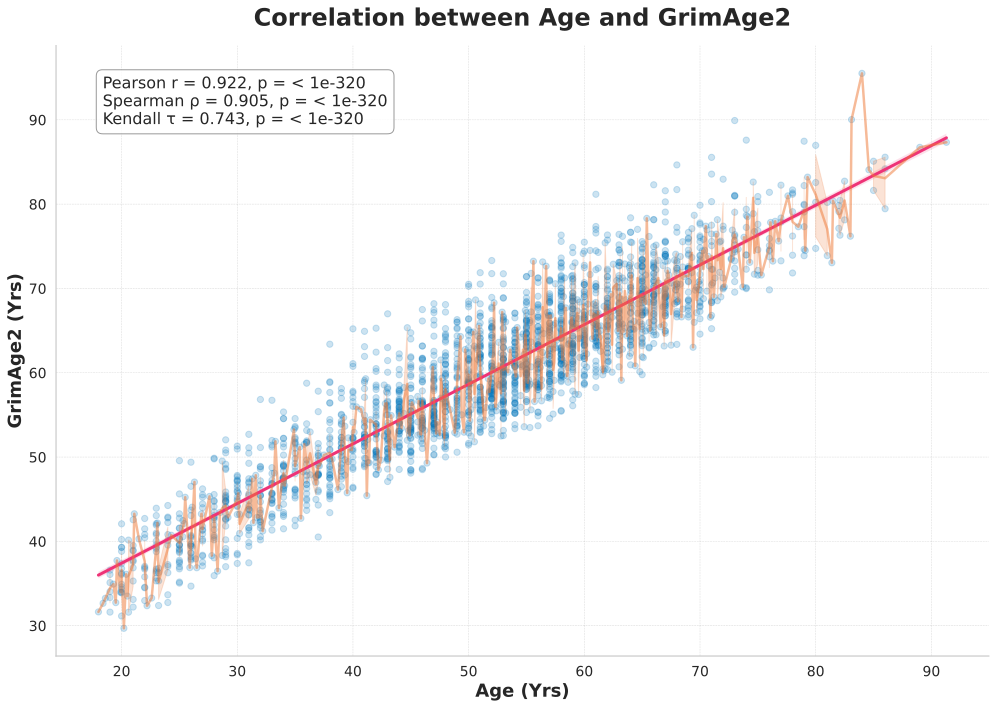

# **BP-DNAm**

## Tasks
- [ ] Format sample sheet and crosscheck with DNAm data
- [ ] Complete [A cross-package Bioconductor workflow for analysing methylation array data vignette](https://bioconductor.org/packages/release/workflows/vignettes/methylationArrayAnalysis/inst/doc/methylationArrayAnalysis.html#data-exploration) for cohort DNAm data
- [ ] Compare _REP vs non _REP sample pair methylation data
- [ ] Finalize sample sheet and DNAm data for [GrimAge version 2](https://www.aging-us.com/article/204434/text)
- [ ] Compute biological age using other methylation clocks and compare with chronological and GrimAge2
  - [ ] [dnaMethyAge: predict epigenetic age from DNA methylation data](https://github.com/yiluyucheng/dnaMethyAge)
  - [ ] [pyaging: a Python-based compendium of GPU-optimized aging clocks](https://github.com/rsinghlab/pyaging)
  - [ ] [Others](https://chatgpt.com/share/4f6a56e0-6ecb-47fb-be89-32ea2363e644)
  - [ ] [Others2](https://aistudio.google.com/app/prompts?state=%7B%22ids%22:%5B%221UxleECM1aPXNsQPsFwGrlLcdvhqkd8-V%22%5D,%22action%22:%22open%22,%22userId%22:%22105635218484851934159%22,%22resourceKeys%22:%7B%7D%7D)
- [ ] Plot chronological vs methylation-predicted biological age for all samples

## Motivation and Background
  - [Relevant Literature+](https://docs.google.com/spreadsheets/d/10S1L54l_t6icdOtmu1MQopsLwvqsSE8iASmZKH2Rtlc)
  - [Meta-analysis of epigenetic aging in schizophrenia reveals multifaceted relationships with age, sex, illness duration, and polygenic risk](https://clinicalepigeneticsjournal.biomedcentral.com/articles/10.1186/s13148-024-01660-8)

## Investigation Overview

### **Stage 1 - Data Preparation and Characterization**
#### _Density Plot of Normalized Beta Values_

### **Stage 2 - Compute and Analyze GrimAge version 2 Biological Age**
#### _BPDNAm GrimAge2 Sourcecode All Values_
               The output files will include (1) DNAmGrimAge2,AgeAccelGrim2 
                                              (2) seven DNAm based plasma protein estimates, and 
                                              (3) DNAm based packyears (DNAmPACKYRS)

    ============================================================================================================
    Name                                            variable                        unit
    ============================================================================================================
    DNAm  GrimAge2                                DNAmGrimAge2                    year
    GrimAge2 age acceleration                     AgeAccelGrim2                   year
    DNAm  Growth differentiation factor 15        DNAmGDF15                       pg/mL
    DNAm  Beta-2-microglobulin                    DNAmB2M                         pg/mL
    DNAm  Cystatin-C                                DNAmCystatinC                   pg/mL
    DNAm  Tissue Inhibitor Metalloproteinases 1     DNAmTIMP1                       pg/mL
    DNAm  Adrenomedullin                            DNAmADM                         pg/mL
    DNAm  Plasminogen activator inhibitor 1         DNAmPAI1                        pg/mL
    DNAm  Leptin                                    DNAmLeptin                      pg/mL
    DNAm  log C-reactive protein                  DNAmlogCRP                      mg/L (in CRP) 
    DNAm  log hemoglobin A1C                      DNAmlogA1C                      % (in A1C)
    DNAm  smoking pack years                        DNAmPACKYRS                  

#### _Pyaging Grimage2 Correlation Scatter Plot_

#### _Pyaging Grimage2 Cluster Plot_

### **Stage 3 - Additional Analysis**
  - 
